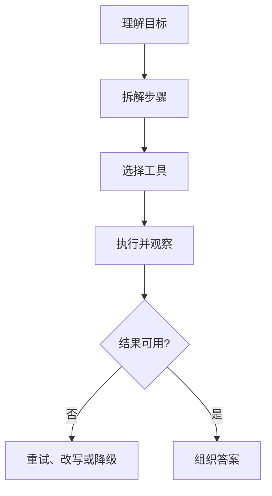
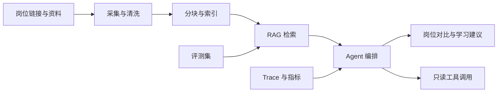

# AI 应用研发工程师：岗位能力地图与十二周路线

阿里校园招聘的 AI 应用研发岗位释放了一个很清楚的信号：企业需要的不只是会写 Prompt 的人，而是能把模型能力落到业务流程的人。

岗位描述里出现了 Agent 架构、RAG、长期记忆、上下文注入、意图识别、任务拆解、反思、MCP、Trace、自动化评测、高并发、异步、降级、可观测、vLLM、Ollama、KV Cache 和 Streaming 等关键词。

如果把这些词当作待背清单，很快会失去方向。更有效的做法是把它们还原成五个工程问题。

## 一、五个工程问题

### 1. 模型怎么拿到正确上下文

模型不会天然知道企业内部知识。你需要决定：

- 什么信息直接放进 Prompt。
- 什么信息通过检索获得。
- 什么信息来自用户长期记忆。
- 上下文过长时如何截断、压缩或重排。

### 2. 模型怎么完成复杂任务

复杂任务通常需要拆解、调用工具、检查结果和处理失败：

### 3. 系统怎么知道自己做得好不好

生成式系统不能只靠“看起来不错”。需要建设：

- 固定评测集。
- 离线回归测试。
- 线上指标。
- 失败案例库。
- Trace 与多维归因。

### 4. 系统怎么承受真实流量

模型调用昂贵且慢。需要处理：

- 超时和重试。
- 并发限制。
- 异步任务。
- 缓存与批处理。
- Streaming。
- 降级路径。

### 5. 系统怎么控制风险

大模型应用会接触外部输入、知识库和工具。要考虑：

- 提示词注入。
- 敏感信息泄露。
- 越权工具调用。
- 高风险操作确认。
- 审计与回滚。

## 二、岗位能力分层

### 第一层：计算机与后端基础

这层不能跳过：

| 模块 | 最低要求 |
| --- | --- |
| 编程语言 | Python 或 Java 至少一门熟练，能写可测试的服务代码 |
| 数据结构与算法 | 能处理常见集合、搜索、排序和复杂度分析 |
| 网络 | 理解 HTTP、超时、重试、连接与流式返回 |
| 数据库 | 能设计表、索引和事务边界 |
| Linux 与 Git | 能部署、排查和协作开发 |

可以结合本专栏的 [Java 后端校招学习路线](../基础知识/Java后端校招学习路线.md) 补齐。

### 第二层：大模型应用基础

至少要做过：

1. 单轮与多轮调用。
2. Prompt 模板。
3. 结构化输出。
4. Tool Calling。
5. Embedding 与向量检索。
6. Streaming。
7. Token、延迟和成本记录。

AI Coding 也应贯穿训练过程：用模型辅助阅读、生成、测试和审查，但每次改动都要自己检查 diff、运行测试并说明边界。延伸阅读：[AI Coding 工程实践](./08-AICoding工程实践.md)。

### 第三层：系统设计

进入岗位竞争力区间：

- RAG 检索链路。
- Agent 状态与工作流。
- MCP 工具接入。
- 评测与回归。
- Trace 和失败归因。
- 安全控制。
- 并发、异步与降级。

### 第四层：业务理解

这层最容易被忽略。岗位描述强调挖掘真实场景、输出可量化结果。你需要能回答：

1. 为什么这个场景适合大模型？
2. 不用大模型是否更简单？
3. 用户真正节省了多少时间？
4. 错误答案的业务代价是什么？
5. 哪些动作必须保留人工确认？

## 三、十二周训练计划

| 周次 | 主题 | 验收产物 |
| --- | --- | --- |
| 第 1 周 | Python 或 Java 服务基础 | 一个带日志、配置和测试的 REST API |
| 第 2 周 | 模型 API 与结构化输出 | 一个可流式返回、能处理超时的模型调用服务 |
| 第 3 周 | Embedding、分块和向量检索 | 一个小型文档检索 Demo，记录 Recall@K |
| 第 4 周 | RAG 回答链路 | 评测 30 个问题，区分检索错误与生成错误 |
| 第 5 周 | Tool Calling | 接入 3 个只读工具，完成参数校验和错误处理 |
| 第 6 周 | MCP | 把至少 1 个工具封装成 MCP Server |
| 第 7 周 | Agent 状态与编排 | 完成一个有明确终止条件的单 Agent 工作流 |
| 第 8 周 | 评测与 Trace | 建立固定评测集，保留每次调用的关键链路 |
| 第 9 周 | 安全 | 加入权限、确认、脱敏和提示词注入测试 |
| 第 10 周 | 性能 | 压测并记录首 Token 延迟、总延迟、错误率和成本 |
| 第 11 周 | 业务化 | 选择一个真实场景，访谈使用者，删掉不必要功能 |
| 第 12 周 | 面试化 | 完成 README、架构图、演示视频、复盘文档和模拟面试 |

## 四、推荐项目：校招信息研究助手

这个项目与求职场景贴近，也能覆盖岗位要求：

### 最小版本

- 导入岗位描述和公开资料。
- 根据问题检索相关片段。
- 回答时展示引用来源。
- 支持岗位能力对比。

### 第二阶段

- 接入 MCP 工具。
- 增加学习计划生成。
- 增加 Trace 页面。
- 建立 50 条评测样本。

### 第三阶段

- 增加权限和敏感信息处理。
- 压测并优化流式体验。
- 为失败案例增加分类和回归测试。

## 五、简历上如何表达

不要写：

> 使用 LangChain、RAG、MCP 和大模型开发智能助手。

更有信息量的表达：

> 设计岗位研究 Agent，将职位描述与公开资料分块索引，建立 50 条固定评测集；通过查询改写和检索重排提升 Recall@5，并将检索失败、工具超时与模型拒答纳入 Trace 分类，支持可回归验证。

数字必须来自真实测试，不要为了好看随手编造。

## 六、准备标准

进入投递前，至少能回答：

1. 你的 Agent 为什么需要 Agent，而不是普通工作流？
2. RAG 质量不好时，你如何区分检索问题和生成问题？
3. 工具调用怎样控制权限和副作用？
4. 一次请求慢，如何拆解时间花在哪里？
5. 模型、检索、Prompt 或工具更新后，怎样知道系统没有退化？

## 参考资料

- [阿里巴巴校园招聘：AI 应用研发工程师](https://campus-talent.alibaba.com/campus/position/199903220038?deptCodes=)
- [LangChain 官方文档：Agents](https://docs.langchain.com/oss/python/langchain/agents)
- [LangChain 官方文档：Retrieval](https://docs.langchain.com/oss/python/langchain/retrieval)
- [Model Context Protocol 官方文档](https://modelcontextprotocol.io/docs/getting-started/intro)
- [推理性能基础](./07-推理性能基础.md)
- [AI Coding 工程实践](./08-AICoding工程实践.md)
