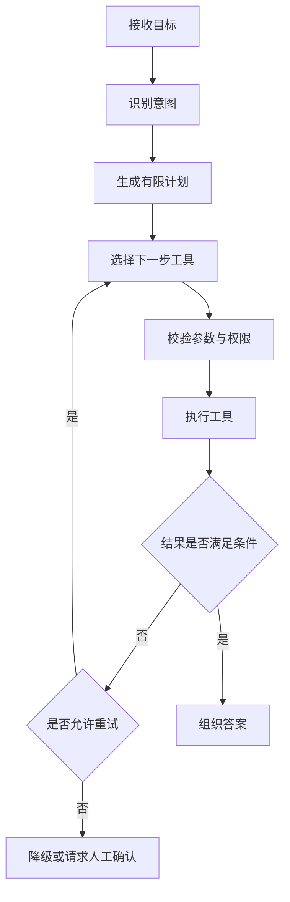

# Agent 系统设计：先做可控工作流，再谈自主规划

Agent 很容易被讲成一种神秘能力：模型会思考、会反思、会自己完成任务。真正写过系统后，你会发现最难的部分并不神秘：

- 状态放在哪里。
- 工具失败后怎么办。
- 循环什么时候结束。
- 用户中途修改目标怎么办。
- 如何知道哪一步开始偏离预期。

Agent 的价值不在于“看起来聪明”，而在于能否在复杂任务中保持可控。

## 一、先问：真的需要 Agent 吗

假设要做一个岗位分析助手，用户上传职位描述后，希望得到能力差距和学习计划。

如果流程固定：

```text
解析职位 -> 提取技能 -> 对比简历 -> 生成建议
```

普通工作流已经够用。每一步输入输出清楚，也容易测试。

如果任务需要根据中间结果动态选择下一步，例如：

- 缺少简历时主动询问用户。
- 遇到模糊岗位时调用检索工具补充信息。
- 发现证据不足时拒绝给出确定结论。
- 根据差距类型选择不同分析工具。

这时才更接近 Agent。

一个朴素判断标准：

| 情况 | 更适合固定工作流 | 更适合 Agent |
| --- | --- | --- |
| 步骤稳定，规则明确 | 是 | 否 |
| 对正确性要求很高 | 优先 | 谨慎使用 |
| 需要动态选择工具 | 有限适用 | 是 |
| 中间结果会改变计划 | 较难 | 是 |
| 很难预先枚举全部路径 | 较难 | 是 |

不要为了简历上多一个关键词，把本来清楚的流程改造成不可预测的循环。

## 二、一个 Agent 至少需要哪些状态

可以从最小状态开始：

```python
from dataclasses import dataclass, field
from typing import Any

@dataclass
class AgentState:
    user_goal: str
    messages: list[dict[str, str]] = field(default_factory=list)
    plan: list[str] = field(default_factory=list)
    completed_steps: list[str] = field(default_factory=list)
    tool_results: dict[str, Any] = field(default_factory=dict)
    retry_count: int = 0
    status: str = "running"
```

这段代码没有框架味，但很重要。你必须知道每次调用前后系统发生了什么。

### 状态设计需要回答

1. 哪些状态只在单次请求中存在？
2. 哪些状态要跨会话保存？
3. 哪些内容可以发给模型？
4. 哪些内容只能留在服务端？
5. 状态过大时如何压缩？
6. 用户能否查看或删除自己的记忆？

长期记忆不是把所有聊天记录原样塞进 Prompt。更常见的做法是提取稳定偏好、关键事实和任务摘要，并让用户能够控制。

## 三、编排：把模型放在可验证的边界里

一个可控的 Agent 工作流：



这里有几个刻意的限制：

- 计划有限，不允许无限拆解。
- 工具调用前做参数和权限校验。
- 重试次数有上限。
- 失败后允许降级或交给人工。
- 每一步都能记录 Trace。

限制不是削弱 Agent，而是让它有机会进入生产环境。

## 四、反思不是无限循环

“Reflection” 经常被理解为让模型重新看一遍答案并修改。它有用，但需要成本意识。

可以把反思限定在特定节点：

1. 工具结果为空。
2. 检索证据不足。
3. 输出没有满足结构化校验。
4. 高风险操作需要二次确认。
5. 评测发现某类错误高发。

不要默认所有回答都反思三次。每次模型调用都会增加延迟和成本，也可能引入新的偏差。

### 一个可控重试示例

```python
MAX_RETRIES = 2

while state.status == "running":
    result = run_next_step(state)
    if result.ok:
        apply_result(state, result)
        continue

    state.retry_count += 1
    if state.retry_count > MAX_RETRIES:
        state.status = "needs_review"
```

真实系统还要区分错误类型：参数错误、权限错误、网络超时、限流和业务拒绝不应该共用一种重试策略。

## 五、工具调用失败怎么处理

假设 Agent 要调用岗位搜索 API，常见失败包括：

| 失败 | 是否适合重试 | 处理方式 |
| --- | --- | --- |
| 网络短暂超时 | 可以，次数有限 | 指数退避，记录 Trace |
| 参数格式错误 | 不应盲目重试 | 校验参数，让模型修正或人工介入 |
| 权限不足 | 不应重试 | 明确提示，停止执行 |
| 接口限流 | 视情况 | 延迟重试、排队或降级 |
| 返回空结果 | 不一定是错误 | 改写查询，或告诉用户证据不足 |

“失败后再试一次”只是最初级的处理。成熟系统会根据失败原因选择不同策略。

## 六、多 Agent 什么时候值得用

多 Agent 常被滥用。把一个任务拆成多个角色，不等于结果自动更好。

多 Agent 可能适合：

- 子任务确实相对独立。
- 不同子任务需要不同工具或权限。
- 需要并行处理多个来源。
- 每个 Agent 的输出有明确验收条件。

不适合：

- 只是想模拟“产品经理、架构师、程序员”开会。
- 没有评测集，不知道多 Agent 是否真的更好。
- Trace 已经难以理解。
- 单 Agent 或固定工作流尚未跑稳。

## 七、面试时怎么讲 Agent 项目

不要只说：

> 我使用 LangChain 实现了一个 Agent。

建议沿着问题讲：

1. 原始业务流程是什么。
2. 哪些路径无法预先写死，所以引入 Agent。
3. 状态如何保存。
4. 工具有哪些，权限如何控制。
5. 失败如何重试、降级或交给人工。
6. 如何评测。
7. 引入 Agent 后指标是否改善。

## 八、自测问题

1. 你的项目为什么需要 Agent，而不是普通工作流？
2. 长期记忆与聊天记录有什么区别？
3. 工具调用超时后，哪些情况适合重试？
4. 如何防止 Agent 无限循环？
5. 多 Agent 带来了什么可验证收益？

## 参考资料

- [LangChain 官方文档：Agents](https://docs.langchain.com/oss/python/langchain/agents)
- [LangChain 官方文档：Runtime](https://docs.langchain.com/oss/python/langchain/runtime)
- [LangSmith 官方文档：Observability](https://docs.langchain.com/langsmith/observability)
