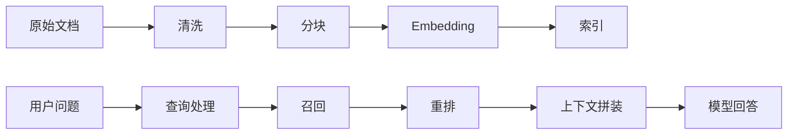

# RAG：从“接入向量库”到可评测的检索链路

RAG 的全称是 Retrieval-Augmented Generation。最简单的理解是：先从知识库找相关内容，再把证据交给模型生成答案。

但“能返回答案”离“答案可靠”还有很远。一个 RAG 系统失败时，至少有四种可能：

1. 文档没有进入知识库。
2. 文档切块不合理。
3. 检索没有找到正确片段。
4. 片段找到了，模型仍然回答错。

如果系统没有评测和 Trace，这四类问题很容易混在一起。

## 一、从一个失败案例开始

用户问：

> 阿里 AI 应用研发工程师岗位是否要求熟悉 MCP？

知识库中明明存在岗位描述，但系统回答：

> 岗位更关注算法基础，没有明确要求 MCP。

先不要急着改 Prompt。应该沿着链路检查：



如果召回结果里根本没有 MCP 相关片段，换更强模型也解决不了问题。

## 二、分块不是机械切字数

常见切块策略：

- 固定字符数。
- 按 Markdown 标题。
- 按段落。
- 按代码、表格和语义结构。
- 多层级父子块。

### 一个岗位描述怎么切

不要把“岗位职责”和“岗位要求”的上下文切散：

```text
## 岗位要求
1. 熟悉 Agent 架构设计
2. 熟悉 RAG、长期记忆、上下文注入
3. 熟悉 MCP、SDK/API 集成
```

如果每一行单独成为一个片段，检索结果可能缺少“这是岗位要求”的语境。如果整个页面塞成一个片段，又可能让无关内容过多。

切块应围绕“读者会怎样提问”设计。

## 三、Embedding 不是全部

向量检索擅长语义相似，但真实系统经常需要组合策略：

| 方法 | 擅长什么 | 可能的问题 |
| --- | --- | --- |
| 向量检索 | 语义相近表达 | 专有名词、编号可能不稳定 |
| 关键词检索 | 精确词、岗位编号、技术名词 | 同义表达召回较弱 |
| 混合检索 | 结合两者 | 实现与调参更复杂 |
| 重排 | 对候选片段重新排序 | 增加延迟和成本 |

查询“199903220038”时，关键词检索很重要；查询“如何让 Agent 调用企业内部工具”时，语义检索更有价值。

## 四、上下文拼装：召回越多不一定越好

把更多片段塞进 Prompt 会增加 token 成本，也可能让真正相关内容被噪声淹没。

上下文拼装要考虑：

- top-k 取多少。
- 是否去重。
- 是否保留标题和来源。
- 是否需要重排。
- 上下文长度超限时保留什么。
- 引用是否能回到原文。

一个实用规则：

> 回答必须带来源；证据不足时明确说不知道，不要让模型用常识补齐企业内部事实。

## 五、评测：先把问题拆成两层

### 1. 检索层

关注正确证据有没有被找到。

常见指标：

- `Recall@K`：前 K 个结果是否包含正确证据。
- `MRR`：正确证据排在多靠前的位置。
- 命中率：测试集里有多少问题能找到至少一个正确片段。

### 2. 生成层

关注模型是否根据证据正确回答。

检查：

- 是否忠于上下文。
- 是否遗漏关键条件。
- 是否引用正确来源。
- 证据不足时是否拒绝编造。
- 格式是否满足业务要求。

### 一张评测样本

```json
{
  "question": "该岗位是否提到 MCP？",
  "expected_answer": "是",
  "required_evidence": ["MCP"],
  "source": "阿里巴巴校园招聘岗位页",
  "tags": ["keyword", "job-requirement"]
}
```

不要等项目做完才补评测。建立前 20 条样本的时间，应该早于引入复杂 Agent。

## 六、错误归因：Prompt 不是万能维修工具

| 失败现象 | 优先排查 |
| --- | --- |
| 正确文档完全没找到 | 数据导入、切块、索引、查询改写 |
| 正确片段排在很后面 | 检索策略、重排、关键词权重 |
| 证据正确但答案遗漏条件 | Prompt、输出结构、模型能力 |
| 无证据时仍然肯定回答 | 拒答策略、评测样本、系统提示 |
| 引用无法打开 | 元数据、来源链接、权限 |

如果每次失败都靠 Prompt 打补丁，系统会越来越难维护。

## 七、一个最小 RAG 项目的验收标准

至少准备：

1. 30 至 50 条问题。
2. 每条问题对应证据片段。
3. 检索层指标。
4. 生成层错误分类。
5. 一次改动前后的对比。
6. 失败案例复盘。

简历里可以讲：

> 建立岗位知识库 RAG 链路，将错误拆分为导入、切块、召回、重排和生成五类；使用固定评测集对查询改写前后 Recall@5 进行回归，避免只凭人工体验调 Prompt。

数字必须来自真实实验。

## 八、自测问题

1. RAG 回答错了，为什么不能立刻归因于模型？
2. 切块大小为什么需要结合问题类型设计？
3. 专有名词检索为什么不能只依赖 Embedding？
4. top-k 越大为什么不一定越好？
5. 如何判断一次检索优化真的有效？

## 参考资料

- [LangChain 官方文档：Retrieval](https://docs.langchain.com/oss/python/langchain/retrieval)
- [LangSmith 官方文档：Evaluation](https://docs.langchain.com/langsmith/evaluation)
- [OpenAI 官方文档：Retrieval](https://platform.openai.com/docs/guides/retrieval)
