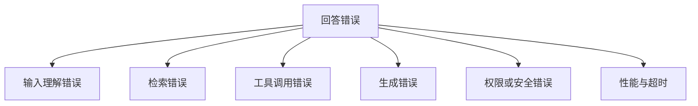
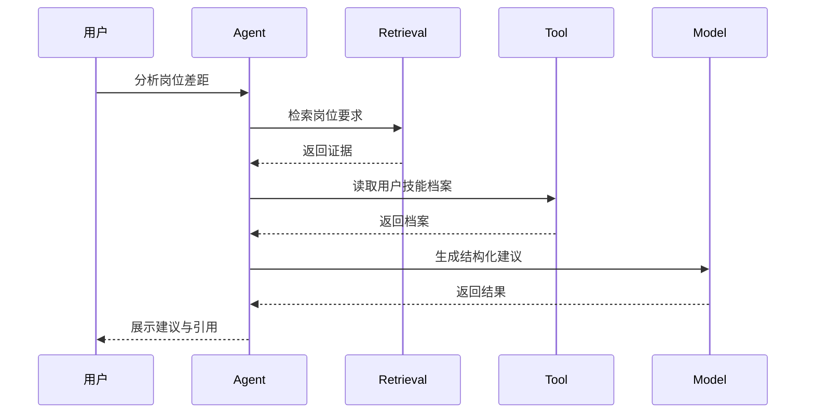

# 大模型应用的评测、可观测与安全

传统软件里，输入相同通常期待输出相同；大模型应用里，输出存在不确定性。于是一个新问题出现了：

> 修改 Prompt、模型、知识库或工具后，怎么知道系统变好了，还是悄悄退化了？

如果团队只能靠几个人打开聊天框“试一试”，系统很难走远。

## 一、先建立失败分类

一个岗位研究 Agent 回答错误，可能来自不同层：



分类很重要，因为修复方式完全不同：

| 失败 | 不要先做什么 | 优先做什么 |
| --- | --- | --- |
| 检索没有召回证据 | 盲目换模型 | 查数据、切块、检索和重排 |
| 工具参数不合法 | 无限重试 | 做 schema 校验和错误反馈 |
| 输出遗漏字段 | 堆更多上下文 | 调整结构化输出和校验 |
| 延迟过高 | 只看总耗时 | 拆解模型、检索、工具、队列耗时 |
| 越权调用 | 只靠 Prompt 约束 | 服务端权限、确认和审计 |

## 二、评测集是系统资产

一条评测样本至少包含：

```json
{
  "id": "job-requirement-001",
  "input": "这个岗位是否要求 MCP？",
  "expected": "明确提到 MCP",
  "tags": ["job-requirement", "keyword"],
  "source": "岗位描述",
  "risk": "medium"
}
```

评测集不应只包含“正常问题”，还要有：

- 模糊问题。
- 缺少信息的问题。
- 不应该回答的问题。
- 越权请求。
- 工具超时。
- 恶意提示词注入。
- 长上下文。
- 多轮对话中目标变化。

### 样本从哪里来

1. 产品设计阶段的关键路径。
2. 开发过程中的失败案例。
3. 线上用户反馈。
4. 安全测试。
5. 模型、Prompt、检索策略变更后新增的回归案例。

失败案例不是脏数据，它们是最值钱的资产。

## 三、离线评测与线上指标要结合

### 离线评测

适合在发布前做回归：

- 结构化字段是否完整。
- RAG 引用是否命中正确来源。
- 工具选择是否正确。
- 参数是否合法。
- 高风险动作是否触发确认。
- 注入测试是否被拦截。

### 线上指标

适合发现真实用户问题：

| 指标 | 说明 |
| --- | --- |
| 请求成功率 | 端到端是否完成 |
| 首 Token 延迟 | 用户多久看到第一段反馈 |
| 总耗时 | 完整任务多久结束 |
| 工具调用成功率 | 外部系统是否稳定 |
| 重试率 | 是否存在隐藏故障 |
| 降级率 | 系统是否频繁走备用路径 |
| 人工接管率 | 自动化是否真正可靠 |
| 用户反馈 | 结果是否解决问题 |

不要只追求“回答准确率”。真实体验还受延迟、可解释性和失败处理影响。

## 四、Trace：把一次回答拆开看

一次 AI 请求可能经历：



Trace 至少应保留：

- 请求标识。
- 每一步开始和结束时间。
- 模型与版本。
- Prompt 模板版本。
- 检索结果和来源。
- 工具名称、参数摘要、返回状态。
- token 用量。
- 错误与重试。
- 最终输出。

注意隐私：日志和 Trace 不应无边界保存完整简历、密钥和敏感个人信息。需要脱敏、访问控制和保留期限。

## 五、性能：先拆延迟，再做优化

端到端延迟可以粗略拆成：

```text
排队时间 + 检索时间 + 工具调用时间 + 模型首 Token 时间 + 模型生成时间 + 后处理时间
```

### 常见优化方向

| 问题 | 可以考虑 |
| --- | --- |
| 用户长时间没有反馈 | Streaming、快速状态提示 |
| 相同问题重复查询 | 对稳定结果缓存 |
| 工具调用慢 | 超时、并行、缓存、降级 |
| Prompt 太长 | 压缩上下文、减少无关片段 |
| 高峰期请求过多 | 限流、队列、异步任务 |
| 本地推理吞吐不足 | 评估批处理、KV Cache、模型规模和推理框架 |

岗位描述提到 vLLM、Ollama、KV Cache 和 Streaming。面试时不要停在“知道这些名词”，而要能说清它们分别影响部署便利性、吞吐、重复计算和用户感知延迟。

## 六、降级：系统失败时要有体面退路

大模型应用不是非黑即白。模型不可用时，不一定只能报错。

岗位研究助手可以设计：

1. 模型不可用：返回检索到的原始岗位片段。
2. 向量检索不可用：退回关键词检索。
3. 工具超时：展示已有结果，并说明缺少哪部分。
4. 高风险操作失败：停止执行，不自动重试。
5. 评测低置信度：请求人工确认。

降级的目标不是假装一切正常，而是在能力受限时仍然诚实、可用、可恢复。

## 七、安全：Prompt 不是权限系统

OWASP 将 Prompt Injection 列为大模型应用的重要风险。系统不应把“请勿泄露信息”写进 Prompt 后就认为安全问题解决了。

### 至少建立这些边界

| 风险 | 控制方式 |
| --- | --- |
| 外部文档夹带恶意指令 | 把外部内容视为数据，隔离指令层 |
| 模型试图调用越权工具 | 服务端鉴权，工具白名单 |
| 自动发送、删除或投递 | 人工确认，可撤销，审计 |
| Trace 泄露个人信息 | 脱敏、最小记录、访问控制 |
| 第三方模型使用敏感数据 | 明确数据边界，必要时本地化或匿名化 |

### 一个基本原则

> 模型可以建议动作，但不能绕过服务端权限和业务规则。

## 八、发布前检查

- [ ] 固定评测集是否覆盖正常、异常和恶意输入？
- [ ] 模型、Prompt、检索策略是否有版本标识？
- [ ] Trace 是否能区分检索、工具和生成错误？
- [ ] 是否记录首 Token 延迟、总耗时和错误率？
- [ ] 工具调用是否经过服务端权限校验？
- [ ] 高风险动作是否需要人工确认？
- [ ] 日志是否做脱敏和访问控制？
- [ ] 是否有降级路径？

## 参考资料

- [LangSmith 官方文档：Evaluation](https://docs.langchain.com/langsmith/evaluation)
- [LangSmith 官方文档：Observability](https://docs.langchain.com/langsmith/observability)
- [OWASP GenAI Security Project：Prompt Injection](https://genai.owasp.org/llmrisk/llm01-prompt-injection/)
- [vLLM 官方文档](https://docs.vllm.ai/)
- [Ollama 官方文档](https://docs.ollama.com/)
