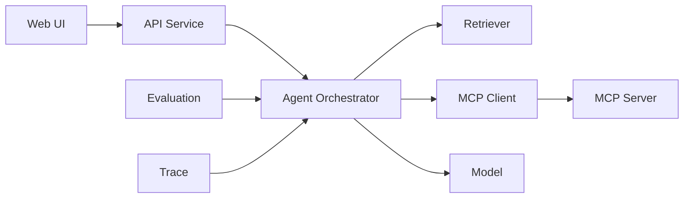

# AI 应用研发作品集：别只做一个聊天框

AI 应用项目最容易撞车：一个输入框，一个发送按钮，一段流式回答，README 写着“基于 RAG 和 Agent”。项目能运行，但面试官很难判断你到底解决了什么问题。

作品集要证明的不是“我能接 API”，而是：

1. 我理解一个真实场景。
2. 我能拆解系统。
3. 我能处理失败。
4. 我会用数据判断改动是否有效。
5. 我知道安全和成本边界。

## 一、先选一个有约束的场景

适合作品集的场景：

| 场景 | 为什么适合 |
| --- | --- |
| 校招信息研究助手 | 有公开资料、RAG、岗位对比、学习建议 |
| 技术文档排障助手 | 有检索、工具调用、引用、失败归因 |
| 代码库入门助手 | 有代码检索、结构化输出、权限边界 |
| 会议行动项助手 | 有信息提取、状态跟踪、人工确认 |

不建议一开始做“万能助手”。边界越宽，越难评测，也越难讲清业务价值。

## 二、一个完整作品集需要什么

### 1. README 第一屏

先回答：

- 为谁解决什么问题。
- 核心能力是什么。
- 如何快速运行。
- 有什么可验证结果。

不要先放十几个技术徽章。

### 2. 架构图



图里只放真正存在的组件。没有实现的，不要为了显得复杂提前画进去。

### 3. 评测报告

至少展示：

| 项目 | 内容 |
| --- | --- |
| 数据集 | 样本数量、来源、标签 |
| 指标 | Recall@K、工具成功率、首 Token 延迟、总耗时 |
| 版本 | 模型、Prompt、检索策略 |
| 对比 | 改动前后 |
| 失败案例 | 至少 3 类 |

### 4. 失败复盘

一份可信的项目一定有失败。可以写：

```markdown
## 失败案例：岗位编号检索错误

- 现象：使用语义检索时，岗位编号无法稳定召回。
- 原因：Embedding 更关注语义，相似编号区分不足。
- 修复：增加关键词检索，与向量检索做混合召回。
- 验证：在编号类问题评测集上比较 Recall@5。
```

这种复盘比“实现了混合检索”更能体现判断过程。

## 三、推荐项目：校招信息研究助手

### 用户故事

用户输入一组岗位链接和自己的技能清单，系统输出：

- 岗位核心要求。
- 技能差距。
- 可执行学习计划。
- 结论对应的原始来源。
- 哪些判断证据不足。

### 最小可行版本

1. 导入公开岗位文本。
2. 清洗、分块和索引。
3. 支持带引用的问答。
4. 建立 30 条固定评测样本。
5. 记录检索结果和模型调用 Trace。

### 进阶版本

1. MCP 接入只读岗位搜索工具。
2. 混合检索与重排。
3. 用户技能档案和可删除的长期记忆。
4. Prompt 注入测试。
5. Streaming 与降级。
6. 压测报告。

### 暂时别急着加

- 多 Agent 角色扮演。
- 复杂前端动画。
- 没有指标支撑的自动反思循环。
- 无法说明价值的中间件堆叠。

## 四、简历怎么写

### 没有信息量的版本

> 基于 LangChain 和大模型开发 RAG 智能助手，支持知识库问答和 Agent 工具调用。

### 更好的版本

> 开发校招信息研究助手，将岗位文本按标题和语义结构分块，组合关键词与向量检索；建立 50 条回归样本区分召回与生成错误，并记录检索、工具、模型链路 Trace，支持带引用回答和证据不足时降级。

如果你还完成了性能优化，可以继续补：

> 对模型调用、检索和工具耗时分段观测，引入流式返回与工具超时降级，将首 Token 延迟作为体验指标持续跟踪。

仍然要强调：数字必须真实，技术必须真的实现。

## 五、面试项目介绍：按问题讲，不按技术栈讲

两分钟结构：

### 1. 场景

> 求职者面对大量岗位描述，很难快速判断共同要求和个人差距。我做了一个校招信息研究助手，帮助用户基于原始岗位文本完成对比。

### 2. 核心链路

> 系统将岗位文本清洗分块，通过混合检索找到证据，再由模型生成带引用的结构化建议。对于只读岗位搜索工具，通过 MCP 接入，并在服务端做参数校验。

### 3. 一个难点

> 初期岗位编号类查询召回不稳定。我把错误拆到检索层，发现纯向量检索对精确编号不友好，增加关键词召回后用固定评测集做回归。

### 4. 一个边界

> 系统只自动执行只读工具。涉及投递、发送或删除的动作，必须由用户确认。

### 5. 结果

> 展示真实评测结果、延迟数据和剩余问题。

## 六、面试官可能继续问

1. 为什么需要 Agent，普通工作流不够吗？
2. 如何构造评测集，是否存在数据泄漏？
3. RAG 回答错误时如何归因？
4. MCP 给你带来了什么，不用它行不行？
5. 工具调用如何防止越权？
6. 如何处理模型超时？
7. 为什么使用这个模型？
8. 本地部署时如何考虑显存、吞吐和延迟？
9. Prompt 被外部文档注入时怎么办？
10. 如果线上效果下降，先看什么？

## 七、提交作品集前检查

- [ ] README 是否先讲问题，再讲技术？
- [ ] 架构图中的组件是否真的实现？
- [ ] 是否有固定评测集？
- [ ] 是否展示至少一个失败案例？
- [ ] 是否有 Trace 或日志截图？
- [ ] 是否说明安全边界？
- [ ] 是否记录延迟和错误率？
- [ ] 是否能在两分钟内讲清项目？

## 延伸阅读

- [Agent 系统设计](./02-Agent系统设计与工程化.md)
- [RAG 从检索到评测](./03-RAG从检索到评测.md)
- [Tool Calling 与 MCP](./04-ToolCalling与MCP.md)
- [评测、可观测与安全](./05-评测可观测与安全.md)
