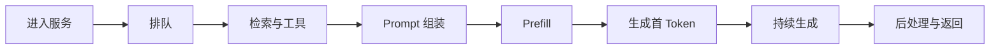
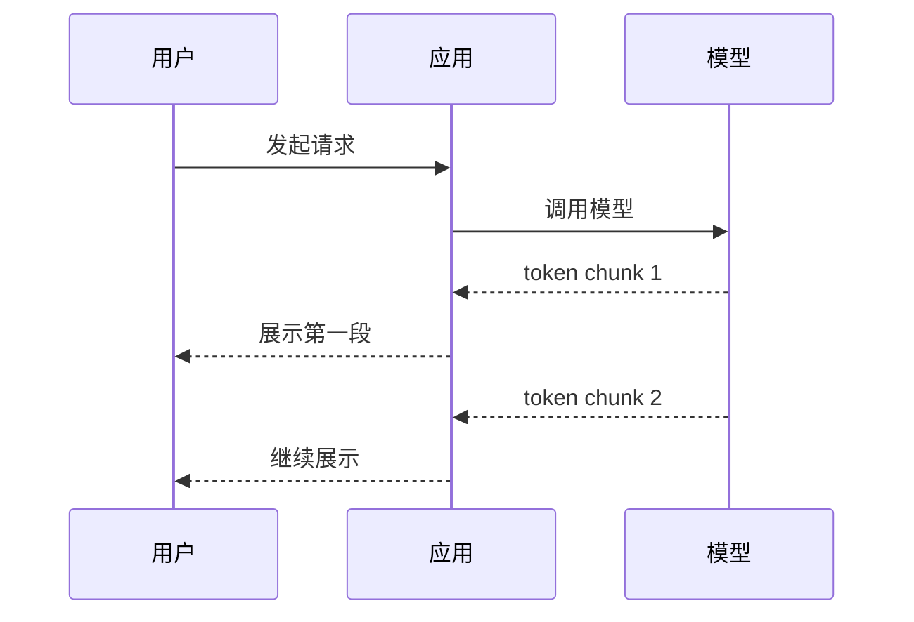

# 大模型应用的推理性能基础：延迟、Streaming 与 KV Cache

AI 应用研发工程师不一定要从零实现推理引擎，但必须理解性能问题从哪里来。否则接口变慢时，只能笼统地说“模型太大”。

岗位描述提到 vLLM、Ollama、KV Cache 和 Streaming。这些词背后其实是一个很朴素的问题：

> 用户发出请求后，时间花在了哪里？哪些优化减少计算，哪些优化改善体感，哪些只是把压力挪到别处？

## 一、先拆开一次请求



至少记录：

| 指标 | 说明 |
| --- | --- |
| 首 Token 延迟 | 用户多久看到第一段输出 |
| 总耗时 | 完整任务多久结束 |
| 输入 token | 上下文是否过长 |
| 输出 token | 是否生成过度 |
| 每秒生成 token | 推理吞吐情况 |
| 队列等待时间 | 是否容量不足 |
| 错误率与超时率 | 高峰期是否退化 |

总耗时只是结果，分段耗时才帮助定位。

## 二、Streaming 改善什么

Streaming 让应用在模型生成过程中逐步返回内容。用户不必等待整段答案结束后才看到结果。



需要说清边界：

- Streaming 主要改善等待体验和首段可见时间。
- 它不保证减少模型完成全部生成的时间。
- 前端、网关和后端都要正确处理流式数据。
- 工具调用、结构化输出和内容审核可能让流式处理更复杂。

Ollama 官方文档说明，其 REST API 默认启用 Streaming；SDK 中可以通过参数启用。具体行为应以使用版本文档为准。

## 三、KV Cache 为什么重要

模型生成下一个 token 时，需要利用此前 token 的注意力相关中间结果。KV Cache 用空间换计算，避免重复计算已经处理过的上下文。

可以把它粗略理解为：

```text
没有缓存：每生成一个 token，都重复处理大量历史上下文
有 KV Cache：复用历史上下文的中间结果，继续向后生成
```

在应用层还会遇到前缀缓存：多个请求共享相同前缀时，复用公共部分的缓存，减少重复计算。

vLLM 官方文档介绍了 Automatic Prefix Caching：如果新请求与已有请求共享前缀，可以复用 KV Cache，跳过共享部分的重复计算。

### 应用设计上的启发

- 把稳定的系统指令放在前面。
- 把用户特定、每次变化的信息放在后面。
- 记录缓存命中情况。
- 不要为了缓存牺牲权限隔离和数据安全。

## 四、减少延迟不只有换模型

OpenAI 官方延迟优化指南给出了一组通用方向。落到项目中，可以这样理解：

| 方向 | 例子 |
| --- | --- |
| 生成更少 token | 限制冗长输出，使用更紧凑的结构 |
| 输入更少 token | 清理 HTML，减少无关 RAG 片段 |
| 减少模型调用次数 | 合并可以一次完成的步骤 |
| 并行化 | 独立检索或工具调用并行执行 |
| 让用户少等 | Streaming、分块、真实进度 |
| 不默认使用大模型 | 规则能解决的问题用规则 |

最后一条很重要。分类、校验、权限判断等任务，不一定都要交给大模型。

## 五、vLLM 与 Ollama 应该怎么理解

### Ollama

适合快速运行和管理本地模型，便于原型验证和本地开发。不要把“能跑起来”直接等同于“适合生产流量”。

### vLLM

面向大模型推理与服务场景，提供 OpenAI 兼容服务等能力，也包含面向吞吐和缓存利用的优化机制。

面试时不要简单比较“谁更快”。先说明：

- 是本地开发、内部工具还是生产服务。
- 模型多大。
- 并发量多少。
- 延迟目标是什么。
- GPU 与显存约束是什么。
- 是否需要批处理、缓存和多卡能力。

## 六、性能优化必须可验证

建立一张对比表：

| 版本 | 首 Token 延迟 P95 | 总耗时 P95 | 错误率 | 输入 token 均值 | 备注 |
| --- | --- | --- | --- | --- | --- |
| 基线 |  |  |  |  |  |
| 减少无关检索片段 |  |  |  |  |  |
| 增加 Streaming |  |  |  |  |  |
| 并行工具调用 |  |  |  |  |  |

没有数据，就不要在简历里写“显著提升性能”。

## 七、自测问题

1. 首 Token 延迟与总耗时有什么区别？
2. Streaming 为什么改善体验，但不一定缩短完整生成时间？
3. KV Cache 用什么资源换取什么收益？
4. 共享前缀为什么可能带来缓存收益？
5. 一次 Agent 请求慢，为什么不能只看模型耗时？

## 参考资料

- [vLLM 官方文档：Automatic Prefix Caching](https://docs.vllm.ai/en/stable/design/prefix_caching/)
- [Ollama 官方文档：Streaming](https://docs.ollama.com/capabilities/streaming)
- [OpenAI 官方文档：Latency optimization](https://platform.openai.com/docs/guides/latency-optimization)
- [OpenAI 官方文档：Prompt caching](https://platform.openai.com/docs/guides/prompt-caching)
