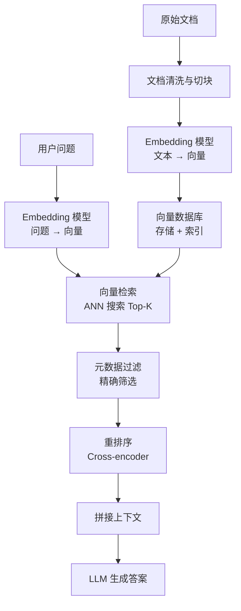
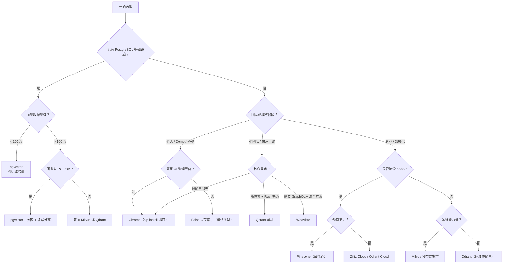
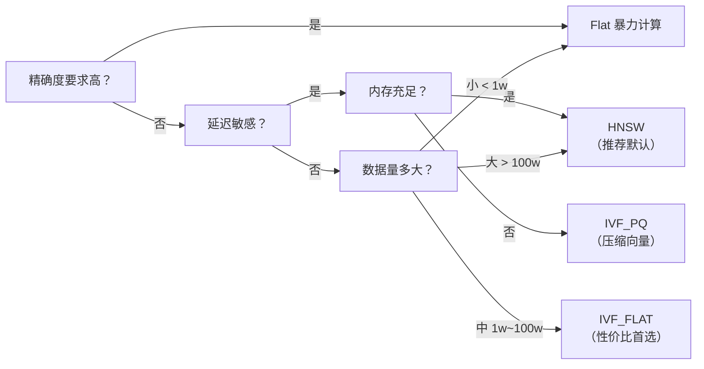

# 向量数据库选型与实战：从对比到落地

RAG 项目做到一半，很多人会问同一个问题：什么时候该上向量数据库，什么时候 Faiss 就够了？

这个问题我实际踩过坑。很早的时候在一个 Demo 里用 Chroma，上线时被问到"为什么不用 Milvus"，我发现自己说不出具体的选型理由，只能回答"大家都在用"。后来在几个项目里轮了一遍 Milvus、Chroma、Qdrant 和 pgvector，才逐渐形成自己的判断框架。

这篇文章把选型逻辑、实战代码和生产注意事项串起来，目标是：读完能自己判断该用哪个，也能把 Chroma 跑起来做检索。

## 一、为什么需要向量数据库

### 传统数据库为什么不适合向量检索

关系型数据库的索引是为精确匹配设计的：B+ 树按顺序排列键值，哈希索引按桶定位。你的 SQL 写的是 `WHERE name = '张三'`，不是 `WHERE embedding SIMILAR TO question_embedding`。

向量检索需要的则是近似最近邻（ANN）搜索，核心操作是：给定一个向量，在海量向量中找到距离最近的 K 个。这个操作在传统数据库里只能全表扫描计算余弦相似度，数据量一大就不可用。

大致边界：

| 数据量 | 方案 | 延迟 |
| --- | --- | --- |
| < 1 万条 | 内存中直接计算 numpy 距离 | 毫秒级 |
| 1 万 ~ 10 万条 | Faiss 内存索引 | 毫秒级 |
| 10 万 ~ 100 万条 | 向量数据库（Chroma / Qdrant 单机） | 毫秒 ~ 十毫秒 |
| > 100 万条 | 向量数据库（Milvus / Qdrant 分布式） | 十毫秒级 |
| 需要混合过滤 + 向量搜索 | pgvector / 向量数据库元数据过滤 | 取决于索引设计 |

### 向量数据库在 RAG 中的位置



向量数据库在整条链路里只负责一件事：存向量 + 快速召回。它不负责切块策略好不好、Embedding 质量高不高、重排序是否有效。如果检索效果差，先检查前面环节，别上来就换数据库。

### 什么时候不需要专门的向量数据库

以下场景直接用 Faiss 就够了，引入向量数据库反而增加运维成本：

1. **原型验证阶段**，数据量不超过 10 万条，只需要验证检索效果。
2. **离线批量检索**，不需要持久化、不需要增量更新。
3. **单机部署 + 简单过滤**，只需要按 top_k 返回结果，没有复杂的元数据筛选。

Faiss 不是"低配方案"，它是 Facebook 开源的向量检索库，Facebook 自己就在用它。Chroma 底层也用到了它的一部分实现。选 Faiss 还是向量数据库，本质上是选"一把锤子"还是"一个工具箱"。

## 二、主流向量数据库对比

### 六款数据库横向对比

| 维度 | Milvus | Chroma | Pinecone | Weaviate | Qdrant | pgvector |
| --- | --- | --- | --- | --- | --- | --- |
| 部署方式 | Docker / K8s / Zilliz Cloud | pip install / Docker | 仅 SaaS | Docker / K8s / Cloud | Docker / K8s / Cloud | PostgreSQL 扩展 |
| 索引类型 | IVF_FLAT, IVF_PQ, HNSW, DiskANN 等十几种 | HNSW（自动） | 托管，不暴露索引细节 | HNSW, Flat, 倒排 + 向量混合 | HNSW（推荐） | IVFFlat, HNSW |
| 元数据过滤 | 标量索引 + 表达式过滤 | 支持 where 过滤（Python dict 风格） | Metadata filtering（key-value） | GraphQL 风格过滤 | JSON 过滤 + payload 索引 | 标准 SQL WHERE |
| 分布式 | 支持（存算分离） | 单机 | 自动扩缩 | 支持 | 支持（Raft 共识） | 跟随 PG 集群方案 |
| 社区活跃度 | 3 万+ GitHub Stars | 1.7 万+ Stars | 商业产品 | 1.2 万+ Stars | 1.1 万+ Stars | PG 生态 |
| 适用规模 | 百万 ~ 亿级 | 千 ~ 十万级 | 不限（按量付费） | 万 ~ 百万级 | 万 ~ 百万级 | 万 ~ 百万级 |
| 开发体验 | 功能强但学习曲线陡 | 最轻量，Python 原生体验 | 开箱即用但不可自托管 | GraphQL 接口，前端友好 | Rust 实现，API 设计清晰 | SQL 选手零学习成本 |

### 选型决策树



一条粗糙但实用的经验：在校招项目或个人作品集里，Chroma 足够；在真实生产环境且数据量超过百万，优先考虑 Milvus 或 Qdrant；如果团队已经有 PostgreSQL，先试 pgvector。

## 三、Chroma 实战上手

Chroma 是我最推荐从零上手的第一款向量数据库，原因很简单：`pip install chromadb` 五秒搞定，没有 Docker 依赖，Python API 设计得像是给 Python 开发者做的（也确实如此）。

### 安装与启动

```bash
# 最小安装——嵌入服务模式，依赖 hnswlib
pip install chromadb

# 需要自动 embedding 功能时
pip install chromadb sentence-transformers

# 生产环境用 Docker（数据持久化更可靠）
docker run -d -p 8000:8000 \
  -v ./chroma-data:/chroma/chroma \
  -e IS_PERSISTENT=TRUE \
  chromadb/chroma:latest
```

### 创建 Collection 与插入向量

```python
import chromadb
from chromadb.utils import embedding_functions

# 1. 创建客户端（两种模式）
# 内存模式：进程结束数据消失，适合原型
# client = chromadb.Client()

# 持久化模式：数据落盘，适合开发验证
client = chromadb.PersistentClient(path="./chroma_data")

# 2. 定义 embedding 函数（自动把文本变成向量）
# 离线模型不调 API，校招项目友好——不用花钱
embedding_fn = embedding_functions.SentenceTransformerEmbeddingFunction(
    model_name="BAAI/bge-small-zh-v1.5"  # 中文小模型，384 维
)

# 3. 创建 Collection——相当于关系数据库里的"表"
collection = client.create_collection(
    name="job_descriptions",
    embedding_function=embedding_fn,
    metadata={"description": "校招岗位描述库"}
)

# 4. 插入数据
# 每条数据包含：documents（原文）、metadatas（结构化属性）、ids（唯一标识）
jobs = [
    {
        "id": "jd_001",
        "doc": "AI应用研发工程师：负责Agent架构设计、RAG系统开发、MCP协议集成",
        "meta": {"company": "阿里", "dept": "AI平台", "level": "校招"}
    },
    {
        "id": "jd_002",
        "doc": "后端开发工程师：负责高并发服务开发、数据库优化、微服务治理",
        "meta": {"company": "阿里", "dept": "电商", "level": "校招"}
    },
    {
        "id": "jd_003",
        "doc": "算法工程师-大模型方向：负责模型微调、RLHF对齐、推理优化",
        "meta": {"company": "字节", "dept": "AI Lab", "level": "校招"}
    },
    {
        "id": "jd_004",
        "doc": "前端开发工程师：负责React组件开发、性能优化、跨端适配",
        "meta": {"company": "腾讯", "dept": "PCG", "level": "实习"}
    },
]

collection.add(
    ids=[j["id"] for j in jobs],
    documents=[j["doc"] for j in jobs],
    metadatas=[j["meta"] for j in jobs],
)

print(f"Collection 记录数: {collection.count()}")
# 输出: Collection 记录数: 4
```

### 检索：相似度搜索 + 元数据过滤

```python
# 5. 纯语义搜索
results = collection.query(
    query_texts=["如何让AI调用企业内部工具"],
    n_results=2,
)

print("=== 纯语义搜索 ===")
for i, (doc_id, distance, doc) in enumerate(zip(
    results["ids"][0],
    results["distances"][0],
    results["documents"][0],
)):
    print(f"排名 {i+1}: [{doc_id}] 距离={distance:.4f}\n  {doc}\n")

# 6. 语义搜索 + 元数据过滤
# 只找"阿里 + 校招"的岗位
results_filtered = collection.query(
    query_texts=["如何让AI调用企业内部工具"],
    n_results=2,
    where={
        "$and": [
            {"company": {"$eq": "阿里"}},
            {"level": {"$eq": "校招"}},
        ]
    },
)

print("=== 带过滤的语义搜索 ===")
for i, (doc_id, doc) in enumerate(zip(
    results_filtered["ids"][0],
    results_filtered["documents"][0],
)):
    print(f"排名 {i+1}: [{doc_id}] {doc}")

# 7. 用已经计算好的向量直接搜（不走 embedding 函数）
import numpy as np
fake_vector = np.random.rand(384).tolist()  # 模拟一个外部计算好的向量

results_by_vector = collection.query(
    query_embeddings=[fake_vector],
    n_results=2,
)
print(f"\n=== 直接用向量搜索（结果数: {len(results_by_vector['ids'][0])}） ===")
```

这段代码可以直接复制到一个 `.py` 文件里跑。唯一需要下载的是 `sentence-transformers` 会拉一次 BGE 模型（约 100MB），之后就走本地推理。

## 四、索引选型深入

向量检索的核心矛盾：精确穷举太慢，近似索引有召回率损失。不同的索引类型就是在"速度、召回率、内存"三者之间做取舍。

### 四种主流索引原理对比

| 索引类型 | 原理 | 构建速度 | 查询速度 | 召回率 | 内存占用 | 适合场景 |
| --- | --- | --- | --- | --- | --- | --- |
| **Flat** | 暴力计算全部距离后排序 | 无构建开销 | 慢（O(n)） | 100% | 低（仅存向量） | 数据量 < 1 万，要求精确结果 |
| **IVF_FLAT** | K-Means 聚类分桶，查询时只搜最近 N 个桶 | 快 | 较快 | 90~98% | 中 | 中等规模，性价比首选 |
| **IVF_PQ** | IVF 分桶 + 乘积量化压缩向量 | 较慢（需训练） | 快 | 80~95% | 低（压缩到 1/8~1/4） | 内存受限，亿级数据 |
| **HNSW** | 多层可跳转图，贪心搜索 | 较慢（建图） | 最快 | 95~99% | 高（存图 + 向量） | 对延迟敏感，数据量 < 千万 |

### 每种索引的"什么时候用"建议

**Flat**：面试问"向量数据库底层原理"时你应该理解它，但生产环境几乎不用，除非你的数据量永远不超过一万条。

**IVF_FLAT**：校招项目里最推荐了解的索引。原理清晰（聚类分桶），面试能讲清楚，实际效果也不差。`nlist` 参数（聚类中心数）的经验值取 `4 * sqrt(n)`，桶搜索数 `nprobe` 取 `nlist / 10` 左右作为起点调优。

**IVF_PQ**：当你需要把向量压缩到极致时用。代价是需要训练阶段，且召回率会明显低于 HNSW。适合"内存比召回率更紧张"的场景，比如边缘设备或超大规模知识库。

**HNSW**：当前工业界的事实默认。Milvus、Qdrant、Chroma 默认都用它。唯一代价是内存——图结构额外占用。如果机器内存够，直接用 HNSW，不要过度设计。

### 召回率 vs 速度的权衡



一条来自实践的提醒：在校招项目里，`HNSW` 三个字母是合理的默认答案。但面试官如果再追问"什么情况下 HNSW 不如 IVF_PQ"，你要能回答"内存受限时"。这就够了。

## 五、生产环境注意事项

### 维度选择：不是越大越好

常见的 Embedding 维度与对应模型：

| 模型 | 维度 | 适用场景 | 备注 |
| --- | --- | --- | --- |
| BGE-small-zh | 384 | 中文通用，轻量 | 校招项目首选，跑得快 |
| BGE-large-zh | 1024 | 中文，高精度 | 对检索质量要求高的场景 |
| text-embedding-3-small | 512 | 多语言 | OpenAI 最便宜的嵌入模型 |
| text-embedding-3-large | 3072 | 多语言高精度 | 支持维度截断（如截到 256） |
| text-embedding-ada-002 | 1536 | 英文为主 | 上一代 OpenAI 模型，仍广泛使用 |

维度越高的向量包含的语义信息越多，但也意味着：存储翻倍、计算耗时更长、索引构建更慢。不要默认选最大维度。先问自己：检索任务对语义精细度要求多高？校招项目 384 维足够，面试时说出你为什选这个维度比选 3072 更有说服力。

### 元数据过滤的性能影响

在 Chroma 里写 `where={"level": {"$eq": "校招"}}` 很方便，但在大规模数据下可能成为瓶颈。原因很简单：向量索引负责找"语义最接近的 K 条"，但不负责判断"哪些记录满足 level=校招"。常见执行路径是：

1. 向量索引返回较多候选结果（over-fetch，比如 top_k * 3）。
2. 对候选结果逐条检查元数据条件，丢弃不满足的。
3. 如果余下不足 top_k 条，再补充检索——但补回来的仍然可能不满足条件。

这样可能导致：返回结果不足 K 条，或者延迟明显增加。解决思路：

- **先过滤再搜索**（pre-filtering）：如果过滤条件能筛掉大部分数据，先做过滤。
- **全文索引 + 向量搜索混合**：用 ElasticSearch 或 PostgreSQL 的全文索引先缩小范围。
- **payload 索引**：Qdrant 支持为频繁过滤的字段建索引。

### 增量更新与数据一致性

向量数据库的写入模式和关系型数据库不同。多数向量库是"追加 + 软删除"而非原地更新：

```python
# Chroma 更新一条记录的正确方式
# 错误：直接改原文档 —— Chroma 不支持 update document 原地修改
# 正确：先删后插，或使用 upsert
collection.upsert(
    ids=["jd_001"],
    documents=["AI应用研发工程师（更新版）：新增多模态Agent能力要求"],
    metadatas=[{"company": "阿里", "dept": "AI平台", "level": "校招", "version": 2}],
)
```

需要关注的三个一致性场景：

| 场景 | 风险 | 做法 |
| --- | --- | --- |
| 文档新增 | 重复写入 | 以文档 hash（如 MD5）作为 id，天然幂等 |
| 文档更新 | 旧片段残留 | upsert 或先删再插，带版本号 |
| 文档删除 | 检索仍返回已删内容 | 软删除标记 + 查询时过滤，定时物理清理 |
| Embedding 模型切换 | 新旧向量混合 | 全量重建索引，不要混用不同模型产生的向量 |

### 监控指标

至少关注这四个：

| 指标 | 含义 | 合理范围 | 排查方向 |
| --- | --- | --- | --- |
| QPS（每秒查询数） | 检索吞吐 | 取决于硬件和应用规模 | 单机 Chroma：50~200 QPS；Milvus 集群可达数千 |
| 延迟 P99 | 99% 请求的响应时间 | < 200ms 为佳 | 高延迟可能来自：磁盘 I/O、索引参数不当、维度太高 |
| 召回率 Recall@K | 前 K 条结果是否命中正确答案 | > 90% | 低召回先排查：切块策略、Embedding 模型、索引参数（如 nprobe） |
| 索引内存 | 索引占用的 RAM | 控制在可用内存 60% 以内 | 超了考虑 IVF_PQ 压缩或换更大内存实例 |

## 六、一个完整 Demo：简历匹配检索系统

用一个接近真实校招场景的例子把上面串起来：把岗位描述存入 Chroma，输入候选人的实习经历，找出最匹配的岗位。

```python
"""
简历匹配检索系统 Demo
场景：校招生输入自己的技能和经历，检索最匹配的岗位要求
依赖：pip install chromadb sentence-transformers
"""
import chromadb
from chromadb.utils import embedding_functions

# ==================== 第一步：初始化 ====================
print("【1/4】初始化向量数据库...")
client = chromadb.PersistentClient(path="./demo_resume_match")

embedding_fn = embedding_functions.SentenceTransformerEmbeddingFunction(
    model_name="BAAI/bge-small-zh-v1.5"
)

# ==================== 第二步：构建岗位知识库（存储） ====================
print("【2/4】构建岗位知识库...")

# 如果之前存过，先删掉重建
try:
    client.delete_collection("job_positions")
except Exception:
    pass

collection = client.create_collection(
    name="job_positions",
    embedding_function=embedding_fn,
)

# 模拟 10 个校招岗位描述
job_data = [
    {"id": "jd_ai", "title": "AI应用研发工程师", "company": "阿里巴巴",
     "dept": "AI平台", "level": "校招",
     "desc": "负责Agent架构设计和开发，包括多Agent协作、工具调用框架。"
             "熟悉RAG系统开发，掌握向量数据库和检索增强技术。"
             "理解MCP协议，能设计模型与外部工具的交互接口。"
             "具备Python后端开发能力，了解大模型推理部署。"},
    {"id": "jd_rag", "title": "RAG系统工程师", "company": "字节跳动",
     "dept": "搜索", "level": "校招",
     "desc": "负责企业级RAG系统的设计与优化，包括文档解析、切块策略、"
             "向量检索、重排序等完整链路。熟悉Milvus、Elasticsearch等检索引擎。"
             "能对检索质量进行离线评测和在线监控。"},
    {"id": "jd_backend", "title": "后端开发工程师", "company": "腾讯",
     "dept": "云架构", "level": "校招",
     "desc": "负责高并发微服务开发，掌握Go或Java。"
             "熟悉MySQL、Redis、Kafka等中间件。"
             "了解分布式系统设计，能处理服务降级和容灾。"},
    {"id": "jd_llm", "title": "大模型训练工程师", "company": "智谱AI",
     "dept": "算法", "level": "校招",
     "desc": "负责大模型预训练和微调，熟悉分布式训练框架。"
             "掌握DeepSpeed、Megatron等训练加速技术。"
             "了解RLHF、DPO等对齐方法。"},
    {"id": "jd_mcp", "title": "MCP协议开发工程师", "company": "蚂蚁集团",
     "dept": "基础平台", "level": "校招",
     "desc": "设计和实现MCP协议的服务端和客户端。"
             "开发Agent工具调用SDK，支持多种语言的工具集成。"
             "熟悉gRPC、HTTP等通信协议，了解安全鉴权机制。"},
    {"id": "jd_eval", "title": "AI系统评测工程师", "company": "百度",
     "dept": "质量", "level": "校招",
     "desc": "负责AI系统的自动化评测体系建设。"
             "设计评测数据集，建立回归测试流程。"
             "对RAG系统进行检索和生成层的质量分析。"
             "开发Trace和可观测性工具。"},
    {"id": "jd_fe", "title": "前端开发工程师", "company": "美团",
     "dept": "到店", "level": "校招",
     "desc": "负责移动端和Web端的前端开发。"
             "熟练掌握React或Vue框架。"
             "了解小程序开发和小程序性能优化。"},
    {"id": "jd_data", "title": "数据平台工程师", "company": "快手",
     "dept": "数据", "level": "校招",
     "desc": "负责大数据平台建设，熟悉Spark、Flink等计算引擎。"
             "设计数据仓库模型，开发ETL流程。"
             "了解数据治理和数据质量管理。"},
    {"id": "jd_embed", "title": "(隐式)模型部署工程师", "company": "华为",
     "dept": "云BU", "level": "校招",
     "desc": "负责大模型的推理部署和性能优化。"
             "熟悉vLLM、TensorRT等推理框架。"
             "掌握KV Cache优化、模型量化等技术。"},
    {"id": "jd_agent", "title": "Agent平台工程师", "company": "字节跳动",
     "dept": "AI平台", "level": "校招",
     "desc": "负责Agent编排平台的建设，包括工作流设计、"
             "插件市场和监控面板。理解LangChain、AutoGen等框架的设计模式。"
             "具备产品思维，能将用户需求抽象为平台能力。"},
]

collection.add(
    ids=[j["id"] for j in job_data],
    documents=[j["desc"] for j in job_data],
    metadatas=[{"title": j["title"], "company": j["company"],
                "dept": j["dept"], "level": j["level"]}
               for j in job_data],
)

print(f"  已入库 {collection.count()} 个岗位\n")

# ==================== 第三步：检索 ====================
print("【3/4】执行检索...")

# 模拟三个不同背景的候选人
candidates = [
    {
        "name": "候选人A",
        "resume": "我做过一个基于LangChain的RAG问答系统，用Chroma存储文档，"
                  "实现了文档切块和向量检索。还基于FastAPI开发了后端服务，"
                  "集成了MCP协议让Agent能调用多个外部工具。",
    },
    {
        "name": "候选人B",
        "resume": "我有两段后端实习经历，用Go开发过高并发API网关，"
                  "熟悉MySQL分库分表和Redis缓存设计。"
                  "参与过微服务从单体拆分，掌握了服务治理和可观测性。",
    },
    {
        "name": "候选人C",
        "resume": "我在实验室做过大模型微调，用LoRA在LLaMA上做指令微调。"
                  "还用过vLLM部署模型，做了KV Cache的对比实验。"
                  "写过评测脚本对模型生成质量做自动化测试。",
    },
]

for candidate in candidates:
    print(f"\n--- {candidate['name']} ---")
    print(f"  简历摘要: {candidate['resume'][:80]}...")

    results = collection.query(
        query_texts=[candidate["resume"]],
        n_results=3,
    )

    for rank, (job_id, distance, meta) in enumerate(zip(
        results["ids"][0],
        results["distances"][0],
        results["metadatas"][0],
    )):
        # cosine 距离: 越小越相似（Chroma 默认返回 L2 或 cosine 距离）
        similarity = 1 - distance if distance <= 1 else 1 / (1 + distance)
        print(f"  Top{rank+1}: {meta['title']} @ {meta['company']} "
              f"| 部门: {meta['dept']} | 距离: {distance:.4f}")

# ==================== 第四步：带过滤的精准检索 ====================
print("\n【4/4】带过滤的精准匹配...")

# 场景：候选人只想看"字节跳动"的岗位
print("\n--- 只看字节跳动的岗位 ---")
results_filtered = collection.query(
    query_texts=["做过RAG系统和Agent开发，熟悉向量数据库"],
    n_results=3,
    where={"company": {"$eq": "字节跳动"}},
)

for rank, (job_id, meta, doc) in enumerate(zip(
    results_filtered["ids"][0],
    results_filtered["metadatas"][0],
    results_filtered["documents"][0],
)):
    print(f"  Top{rank+1}: {meta['title']} | {doc[:60]}...")

print("\n--- 只看 AI平台 部门的岗位 ---")
results_dept = collection.query(
    query_texts=["做过RAG系统和Agent开发，熟悉向量数据库"],
    n_results=3,
    where={"dept": {"$eq": "AI平台"}},
)

for rank, (job_id, meta) in enumerate(zip(
    results_dept["ids"][0],
    results_dept["metadatas"][0],
)):
    print(f"  Top{rank+1}: {meta['title']} @ {meta['company']} | {meta['dept']}")

print("\n=== Demo 完成 ===")
print("从上述结果可以看到：")
print("- 候选人A（RAG+Agent背景）应该最匹配 AI应用研发、RAG系统、Agent平台等岗位")
print("- 候选人B（后端背景）应该最匹配 后端开发工程师")
print("- 候选人C（模型训练背景）应该最匹配 大模型训练、模型部署岗位")
```

这个 Demo 可以直接跑。如果想把岗位数据换成真实的校招岗位页面，只需要把 `job_data` 里的描述替换成爬取或手动整理的内容，其他代码不用改。

## 七、写在面试前

如果面试官问"你项目中为什么选 Chroma 而不是 Milvus"，一个过得去的回答：

> 项目数据量在万级别，Chroma 的 HNSW 索引完全够用。它 pip install 就能跑，部署成本为零，让我把时间花在切块策略和评测上，而不是搭集群。如果将来数据量到百万级别，我会评估 Qdrant 或 Milvus 的迁移成本，但因为 embedding 模型和检索接口是抽象的，换底层数据库改动范围可控。

这个回答做了三件事：说清了选型理由（数据量级匹配）、说明了为什么没选对的成本（开发效率）、展示了工程素养（抽象层隔离变化）。

不要回答"因为教程里用的是 Chroma"。

## 自测问题

1. 什么场景下 Faiss 比向量数据库更合适？
2. HNSW 和 IVF_PQ 各自的核心取舍是什么？
3. Chroma 的 `where` 过滤在大数据量下可能有什么隐患？
4. 为什么切换 Embedding 模型后需要全量重建索引？
5. 如果检索延迟 P99 从 50ms 飙升到 500ms，你会从哪些方向排查？

## 参考资料

- [Chroma 官方文档](https://docs.trychroma.com/)
- [Milvus 索引类型说明](https://milvus.io/docs/index.md)
- [Qdrant 官方文档](https://qdrant.tech/documentation/)
- [pgvector GitHub](https://github.com/pgvector/pgvector)
- [Faiss Wiki](https://github.com/facebookresearch/faiss/wiki)
- [sentence-transformers 预训练模型列表](https://www.sbert.net/docs/pretrained_models.html)
