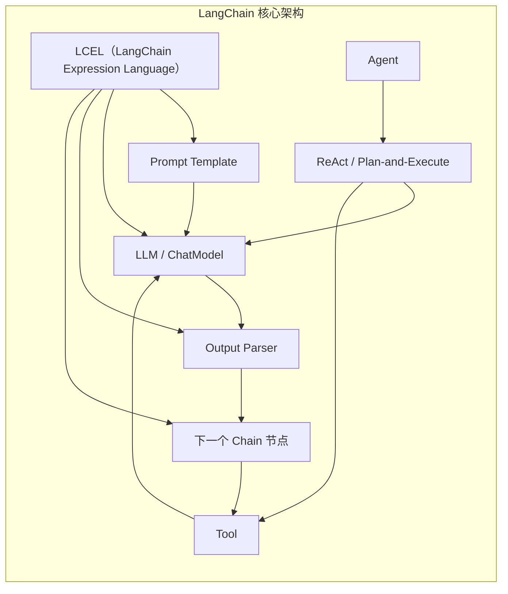
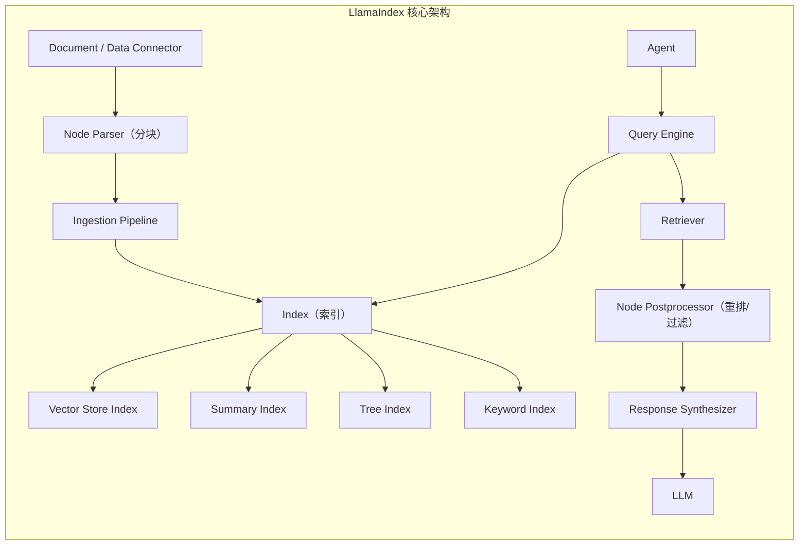
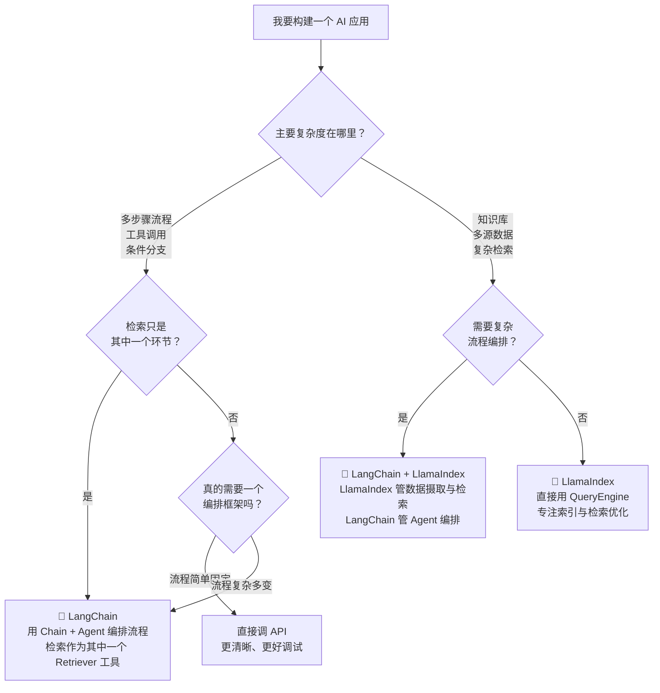

# LangChain 与 LlamaIndex 框架对比：什么时候用什么

很多同学准备 AI 应用研发岗位时，会把 LangChain 和 LlamaIndex 当成"必须学的两个框架"，挨个看文档、跑 Demo，最后面试被问到"你为什么选 LangChain 而不是 LlamaIndex"时还是答不清楚。

问题不在于哪个框架更好。问题在于你没有先想清楚：**你的系统最大的复杂度在流程还是数据。**

这篇文章的目标不是教你用哪个框架，而是帮你建立一套选型逻辑——之后无论框架怎么变，你都能快速判断。

## 一、两个框架的定位差异

### LangChain：以流程为中心的编排框架

LangChain 的核心思路是：**把 LLM 调用抽象成可组合的链式单元。** 它关注的是一系列 LLM 操作的编排——先做什么、再做什么、中间结果怎么传递、出错了怎么处理。



LangChain 的关键词是：**Chain、Agent、Tool、Memory、LCEL。** 它的世界模型是"把 LLM 调用串成一条可控流水线"。

### LlamaIndex：以数据为中心的 RAG 框架

LlamaIndex 的核心思路是：**把数据摄取、索引、检索、查询统一成一套数据管线的抽象。** 它关注的是原始文档如何变成 LLM 可用的上下文。



LlamaIndex 的关键词是：**Index、Node、Retriever、QueryEngine、IngestionPipeline。** 它的世界模型是"把数据变成可查询的知识库"。

### 一句话总结

> **LangChain 管"流程"，LlamaIndex 管"数据"。**

这不是说 LangChain 不会检索、LlamaIndex 不能编排——而是说它们各自的核心设计围绕不同的轴。理解了这个轴，你就能判断什么时候应该往哪个方向偏。

## 二、核心概念对比

### 2.1 框架抽象层对比

| 对比维度 | LangChain | LlamaIndex |
| --- | --- | --- |
| 核心抽象 | Chain / Runnable（可组合的执行单元） | QueryEngine（数据查询的统一入口） |
| 文档处理 | Document Loader + Text Splitter（基础能力） | IngestionPipeline + NodeParser（完整管线） |
| 检索方式 | VectorStore Retriever（以向量库插件形式存在） | 多种 Index + 多种 Retriever（索引是核心） |
| 编排方式 | LCEL（管道操作符 `|`）+ Runnable 接口 | Query Pipeline + Agent |
| Agent 支持 | 核心能力，工具定义和执行循环完善 | 作为 Query Pipeline 的增强层 |
| 多模态 | 通过 Document Loader 支持 | 原生多模态索引（文本、图像、表格） |
| 可观测性 | LangSmith（官方平台，功能完整） | Instrumentation + 第三方集成 |
| 生态 | 模型/向量库/工具/平台集成最广泛 | 数据连接器丰富，检索策略灵活 |

### 2.2 LCEL 与 QueryEngine：两种设计哲学

| 维度 | LangChain LCEL | LlamaIndex QueryEngine |
| --- | --- | --- |
| 设计思想 | 函数式管道，强调组合与复用 | 面向对象的查询封装，强调索引与检索 |
| 表达方式 | `chain = prompt \| llm \| parser` | `engine = index.as_query_engine()` |
| 学习成本 | 需要理解 Runnable 接口和管道语义 | 上手更快，但深入定制需要理解索引结构 |
| 调试方式 | 可通过回调追踪每个节点 | 可通过回调追踪检索与生成阶段 |
| 灵活度 | 极高，可以任意组合 | 检索侧灵活，编排侧不如 LangChain |

### 2.3 各自的优势场景

| 场景 | LangChain | LlamaIndex |
| --- | --- | --- |
| 多步骤 Agent 工作流（思考-行动-观察循环） | 原生优势 | 可以做到但非强项 |
| 复杂工具调用编排 | 成熟 | 一般 |
| 文档解析与数据摄取 | 基础 | 深度优化（PDF、表格、图片） |
| 多策略混合检索 | 需要手动组合 | 内置多种索引和混合检索 |
| 结构化数据查询（Text-to-SQL） | 需要自己实现 | 内置支持 |
| 快速搭建问答机器人 | 较快 | 更快 |
| 检索质量评测 | 依赖外部工具 | 内置评测模块 |
| 生产级可观测性 | LangSmith 完善 | 需要搭配第三方 |

## 三、同一个任务，两种实现

我们用一个经典场景来对比：从一组 Markdown 文档构建 RAG 问答系统，用户可以问"岗位要求是什么"这类问题。

### 3.1 用 LangChain 实现

```python
from langchain_community.document_loaders import DirectoryLoader, TextLoader
from langchain_text_splitters import RecursiveCharacterTextSplitter
from langchain_openai import OpenAIEmbeddings, ChatOpenAI
from langchain_chroma import Chroma
from langchain_core.prompts import ChatPromptTemplate
from langchain_core.runnables import RunnablePassthrough
from langchain_core.output_parsers import StrOutputParser

# 1. 加载文档
loader = DirectoryLoader("./docs", glob="**/*.md", loader_cls=TextLoader)
documents = loader.load()

# 2. 分块
text_splitter = RecursiveCharacterTextSplitter(
    chunk_size=800, chunk_overlap=100
)
chunks = text_splitter.split_documents(documents)

# 3. 构建向量存储与检索器
vectorstore = Chroma.from_documents(
    documents=chunks, embedding=OpenAIEmbeddings()
)
retriever = vectorstore.as_retriever(search_kwargs={"k": 4})

# 4. 构建 RAG Chain（LCEL 管道）
template = """你是一个岗位信息助手。仅根据以下上下文回答问题。
如果上下文中没有相关信息，说"未找到相关信息"。

上下文：
{context}

问题：{question}

回答："""

prompt = ChatPromptTemplate.from_template(template)
llm = ChatOpenAI(model="gpt-4o", temperature=0)

def format_docs(docs):
    return "\n\n".join(doc.page_content for doc in docs)

rag_chain = (
    {"context": retriever | format_docs, "question": RunnablePassthrough()}
    | prompt
    | llm
    | StrOutputParser()
)

# 5. 调用
result = rag_chain.invoke("阿里 AI 应用研发岗位有哪些要求？")
print(result)
```

### 3.2 用 LlamaIndex 实现

```python
from llama_index.core import (
    VectorStoreIndex,
    SimpleDirectoryReader,
    Settings,
)
from llama_index.core.node_parser import SentenceSplitter
from llama_index.llms.openai import OpenAI
from llama_index.embeddings.openai import OpenAIEmbedding

# 1. 全局配置（一次设定，之后自动复用）
Settings.llm = OpenAI(model="gpt-4o", temperature=0)
Settings.embed_model = OpenAIEmbedding()
Settings.node_parser = SentenceSplitter(
    chunk_size=800, chunk_overlap=100
)

# 2. 加载文档（自动分块 + 建索引）
documents = SimpleDirectoryReader(
    input_dir="./docs",
    required_exts=[".md"],
).load_data()

index = VectorStoreIndex.from_documents(documents)

# 3. 构建查询引擎（一行代码）
query_engine = index.as_query_engine(
    similarity_top_k=4,
    response_mode="compact",  # 自动压缩上下文
)

# 4. 调用
result = query_engine.query("阿里 AI 应用研发岗位有哪些要求？")
print(result)
```

### 3.3 代码对比

| 维度 | LangChain | LlamaIndex |
| --- | --- | --- |
| 代码行数 | 约 35 行（不含注释） | 约 20 行（不含注释） |
| 可读性 | 需要理解 LCEL 管道语法，`RunnablePassthrough` 等概念 | 函数调用顺序直观，`Settings` 全局配置降低重复 |
| 灵活性 | 极高：可以替换管道中任意环节，自定义方法签名自由 | 检索侧灵活（索引类型、检索参数可调），编排侧有上限 |
| 调试友好度 | 管道出错时堆栈可能难读 | 检索和生成阶段分离清晰，更容易定位 |
| 适合谁来改 | 熟悉函数式编程、需要自定义编排逻辑的开发者 | 希望快速验证、检索链路比编排复杂的团队 |

> **关键洞察**：代码量的差异不是重点。重点是**当需求变复杂时，你要改动的部分在哪个框架里更自然。** 如果你接下来要加多轮对话、复杂工具调用、条件分支——LangChain 的管道更灵活。如果你接下来要调检索策略、加混合索引、评测检索质量——LlamaIndex 的索引系统更贴合。

### 3.4 如果不用任何框架呢？

实际上，搭建一个 RAG 系统的核心环节很有限：Embedding、向量存储、检索、Prompt 拼装、LLM 调用。不引入任何框架，直接用官方 SDK 也能写清楚：

```python
from openai import OpenAI
import chromadb
import hashlib

client = OpenAI()
chroma_client = chromadb.PersistentClient(path="./chroma_db")
collection = chroma_client.get_or_create_collection("job_docs")

def search(query: str, k: int = 4):
    """检索最相关的文档片段"""
    query_embedding = client.embeddings.create(
        model="text-embedding-3-small", input=query
    ).data[0].embedding
    results = collection.query(
        query_embeddings=[query_embedding], n_results=k
    )
    return results["documents"][0]

def answer(query: str) -> str:
    """检索 + 生成"""
    docs = search(query)
    context = "\n\n".join(docs)
    response = client.chat.completions.create(
        model="gpt-4o",
        messages=[
            {"role": "system", "content": f"仅根据以下上下文回答：\n{context}"},
            {"role": "user", "content": query},
        ],
        temperature=0,
    )
    return response.choices[0].message.content

print(answer("阿里 AI 应用研发岗位有哪些要求？"))
```

这段代码没有任何第三方框架依赖，不到 30 行。如果你的 RAG 需求确实就这么简单，直接用 API 写反而最清晰、最好调试、最不受框架版本升级的影响。

## 四、框架选型决策

### 4.1 决策树



### 4.2 什么时候用 LangChain

- **核心需求是多步骤 Agent 工作流**：重试、分支、工具选择、条件跳转。
- **需要集成大量工具**：API 调用、数据库查询、文件操作——LangChain 的 Tool 生态最成熟。
- **团队需要统一编排范式**：LCEL 的 `|` 操作符让链路定义更声明式。
- **需要生产级可观测性**：LangSmith 提供全链路 Trace。

### 4.3 什么时候用 LlamaIndex

- **核心需求是"让 LLM 理解你的私有数据"**：多格式文档解析、大文件处理、表格理解。
- **检索策略复杂**：混合检索、多层级索引、递归检索、SQL 与向量联合查询。
- **需要快速验证 RAG 方案**：从文档到问答只需要几十行代码。
- **检索质量评测是刚需**：内置评测器可以直接跑 Recall/Precision。

### 4.4 什么时候两个一起用

两个框架不是互斥的。常见的组合方式是：

- **LlamaIndex 负责数据管线**：数据接入、分块、建索引、检索。
- **LangChain 负责应用编排**：Retriever 作为 LangChain 的一个 Tool，由 Agent 决定何时检索。

```python
# 示意：LlamaIndex 的检索器嵌入 LangChain Agent
from llama_index.core import VectorStoreIndex
from langchain.agents import create_openai_functions_agent

# LlamaIndex 侧：构建索引，暴露为检索工具
index = VectorStoreIndex.from_documents(documents)
llama_retriever = index.as_retriever(similarity_top_k=4)

# 包装为 LangChain Tool
from langchain.tools import tool

@tool
def search_knowledge_base(query: str) -> str:
    """搜索内部知识库，获取岗位、文档等信息。"""
    nodes = llama_retriever.retrieve(query)
    return "\n\n".join(n.node.text for n in nodes)

# LangChain 侧：将检索工具和其他工具一起交给 Agent
tools = [search_knowledge_base, send_email_tool, query_database_tool]
agent = create_openai_functions_agent(llm, tools, prompt)
```

### 4.5 什么时候不用任何框架

这是一个容易被忽略但非常重要的选项。以下情况直接调 API 更合适：

1. **流程简单且固定**：用户问问题，检索文档，返回答案——三步就够。
2. **项目尚在验证阶段**：不确定是否需要 RAG，先跑通再引入框架。
3. **团队学习成本敏感**：框架的抽象层可能比业务逻辑更难理解。
4. **对稳定性和可控性要求极高**：框架版本升级可能引入不可预期的行为变化。
5. **已经在用托管平台**：如果你用 Dify、Coze 等平台作为 AI 应用底座，客户端不需要再引入编排框架。

一个实用原则：

> 当你发现自己在和框架打架——花大量时间绕过框架默认行为而不是解决业务问题——那就是应该考虑"不用框架"或"换框架"的信号。

## 五、面试高频追问

### 追问一："你为什么选 LangChain 而不是 LlamaIndex？"

这道题面试官不是让你站队，而是在考察你有没有真正理解两个框架的设计哲学。

**合格的回答思路**：

不要只说"因为流行"或"因为文档多"。应该这样说：

1. 先描述你的项目核心复杂度在哪里（流程 / 数据）。
2. 说明框架设计如何匹配这个复杂度。
3. 提到你考虑了替代方案及取舍。

示例回答：

> 我们的项目需要 Agent 根据用户意图动态选择工具——可能是检索文档、查询数据库，也可能是调用外部 API 创建工单。多步骤编排和工具选择是我们的核心复杂度，所以选了 LangChain。它的 Agent 框架和 LCEL 管道让我们能清晰定义每一步的执行逻辑。
>
> 但如果项目重心是构建企业知识库问答，我会优先考虑 LlamaIndex，因为它的索引系统和检索策略比 LangChain 的检索模块更成熟，数据摄取管线也更完整。

### 追问二：LangChain 的缺点是什么

不能回避这个问题。面试官通常想看到你"用过、踩过坑、有自己的判断"。

LangChain 的主要问题：

1. **过度抽象**：许多包装层只是为了"统一接口"而存在，但增加了理解成本。比如 `RunnablePassthrough`、`RunnableLambda`、`RunnableParallel` 等概念，初学者很容易迷失。
2. **调试困难**：LCEL 管道出错时，堆栈 Trace 可能很深，错误信息不够直观。你需要理解 Runnable 接口的执行机制才能定位问题。
3. **版本兼容性不稳定**：LangChain 从 0.x 到 1.x 经历了大量 Breaking Change，社区的 Cookbook 和教程经常因为版本不对而跑不通。
4. **隐藏的 Prompt 与行为**：很多 Chain 内部有默认 Prompt，如果你不知道它们的存在，最终发给模型的 Prompt 可能和你想的不一样。
5. **重量级**：引入 LangChain 意味着引入整个依赖体系，而你的核心需求可能只是一个简单的 API 调用链。

**追问时的加分回答**：

> 所以在我们的项目中，我们选择直接依赖 `langchain-core` 和 `langchain-openai` 而不是全量安装 `langchain`，并且所有 Prompt 都在代码中显式定义，决不依赖框架默认值。这样既用到了 LCEL 的管道编排能力，又避免了过度封装。

### 追问三：框架的版本兼容性风险怎么处理

这是生产环境必须面对的问题。几个实际做法：

1. **锁定依赖版本**：`requirements.txt` 或 `pyproject.toml` 中使用精确版本号，不用 `>=`。
2. **最小化依赖面**：只安装需要的子包（如 `langchain-core`、`langchain-openai`），不装全家桶。
3. **核心逻辑与框架解耦**：不要让框架的抽象渗透到你的业务服务层。把框架调用封装在薄薄的一层 Adapter 里，框架换了只改 Adapter。
4. **用 CI 跑集成测试**：每次依赖更新时自动跑一遍核心流程的端到端测试。
5. **关注框架的稳定性声明**：看官方是否标注了 Beta、Experimental。生产环境只用 Stable API。

### 追问四：如果你要设计一个更轻量的替代方案，会怎么设计

这道题考察的是你对框架本质的理解——你能不能拆掉框架，把核心机制用最简单的代码重建。

**一个轻量 RAG 编排的设计思路**：

```python
from dataclasses import dataclass
from typing import Protocol

# 1. 用 Protocol 定义接口，不依赖具体实现
class Retriever(Protocol):
    def retrieve(self, query: str, top_k: int) -> list[str]: ...

class Generator(Protocol):
    def generate(self, context: str, query: str) -> str: ...

# 2. 核心编排逻辑不到 20 行
@dataclass
class RAGPipeline:
    retriever: Retriever
    generator: Generator
    top_k: int = 4

    def run(self, query: str) -> dict:
        docs = self.retriever.retrieve(query, self.top_k)
        context = "\n\n".join(docs)
        answer = self.generator.generate(context, query)
        return {
            "answer": answer,
            "sources": docs,
            "query": query,
        }

# 3. 需要 Agent 时，加一个循环
def agent_loop(pipeline: RAGPipeline, user_query: str, max_steps: int = 5):
    """最简单的 Agent：检索 → 判断是否充分 → 决定是否继续"""
    history = []
    for step in range(max_steps):
        result = pipeline.run(user_query)
        history.append(result)
        # 让模型判断答案是否充分
        if is_answer_sufficient(result["answer"]):
            return result
    return result
```

这个设计的要点：

- **协议优于实现**：`Retriever` 和 `Generator` 是 Protocol，你可以用任何库实现。
- **编排逻辑显式**：没有隐式 Prompt、没有自动注入的上下文、没有框架黑魔法。
- **不到 100 行核心代码**：够用于大多数 RAG 场景。
- **需要什么加什么**：重排序、混合检索、记忆，都可以作为可插拔组件加上去。

面试官想看到的不是你重新造一个轮子，而是你能**把框架拆回基本问题**——这个能力比会调用哪个 API 重要得多。

## 自测问题

1. 如果你的项目核心是多步骤 Agent 编排和工具调用，LangChain 和 LlamaIndex 哪个更合适？为什么？
2. LlamaIndex 的 `Settings` 全局配置解决了什么问题？它有没有可能成为问题？
3. 什么情况下你应该"不用任何框架"，直接调 API？
4. LangChain 的过度抽象体现在哪些地方？你如何规避？
5. 如果要在生产环境同时使用 LangChain 和 LlamaIndex，你会怎么分工？

## 参考资料

- [LangChain 官方文档：Expression Language (LCEL)](https://docs.langchain.com/oss/python/langchain/expression-language)
- [LlamaIndex 官方文档：Core Concepts](https://docs.llamaindex.ai/en/stable/understanding/)
- [LlamaIndex 官方文档：Query Engine](https://docs.llamaindex.ai/en/stable/understanding/querying/)
- [LangChain 官方文档：Build a Simple RAG](https://docs.langchain.com/oss/python/langchain/rag)
- [Why We Ditched LangChain (And Why You Should Too)](https://www.patterns.app/blog/why-we-ditched-langchain)
