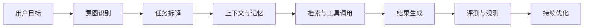
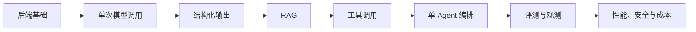

# AI 应用研发工程师求职专题

> 从“会调用模型”走向“能交付一个可靠的 AI 系统”。

这组文章根据阿里巴巴校园招聘岗位 [AI 应用研发工程师](https://campus-talent.alibaba.com/campus/position/199903220038?deptCodes=) 的职责与要求整理。岗位页面会随招聘批次调整，阅读时请以官网最新内容为准。

## 一、这类岗位到底在做什么

AI 应用研发不是给传统后端加一个聊天窗口。它要解决的是：如何让大模型在真实业务里稳定完成任务。

一个能上线的 Agent，除了模型调用，还需要：

模型只是其中一层。工程师还要处理数据、工具协议、错误恢复、并发、延迟、安全、评测和业务指标。

## 二、从岗位要求反推能力地图

阿里岗位文本可以拆成六类能力：

| 能力 | 岗位里的真实问题 | 本专题对应文章 |
| --- | --- | --- |
| Agent 架构 | 记忆、上下文、任务拆解、反思、编排如何设计 | [Agent 系统设计](./02-Agent系统设计与工程化.md) |
| RAG 与数据 | 如何让模型使用可信业务知识，如何评估检索质量 | [RAG 从检索到评测](./03-RAG从检索到评测.md) |
| 工具调用与 MCP | 如何接入 API、知识库和内部系统，如何控制副作用 | [Tool Calling 与 MCP](./04-ToolCalling与MCP.md) |
| 评测、观测与安全 | 如何回归测试、定位失败、控制提示词注入风险 | [评测、可观测与安全](./05-评测可观测与安全.md) |
| 工程能力 | 并发、异步、降级、延迟和成本如何权衡 | [岗位能力路线](./01-岗位能力地图与十二周路线.md) |
| 推理性能 | Streaming、KV Cache、推理框架与性能指标如何理解 | [推理性能基础](./07-推理性能基础.md) |
| AI Coding | 如何用模型提升研发效率，同时保留审查、测试和数据边界 | [AI Coding 工程实践](./08-AICoding工程实践.md) |
| 向量数据库 | Milvus、Chroma、Pinecone 怎么选，生产环境怎么用 | [向量数据库选型与实战](./09-向量数据库选型与实战.md) |
| 框架对比 | LangChain 和 LlamaIndex 各自的定位和适用场景 | [LangChain 与 LlamaIndex 框架对比](./10-LangChain与LlamaIndex框架对比.md) |
| 作品集与表达 | 如何把 Demo 做成可验证、可讲清楚的项目 | [作品集与面试准备](./06-作品集与面试准备.md) |

## 三、不要把学习顺序搞反

很多同学先追框架，再追新概念，最后项目里堆了十几个名词，却回答不了三个基础问题：

1. 不用 Agent 能不能解决？
2. RAG 的检索结果错了，怎么发现？
3. 工具调用失败或超时，系统怎么收场？

建议按下面的顺序学习：

多 Agent、复杂反思循环和大规模工作流可以学，但应建立在可评测的单 Agent 之上。

## 四、如何阅读本专题

### 正在寻找方向

先读 [岗位能力地图与十二周路线](./01-岗位能力地图与十二周路线.md)，判断自己缺的是后端基础、模型应用经验，还是项目证据。

### 已经做过聊天机器人

优先读：

1. [RAG 从检索到评测](./03-RAG从检索到评测.md)
2. [Tool Calling 与 MCP](./04-ToolCalling与MCP.md)
3. [评测、可观测与安全](./05-评测可观测与安全.md)

聊天界面不是项目亮点。如何发现失败、如何修复失败，才是。

### 正在准备面试

读 [作品集与面试准备](./06-作品集与面试准备.md)，为项目准备：

- 一张架构图。
- 一组评测数据。
- 一个失败案例。
- 一个性能优化案例。
- 一个安全边界。

## 五、与现有专题的关系

如果你还没有系统使用过大模型，可以先读 [大模型使用专题](../大模型使用/README.md)。那组文章面向学习和求职效率，这组文章面向 AI 应用研发岗位。

二者的区别很简单：

- **使用专题**：让大模型成为你的助教和工具。
- **研发专题**：让你能够设计、实现、测试和维护一个 AI 应用。

## 参考资料

- [阿里巴巴校园招聘：AI 应用研发工程师](https://campus-talent.alibaba.com/campus/position/199903220038?deptCodes=)
- [Model Context Protocol 官方文档](https://modelcontextprotocol.io/docs/getting-started/intro)
- [LangChain 官方文档：Retrieval](https://docs.langchain.com/oss/python/langchain/retrieval)
- [OWASP GenAI Security Project：Prompt Injection](https://genai.owasp.org/llmrisk/llm01-prompt-injection/)
