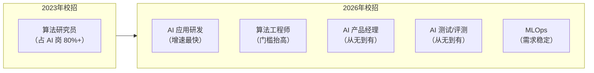
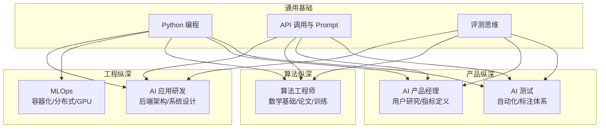
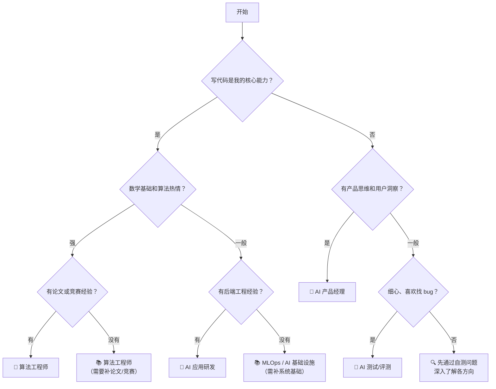

# AI 岗位全景与转型路径：从迷茫到清晰

> 2025-2026 校招季，AI 岗位不再是少数博士的专属赛道。问题是：你到底适合哪一种？

---

## 一、2025-2026 校招 AI 岗位地图

下面这张表覆盖了当前校招市场上主要的六类 AI 岗位。注意：岗位名称各公司叫法不同，关键是看职责和技能要求。

| 岗位类型 | 核心职责 | 必备技能 | 加分项 | 典型公司 | 校招薪资范围（年薪/万） |
| --- | --- | --- | --- | --- | --- |
| **AI 应用研发工程师** | 将大模型能力集成到业务系统中，设计 Agent、RAG、工具调用等架构 | Python/Java/Go 至少一门、API 调用、Prompt 设计、RAG 基础 | 开源项目、Agent 实战经验、评测方法论 | 阿里、字节、腾讯、美团 | 30-55 |
| **算法工程师（CV/NLP/推荐/搜索）** | 模型选型、微调、优化，参与核心算法迭代 | 扎实的数学基础（线代/概率/最优化）、PyTorch/TensorFlow、论文复现能力 | 顶会论文、竞赛 Top 名次、博士学历 | 字节、阿里、百度、商汤、旷视 | 35-70 |
| **AI 产品经理** | 定义 AI 产品功能边界、设计评测标准、管理模型行为预期 | 产品基本功 + 对模型能力/局限的理解、Prompt Engineering、数据分析 | 技术背景（CS 专业）、有过模型调用的项目 | 字节、腾讯、百度、各 AI 创业公司 | 28-50 |
| **AI 测试/评测工程师** | 构建模型和 AI 应用的评测体系，自动化回归测试，发现模型退化 | Python、测试框架、数据标注与清洗、统计学基础 | 自动化测试平台经验、安全测试 | 字节、阿里、百度、快手 | 25-45 |
| **MLOps / AI 基础设施** | 模型训练平台、推理服务部署、GPU 资源调度、Pipeline 编排 | Kubernetes、Docker、Linux 系统、至少一门后端语言、GPU 基础知识 | 大模型推理优化经验、分布式训练 | 阿里云、华为、字节、AWS | 35-60 |
| **Prompt Engineer / AI 运营** | 设计和迭代 Prompt 模板、管理模型输出质量、标注与反馈闭环 | Prompt 设计方法论、数据标注、领域知识（法律/金融/教育等） | 实际业务中调优模型经验、A/B 测试 | 各 AI 创业公司、法律/金融科技公司 | 20-40 |

### 岗位趋势速读

两个关键变化：

1. **AI 应用研发岗位增速远超算法岗**。大模型落地需要大量工程化人才，而不仅仅是模型训练人才。
2. **AI 产品和 AI 测试岗位从 0 到 1**。公司发现光有模型不够，还需要有人定义"好"的标准，有人保证"好"能持续。

---

## 二、不同岗位的能力重叠与差异

六类岗位不是六个孤岛。它们共享一套基础能力，又在各自的纵深上分化。

### 通用能力（所有 AI 岗位都需要）

| 能力 | 具体是什么 | 怎么证明 |
| --- | --- | --- |
| Python 编程 | 能写脚本调用 API、处理数据、做简单后端逻辑 | GitHub 上有调用 OpenAI/Claude API 的项目 |
| API 调用与 Prompt 设计 | 理解模型的输入输出、能写出结构化的 System Prompt | 有实际调优过一个 Prompt 的经验（附效果对比） |
| 评测思维 | 知道如何判断模型输出好不好，能设计简单评测集 | 项目中包含测试用例或评测数据 |
| 对模型能力的理解 | 知道大模型擅长什么、不擅长什么、什么时候不该用 | 面试中能举例说明 |

### 岗位特有能力

| 岗位 | 独有纵深 | 如果缺这个，基本拿不到 offer |
| --- | --- | --- |
| AI 应用研发 | 后端架构设计、异步编程、RAG 与 Agent 编排 | 没有独立完成过一个有架构设计的项目 |
| 算法工程师 | 数学推导能力、论文阅读与复现、模型训练调参 | 没有深度学习项目或论文/竞赛经历 |
| AI 产品经理 | 需求分析、用户访谈、指标定义、项目管理 | 没有产品实习或完整的项目推动经验 |
| AI 测试/评测 | 测试方法论、自动化框架搭建、统计学分析 | 没有测试相关项目或实习 |
| MLOps | Linux 运维、Kubernetes、分布式系统、GPU 管理 | 没有系统管理或运维相关经验 |

---

## 三、三条转型路径

根据你的背景，选择阻力最小的那条路。

### 路径 1：后端开发 → AI 应用研发（差距最小）

这是当前转化率最高的路径。后端工程师已有的能力（系统设计、数据库、API 设计、并发处理）在 AI 应用研发中全部用得上。

**差距分析：**

| 已有的 | 需要补的 |
| --- | --- |
| 后端语言（Java/Go/Python） | Prompt Engineering 方法论 |
| 数据库与缓存 | RAG 架构与检索策略 |
| API 设计与中间件 | Agent 编排（ReAct、Plan-Execute 等范式） |
| 系统设计与高并发 | 模型评测体系搭建 |
| 工程化思维 | 大模型的局限性与幻觉处理 |

**4 周快速学习计划：**

| 周次 | 学习内容 | 产出 |
| --- | --- | --- |
| 第 1 周 | 调用 OpenAI/Claude API，完成结构化输出、Function Calling | 一个能调用工具的简单命令行 Agent |
| 第 2 周 | 学习 RAG 原理：Embedding、向量数据库、检索策略、重排序 | 一个能回答本地文档问题的 RAG 系统 |
| 第 3 周 | 学习 Agent 编排：ReAct 范式、记忆管理、多步推理 | 一个能执行多步任务的 Agent（如自动分析数据并生成报告） |
| 第 4 周 | 搭建评测体系：构造测试集、自动化评测、结果分析 | 为自己的 Agent 写一套评测脚本，输出指标报告 |

**推荐项目方向**：智能客服系统、代码审查助手、数据分析 Agent。重点不是模型多强，而是系统设计合理、有评测数据。

### 路径 2：数据分析/统计学 → AI 算法（需要补数学和深度学习）

数据分析背景的同学在数据处理和统计思维上有优势，但需要补深度学习的理论和实践。

**差距分析：**

| 已有的 | 需要补的 |
| --- | --- |
| Python 数据处理（Pandas/NumPy） | 深度学习框架（PyTorch） |
| 统计分析与可视化 | 线性代数与最优化理论 |
| 数据清洗与特征工程 | 模型训练、微调、评估全流程 |
| SQL 与数据管道 | Transformer 架构与主流模型原理 |

**8 周学习计划：**

| 周次 | 学习内容 | 产出 |
| --- | --- | --- |
| 第 1-2 周 | 线性代数复习 + PyTorch 基础（tensor、autograd、简单网络） | 用 PyTorch 实现线性回归和 MLP |
| 第 3-4 周 | 深度学习基础：CNN、RNN、Transformer 原理 | 复现一篇经典论文的模型结构 |
| 第 5-6 周 | 大模型微调：LoRA、QLoRA、指令微调 | 用一个开源模型完成特定任务的微调 |
| 第 7-8 周 | 刷题 + 项目整理 + 论文阅读 | 一个完整的微调项目 + 项目文档 |

**推荐项目方向**：用 LoRA 微调开源模型做特定领域分类、情感分析、实体识别。重点是有完整的实验记录（数据、超参、结果对比）。

### 路径 3：产品/运营 → AI 产品（需要补技术理解）

产品/运营背景的同学不缺产品 sense，缺的是对模型能力的准确理解和与技术团队的对话能力。

**差距分析：**

| 已有的 | 需要补的 |
| --- | --- |
| 用户研究与需求分析 | Python 基础（能跑脚本、读日志） |
| 指标定义与数据分析 | API 调用与 Prompt 调试 |
| 项目推动与跨部门沟通 | 模型能力边界（什么能做、什么不能做） |
| 竞品分析 | 评测方法论（如何定义"好"） |

**6 周学习计划：**

| 周次 | 学习内容 | 产出 |
| --- | --- | --- |
| 第 1-2 周 | Python 基础 + API 调用实战 | 调用 API 完成一个简单应用（如自动生成周报） |
| 第 3-4 周 | Prompt Engineering 系统学习 + 模型能力边界分析 | 一个 Prompt 调优案例（附优化前后对比） |
| 第 5-6 周 | AI 产品评测方法论 + 竞品分析 | 一份 AI 产品分析报告 + 评测方案设计 |

**推荐产出**：不需要写复杂的代码。做一份某个 AI 产品的深度分析报告，包含：产品能力矩阵、评测标准设计、改进建议。这在 AI 产品岗面试中是强有力的材料。

---

## 四、如何判断自己适合哪个方向

### 5 个自测问题

回答以下问题，每个问题会指向不同方向：

**问题 1：提到"写代码"，你的第一反应是？**
- A. 喜欢设计架构、处理并发、保证系统稳定 → AI 应用研发 / MLOps
- B. 不排斥写代码，但更喜欢思考"为什么做这个功能" → AI 产品经理
- C. 喜欢研究算法原理、做实验、调参数 → 算法工程师

**问题 2：你对数学的态度是？**
- A. 不排斥，但更享受工程落地 → AI 应用研发
- B. 很享受数学推导，看论文的公式部分不会想跳过 → 算法工程师
- C. 不太行，但逻辑分析能力强 → AI 产品经理 / AI 测试

**问题 3：你目前的项目经验最接近哪种？**
- A. 做过完整的后端项目，有上线经验 → AI 应用研发
- B. 做过数据分析、建模相关的课程设计 → 算法工程师（需补深度学习）
- C. 做过产品实习或运营项目 → AI 产品经理
- D. 几乎没有项目经验 → 先补基础，选 AI 应用研发 / AI 测试入门

**问题 4：你对"不确定性"的容忍度？**
- A. 喜欢确定性的输入输出，讨厌"概率性"的结果 → AI 应用研发（工程化解决不确定性）
- B. 能接受概率和不确定性，愿意用实验验证 → 算法工程师
- C. 能接受不确定性，但更关心用户体验是否可接受 → AI 产品经理

**问题 5：你希望在团队中的角色是？**
- A. 技术核心，设计和实现系统 → AI 应用研发 / 算法工程师
- B. 桥梁角色，连接技术和业务 → AI 产品经理
- C. 质量守门员，保证交付质量 → AI 测试/评测

### 决策流程图

---

## 五、AI 岗位简历的关键差异

### AI 岗位简历应该突出什么

相比传统技术岗位，AI 岗位简历需要在以下几个方面额外用力：

| 简历要素 | 传统后端岗位 | AI 岗位（额外要求） |
| --- | --- | --- |
| 项目经验 | 描述技术栈和架构 | **加上评测数据和效果对比**（准确率从 X 提升到 Y） |
| 技能列表 | 语言、框架、数据库 | **加上 Prompt 设计、模型调用、评测方法论** |
| 项目亮点 | QPS、延迟、架构图 | **加上如何处理模型不确定性、失败恢复策略** |
| 技术深度 | 源码阅读、性能优化 | **加上对某个模型行为模式的深入分析** |

### 没有 AI 项目经验怎么写

如果你完全没做过 AI 项目，不要编造，也不要写"对 AI 充满热情"。以下是三个可操作的方案：

**方案 A：改造你现有的后端项目。**
- 你是做电商系统的 → 加一个智能客服模块
- 你是做数据分析的 → 加一个自然语言查询接口
- 关键：不只是调 API，要展示你的工程思考（错误处理、缓存、评测）

**方案 B：做一个完整的 AI Demo 并写好文档。**
- 选一个具体场景（如"帮实习生写周报的工具"）
- 完成从 Prompt 设计 → API 调用 → 错误处理 → 评测的全流程
- 把项目文档写成可交付的形式（README + 架构图 + 评测数据）

**方案 C：参与开源项目。**
- 给 LangChain、LlamaIndex、Dify 等项目提 PR
- 哪怕只是修一个文档 bug 或补充测试用例
- 重要的是你理解了项目的架构和设计思路

### 开源项目、竞赛、论文的权重

不同岗位对这三类"硬通货"的看重程度不同：

| 证明材料 | AI 应用研发 | 算法工程师 | AI 产品经理 | AI 测试 |
| --- | --- | --- | --- | --- |
| **开源项目贡献** | ⭐⭐⭐⭐⭐ | ⭐⭐⭐ | ⭐⭐⭐ | ⭐⭐⭐⭐ |
| **竞赛名次** | ⭐⭐⭐ | ⭐⭐⭐⭐⭐ | ⭐⭐ | ⭐⭐⭐ |
| **论文发表** | ⭐⭐ | ⭐⭐⭐⭐⭐ | ⭐ | ⭐ |
| **完整工程项目** | ⭐⭐⭐⭐⭐ | ⭐⭐⭐ | ⭐⭐⭐ | ⭐⭐⭐⭐ |
| **产品分析报告** | ⭐⭐ | ⭐ | ⭐⭐⭐⭐⭐ | ⭐⭐⭐ |

> 看懂这张表：AI 应用研发最看重的是你能做出可用的东西；算法工程师最看重的是你的研究能力；AI 产品经理最看重的是你的分析能力。

### 简历示例对比

**传统后端开发的简历项目描述：**
> 基于 Spring Boot + Redis + MySQL 设计并实现了电商订单系统，支持高并发下单，QPS 达到 5000，通过消息队列保证最终一致性。

**AI 应用研发的简历项目描述：**
> 基于 LangChain + GPT-4 设计智能客服系统，采用 RAG 架构接入 2000+ 篇产品文档。通过混合检索（BM25 + 向量）将答案准确率从 67% 提升到 89%。设计了 200 条测试用例的自动化评测集，实现了对话质量的可量化追踪。

看出区别了吗？

1. 传统后端强调**系统指标**（QPS、一致性）；AI 岗位还需要**质量指标**（准确率、评测集）。
2. 传统后端描述"做了什么"；AI 岗位需要描述"效果如何"以及"怎么验证效果"。
3. AI 岗位简历的关键词：**评测**、**准确率**、**检索策略**、**自动化测试**。

---

## 六、常见误区

### 误区 1："必须会训练模型才能投 AI 岗"

**事实**：当前校招中增速最快的 AI 岗位是 AI 应用研发，其核心能力是工程化应用大模型，而不是从零训练模型。你不需要知道反向传播的数学推导，但需要知道什么时候用 RAG、什么时候用 Fine-tuning、怎么评测模型输出。

### 误区 2："AI 岗位都是算法岗"

**事实**：如前文的岗位地图所示，AI 岗位已经分化为至少六个方向。其中只有算法工程师需要深度数学和论文能力。AI 应用研发、AI 产品、AI 测试等岗位更看重工程能力、产品思维和评测方法论。

### 误区 3："数学不好不能做 AI"

**事实**：取决于做哪个方向。AI 应用研发需要的是逻辑能力和工程思维，不是数学推导。AI 产品经理需要的是数据分析能力，不是最优化理论。只有算法工程师对数学有硬性要求。如果你能理解"为什么 RAG 有时候检索不准"，而不需要推导 "注意力机制的梯度公式"，你完全可以做 AI 应用研发。

### 误区 4："Python 不熟练没机会"

**事实**：Python 在 AI 生态中确实占主导，但 AI 应用研发也可以用 Java/Go。阿里的 AI 应用研发岗位明确接受 Java 背景。关键是你会用某种语言调用 API、处理数据、设计架构。语言是工具，思路才是核心。

---

## 下一步

1. 如果还没确定方向 → 回到[第四节](#四如何判断自己适合哪个方向)做 5 个自测问题
2. 如果已经确定方向 → 按照[第三节](#三三条转型路径)的学习计划开始准备
3. 如果需要准备简历 → 收藏本页，等待"AI 简历怎么写"专题更新

> 一句话总结：AI 校招的最大信息差，不是你不知道什么技术，而是你不知道自己已经能做什么岗位。
