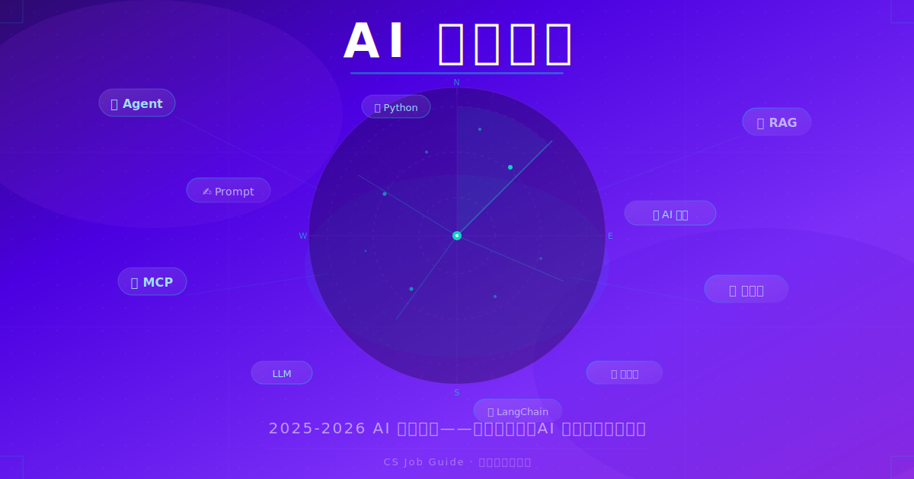
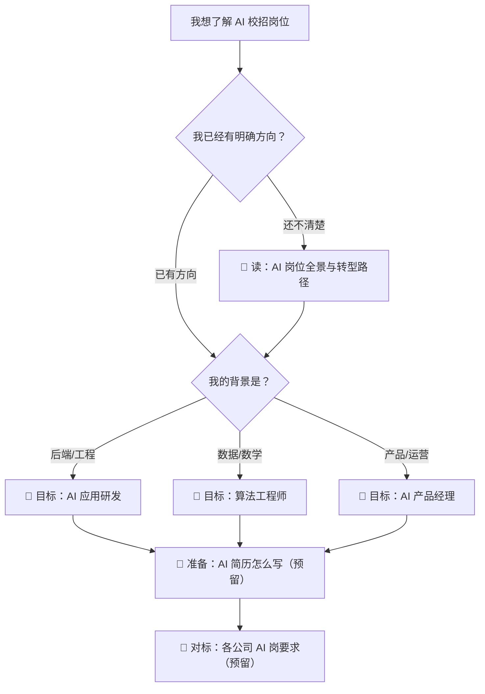

  

# AI 求职趋势与岗位分析

> 2025-2026 年校招中，AI 岗位正在从"少数人的算法竞赛"变成"大多数人的就业选项"。

## 概述

过去两年，校园招聘中的 AI 岗位发生了几个关键变化：

- **岗位种类大幅扩展**：不再只有算法研究员一种选择。AI 应用研发、AI 产品经理、AI 测试/评测、MLOps 等岗位大量出现在各大公司的校招列表中。
- **门槛分层**：不是所有 AI 岗位都要求发过顶会论文。很多岗位更看重工程能力、产品思维和对模型能力的理解。
- **薪资倒挂**：部分 AI 应用类岗位的薪资已接近甚至超过传统后端开发，且需求增速更快。

本专题帮助你回答三个问题：

1. 市场上到底有哪些 AI 岗位？它们分别要求什么？
2. 我目前的背景最适合往哪个方向走？
3. 从现在开始，怎么准备才能在秋招/春招中拿到 AI 方向的 offer？

## 阅读地图

## 文章索引

| 序号 | 文章 | 适合人群 | 状态 |
| --- | --- | --- | --- |
| 1 | [AI 岗位全景与转型路径](./01-AI岗位全景与转型路径.md) | 所有考虑转向 AI 方向的同学 | ✅ 已完成 |
| 2 | AI 简历怎么写 | 正在准备投递 AI 岗位 | 🔜 预留 |
| 3 | 各公司 AI 岗要求对比 | 想了解不同公司差异 | 🔜 预留 |

## 与新专题的关系

- 如果你需要系统学习 AI 应用开发的工程能力，读 [AI 应用研发专题](../AI应用研发/README.md)。
- 如果你需要先了解如何用大模型提升学习效率，读 [大模型使用专题](../大模型使用/README.md)。
- 本专题解决的是"选方向"和"拿到面试"的问题，偏求职策略。

## 快速开始

如果你只有 10 分钟，先读 [AI 岗位全景与转型路径](./01-AI岗位全景与转型路径.md) 的第四节"如何判断自己适合哪个方向"，做完 5 个自测问题，你会对自己的定位有一个初步判断。
