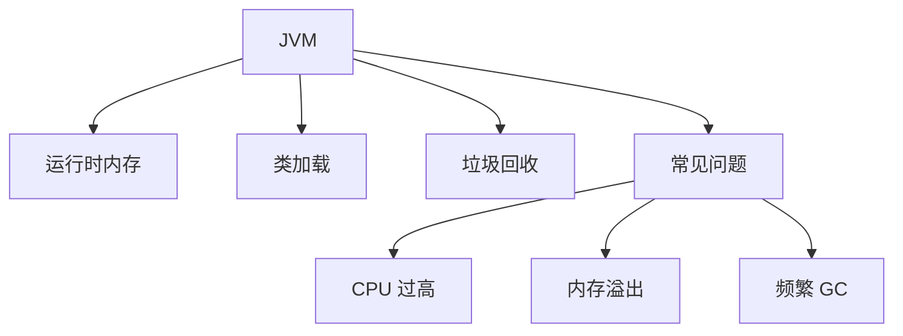

# JVM 高频面试题：内存、GC 与排查思路

JVM 面试题不要只背名词。更好的准备方式是围绕“程序如何加载、对象如何分配、垃圾如何回收、问题如何定位”建立主线。

## 一、知识地图

## 1、JVM 运行时内存区域有哪些？

回答时建议区分线程私有和线程共享区域，并说明它们大致承担什么职责。具体实现与版本细节要查阅对应 JVM 文档。

## 2、堆和栈有什么区别？

| 维度 | 堆 | 栈 |
| --- | --- | --- |
| 典型内容 | 对象实例等 | 方法调用、局部变量等 |
| 共享范围 | 通常在线程之间共享 | 通常线程私有 |
| 常见问题 | 堆内存不足 | 栈深度过大 |

## 3、对象什么时候可以被回收？

核心问题是对象是否仍然可达。回答时可以说明可达性分析，并继续讨论不同引用类型。

## 4、常见垃圾回收思路有哪些？

至少理解标记、复制、整理等基本思路，以及为什么不同区域和场景可能采用不同策略。

## 5、什么是 Stop-The-World？

某些垃圾回收阶段需要暂停应用线程。理解它有助于解释为什么 GC 会影响延迟，以及为什么要关注停顿时间。

## 6、类加载过程包括什么？

可以从加载、链接和初始化展开，并理解双亲委派模型试图解决的问题。

## 7、如何排查内存溢出？

面试中不必堆砌命令。重点说明：先确认现象，再收集证据，最后验证修复。

## 8、CPU 过高怎么排查？

建议说明：

1. 确认问题时间窗口。
2. 定位异常进程和线程。
3. 结合线程栈、日志和监控分析热点。
4. 检查死循环、锁竞争、频繁 GC 和外部依赖。
5. 修复后通过压测和监控验证。

## 9、频繁 GC 可能是什么原因？

可能与对象分配速率、内存设置、缓存使用、数据规模和代码行为有关。不要直接跳到修改 JVM 参数，先确认根因。

## 10、版本意识

JVM 实现、垃圾收集器和默认行为可能随版本变化。面试和实践中都应明确使用的 JDK 版本，并查阅官方资料。

## 行动清单

- [ ] 能解释堆、栈和类加载。
- [ ] 能说明对象可达性和 GC 基本思路。
- [ ] 能讲清楚一次内存或 CPU 问题排查流程。
- [ ] 对版本相关结论查阅官方文档。

参考资料：[Java SE Documentation](https://docs.oracle.com/en/java/javase/21/) · [HotSpot Virtual Machine Garbage Collection Tuning Guide](https://docs.oracle.com/en/java/javase/21/gctuning/)
