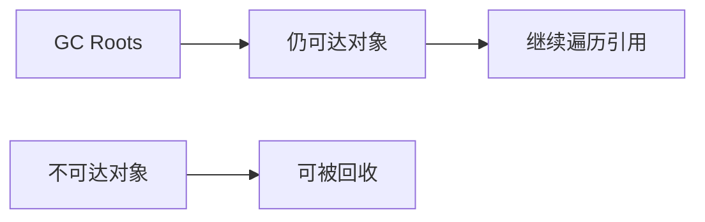

# JVM：从内存结构到线上问题排查

JVM 面试最容易出现两种失衡：

1. 背了许多名词，却说不清一次内存溢出该怎么定位。
2. 只会报命令，却解释不了对象为什么一直活着、GC 为什么频繁发生。

更可靠的复习方式，是用一条问题链把知识串起来：

> 对象放在哪里？什么时候可以回收？回收为什么会影响延迟？程序异常时如何收集证据？

本文以 HotSpot 和 JDK 21 文档为参考。不同 JDK 版本、不同虚拟机实现以及不同垃圾收集器会有差异，面试中应主动说明版本前提。

## 一、先分清内存问题的三种样子

假设一个 Java 服务上线后出现告警，你至少要区分：

| 现象 | 常见方向 | 先看什么 |
| --- | --- | --- |
| 内存持续上涨，最终 OOM | 对象被长期引用、缓存无上限、数据量异常 | 堆使用曲线、GC 日志、堆转储 |
| 内存上下波动，但 GC 很频繁 | 分配速率过高、堆配置不合适、批量处理过重 | GC 频率、停顿、分配行为 |
| CPU 突然升高 | 死循环、热点计算、锁竞争、频繁 GC | 进程、线程、线程栈、GC 指标 |

这三类问题会互相影响，但排查起点不同。不要看到 CPU 高就先改 JVM 参数，也不要看到 OOM 就立刻把堆调大。

## 二、运行时内存：回答时先讲职责，再讲边界

面试官问“JVM 内存区域有哪些”，不是在考背诵顺序。建议从线程共享和线程私有两个角度组织：

| 区域 | 主要职责 | 典型问题 |
| --- | --- | --- |
| 堆 | 存放对象，是 GC 重点管理的区域 | `OutOfMemoryError`、频繁 GC |
| 方法区相关实现 | 类元数据等 | 类加载过多、元空间不足 |
| Java 虚拟机栈 | 方法调用对应的栈帧、局部变量等 | 递归过深导致 `StackOverflowError` |
| 程序计数器 | 记录线程执行位置 | 通常不是业务排查重点 |
| 本地方法栈 | 服务于本地方法调用 | 结合具体实现理解 |

一个经常被忽略的边界是：**局部变量在栈上，不等于对象一定在栈上。**

```java
public UserProfile load() {
    UserProfile profile = new UserProfile();
    return profile;
}
```

这里的局部变量 `profile` 可以理解为引用。对象如何分配，要结合 JVM 优化和实现讨论。校招回答里，先把引用与对象分清楚，比武断地说“对象都在堆上”更稳妥。

## 三、对象什么时候可以被回收

垃圾回收的核心不是“对象不用了”，而是对象是否仍然可达。



业务里的内存泄漏通常不是 JVM 忘了回收，而是代码仍然保留着引用。例如：

```java
private static final Map<Long, UserProfile> CACHE = new HashMap<>();

public void remember(UserProfile profile) {
    CACHE.put(profile.id(), profile);
}
```

如果这个 Map 没有容量上限、淘汰策略和监控，缓存会不断增长。对象“业务上已经没用”并不重要，只要静态 Map 仍然引用它，GC 就不会把它当成垃圾。

### 面试追问

1. 为什么静态集合容易造成内存问题？
2. 缓存应该有哪些边界：容量、TTL、淘汰策略、指标、降级？
3. 弱引用适合解决所有缓存问题吗？为什么不适合？

## 四、理解 GC：先讲目标，不要急着报收集器名字

垃圾回收要解决两个问题：

1. 找出哪些对象已经不可达。
2. 回收空间，并处理空间碎片、复制成本和停顿时间等问题。

常见思路包括标记、复制、清理和整理。不同收集器会采用不同组合。面试中如果被问到收集器，建议按这条线回答：

> 我会先确认 JDK 版本、使用的收集器和服务目标。吞吐量优先的离线任务，与强调尾延迟的在线接口，调优目标并不相同。

Oracle 的 HotSpot GC 调优指南也强调，选择和调优应该围绕应用需求展开，例如最大停顿时间与吞吐量目标，而不是追求一个脱离场景的“最优参数”。

### Stop-The-World 为什么重要

某些 GC 阶段需要暂停应用线程。一次停顿很短，不代表对业务完全无感；频率、尾延迟和流量峰值都要一起看。

因此线上讨论 GC 时，不要只说“平均停顿”。更值得关注：

- 停顿时间分布。
- GC 发生频率。
- GC 前后堆占用变化。
- 请求延迟与 GC 时间点是否重合。
- 对象分配速率是否异常。

## 五、类加载：理解“为什么”，比背流程更重要

类加载可以从加载、链接、初始化展开。校招常问双亲委派，回答不要停在“先让父加载器加载”。

它至少带来两个好处：

1. 避免同一个类被随意重复加载。
2. 保护基础类的稳定性，减少核心类被替换带来的混乱。

继续深入时，应知道实际框架和容器可能存在不同的类加载策略。面试回答要区分“经典模型”和“具体环境中的实现”。

## 六、内存溢出怎么排查：先保存证据

一个比较完整的回答可以这样展开：


### 一个可用的表达

> 我会先确认是堆内存、元空间还是线程相关问题，并保留问题时间窗口内的 GC 日志和监控。如果是堆内存持续增长，会分析堆转储中的大对象、对象数量和 GC Roots 引用链，再回到缓存、集合、监听器或线程本地变量等代码路径验证。修复后不仅看 OOM 是否消失，还要观察内存曲线和 GC 行为是否恢复正常。

### 常见误区

- 一上来只说“加内存”。
- 只看某一刻的内存使用率，不看趋势。
- 拿到堆转储只找最大的对象，不分析它为什么仍然可达。
- 修复后不做压测，也不观察长时间曲线。

## 七、CPU 高怎么排查：把线程栈和业务动作对上

CPU 高不一定是 JVM 问题。排查时可以按以下顺序：

1. 确认异常发生在哪台机器、哪个进程、哪个时间窗口。
2. 找出消耗 CPU 较高的线程。
3. 获取线程栈，判断是计算热点、死循环、锁竞争还是频繁 GC。
4. 把线程栈与接口、任务、日志和发布变更对应起来。
5. 修复后通过同样口径的指标验证。

面试官真正关心的是：你有没有证据链，而不是你能不能一口气报出十条命令。

## 八、一次模拟面试

1. 堆内存持续上涨，但每次 Full GC 后只能回落一点，你会优先怀疑什么？
2. 为什么“把堆调大”有时只是推迟问题暴露？
3. 局部变量在栈上，是否意味着它引用的对象也一定在栈上？
4. 一个服务频繁 GC，但没有 OOM，应该继续看哪些指标？
5. 双亲委派解决了什么问题？在真实框架中是否永远不变？

能把这五题讲清楚，再补充具体收集器和工具，会更扎实。

## 参考资料

- [Oracle Java SE 21：Java Virtual Machine Guide](https://docs.oracle.com/en/java/javase/21/vm/java-virtual-machine-technology-overview.html)
- [Oracle Java SE 21：HotSpot Virtual Machine Garbage Collection Tuning Guide](https://docs.oracle.com/en/java/javase/21/gctuning/)
- [Java Virtual Machine Specification, Java SE 21 Edition](https://docs.oracle.com/javase/specs/jvms/se21/html/)
