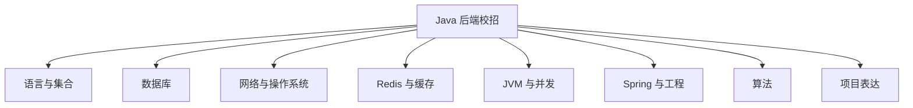

# Java 后端校招学习路线：八周建立可面试的知识主线

准备后端校招时，最常见的焦虑不是没学，而是学得太散：

- Java 集合看过一遍，过两周又忘了。
- Redis 背了穿透、击穿、雪崩，却不会设计一个缓存。
- Spring 用过不少注解，解释事务失效时没有思路。
- 项目写了三个月，面试时只能讲“使用了某某技术”。

解决办法不是再收藏一套资料，而是建立一条可验收的主线：每学一个主题，都留下能讲、能写、能验证的产物。

## 一、先确定校招的最低闭环



不要一开始就把时间全花在微服务、分布式事务和冷门源码上。校招面试里，基础问题回答松散，比“还没学完复杂架构”更影响结果。

## 二、每个主题都要过三道验收

### 1. 能解释

不用背标准答案，能用自己的话说清楚：

- 它解决什么问题。
- 为什么这样设计。
- 有什么代价和边界。

例如，回答 Redis 分布式锁时，不能只说 `SETNX`。至少要想到过期时间、持有者标识、原子释放和任务超时。

### 2. 能写一个最小示例

知识点落到十几行代码里，很多含糊会自然暴露。例如：

- 用不可变对象作为 `HashMap` 的 key。
- 写一个带唯一值校验的 Redis 锁释放脚本。
- 制造一次 Spring 事务自调用失效。
- 用 SQL 执行计划分析一次索引选择。

### 3. 能回答追问

每个知识点至少问自己两次“然后呢”：

```text
HashMap 为什么快？
-> 因为根据哈希值定位桶。
-> 如果哈希冲突很多呢？
-> 如果并发写入呢？
-> 如果 key 放入后字段被修改呢？
```

这才是面试真正发生的方式。

## 三、八周训练安排

每周不只安排“看什么”，还安排产出物。根据自己的基础，可以把一周拉长为两周，但不要取消验收。

| 周次 | 主题 | 必须完成的产出 |
| --- | --- | --- |
| 第 1 周 | Java 基础、集合、异常、泛型 | 讲清 `HashMap`、`ConcurrentHashMap`、`ArrayList`；完成 1 次 30 分钟模拟问答 |
| 第 2 周 | MySQL | 为 3 条 SQL 看执行计划；解释索引、事务、锁与 MVCC 的联系 |
| 第 3 周 | 网络与操作系统 | 画出一次 HTTP 请求路径；讲清 TCP、进程线程、虚拟内存和 IO 多路复用 |
| 第 4 周 | Redis | 为项目设计一份缓存方案；说明 TTL、一致性、击穿和降级 |
| 第 5 周 | JVM 与并发 | 写一份 CPU 高、内存上涨的排查流程；复习线程池、锁和并发容器 |
| 第 6 周 | Spring 与 Spring Boot | 复现事务自调用问题；解释 IoC、AOP、事务边界和自动配置 |
| 第 7 周 | 算法与 Linux/Git | 完成一次限时算法模拟；独立完成服务启动排查和一次 Git 冲突解决 |
| 第 8 周 | 项目与综合模拟 | 完成 2 分钟项目介绍、3 个难点案例和 2 次完整模拟面试 |

## 四、每天怎么安排

如果每天有三小时，可以用一个不花哨的结构：

| 时间 | 内容 | 目标 |
| --- | --- | --- |
| 60 分钟 | 算法训练 | 独立写题，记录错误原因 |
| 60 分钟 | 基础知识 | 读资料、写最小示例、整理追问 |
| 45 分钟 | 项目与工程 | 梳理项目，练习 Linux、Git、SQL 或排查 |
| 15 分钟 | 口头表达 | 不看笔记讲一个主题 |

最后 15 分钟很重要。许多同学“看懂了”，一开口却只能说出关键词。口头表达会迫使你发现知识断点。

## 五、项目怎么和知识点连接

项目不是技术名词清单，而是你解决问题的证据。

把每个项目至少整理成三张卡片：

### 卡片 1：一条核心链路

例如职位发布：

```text
接收请求 -> 校验参数 -> 写入数据库 -> 删除缓存 -> 记录审计日志
```

你要能解释每一步为什么存在，失败后会怎样。

### 卡片 2：一个真实问题

例如缓存删除失败：

- 现象是什么。
- 如何发现。
- 排查过哪些方向。
- 最终原因是什么。
- 修复后如何验证。

### 卡片 3：一个取舍

例如为什么没有引入消息队列，或者为什么缓存允许短时间不一致。

没有使用复杂技术并不可怕。真正危险的是没有判断过程。

## 六、资料使用顺序

建议按下面的顺序复习：

1. 先读一篇主线文章，建立地图。
2. 对不理解的点看官方文档或教材。
3. 写最小示例。
4. 用自己的语言做口头复述。
5. 把卡住的问题记录下来，一周后重答。

本专栏的后端主线：

- [Java 基础与集合](./Java基础与集合高频面试题.md)
- [JVM：从内存结构到线上问题排查](./JVM高频面试题.md)
- [Redis：缓存设计、持久化与并发边界](./Redis高频面试题.md)
- [Spring 与 Spring Boot](./Spring与SpringBoot高频面试题.md)
- [Linux 与 Git](./Linux与Git校招实用指南.md)
- [MySQL 基础高频面试题](./MySQL基础高频面试题%20.md)
- [MySQL 进阶高频面试题](./MySQL进阶高频面试题.md)
- [MySQL 高级高频面试题](./MySQL高级高频面试题.md)
- [操作系统高频面试题](./操作系统高频面试题.md)
- [数据结构与算法刷题计划](./数据结构与算法刷题计划.md)

## 七、什么情况下可以进入下一阶段

不是“文章看完了”，而是你能完成这些动作：

- 不看笔记解释一个主题 5 分钟。
- 写出一个最小示例。
- 接住至少两个追问。
- 说出一个业务边界或失败场景。
- 知道哪里需要查官方文档，而不是凭印象下结论。

达到这个标准，知识才开始变成面试能力。
