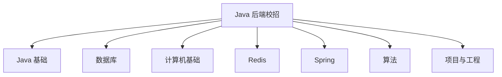

# Java 后端校招学习路线

后端校招需要建立主线。不要一开始就追逐复杂架构，也不要只背零散题目。先完成“语言、数据库、网络、操作系统、缓存、框架、算法、项目”八个模块的最小闭环。

## 一、能力地图

## 二、学习顺序

| 阶段 | 模块 | 最低要求 |
| --- | --- | --- |
| 01 | Java 基础 | 面向对象、集合、异常、泛型、并发基础 |
| 02 | MySQL | SQL、索引、事务、锁、MVCC、慢查询 |
| 03 | 网络与操作系统 | TCP、HTTP、HTTPS、进程线程、内存、IO |
| 04 | Redis | 数据结构、持久化、缓存问题 |
| 05 | JVM | 内存区域、GC、类加载、排查思路 |
| 06 | Spring | IOC、AOP、事务、常用注解、启动流程 |
| 07 | 算法 | 数组、链表、树、哈希、搜索、动态规划 |
| 08 | 项目 | 个人职责、技术选择、问题定位、验证方式 |

## 三、八周训练计划

| 周次 | 主题 | 验收方式 |
| --- | --- | --- |
| 第 1 周 | Java 基础与集合 | 回答 20 道题，完成一次模拟面试 |
| 第 2 周 | MySQL | 使用执行计划分析 SQL |
| 第 3 周 | 网络与操作系统 | 能口述 TCP、HTTP 和进程线程 |
| 第 4 周 | Redis | 能说明缓存穿透、击穿、雪崩 |
| 第 5 周 | JVM 与并发 | 能解释 GC、类加载和线程安全 |
| 第 6 周 | Spring 与项目 | 完成 2 分钟项目讲解稿 |
| 第 7 周 | 算法集中训练 | 完成错题复盘 |
| 第 8 周 | 综合模拟面试 | 输出薄弱点清单 |

## 四、学习深度标准

每个主题至少回答三类问题：

1. **是什么**：给出准确解释。
2. **为什么**：说明设计取舍。
3. **怎么用**：结合项目、SQL 或代码。

## 五、不要过早追求复杂度

微服务、分布式事务、复杂中间件都可以学习，但前提是你已经能够解释基础问题。校招面试中，基础薄弱比“没学过高级架构”更致命。

## 行动清单

- [ ] 按照八周计划标记自己的薄弱模块。
- [ ] 每周完成一次口头模拟面试。
- [ ] 为每个模块建立错题清单。
- [ ] 用项目案例连接知识点。

延伸阅读：[Java 基础与集合高频面试题](./Java基础与集合高频面试题.md) · [Redis 高频面试题](./Redis高频面试题.md) · [JVM 高频面试题](./JVM高频面试题.md)
