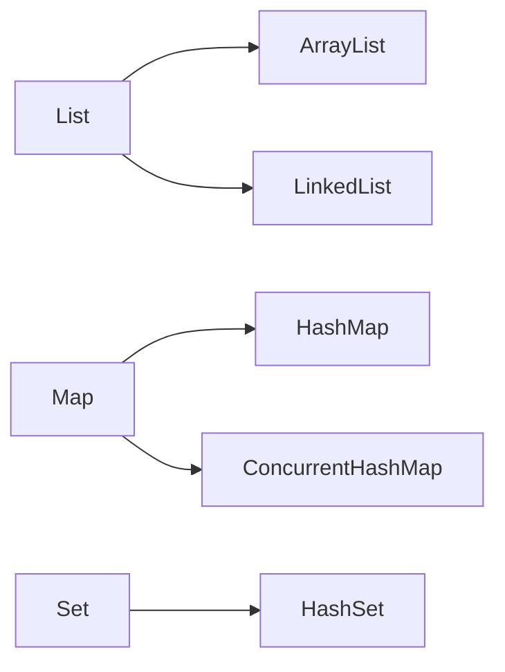

# Java 基础与集合高频面试题

Java 基础是后端面试的第一道门槛。复习时不要只背结论，还要结合源码思想、线程安全和使用场景进行说明。

## 1、`==` 和 `equals` 有什么区别？

对于基本类型，`==` 比较值；对于引用类型，`==` 比较引用是否指向同一对象。`equals` 的语义取决于类是否重写该方法。

追问：重写 `equals` 时为什么通常也要重写 `hashCode`？

## 2、String、StringBuilder 和 StringBuffer 有什么区别？

| 类型 | 特点 | 常见场景 |
| --- | --- | --- |
| `String` | 不可变 | 少量字符串、常量 |
| `StringBuilder` | 可变，通常用于单线程拼接 | 循环拼接 |
| `StringBuffer` | 方法带同步控制 | 特定线程安全场景 |

## 3、ArrayList 和 LinkedList 有什么区别？

回答时不要简单说“查询快、增删快”。需要结合访问位置、移动元素、节点遍历、内存局部性和实际场景讨论。

## 4、HashMap 的基本原理是什么？

理解 HashMap 可以围绕：

1. 如何根据 key 定位桶。
2. 如何处理哈希冲突。
3. 何时扩容。
4. 为什么需要合理实现 `hashCode` 和 `equals`。
5. 并发写入时为什么不能直接使用普通 HashMap。

## 5、HashMap 和 ConcurrentHashMap 有什么区别？

ConcurrentHashMap 面向并发访问场景。回答时应说明线程安全、并发控制和使用限制，不要只回答“一个安全，一个不安全”。

## 6、ArrayList 扩容需要注意什么？

扩容通常需要创建更大的数组并复制元素，因此频繁扩容会产生额外开销。能够预估容量时，可以考虑提前设置初始容量。

## 7、接口和抽象类如何选择？

接口更适合表达能力约定和多种实现；抽象类适合复用共同状态和行为。选择时应考虑职责、继承限制和可维护性。

## 8、异常有哪些常见类别？

| 类别 | 说明 |
| --- | --- |
| Checked Exception | 编译期要求处理或声明 |
| RuntimeException | 运行时异常，通常与程序逻辑有关 |
| Error | 通常表示较严重问题，不建议按普通业务异常处理 |

## 9、什么是泛型？

泛型可以增强类型安全，并减少显式类型转换。继续追问时可能涉及类型擦除、通配符和边界。

## 10、如何复习集合框架？

对每个常用集合回答：

1. 底层结构是什么？
2. 常见操作复杂度如何？
3. 是否线程安全？
4. 什么场景适合使用？
5. 有哪些边界和误区？

## 行动清单

- [ ] 能解释 `equals` 与 `hashCode` 的关系。
- [ ] 能对比常用集合的结构和场景。
- [ ] 能说明 HashMap 的基本原理。
- [ ] 能解释并发环境下集合选择。

参考资料：[Java Platform API Documentation](https://docs.oracle.com/en/java/javase/21/docs/api/)
