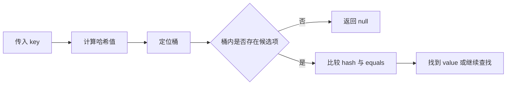

# Java 基础与集合：面试官真正想听什么

Java 基础题看起来零碎，真正考察的却是同一件事：你能不能从 API 的表面用法，继续讲到数据结构、对象语义和并发边界。

如果面试官问“`HashMap` 的原理是什么”，背出“数组、链表、红黑树”只能算开场。一个有说服力的回答，还要解释：为什么需要 `hashCode` 和 `equals`、容量为什么会影响性能、普通 `HashMap` 为什么不能直接承担并发写入、业务代码里最容易踩什么坑。

本文以 JDK 21 为参考版本。涉及阈值、扩容和树化等实现细节时，应明确它们属于具体 JDK 的实现，不要把实现细节说成 Java 语言规范。

## 一、先从一个线上问题说起

某个接口把用户信息放进缓存：

```java
Map<UserKey, UserProfile> cache = new HashMap<>();

UserKey key = new UserKey("20260001");
cache.put(key, profile);

key.setStudentId("20260002");
System.out.println(cache.get(key)); // 可能得到 null
```

对象明明还在 `Map` 里，为什么取不到？

原因在于：`HashMap` 会根据 key 的哈希值定位桶。如果 key 放入后，参与 `hashCode()` 计算的字段发生变化，再用这个对象查询时可能会走到另一个桶。这个例子比背诵“重写 `equals` 必须重写 `hashCode`”更重要，因为它揭示了 Map 的真实使用约束：**作为 key 的对象最好不可变**。

## 二、`equals` 与 `hashCode`：对象语义的底座

### 1. `==` 与 `equals` 的区别

- 基本类型使用 `==` 比较值。
- 引用类型使用 `==` 比较两个引用是否指向同一个对象。
- `equals` 表达逻辑相等。类没有重写时，默认行为仍接近引用相等。

### 2. 为什么重写 `equals` 时通常也要重写 `hashCode`

哈希容器先根据哈希值缩小查找范围，再在候选元素中判断是否相等。两个逻辑相等的对象如果拥有不同哈希值，可能被放入不同桶，容器就无法正确识别它们。

应记住的不是一句口诀，而是这条约束：

> 如果两个对象通过 `equals` 判断相等，它们必须拥有相同的 `hashCode`。反过来不成立：哈希值相同的对象仍可能不相等。

一个适合作为 key 的类，通常应该只使用稳定字段参与相等性判断：

```java
public record UserKey(String studentId) {
}
```

`record` 不会自动解决所有设计问题，但它天然适合表达这类不可变值对象。

### 面试追问

1. 哈希冲突为什么不可避免？
2. `HashSet` 为什么也需要正确实现 `hashCode` 和 `equals`？
3. ORM 实体是否适合直接作为 `HashMap` 的 key？如果主键在持久化后才生成，会发生什么？

## 三、`HashMap`：不要把答案停在“数组加链表”

Oracle API 文档对 `HashMap` 的定位很克制：它是基于哈希表的 `Map` 实现，允许 `null` key 和 `null` value，不保证顺序，也不提供同步保证。理解这几句话，已经能回答不少常见误用。

### 1. 一次查询大致经历什么



理想情况下，元素分布均匀，定位桶后只需要少量比较。真正值得讨论的是两个退化场景：

1. key 的哈希分布差，大量元素挤在少数桶中。
2. 容量设置不合理，频繁扩容带来重新组织数据的成本。

### 2. 容量与负载因子应该怎么讲

`HashMap` 的性能与两个参数有关：

- **capacity**：桶数组容量。
- **load factor**：容量使用到什么程度时触发扩容。

Oracle 文档指出，默认负载因子 `0.75` 通常在时间和空间成本之间取得较好平衡。负载因子过高，冲突概率会上升；过低，则空间浪费更明显。

如果已经能估算元素规模，应考虑初始化容量。这里不必炫耀一串位运算，先说清楚目标：减少扩容次数，同时避免分配明显过大的数组。

```java
Map<Long, UserProfile> profiles = new HashMap<>(expectedSize);
```

### 3. “链表转红黑树”应该怎么回答

在常见 JDK 8 及之后的实现中，桶内冲突严重时可能树化，以避免链表过长导致查询退化。面试时可以提到这一点，但最好补一句：

> 树化阈值属于实现细节。业务代码真正应该关心的是 key 设计、初始容量和是否存在恶意或异常的哈希分布。

这会比背阈值更像工程回答。

### 4. 为什么不能在并发写入场景直接用 `HashMap`

`HashMap` 没有提供并发安全保证。即使你在一次测试里没复现问题，也不能据此认为它“多数时候可用”。并发代码的判断标准不是“目前没报错”，而是操作是否拥有清晰的同步约束。

如果多个线程需要共享访问，应先问：

1. 是只读，还是会写入？
2. 是单次 `get` / `put`，还是“先读再写”的复合操作？
3. 是否需要原子更新？

## 四、`ConcurrentHashMap`：线程安全不等于业务原子性

很多回答到这里会变成：“`ConcurrentHashMap` 是线程安全的，所以可以放心用。”这句话只说了一半。

下面的代码仍然有竞态条件：

```java
if (!map.containsKey(key)) {
    map.put(key, loadValue());
}
```

两个线程可能同时判断 key 不存在，然后重复加载、重复写入。应该使用容器提供的复合操作：

```java
Value value = map.computeIfAbsent(key, this::loadValue);
```

但也不要把 `computeIfAbsent` 当成万能按钮。映射函数应该尽量短小，不要在里面执行不可控的慢操作，也不要写难以推理的递归更新。Oracle API 文档明确说明该操作是原子的，并提醒映射函数不应在计算过程中修改该 Map。

### 面试追问

1. `Collections.synchronizedMap` 和 `ConcurrentHashMap` 的适用场景有什么区别？
2. `ConcurrentHashMap` 为什么不允许 `null` key 和 `null` value？
3. “线程安全的容器”能否保证一段业务流程整体线程安全？

## 五、`ArrayList` 与 `LinkedList`：别再机械背“增删快”

一个常见但不够准确的回答是：

> `ArrayList` 查询快，`LinkedList` 增删快。

更好的回答需要补充“在什么位置”和“是否已经拿到节点”。

| 场景 | `ArrayList` | `LinkedList` |
| --- | --- | --- |
| 按下标读取 | 直接定位，适合随机访问 | 需要从头或尾遍历 |
| 尾部追加 | 通常高效，容量不足时扩容 | 通常高效 |
| 中间插入 | 需要移动后续元素 | 先定位节点，再修改链接 |
| 遍历性能 | 连续存储通常更友好 | 节点分散，额外对象更多 |

关键点在于：如果为了在 `LinkedList` 中间插入一个元素，你仍然要先按下标遍历到目标位置，那么“修改链接很快”并不等于整个操作更快。

大多数业务代码优先从 `ArrayList` 开始考虑。只有明确需要双端队列等语义时，再选择更合适的数据结构。队列场景也可以进一步了解 `ArrayDeque`。

## 六、字符串、异常与泛型：基础题也要回答到位

### 1. `String`、`StringBuilder` 与 `StringBuffer`

| 类型 | 特点 | 常见选择 |
| --- | --- | --- |
| `String` | 不可变，适合表达值 | 少量拼接、常量、方法参数 |
| `StringBuilder` | 可变，不提供同步保证 | 单线程循环拼接 |
| `StringBuffer` | 方法带同步控制 | 历史代码或确有同步需求的场景 |

不要把“字符串拼接一定要用 `StringBuilder`”说得过于绝对。简单表达式可能被编译器优化。真正需要关注的是循环中反复拼接、可读性和实际性能证据。

### 2. 异常不是分类题，而是边界设计题

业务代码中，异常至少承担三件事：

1. 告诉调用方失败原因。
2. 保留定位问题所需的上下文。
3. 明确哪些问题可以恢复，哪些应该尽快暴露。

不要随手 `catch (Exception e)` 后只打印一句日志，更不要吞掉异常。一个清晰的异常处理策略，通常比背完 checked exception 和 runtime exception 的定义更有价值。

### 3. 泛型的真正价值

泛型不仅减少类型转换，更重要的是把类型错误提前到编译阶段。继续追问时，要能解释：

- 为什么 `List<Integer>` 不是 `List<Number>` 的子类型。
- `? extends T` 更适合读取，`? super T` 更适合写入。
- Java 泛型通常通过类型擦除实现。

## 七、一轮模拟面试

尝试在不看笔记的情况下回答：

1. 一个对象放入 `HashSet` 后，修改字段导致 `contains` 返回 `false`，你会从哪里排查？
2. 已知接口一次会加载十万条数据，如何减少 `ArrayList` 和 `HashMap` 的扩容成本？
3. 用 `ConcurrentHashMap` 做本地缓存时，为什么“先判断再写入”仍可能有问题？
4. `LinkedList` 在中间插入元素一定比 `ArrayList` 快吗？
5. 你会如何设计一个稳定、可读、适合作为 Map key 的类？

能把这些问题讲顺，再去记更细的源码实现，效率会高很多。

## 参考资料

- [Oracle Java SE 21 API：HashMap](https://docs.oracle.com/en/java/javase/21/docs/api/java.base/java/util/HashMap.html)
- [Oracle Java SE 21 API：ConcurrentHashMap](https://docs.oracle.com/en/java/javase/21/docs/api/java.base/java/util/concurrent/ConcurrentHashMap.html)
- [Oracle Java SE 21 API：ArrayList](https://docs.oracle.com/en/java/javase/21/docs/api/java.base/java/util/ArrayList.html)
- [Oracle Java SE 21 API：LinkedList](https://docs.oracle.com/en/java/javase/21/docs/api/java.base/java/util/LinkedList.html)
