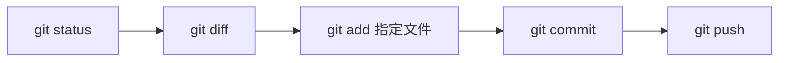

# Linux 与 Git：校招够用的工程基本功

Linux 和 Git 很少以“请完整讲一遍”的方式出现在面试里。它们更常藏在项目追问中：

- 服务启动后访问不了，你怎么排查？
- 日志里出现大量报错，你怎么定位时间窗口？
- 两个人改了同一段代码，冲突怎么处理？
- 不小心提交了不该提交的文件，怎么办？

这类问题不需要背命令百科。重要的是形成一条清楚的排查路径，并知道哪些操作会改写历史。

## 一、Linux：从“接口访问不了”开始

假设你把一个 Java 服务部署到 Linux 服务器，进程看起来已经启动，但浏览器访问超时。不要立刻重启，先把问题拆成几层：


### 1. 看进程

```bash
ps -ef | grep java
```

你要确认的不只是“有没有 Java”，还包括：

- 是否是预期的进程。
- 启动时间是否合理。
- 启动参数和配置文件是否正确。
- 是否发生重复启动。

### 2. 看端口

```bash
ss -lntp
```

`ss` 可以查看 socket 统计信息。关注服务是否监听预期端口，以及监听地址是 `127.0.0.1`、`0.0.0.0` 还是特定网卡地址。

如果服务只监听本地回环地址，从其他机器访问自然失败。

### 3. 在服务器本机请求一次

```bash
curl -i http://127.0.0.1:8080/health
```

如果本机能访问，外部不能访问，排查重点应转向网络、安全组、防火墙和代理配置。如果本机都失败，再回到进程、端口和应用日志。

这就是工程排查最重要的习惯：**每一步都缩小问题范围。**

## 二、日志：先锁定时间窗口，再搜索上下文

最没有效率的做法，是打开一整个日志文件从头翻到尾。

先确认：

1. 问题大约发生在什么时间。
2. 对应哪个服务实例。
3. 是否有请求 ID、用户 ID、任务 ID 或错误码。
4. 发布、配置变更和依赖异常是否发生在同一时间窗口。

常见命令：

```bash
tail -n 200 app.log
grep -n "ERROR" app.log
grep -n "requestId=abc123" app.log
```

如果服务由 systemd 管理，可以进一步了解：

```bash
journalctl -u your-service --since "2026-05-31 10:00:00"
```

日志不是越多越好。项目里最好让关键日志具备时间、级别、请求标识和必要上下文，同时避免输出密码、令牌和完整个人信息。

## 三、CPU、内存与磁盘：先看现象，再做判断

### 1. CPU 高

```bash
top
ps -ef
```

对 Java 服务，下一步通常要结合线程级信息、线程栈和 GC 指标。不要把 `top` 当作结论，它只是入口。

### 2. 内存高

```bash
free -h
top
```

Linux 会把空闲内存用于缓存，因此看到内存占用高，不等于立刻存在泄漏。要结合进程、趋势、交换空间和应用指标分析。

### 3. 磁盘空间不足

```bash
df -h
du -sh *
```

常见原因包括日志没有轮转、临时文件未清理、构建产物重复堆积。执行清理前先确认路径和文件用途，不要为了腾空间直接删除未知目录。

## 四、权限与文件：理解最常见的边界

```bash
ls -la
chmod u+x deploy.sh
```

看到 `Permission denied` 时，先判断：

- 当前用户是谁。
- 文件或目录归谁所有。
- 缺的是读、写还是执行权限。
- 父目录是否允许访问。

不要习惯性使用最高权限运行服务。最小权限不仅是安全要求，也能减少误操作范围。

## 五、Git：先建立提交意识

Git 不只是“把代码传到 GitHub”。它首先是一套记录变更、理解差异和协作开发的工具。

一个小而清晰的日常循环：



### 1. 每次提交前先看什么

```bash
git status --short
git diff
git diff --staged
```

这三条命令分别帮助你确认：

- 哪些文件发生变化。
- 尚未暂存的改动是什么。
- 即将进入提交的改动是什么。

把“提交前看 diff”养成习惯，可以避免把配置文件、临时文件和无关改动一起交上去。

### 2. 提交应该多大

一次提交最好表达一个完整、可理解的意图，例如：

```text
修复职位详情缓存删除失败后的重试逻辑
```

比起：

```text
update
```

前者更容易审查，也更方便未来定位问题。

## 六、分支、合并与变基：先知道谁会改写历史

### 1. 分支是什么

分支可以理解为指向某次提交的可移动引用。创建功能分支后，你可以在不影响主线的情况下提交改动：

```bash
git switch -c feature/job-cache
```

### 2. 合并冲突怎么处理

冲突不是 Git 坏了，而是 Git 无法替你判断哪一份内容才符合业务意图。

处理顺序：

1. `git status` 查看冲突文件。
2. 打开文件理解两边改动。
3. 手工保留正确内容。
4. 运行测试或至少完成必要验证。
5. 暂存并提交解决结果。

不要盲目选择“全部接受当前”或“全部接受对方”。冲突解决是一次代码审查。

### 3. `merge` 与 `rebase`

- `merge` 会保留分支合并关系。
- `rebase` 会把提交重新放到新的基线之上，形成更线性的历史。

关键边界是：`rebase` 会改写提交历史。对于已经推送并被其他人基于其开发的公共分支，不要随意变基和强推。

面试中不需要站队。说明团队规范、历史可读性和协作风险即可。

## 七、误提交文件怎么办

先分情况：

### 文件尚未提交

```bash
git restore --staged path/to/file
```

这会把文件从暂存区移出。是否继续保留工作区修改，取决于你的实际需求。

### 已提交但尚未共享

可以根据团队习惯修改本地提交。但执行会改写历史的操作前，先确认它没有被其他人使用。

### 敏感信息已经推送

不要只删除文件再提交。密码、令牌和密钥应立即轮换或吊销，并按仓库管理规范处理历史记录。因为敏感信息一旦推送，就不能假设“后来删掉了，所以没人看到”。

## 八、一次模拟面试

1. 服务启动后外部访问不了，你会如何逐层缩小范围？
2. 为什么 Linux 内存占用高不一定等于内存泄漏？
3. 解决 Git 冲突时，为什么不能机械地接受某一侧全部改动？
4. `rebase` 的风险是什么？什么情况下要谨慎使用？
5. API 密钥被提交并推送后，为什么第一步是轮换，而不是只删文件？

## 九、练习建议

找一个自己的项目，用虚拟机、云服务器或本地 Linux 环境完成：

1. 启动服务，并用 `ps`、`ss`、`curl` 验证。
2. 制造一次端口配置错误，根据排查路径定位。
3. 创建两个 Git 分支修改同一行，手工解决冲突。
4. 提交前用 `git diff --staged` 检查改动。

做过一次，远比背二十条命令扎实。

## 参考资料

- [Git 官方文档](https://git-scm.com/docs)
- [Pro Git：Git Branching](https://git-scm.com/book/en/v2/Git-Branching-Branches-in-a-Nutshell)
- [Linux manual page：ss(8)](https://man7.org/linux/man-pages/man8/ss.8.html)
- [systemd 官方文档：journalctl](https://www.freedesktop.org/software/systemd/man/latest/journalctl.html)
