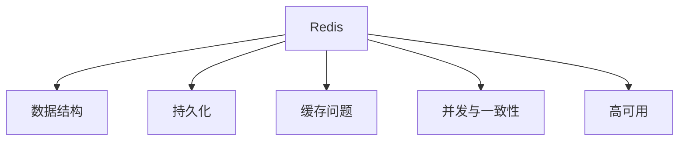

# Redis 高频面试题：缓存、持久化与高并发

Redis 面试题经常从“用过哪些数据结构”开始，逐步追问到缓存异常、持久化、一致性和并发问题。回答时不要只背方案，要说明业务场景与取舍。

## 一、知识地图



## 1、Redis 常见数据结构有哪些？

| 数据结构 | 常见场景 |
| --- | --- |
| String | 缓存对象、计数器、简单状态 |
| Hash | 对象字段存储 |
| List | 简单队列、时间线 |
| Set | 去重、集合运算 |
| Sorted Set | 排行榜、按分值排序 |
| Stream | 消息流场景 |

选择数据结构前，先明确查询方式、更新方式和数据规模。

## 2、什么是缓存穿透？

查询不存在的数据时，如果每次请求都落到数据库，可能形成缓存穿透。

常见思路：

1. 对非法输入提前校验。
2. 对不存在的数据短时间缓存空值。
3. 使用布隆过滤器降低无效请求。

## 3、什么是缓存击穿？

热点 key 失效时，大量请求同时访问数据库，可能形成缓存击穿。可以根据业务选择互斥更新、逻辑过期或提前刷新。

## 4、什么是缓存雪崩？

大量 key 在相近时间失效，或缓存服务不可用，可能导致请求集中落到后端。常见思路包括分散过期时间、限流降级、提高可用性和容量评估。

## 5、RDB 和 AOF 有什么区别？

| 维度 | RDB | AOF |
| --- | --- | --- |
| 核心思路 | 保存某个时间点的数据快照 | 记录写操作日志 |
| 恢复方式 | 加载快照 | 重放日志 |
| 关注点 | 快照频率、数据丢失窗口 | 日志体积、写入策略、重写 |

具体参数和行为应结合使用版本查阅 [Redis 官方文档](https://redis.io/docs/latest/operate/oss_and_stack/management/persistence/)。

## 6、如何理解缓存与数据库一致性？

缓存和数据库是两个系统，很难只靠一句“先删缓存还是先更新数据库”覆盖所有场景。应先回答：

1. 业务允许多长时间的不一致？
2. 读多写少还是写入频繁？
3. 是否需要消息、重试或补偿？
4. 如何监控异常并进行修复？

## 7、分布式锁需要注意什么？

至少关注：

- 锁是否设置合理过期时间。
- 解锁时是否确认锁属于自己。
- 任务执行时间超过过期时间怎么办。
- 网络异常和重试是否可能带来问题。
- 是否真的需要分布式锁，能否通过业务唯一约束解决。

## 8、Redis 为什么快？

回答时可以从内存访问、高效数据结构、事件处理模型和减少阻塞等角度说明。不要只回答“因为在内存中”。

## 9、如何排查热点 key？

1. 观察请求量、延迟和错误率。
2. 结合业务判断热点来源。
3. 评估本地缓存、拆分 key、限流和容量扩展。
4. 上线后继续观察效果。

## 10、面试表达模板

```text
这个问题需要先看业务场景。
如果是【场景】，主要风险是【风险】。
我会优先采用【方案】，因为【原因】。
同时还要考虑【边界条件】，并通过【监控或验证方式】确认效果。
```

## 行动清单

- [ ] 能解释常见数据结构和场景。
- [ ] 能区分穿透、击穿和雪崩。
- [ ] 能比较 RDB 与 AOF。
- [ ] 能讨论一致性和分布式锁的边界。

参考资料：[Redis Documentation](https://redis.io/docs/latest/)
