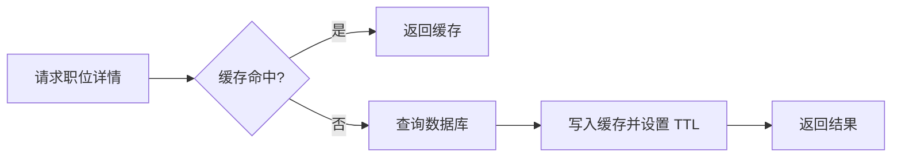
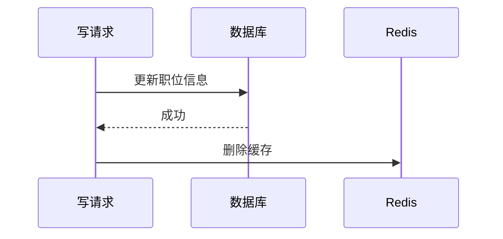

# Redis：缓存设计、持久化与并发边界

Redis 面试题经常从一句“项目里用过 Redis 吗”开始。如果回答只剩下穿透、击穿、雪崩三个名词，面试很快就会陷入背诵。

更好的方式，是先把业务问题说清楚：

> 为什么要加缓存？读写比例如何？允许多久不一致？热点 key 失效会发生什么？缓存服务不可用时，数据库能不能扛住？

Redis 不是项目装饰品。它改变了系统的数据路径，也引入了新的失败方式。

## 一、先设计一个缓存，而不是先背术语

假设求职平台有一个职位详情接口：

```text
GET /jobs/{jobId}
```

职位详情读多写少，适合缓存。但在写代码前，至少要回答：

1. key 如何命名？是否包含版本或业务前缀？
2. value 存整个对象，还是按字段拆分？
3. TTL 多长？是否允许短时间旧数据？
4. 职位下线后如何让缓存尽快失效？
5. Redis 不可用时，是回源、限流还是降级？

一个常见读路径如下：



这只是起点。真正的面试深度在异常路径里。

## 二、数据结构：选择取决于访问方式

Redis 官方文档列出了 String、Hash、List、Set、Sorted Set、Stream 等常用数据类型。回答“用过哪些”没有意义，应该结合查询方式讨论。

| 场景 | 可考虑的数据结构 | 需要继续判断 |
| --- | --- | --- |
| 缓存职位详情 JSON | String | 更新是否总是整体覆盖 |
| 保存对象部分字段 | Hash | 是否经常按字段读写 |
| 去重后的收藏集合 | Set | 是否需要集合运算 |
| 热门职位排行榜 | Sorted Set | 排序分值如何更新 |
| 事件流与消费组 | Stream | 消费确认、积压和重试策略 |

不要把 Redis 数据结构当成 Java 集合的远程版本。需要同时考虑序列化成本、网络往返、数据规模、过期策略和命令复杂度。

## 三、缓存穿透、击穿、雪崩：区别在流量如何落到数据库

### 1. 缓存穿透：请求的数据根本不存在

例如攻击者持续请求不存在的 `jobId`。缓存没有数据，数据库也没有数据，每次请求都回源。

可以分层处理：

1. 在入口校验明显非法参数。
2. 对不存在的数据缓存短时间空值。
3. 数据规模和场景合适时，引入布隆过滤器。
4. 对异常访问增加限流和监控。

空值缓存不是没有代价。TTL 太长会让新创建的数据暂时不可见，TTL 太短又削弱防护效果。回答时把这个取舍说出来，才算完整。

### 2. 缓存击穿：一个热点 key 突然失效

例如某个大厂校招职位被集中访问，恰好在流量高峰过期。大量请求同时回源，数据库压力瞬间升高。

常见思路包括：

- 使用互斥更新，让少量请求负责重建缓存。
- 热点数据使用逻辑过期，并由后台刷新。
- 在可预测的活动前提前预热。

没有一种方案永远正确。互斥更新会增加等待时间；逻辑过期可能返回旧数据。选择取决于业务能否容忍短时间不一致。

### 3. 缓存雪崩：大量 key 同时失效，或者 Redis 整体不可用

如果批量写入的数据拥有完全相同的 TTL，它们可能在同一时刻集中失效。可以在 TTL 上增加小范围随机偏移，降低同时回源概率。

但这只解决一种雪崩。Redis 节点故障、网络异常、容量不足也可能让请求落到数据库。因此还需要限流、降级、容量评估和高可用方案。

## 四、缓存与数据库一致性：先问“允许错多久”

缓存和数据库是两个系统，不存在一句万能口诀解决一致性问题。

以“更新数据库后删除缓存”为例：



这个方案简单、常用，但仍要继续追问：

1. 删除缓存失败怎么办？
2. 是否需要重试、消息队列或补偿任务？
3. 读请求在并发窗口内会不会写回旧值？
4. 业务允许多久的数据不一致？
5. 如何监控缓存更新异常？

面试中可以这样回答：

> 我会先明确一致性要求。对职位详情这类读多写少、允许短时间旧数据的场景，可以更新数据库后删除缓存，并为删除失败设计重试和监控。如果是余额、库存扣减这类强约束数据，我不会把缓存当作唯一正确性来源，而会把约束放回数据库或专门的交易链路。

## 五、RDB 与 AOF：不要只背“快照”和“日志”

Redis 官方持久化文档介绍了 RDB 与 AOF 两类机制：

| 机制 | 核心思路 | 优点 | 需要接受的代价 |
| --- | --- | --- | --- |
| RDB | 在某个时间点生成数据快照 | 文件紧凑，适合备份与恢复 | 两次快照之间可能有数据丢失窗口 |
| AOF | 记录写操作，重启时重放 | 可根据刷盘策略降低数据丢失范围 | 文件更大，需要重写与恢复成本 |

回答时要把持久化目标说清楚：缓存是否允许丢失？Redis 是否还承担队列、状态或排行榜等更重要的数据？恢复时间要求是什么？

Redis 官方文档也说明可以同时启用 RDB 与 AOF。选择不是考试里的二选一，而是数据价值、性能、恢复目标和运维复杂度之间的平衡。

## 六、分布式锁：最危险的答案是“`SETNX` 就行”

一个相对完整的锁至少需要：

1. 原子地完成“只有不存在时才写入”和设置过期时间。
2. value 中保存唯一标识，表示锁的持有者。
3. 解锁时先判断持有者，再删除锁。
4. 用原子方式完成“判断并删除”。

伪代码可以写成：

```text
SET resource_name unique_value NX PX 30000
```

释放锁时不能直接 `DEL`。考虑这个时间线：

```text
客户端 A 获得锁
客户端 A 执行过慢，锁过期
客户端 B 获得同名锁
客户端 A 执行 DEL，误删了 B 的锁
```

因此，释放锁时需要校验唯一值，并用脚本保证比较和删除的原子性。Redis 官方分布式锁文档给出了相应思路。

更重要的是继续追问：

- 任务执行时间超过锁过期时间怎么办？
- 网络分区时，安全性和可用性如何取舍？
- 是否真的需要 Redis 锁？
- 能否使用数据库唯一约束、幂等键或业务状态机解决？

能问出最后一个问题，往往比“我会用 Redisson”更有工程意识。

## 七、热点 key 与大 key：不要等到报警才第一次讨论

### 热点 key

热点 key 会让少数节点或网络链路承受集中压力。处理方式可能包括：

- 本地短时缓存。
- 拆分读取压力。
- 提前预热。
- 对热点接口限流。
- 结合业务判断是否能返回降级数据。

### 大 key

大 key 可能拖慢序列化、网络传输和命令执行，也会让删除或迁移更棘手。设计时不要把没有上限的数据不断塞进一个 key。

一个实用原则是：**缓存设计必须拥有容量意识。** 不仅要问“能不能存”，还要问单 key 多大、总量多大、增长是否有上限、如何淘汰和监控。

## 八、一次模拟面试

1. 职位详情缓存删除失败，你会如何保证最终恢复一致？
2. 为什么给 TTL 加随机值只能缓解部分缓存雪崩？
3. 缓存空值会带来什么副作用？
4. 为什么释放分布式锁时不能直接 `DEL`？
5. 一个排行榜 key 越来越大，你会怎样重构？
6. Redis 出现延迟抖动，你会从业务、命令、网络和容量哪些方向排查？

## 参考资料

- [Redis 官方文档：Data types](https://redis.io/docs/latest/develop/data-types/)
- [Redis 官方文档：Persistence](https://redis.io/docs/latest/operate/oss_and_stack/management/persistence/)
- [Redis 官方文档：Distributed locks with Redis](https://redis.io/docs/latest/develop/clients/patterns/distributed-locks/)
