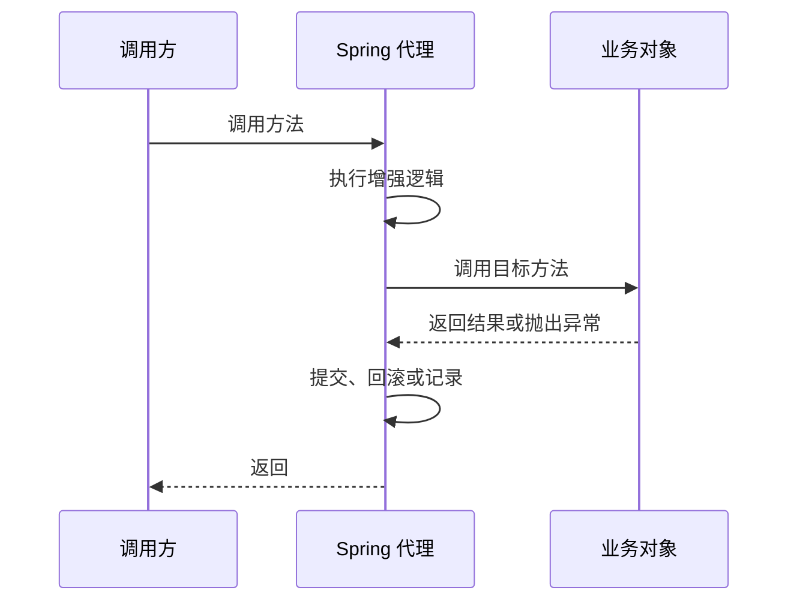

# Spring 与 Spring Boot：从容器、代理到一次事务失效

Spring 面试题很容易变成注解默写：`@Component`、`@Autowired`、`@Transactional`、`@SpringBootApplication`。这些当然要认识，但只会背注解，遇到追问很快就会卡住。

更好的复习方式是抓住三条主线：

1. 容器如何创建和管理对象。
2. 代理如何在方法调用前后增加行为。
3. Spring Boot 如何把常见配置组织成更顺手的启动体验。

本文不试图覆盖 Spring 的所有能力。目标是让你在校招面试中，把最常见的问题说清楚，并能解释一个真实故障。

## 一、先从一个事务为什么没生效说起

看下面这段简化代码：

```java
@Service
public class JobService {

    public void publishBatch(List<Job> jobs) {
        for (Job job : jobs) {
            publishOne(job);
        }
    }

    @Transactional
    public void publishOne(Job job) {
        // 写数据库
    }
}
```

很多同学会自然地认为：`publishOne` 标了 `@Transactional`，循环中每次调用都会进入事务。

但在常见的 Spring 代理模式下，`publishBatch` 内部直接调用 `this.publishOne(...)`，调用没有经过外部代理，事务拦截逻辑就可能没有机会执行。Spring 官方事务文档明确提醒：代理模式下，只有通过代理进入的外部方法调用才会被拦截，自调用不会触发事务行为。

这个问题值得记住，因为它把 IoC、AOP、代理和事务连在了一起。

## 二、IoC：不是“把对象放进容器”这么简单

### 1. 容器解决了什么问题

没有容器时，一个服务可能自己创建依赖：

```java
public class JobService {
    private final JobRepository repository = new JdbcJobRepository();
}
```

这段代码可以运行，但 `JobService` 与具体实现绑定得很紧。测试时想替换仓储实现，或者未来切换数据来源，都要修改业务类。

使用依赖注入后：

```java
@Service
public class JobService {
    private final JobRepository repository;

    public JobService(JobRepository repository) {
        this.repository = repository;
    }
}
```

对象的创建和依赖关系交给容器管理，业务类只依赖抽象。Spring 官方文档把 IoC 也称为依赖注入：对象通过构造器参数、工厂方法参数或属性声明依赖，容器在创建 bean 时注入这些依赖。

### 2. 为什么更推荐构造器注入

构造器注入的好处很朴素：

- 依赖在对象创建时就明确。
- 便于写单元测试。
- 更容易把必要依赖设计为 `final`。
- 依赖过多时，会自然暴露类职责可能过重。

字段注入写起来短，但短不等于更清晰。面试中如果被问偏好，建议从可测试性和对象完整性回答。

### 3. Bean 的生命周期应该怎么讲

不要一口气背十几个扩展点。先说主干：


再补充：Spring 提供了 BeanPostProcessor、初始化回调、销毁回调等扩展机制。具体回调顺序较细，使用时应查对应版本文档，不要在业务代码里依赖难以维护的隐式顺序。

## 三、AOP：代理到底替你做了什么

AOP 适合处理横切关注点：事务、日志、鉴权、监控等。它们会出现在许多业务方法周围，但不应该复制粘贴到每个方法里。

可以把代理理解为一层可插入的调用边界：



### 自调用为什么容易失效

对象内部通过 `this` 调用另一个方法时，路径没有重新经过代理。于是依赖代理实现的增强能力可能不会触发。

可考虑的改法不是死记一种，而是根据职责选择：

1. 把需要事务边界的方法拆到另一个 Bean，由外部注入后调用。
2. 重新设计事务边界，让入口方法承担清晰的事务职责。
3. 在确有需要时了解 AspectJ 模式，但不要为了绕过设计问题轻易增加复杂度。

## 四、`@Transactional`：面试重点是边界和失败条件

### 1. 事务注解应该放在哪里

事务通常围绕一段完整业务动作设计，例如“创建订单并扣减可售库存”。不要把每条 SQL 都单独套一层事务，也不要让事务无边界地包住外部 HTTP 调用。

长事务会占用连接和锁资源，增加竞争与失败成本。

### 2. 为什么有时异常抛出了却没有回滚

常见方向包括：

- 方法调用没有经过代理，例如自调用。
- 异常被业务代码捕获后吞掉。
- 回滚规则与异常类型不匹配。
- 数据库引擎或调用链并没有提供预期的事务能力。
- 事务边界拆分不合理。

Spring 官方文档说明，默认情况下声明式事务会对 `RuntimeException` 和 `Error` 回滚，而 checked exception 默认不会触发回滚。真正开发时，应根据业务明确回滚规则，并通过测试验证。

### 3. 传播行为不要背成单词表

先理解问题：一个有事务的方法调用另一个有事务的方法，内部方法是加入已有事务，还是新开事务，还是要求当前不能有事务？

最常见的 `REQUIRED` 可以理解为：

> 当前有事务就加入，没有就创建。

其他传播行为要结合明确场景学习。面试中如果没有实际使用经验，不必硬讲复杂案例。

## 五、循环依赖：先判断是否值得解决

构造器注入下，如果 A 依赖 B，B 又依赖 A，容器无法完成对象创建：

```text
JobService -> NotificationService -> JobService
```

面试官问循环依赖时，经常期待你谈 Spring 的处理机制。但在工程里，第一反应应该是：**这两个类的职责是不是纠缠过深？**

优先考虑：

- 抽取第三个更清晰的服务。
- 使用领域事件或消息解耦。
- 调整调用方向。

理解框架如何处理部分循环依赖是知识，主动减少循环依赖是设计能力。

## 六、Spring Boot：不是“Spring 的升级版”

Spring Boot 建立在 Spring 之上，重点是让应用更容易创建、配置和运行。它常见的价值包括：

- 提供 starter 依赖，组织常见技术栈。
- 根据 classpath、配置和条件装配常用 Bean。
- 提供外部化配置。
- 提供嵌入式服务器和生产可用能力。

### 自动配置应该怎么解释

不要只背 `@EnableAutoConfiguration`。可以这样说：

> Spring Boot 会根据应用当前具备的类、配置项和已有 Bean 等条件，决定是否应用某些自动配置。它不是无条件替你创建所有对象，也不是不可见的魔法。遇到配置不符合预期时，应该查看条件是否满足、是否存在自定义 Bean 覆盖以及配置属性是否正确。

Spring Boot 官方参考文档也说明，自动配置会尝试基于已添加的 jar 依赖自动配置应用；当开发者定义自己的配置时，特定自动配置可以回退。

### 面试追问

1. 为什么有时引入一个 starter 后应用行为会变化？
2. 自定义 Bean 与自动配置的 Bean 同时存在时怎么办？
3. 配置文件里的密码能否直接提交到仓库？
4. 开发、测试、生产环境的配置应该如何隔离？

## 七、一个排查案例：事务注解存在，数据却只写了一半

可以用下面的顺序回答：

1. 确认异常是否真的抛出，是否被捕获后吞掉。
2. 确认方法是否由 Spring 管理的 Bean 调用。
3. 确认调用是否经过代理，是否存在自调用。
4. 检查回滚规则与异常类型。
5. 确认事务覆盖的数据源和数据库能力。
6. 增加集成测试，验证回滚结果。

这比单纯回答“加一个 `rollbackFor = Exception.class`”更可靠，因为后者只能覆盖部分原因。

## 八、一次模拟面试

1. IoC 解决的核心问题是什么？为什么构造器注入更适合必要依赖？
2. `@Transactional` 方法被同一个类的另一个方法调用，为什么可能失效？
3. 声明式事务默认遇到 checked exception 一定回滚吗？
4. 循环依赖出现时，你会优先调整框架配置还是重新看职责划分？
5. Spring Boot 自动配置为什么不是“引入依赖后什么都不用管”？

## 参考资料

- [Spring Framework Reference：The IoC Container](https://docs.spring.io/spring-framework/reference/core/beans.html)
- [Spring Framework Reference：Declarative Transaction Management](https://docs.spring.io/spring-framework/reference/data-access/transaction/declarative.html)
- [Spring Boot Reference：Auto-configuration](https://docs.spring.io/spring-boot/reference/using/auto-configuration.html)
