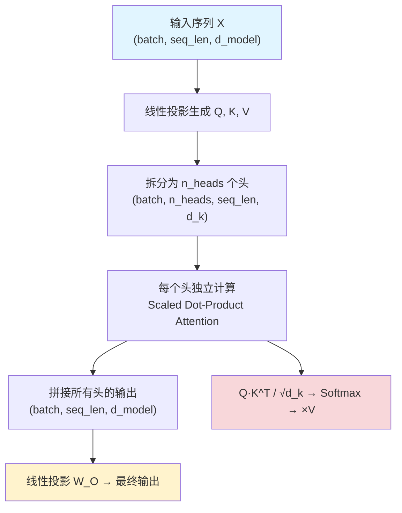
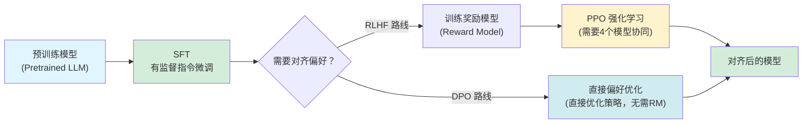
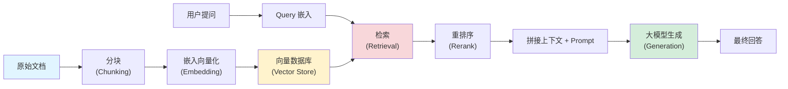
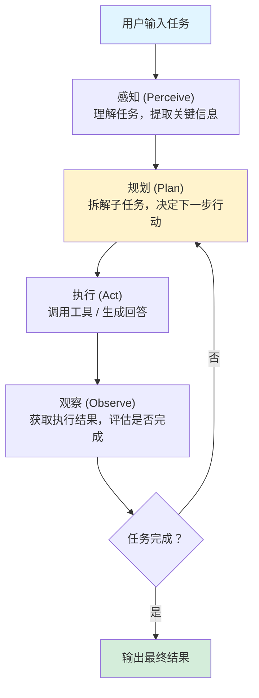
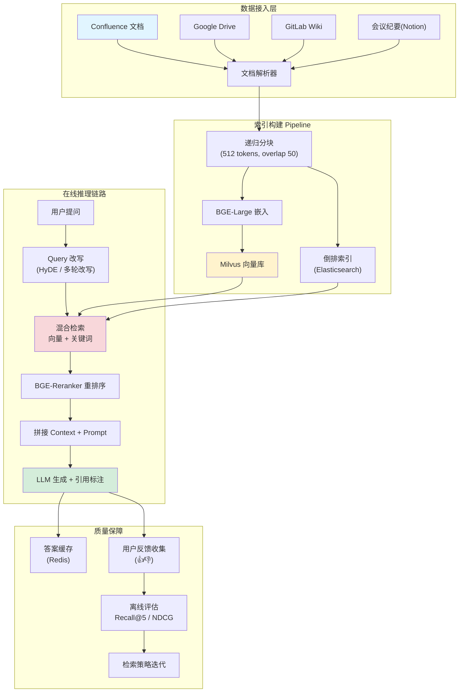

# 大模型与 AI 面试高频题：面试官真正想考什么

大模型/AI 方向的校招面试，最常出现的两类候选人：一类能流畅地背出 Transformer 结构图，但问一句"为什么 QK^T 之后要除以 √d_k"就卡住了；另一类项目经验丰富，却说不清 LoRA 到底省了多少参数、RAG 的检索质量怎么衡量。

面试官真正想听的不是名词堆砌，而是你能否从"原理→工程权衡→边界条件"这条线把问题讲通。本文覆盖 AI 面试中最高频的七个模块，每个模块都标注了面试官最可能追问的方向。

## 一、Transformer 与 Attention

如果面试只给一次展示理解深度的机会，Transformer 就是这一个。不要从"Encoder 和 Decoder 各 6 层"开始背——面试官想听的是你为什么这样设计。

### 1. Self-Attention 的计算流程与 Q/K/V 的物理含义

Self-Attention 的核心计算只有三步：

```python
import torch
import torch.nn.functional as F

def self_attention(X, W_Q, W_K, W_V):
    """
    X: (batch, seq_len, d_model)
    W_Q, W_K, W_V: (d_model, d_k) 或 (d_model, d_v)
    """
    Q = X @ W_Q   # (batch, seq_len, d_k)
    K = X @ W_K   # (batch, seq_len, d_k)
    V = X @ W_V   # (batch, seq_len, d_v)

    # 注意力分数：Q 与 K 的点积，衡量"当前位置应该关注哪些位置"
    scores = Q @ K.transpose(-2, -1) / (K.shape[-1] ** 0.5)  # 缩放 √d_k

    # softmax 归一化为概率分布
    attn_weights = F.softmax(scores, dim=-1)

    # 用注意力权重加权聚合 V
    output = attn_weights @ V   # (batch, seq_len, d_v)
    return output, attn_weights
```

| 矩阵 | 物理含义 | 面试角度怎么讲 |
| --- | --- | --- |
| **Q（Query）** | "我在找什么"——当前 token 发出的查询信号 | 每个位置向全序列提出的问题 |
| **K（Key）** | "我是什么"——每个 token 的特征标签 | 每个位置提供的匹配索引 |
| **V（Value）** | "我有什么内容"——每个 token 实际携带的信息 | 被选中后实际传递的语义内容 |

关键洞察：Q 和 K 负责"注意谁"，V 负责"提取什么内容"。这种设计将**注意力决策**与**信息传递**解耦——即使两个位置的 Key 相似（都值得关注），它们的 Value 也可以完全不同（携带不同的语义信息）。

### 2. 多头注意力为什么有效

如果用单头注意力，一个词只能生成一种注意力模式——"bank"可能只关注了"river bank"的上下文，却错过了"bank account"的信息。多头注意力让模型同时从多个子空间进行关注：

```python
class MultiHeadAttention(nn.Module):
    def __init__(self, d_model=512, n_heads=8):
        super().__init__()
        self.d_k = d_model // n_heads
        self.n_heads = n_heads

        # 所有头的 Q/K/V 投影合并为一个大矩阵，计算更高效
        self.W_Q = nn.Linear(d_model, d_model)
        self.W_K = nn.Linear(d_model, d_model)
        self.W_V = nn.Linear(d_model, d_model)
        self.W_O = nn.Linear(d_model, d_model)

    def forward(self, X):
        batch, seq_len, d_model = X.shape

        # 投影并拆分为多个头
        Q = self.W_Q(X).view(batch, seq_len, self.n_heads, self.d_k).transpose(1, 2)
        K = self.W_K(X).view(batch, seq_len, self.n_heads, self.d_k).transpose(1, 2)
        V = self.W_V(X).view(batch, seq_len, self.n_heads, self.d_k).transpose(1, 2)

        # 缩放点积注意力（每个头独立计算）
        scores = Q @ K.transpose(-2, -1) / (self.d_k ** 0.5)
        attn = scores.softmax(dim=-1)
        head_out = attn @ V

        # 拼接所有头的结果
        concat = head_out.transpose(1, 2).contiguous().view(batch, seq_len, d_model)
        return self.W_O(concat)
```

从工程角度看，多头的价值在于：(1) 不同头可以关注不同距离、不同语法关系、不同语义维度；(2) 多个低维注意力比一个大注意力更稳定，因为每个头只需学习一种模式；(3) 现代 GPU 对矩阵分块计算天然友好。

### 3. 位置编码的几种方案

| 方案 | 特点 | 代表模型 | 适用场景 |
| --- | --- | --- | --- |
| **正弦位置编码** | 固定函数生成，无需学习；可外推到训练时未见过的长度 | 原始 Transformer | 当外推能力有要求 |
| **可学习位置编码** | 作为参数参与训练；受训长度限制 | BERT, GPT-2 | 固定长度场景 |
| **RoPE（旋转位置编码）** | 通过旋转变换将位置信息注入 Q/K 点积，相对位置天然成立 | LLaMA, Qwen, ChatGLM | 当前主流，兼顾外推与训练效率 |
| **ALiBi** | 在注意力分数上加一个与距离成正比的偏置 | BLOOM | 追求简单和强外推能力 |

RoPE 目前是事实标准。它的核心数学是：对 Q 和 K 的每两个维度施加一个角度与位置成正比的旋转。因为旋转后 Q 和 K 的点积只依赖于**两个位置之间的相对距离**，所以相对位置信息自然成立，无需额外编码。

### 4. 为什么 Transformer 比 RNN/LSTM 更适合长序列

回答这个问题的关键是"路径长度"和"并行度"：

- **信息传播路径**：RNN 中，位置 t 要与位置 1 交互，必须经过 t-1 步递推——每一步都可能损失信息。Transformer 中任意两个位置直接通过 Attention 建立连接，路径长度为 O(1)。
- **梯度传播**：RNN 的 BPTT 沿时间步反向传播，层数≈序列长度，梯度消失/爆炸严重。Transformer 的梯度只需要穿过残差连接和注意力层，路径短得多。
- **并行计算**：RNN 的每一步依赖上一步的隐藏状态，训练时无法并行。Transformer 的所有位置同时计算 Q/K/V，训练效率差一个数量级。

但要注意补一句：Self-Attention 的时间和显存复杂度是 O(n^2)，这是 Transformer 处理超长序列的主要瓶颈。面试官如果追问，可以自然引出 FlashAttention、稀疏注意力、Mamba 状态空间模型等方向——说明你了解这个设计的代价，而不是只讲优点。

### 👉 面试追问

1. **为什么缩放因子是 √d_k？** 当 d_k 很大时，Q·K^T 的方差会增大（假设 Q 和 K 的元素独立，方差为 1，则点积方差为 d_k）。softmax 在输入方差大时趋向 one-hot 分布（梯度趋近 0），除以 √d_k 将方差拉回 1，使 softmax 保持在合适的工作区间。面试官想听的不是"除以根号"，而是你理解"控制方差→稳定梯度"这条因果链。

2. **Pre-Norm 和 Post-Norm 有什么区别？** Post-Norm（原始 Transformer）在每个子层之后做 LayerNorm：`LayerNorm(x + Sublayer(x))`。Pre-Norm：`x + Sublayer(LayerNorm(x))`。Pre-Norm 训练更稳定，不需要 warmup 也能收敛，所以 LLaMA、GPT 等现代模型都用它。代价是浅层残差可能"绕过"子层（通过 residual 直传），理论表达能力略弱于 Post-Norm。

3. **为什么不直接用"无头"的大 Attention，而要拆成多头？** 如果只有一个头，每个位置的注意力分布是所有维度共用的——它必须同时照顾语法、语义、指代消解等所有任务。多头让不同维度的子空间形成独立的注意力分布。而且降维可以减少单头参数和计算量。



## 二、大模型训练与微调

把微调方法背成清单（SFT → RLHF → DPO）只能拿及格分。面试官真正要考的是：你能不能根据资源、数据量和业务目标，说出应该选哪种方案并讲清理由。

### 1. SFT、RLHF、DPO 的区别与演进



| 方法 | 输入 | 核心思路 | 工程复杂度 | 适用场景 |
| --- | --- | --- | --- | --- |
| **SFT** | (指令, 标准回答) 对 | 用标准答案做有监督学习，让模型学会"按指令回答" | 低，本质上就是语言模型训练 | 构建基础对话能力 |
| **RLHF** | (指令, 好回答, 差回答) 三元组 | 先训练 Reward Model 评判回答质量，再用 PPO 优化策略模型 | 极高，需同时维护 4 个模型 | 需求精细对齐，有充足资源 |
| **DPO** | (指令, 好回答, 差回答) 二元组 | 绕过 RM，直接在偏好数据上优化策略，数学上等价于 RLHF 的最优解 | 中，只需模型本身 | 当前主流，资源友好 |

关键趋势：DPO 正在取代 RLHF。因为 DPO 不需要训练和维护 Reward Model，不需要 PPO 的在线采样和梯度更新循环，训练稳定、代码简单。但 DPO 对偏好数据质量的敏感度高于 RLHF——垃圾偏好数据会让 DPO 学出一个"垃圾偏好"。

### 2. LoRA 的原理和参数量估算

LoRA 的核心假设：模型在微调时的参数更新是**低秩**的。与其直接训练完整的 ΔW（维度 d×d），不如把它分解为两个小矩阵的乘积 A·B：

```python
class LoRALinear(nn.Module):
    def __init__(self, in_features, out_features, rank=8, alpha=16):
        super().__init__()
        # 原始权重，冻结
        self.linear = nn.Linear(in_features, out_features, bias=False)
        self.linear.weight.requires_grad = False

        # LoRA 低秩分解：B @ A，其中 A: (rank, in_features), B: (out_features, rank)
        self.lora_A = nn.Parameter(torch.randn(rank, in_features) * 0.01)
        self.lora_B = nn.Parameter(torch.zeros(out_features, rank))
        self.alpha = alpha  # 缩放因子
        self.rank = rank

    def forward(self, x):
        base = self.linear(x)                          # 原始输出，不更新
        delta = (x @ self.lora_A.T) @ self.lora_B.T    # 低秩更新: x·A^T·B^T
        return base + delta * (self.alpha / self.rank)
```

**参数量估算——用具体数字说话：**

以 LLaMA-7B 为例，目标是微调所有线性层的 Q/K/V/O 投影：
- 模型总参数约 7B
- 一个线性层 (4096, 4096) 的权重参数量 = 4096 × 4096 ≈ 16.8M
- LoRA (rank=8) 的该层可训练参数 = 8 × 4096 + 4096 × 8 ≈ 65K
- 压缩比 ≈ 256 : 1

如果对 Attention 的 Q、K、V、O 四个投影层都加 LoRA，总可训练参数约为：
- 层数 32 × 4 个投影层 × 65K ≈ **8.3M**
- 占原模型参数的比例：8.3M / 7B ≈ **0.12%**

这就是为什么 LoRA 可以让一块 24G 显存的消费级 GPU 也能微调 7B 模型——因为只有 0.1% 的参数需要梯度和优化器状态。

### 3. 全量微调 vs LoRA vs QLoRA 怎么选

| 维度 | 全量微调 | LoRA | QLoRA |
| --- | --- | --- | --- |
| **显存需求** | 模型 × 4（参数+梯度+优化器×2）| 模型 + 少量可训练参数 | LoRA + NF4 量化，显存再降 4-8 倍 |
| **训练速度** | 慢，所有参数更新 | 快，只更新低秩矩阵 | 中，量化层有编解码开销 |
| **效果上限** | 理论最高 | 接近全量微调（rank 足够大时）| 略低于 LoRA |
| **多任务切换** | 每任务一份完整模型 | 每任务只需保存 A/B 矩阵 | 同 LoRA |
| **典型显存（7B）** | ~56G (FP32) / ~28G (FP16) | ~16-20G (FP16) | ~6-10G (NF4) |

选择决策树思路：如果数据量很大（>10万条）且效果要求极致 → 全量微调；如果资源有限或需要服务多个任务 → LoRA；如果只有消费级 GPU（24G 以下）→ QLoRA。大多数校招项目和中小公司的业务场景，LoRA 已经足够。

### 4. Prompt Tuning / P-Tuning 适合什么场景

这两种方法的核心思想是"不修改模型权重，只学一段虚拟 prompt 的 embedding"：

- **Prompt Tuning**：在输入层前拼接一段可学习的 token embedding，适合 T5 这类 Encoder-Decoder 模型。
- **P-Tuning v2**：在每一层都加入可学习的 prompt，效果更好，适合 NLU 任务。

适合场景：(1) 多任务共享一个大模型，每个任务只需存一段 prompt；(2) 数据极少（几十到几百条），LoRA 可能过拟合；(3) 需要毫秒级任务切换的线上服务。不适合需要深度领域知识注入的场景——因为不修改模型权重，知识只能"软引导"而不能"硬写入"。

### 👉 面试追问

1. **微调到底需要多少条数据？** 没有绝对数字，但要能说出推理逻辑：SFT 通常需要几百到几千条高质量指令数据；任务越开放（如创意写作），需要的数据越多；任务越收敛（如格式转换），几百条可能就够。质量>>数量——用 50 条精心标注的数据可能比 5000 条自动构造的数据效果好。

2. **数据质量怎么评估？** 三个维度：准确性（标答是否正确）、多样性（是否覆盖各种表达的同类问题）、一致性（同一任务的不同数据是否遵循相同的格式和判断标准）。实践中最快的方式：先用 50 条数据做一次快速微调，人工检查模型输出，反向定位哪些数据有问题。

3. **LoRA 的 rank 怎么选？** rank 决定了低秩近似的表达能力上限。rank=4-8 适合指令微调（任务变化不大），rank=16-64 适合领域适配（需要注入大量新知识）。rank 过大会退化成近似全量微调，失去了 LoRA 的意义。可以通过对验证集扫描不同 rank 来确定。

## 三、RAG 核心问题

RAG 是面试中区分"用过 API"和"真正做过系统"的关键分水岭。面试官会从"为什么要分块"一路追问到"检索质量怎么衡量"。

### 1. RAG 的完整链路



每个环节都可能出问题：分块太粗 → 检索精度低；嵌入模型太弱 → 语义匹配不准；检索召回低 → 丢失关键信息；重排缺失 → 噪声文档混入 Context；生成阶段 Context 太长 → 模型忽视中间信息（Lost in the Middle）。

### 2. 分块策略怎么选

分块是 RAG 里最不性感但最能决定效果的环节。核心矛盾：块太大，检索不精确且容易超出 Context 窗口；块太小，语义不完整，检索容易漏。

| 策略 | 做法 | 优点 | 缺点 | 适用场景 |
| --- | --- | --- | --- | --- |
| **固定大小** | 每 N 个 token 一切，带 overlap | 简单、计算快 | 可能在句子中间切断，破坏语义 | 快速原型、非关键场景 |
| **语义分块** | 按段落/句子边界切分，或使用嵌入相似度检测语义边界 | 保证块内语义完整 | 实现复杂，块大小不均匀 | 对回答质量有要求的场景 |
| **递归分块** | 先用大块，再按分隔符（段落→句子→词）递归切分到阈值以内 | 兼顾语义和大小控制 | 调试成本高 | LangChain 等框架的默认策略 |
| **句子窗口** | 每个句子+前后各 K 句作为上下文 | 检索粒度细，上下文完整 | 存储冗余大 | FAQ、精准匹配场景 |

工程中常用：递归分块 + 10-20% 的 overlap。overlap 防止关键信息恰好落在两个块的边界上。overlap 太小 → 边界信息丢失；overlap 太大 → 冗余增加，检索出更多重复内容。

### 3. 检索质量怎么评估

面试官想听的是你知道有衡量标准，而不是"看着差不多就行"：

```python
def recall_at_k(retrieved_ids, relevant_ids, k):
    """召回率：相关文档中，被检索到的比例"""
    retrieved_k = set(retrieved_ids[:k])
    relevant = set(relevant_ids)
    return len(retrieved_k & relevant) / len(relevant)

def mrr(retrieved_ids, relevant_ids):
    """平均倒数排名：第一个相关文档的位置越靠前越好"""
    relevant = set(relevant_ids)
    for i, doc_id in enumerate(retrieved_ids):
        if doc_id in relevant:
            return 1.0 / (i + 1)
    return 0.0

# NDCG：考虑相关性强弱和排名位置的综合指标
# DCG = Σ(rel_i / log2(i+1))，NDCG = DCG / IDCG
```

实际面试中，能说清这三个指标就足够了：Recall@k 衡量"找全了没有"；MRR 衡量"第一个对的排第几"；NDCG 衡量"整体排序好不好"。工程师应该更关注 Recall@k——如果检索阶段就漏了关键文档，后面的生成再强也没用。

### 4. 什么时候用 RAG，什么时候用微调

| 维度 | RAG | 微调 |
| --- | --- | --- |
| **知识更新方式** | 更新文档即可，秒级生效 | 需要重新训练 |
| **知识来源透明度** | 可追溯来源，降低幻觉 | 知识内化进参数，难以溯源 |
| **适合的数据特征** | 频繁更新的知识（文档、新闻、政策）| 稳定的领域范式（医学诊断逻辑、代码风格）|
| **成本** | 检索+推理，推理阶段开销大 | 训练一次，推理时无额外开销 |
| **知识容量** | 可无限扩展（外部知识库）| 受模型容量限制 |

不是二选一：很多生产系统先用 RAG 覆盖 80% 的知识密集型问题，再用微调处理需要深度推理的领域问题。面试官想听到这样的综合判断，而不是"只用 RAG"或"只用微调"的绝对化回答。

### 👉 面试追问

1. **如何处理检索到的噪声文档？** 分三层应对：(1) 检索阶段，提高 top_k 召回再用重排模型筛选，减少噪声混入；(2) 生成阶段，Prompt 中明确告诉模型"如果检索内容与问题无关，请忽略并基于自身知识回答"；(3) 后处理阶段，用 NLI 模型判断生成回答是否被检索内容支撑，触发降级策略。

2. **重排模型选哪个？** BGE-Reranker、Cohere Rerank、Cross-Encoder 架构的模型。重排的作用是把检索的 top_k（如 20 条）重新排序后取 top_n（如 5 条），能显著提升最终进入 Context 的文档质量。

3. **向量数据库怎么选？** 小规模（<100 万条）：Milvus、Qdrant；需要混合检索（向量+关键词）：Elasticsearch + 密集向量插件；做原型：Chroma、FAISS。关键是混合检索——纯向量检索对于精确匹配（编号、日期、专有名词）效果不佳。

## 四、Agent 设计

Agent 是 2024-2025 年 AI 面试的最大热点。面试官通常从一个具体场景切入："给你一个任务，你怎么设计一个 Agent 来完成它？"

### 1. Agent 的核心循环



这个循环看似简单，但面试官会逐环节追问：

- **感知**：怎么从用户模糊的描述中提取结构化意图？是否需要 intent classification？
- **规划**：一次性分解还是逐步规划？遇到失败怎么动态调整？
- **执行**：工具调用的参数怎么校验？多个工具调用怎么编排？
- **观察**：怎么判断工具返回的结果是否可用？怎么区分"空结果"和"调用失败"？

### 2. ReAct vs Plan-and-Execute vs Multi-Agent

| 范式 | 工作方式 | 优点 | 缺点 | 适合场景 |
| --- | --- | --- | --- | --- |
| **ReAct** | 交替进行推理（Thought）和行动（Action），每步观察后重新思考 | 灵活、纠错能力强 | 可能走弯路，缺少全局规划 | 探索型任务，不确定需要几步 |
| **Plan-and-Execute** | 先一次性生成完整计划，再逐步执行 | 效率高，可预测 | 计划过于僵化，遇到意外难调整 | 步骤明确的确定性任务 |
| **Multi-Agent** | 多个 Agent 分工协作，各有角色和工具 | 处理复杂、多领域任务 | 通信开销大，协调复杂 | 需要多个专业角色配合的大任务 |

面试验收时，ReAct 是必须要掌握的基线。但如果你还能谈到"长任务用 Plan-and-Execute 防止漂移，复杂跨域任务考虑 Multi-Agent，简单单步任务直接用 Function Calling"——面试官会认为你有真实工程经验。

### 3. 工具调用的安全边界怎么设计

这也是安全面试题的常客：

- **输入校验**：对大模型给出的工具参数做类型检查、范围校验、正则匹配。不要让模型直接拼接 SQL 或 shell 命令。
- **权限最小化**：每个 Agent 只授予完成任务所需的最小工具集。查询类 Agent 不应该有写数据库的权限。
- **人类审核节点**：超过一定风险等级的操作（删除、发送消息、修改配置）必须经过人工确认。
- **速率限制与预算控制**：防止 Agent 陷入循环无限调用工具，设置 max_steps 和 token 预算。

```python
class ToolCallGuard:
    """工具调用的安全边界示例"""
    MAX_STEPS = 20

    def validate(self, tool_name: str, params: dict) -> bool:
        # 规则1：禁止的命令列表
        DANGEROUS_COMMANDS = {"os.system", "eval", "exec"}
        if tool_name in DANGEROUS_COMMANDS:
            return False

        # 规则2：只允许白名单工具
        if tool_name not in self.allowed_tools:
            return False

        # 规则3：参数类型与范围校验
        schema = self.allowed_tools[tool_name]["schema"]
        for key, value in params.items():
            if key not in schema:
                return False
            if not isinstance(value, schema[key]["type"]):
                return False

        return True
```

### 👉 面试追问

1. **Agent 陷入循环怎么办？** 这是最经典的工程问题。应对策略：(1) 硬性限制 max_steps；(2) 检测重复——如果连续 N 步的输出高度相似（如编辑距离极小），主动终止并尝试不同策略；(3) 监控 token 消耗，超出预算自动降级为简单回答模式；(4) 为每一步设置超时，防止单个工具调用卡死。

2. **怎么做降级？** 设计三级降级：L1（Agent 正常完成）→ L2（Agent 超步数，取中间结果做总结）→ L3（Agent 异常，回退到非 Agent 模式直接回答或返回友好提示）。关键是每一级都要有兜底策略，不能让用户看到空白或错误堆栈。

3. **怎么评估 Agent 的可靠性？** 不是"跑几次看着差不多就行"。需要构建评估集，记录每一步的工具调用是否正确、最终结果是否达到预期、平均步数和 token 消耗。常用指标：任务成功率（最高权重）、平均步数（效率）、工具调用准确率（是否调了正确的工具和正确的参数）。

## 五、Prompt Engineering

很多同学认为 Prompt Engineering"就是学几条模板"。面试官要考的是：你能否理解每种技术的原理差异，以及能否根据场景选择正确的结构化方式。

### 1. Few-shot、Chain-of-Thought、Tree-of-Thought 的区别

| 技术 | 做法 | 何时有效 | 代价 |
| --- | --- | --- | --- |
| **Few-shot** | 在 Prompt 中提供几个示例，让模型模仿格式和风格 | 任务格式固定，输出结构可预测 | 消耗 Context 窗口 |
| **Chain-of-Thought (CoT)** | 要求模型"一步步思考"，显式输出推理过程 | 需要多步推理的数学、逻辑、规划任务 | token 消耗增加 2-5 倍 |
| **Tree-of-Thought (ToT)** | 在每一步探索多个推理分支，用 BFS/DFS 搜索最佳路径 | 需要探索多种方案的创造性任务 | 计算量巨大，通常不用于生产 |

核心区别：Few-shot 解决"不知道格式"；CoT 解决"不知道怎么推"；ToT 解决"不知道哪条路对"。对于校招面试，能详细讲清楚 CoT 的原理就足够了——包括它为什么在足够大的模型上才有效（涌现能力），以及 Zero-shot CoT（加一句"Let's think step by step"）的实用技巧。

### 2. 什么时候需要结构化输出

结构化输出不是"能输出 JSON 就行"——它的真正价值是让下游系统可靠地消费模型输出：

| 方案 | 适用场景 | 可靠性 |
| --- | --- | --- |
| **Prompt 中要求 JSON** | 原型验证、非关键流程 | 低，模型可能输出多余文本或格式错误 |
| **JSON Mode** | 生产环境的结构化提取 | 中，保证输出是合法 JSON，但不保证 Schema 完全匹配 |
| **Function Calling / Tool Use** | 需要精确参数、与 API 对接 | 高，模型经过专门训练，参数更可靠 |
| **Grammar-constrained Decoding** | 需要严格遵守特定格式（如 SQL、代码） | 最高，在解码阶段就限制 token 选择 |

面试中的加分回答："对于非关键场景，JSON Mode 足够。但如果输出要直接驱动数据库操作或支付接口，我会用 Function Calling + 参数校验的双重保障，或者引入 constrained decoding。"

### 👉 面试追问

1. **Prompt 注入怎么防？** 三层防御：(1) 输入层——对用户输入做清洗，检测已知的注入模式（如"忽略上述指令""Ignore previous instructions"）；(2) 结构层——用分隔符（如 ```` ``` ```` 或 XML 标签）将用户输入与系统指令隔开，模型更倾向于遵循离它最近的系统级指令；(3) 架构层——不要给模型执行危险操作的权限，对工具调用参数做严格校验。最核心的原则：**永远不要信任模型的输出直接作为安全判断的依据**。

2. **长 Prompt 中模型会忽视中间内容怎么办？** 这就是 "Lost in the Middle" 现象。应对：(1) 把最关键的信息放在 Prompt 的开头和结尾；(2) 用结构化的标题和编号增强中间内容的显著性；(3) 如果 Context 很长，考虑分步检索——先让模型判断需要哪部分信息，只加载相关部分。

## 六、推理与部署

面试官在这一模块考察的是：你不是只在 Colab 上跑过 demo，你理解模型在真实服务器上运行的资源约束。

### 1. KV Cache 的作用和显存估算

自回归生成时，每个新 token 都需要对之前所有 token 做 Attention。如果不缓存，每个 step 都要重新计算所有历史 token 的 K 和 V，计算量是 O(n^2)（n 为已生成的 token 数）。KV Cache 把已计算的 K、V 存下来，每个新 step 只需计算当前 token 的 Q、K、V 并与缓存的 K、V 做一次 Attention——复杂度降为 O(n)。

**显存估算（以 LLaMA-7B 为例）：**

```
每层的 KV Cache 大小 = 2 × batch_size × seq_len × n_heads × d_head × num_layers × 2bytes(FP16)

举例：batch=1, seq_len=2048, 32层, 32头, d_head=128
= 2 × 1 × 2048 × 32 × 128 × 32 × 2 bytes
≈ 1.07 GB
```

当 batch_size=32、seq_len=4096 时，KV Cache 可以轻松占用数十 GB 显存——超过模型权重本身。这就是为什么长序列+高并发的推理服务如此困难。

### 2. 量化的基本原理和精度损失

```python
# 简化的对称量化示例
def quantize_int8(tensor_fp16):
    """将 FP16 张量量化为 INT8"""
    scale = tensor_fp16.abs().max() / 127.0   # 最大绝对值映射到 127
    tensor_int8 = (tensor_fp16 / scale).round().clamp(-128, 127).to(torch.int8)
    return tensor_int8, scale

def dequantize_int8(tensor_int8, scale):
    """反量化回 FP16"""
    return tensor_int8.float() * scale
```

| 量化方法 | 精度 | 显存节省 | 特点 |
| --- | --- | --- | --- |
| **INT8（动态量化）** | 几乎无损 | ~2x | 激活值仍用 FP16，仅权重量化 |
| **INT4（GPTQ）** | 轻微损失（<1% 困惑度上升） | ~4x | 需要校准数据做逐层量化，一次性完成 |
| **INT4（AWQ）** | 略优于 GPTQ | ~4x | 识别并保护重要权重通道，无需反向传播校准 |
| **NF4（QLoRA 用）** | 略低于 INT4 但分布更贴合正态 | ~4x | 信息论最优的 4-bit 数据类型 |

面试加分表述："量化实际上利用了模型权重的冗余——大模型在训练过程中并没有充分利用 FP16 的全部精度。但要注意，极低精度（2-bit、3-bit）量化后常规困惑度可能仍然不错，但在推理任务（代码生成、数学推理）上可能出现灾难性退化。"

### 3. Streaming 输出的工程实现要点

从用户体验到后端实现，SSE（Server-Sent Events）是主流方案：

```python
from fastapi import FastAPI
from fastapi.responses import StreamingResponse
import asyncio

app = FastAPI()

async def generate_stream(prompt: str):
    """生成流式输出"""
    # 实际场景中调用 vLLM / TGI 等推理框架的 streaming API
    for token_chunk in model.generate_stream(prompt):
        # SSE 格式：data: {json}\n\n
        yield f"data: {json.dumps({'token': token_chunk, 'done': False})}\n\n"
        await asyncio.sleep(0)  # 让出控制权，支持并发
    yield f"data: {json.dumps({'token': '', 'done': True})}\n\n"

@app.post("/chat")
async def chat(prompt: str):
    return StreamingResponse(
        generate_stream(prompt),
        media_type="text/event-stream",
        headers={"X-Accel-Buffering": "no"}  # 禁用 nginx 缓冲
    )
```

关键工程要点：(1) 首 token 延迟（TTFT）要尽量小——用户等待首字的耐心通常不超过 2 秒；(2) 生成速率（token/s）直接影响阅读体验，低于 15 token/s 用户会明显感觉卡顿；(3) SSE 断开时前端必须能自动重连并恢复会话。

### 👉 面试追问

1. **并发请求时显存不够怎么办？** 这是生产环境的核心矛盾。解决思路：(1) **Continuous Batching**——不等整个 batch 的所有请求都生成完，动态插入新请求和移除已完成请求，提高 GPU 利用率；(2) **PagedAttention（vLLM）**——将 KV Cache 分成固定大小的 block，像操作系统虚拟内存一样管理，避免预留的最大长度浪费显存；(3) **量化 KV Cache**——对 KV Cache 做 INT8 量化，进一步节省显存；(4) **模型量化+多卡推理**——量化为 INT4 降低单卡需求，或用 tensor parallelism 分摊到多卡。

2. **PagedAttention 的核心思想是什么？** KV Cache 不再为每个请求分配连续的最大长度空间，而是拆成固定大小的 block 按需分配。就像操作系统的分页机制——每个序列的 KV Cache 由一个 block 链表管理。这解决了"为最大长度预留导致的碎片化浪费"问题，显存利用率可以从 20-30% 提升到接近 100%。

## 七、面试官视角的开放题

开放题是面试的分水岭。标准题有标准答案，开放题考察的是：你如何拆解一个模糊需求，以及你做技术选型的思维框架。

### 设计一个"公司内部知识库问答系统"

**题目：** 公司有 5000+ 篇技术文档、会议纪要、产品规格书，分布在不同系统中。员工希望能用自然语言提问，系统给出准确回答并标注来源。

#### 一个好的回答应该包含以下结构：

**第一步：澄清需求（面试中主动提问是加分项）**

1. 用户规模有多大？预期的 QPS？（决定是否需要高并发）
2. 知识更新的频率？（决定索引重建策略）
3. 回答的准确性有什么要求？（决定是否需要人工审核环节）
4. 是否需要对不同角色的员工做权限隔离？（决定架构复杂度）

**第二步：给出架构设计**



**第三步：关键选型决策点（面试官会追问这些）**

| 决策点 | 推荐方案 | 为什么 |
| --- | --- | --- |
| 分块策略 | 递归分块 + 512 token 块 + 50 token overlap | 兼顾语义完整和检索精度 |
| 嵌入模型 | BGE-Large-zh（或最新 SOTA） | 中文+通用领域效果最好 |
| 检索方式 | 混合检索（向量 0.7 + BM25 0.3 加权融合） | 精确匹配和语义匹配互补 |
| 向量数据库 | Milvus（规模大）/ Qdrant（简单好用） | 支持混合检索、水平扩展 |
| 重排模型 | BGE-Reranker-v2 | Cross-Encoder 精度更高 |
| 生成模型 | DeepSeek / Qwen 等国产模型，私有化部署 | 内部数据不能上公有云 |
| 降级策略 | 检索空→提示无相关信息；检索噪声→基于自身知识回答 | 保证任何情况下都有可用的输出 |

**第四步：量化问题的预估（展示工程思维）**

以 5000 篇文档，平均每篇 5000 字估算：
- 总 chunk 数 ≈ 5000 × (5000 / 400) ≈ 62,500 个（假设每 400 中文字符一 chunk）
- 向量存储 ≈ 62,500 × 1024 维 × 4 bytes ≈ 256 MB（很小，单机足够）
- QPS=50 时，延迟瓶颈主要在大模型生成（非检索），需考虑并发推理框架（vLLM/TGI）
- 知识更新频率若是每天一次增量同步，索引重建不是瓶颈

**第五步：回答开放题的加分技巧**

不要上来就开始画架构图。先花 30 秒陈述你的设计原则："我会优先考虑可维护性和可评估性——任何一个知识库系统，最难的不是搭起来，而是持续优化检索质量。所以我会把评估链路和反馈闭环作为一等公民设计。"这比直接背一张架构图更能打动面试官。

---

## 一轮模拟面试

尝试在不看笔记的情况下回答以下问题，每题控制在 3 分钟内：

1. **Self-Attention 中 Q、K、V 的区别是什么？为什么要除以 √d_k？**
   （考察：是否理解每个矩阵的物理含义，以及缩放背后的数学直觉）

2. **你要微调一个 7B 模型做客服对话，数据有 2000 条，GPU 是单卡 24G。你选什么方案？为什么？**
   （考察：能否根据资源约束做技术选型）

3. **RAG 系统上线后发现回答经常"张冠李戴"，把 A 文档的信息安在 B 文档上，你会怎么排查和修复？**
   （考察：分块重叠、检索精度、重排、Prompt 设计四个环节的系统排查能力）

4. **你设计的 Agent 在某次任务中调了 30 次工具还没完成，你要怎么防止这种情况？**
   （考察：循环检测、max_steps、降级策略）

5. **一个对话系统在单用户时体验流畅，10 个并发用户时首 token 延迟超过 5 秒。你从哪些方向优化？**
   （考察：Continuous Batching、KV Cache 管理、PagedAttention、模型量化）

能把这些问题讲出"为什么这样设计"而不仅仅是"怎么做"，你就已经超过了大部分候选人。

## 面试快速自查清单

- [ ] Transformer：能画出 MHA 计算图，能解释缩放因子和 Pre/Post-Norm 的区别
- [ ] 微调：能根据数据量和 GPU 显存快速判断用 LoRA/QLoRA/全量微调
- [ ] RAG：能讲出分块策略的利弊，能说清 Recall@k 和 MRR 的含义
- [ ] Agent：能设计工具调用的安全边界，能给出循环检测和降级方案
- [ ] Prompt：能区分 Few-shot/CoT/ToT，知道 JSON Mode 和 Function Calling 的选型依据
- [ ] 推理部署：能估算 KV Cache 显存，能说出 PagedAttention 解决了什么问题
- [ ] 开放题：能按照"澄清需求→架构设计→关键技术选型→量化预估"的结构展开回答
