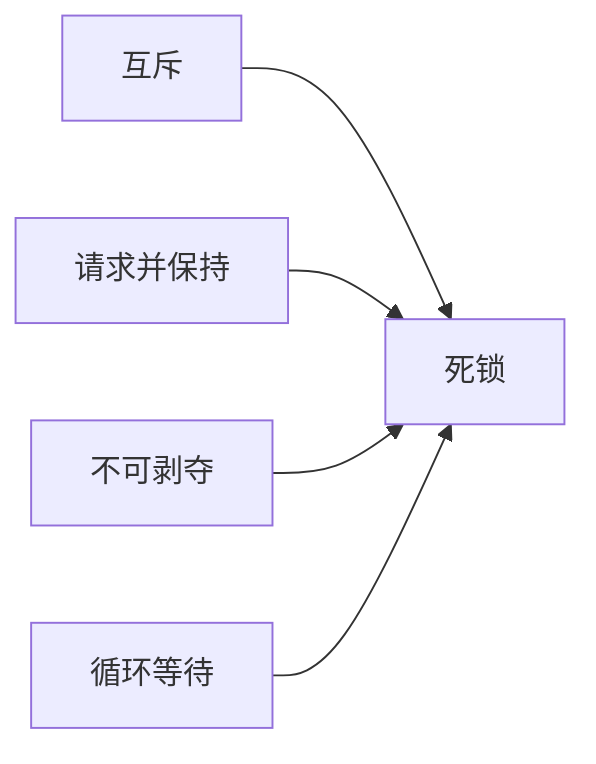

# 操作系统：从进程线程到一次服务器卡顿

操作系统知识看起来抽象，但后端、客户端、C++ 和测试开发都绕不开。线程池为什么不能无限开线程？数据库为什么需要锁？服务为什么端口还在，响应却越来越慢？这些问题背后都有操作系统的影子。

复习时不要把概念拆成孤岛。可以沿着一个服务器请求往下问：


## 一、进程与线程：先说资源，再说执行

### 1. 进程是什么

进程可以看作正在运行的程序实例，拥有相对独立的地址空间和资源边界。两个进程默认不能随意读写对方内存，这种隔离让系统更稳定，也带来进程间通信成本。

### 2. 线程是什么

线程是进程中的执行流。同一进程内的线程共享部分资源，例如地址空间和打开的文件，但每个线程仍有自己的执行上下文和栈。

一个更完整的对比：

| 维度 | 进程 | 线程 |
| --- | --- | --- |
| 资源边界 | 拥有相对独立的地址空间 | 共享所属进程的部分资源 |
| 执行 | 一个进程可以包含多个线程 | 线程承担具体执行 |
| 通信 | 通常需要 IPC 机制 | 可共享内存，但必须处理并发 |
| 故障影响 | 隔离相对更强 | 一个线程的严重错误可能影响整个进程 |

### 3. 为什么线程不是越多越好

线程会占用内存，也会带来调度与上下文切换成本。任务很多时，不等于应该无限创建线程。

面试官继续追问线程池时，可以从任务类型回答：

- CPU 密集任务更受计算核心限制。
- IO 密集任务会花时间等待外部资源，但也不能无限扩大线程数。
- 队列长度、拒绝策略、任务耗时和下游承载能力都要一起考虑。

## 二、用户态、内核态与系统调用

应用程序不能直接执行所有特权操作。读取文件、建立网络连接等能力，需要通过操作系统提供的接口进入内核处理。

这不是为了增加麻烦，而是为了控制边界：如果任意程序都能直接操作设备和关键内存，系统很难保持稳定和安全。

面试中不必把“进入内核态”说成某个固定耗时数字。更重要的是理解：系统调用、数据复制、调度和设备等待都可能成为性能成本，需要结合实际路径分析。

## 三、上下文切换：真正的代价不只是一份寄存器

操作系统切换执行任务时，需要保存当前上下文并恢复另一个任务的上下文。频繁切换可能带来额外成本。

除了保存与恢复状态，还要考虑缓存局部性受到影响。新线程接手后，CPU 缓存里的数据未必仍然适合它。

因此，遇到服务吞吐下降时，不要只看 CPU 使用率。线程数量、运行队列、锁竞争和上下文切换都值得观察。

## 四、虚拟内存：隔离、抽象与按需使用

虚拟内存让每个进程看到相对独立的地址空间，再由页表等机制映射到物理内存。

它至少带来三个价值：

1. **隔离**：进程不能随意访问其他进程内存。
2. **抽象**：程序面对的是连续、统一的地址空间视图。
3. **按需使用**：页面可以根据需要加载和管理。

### 缺页是什么意思

当程序访问的虚拟页面当前没有建立好所需映射时，会触发缺页处理。缺页不一定都是严重故障，关键要看后续是否需要昂贵的磁盘访问，以及发生频率是否异常。

### 分页与分段怎么区分

- 分页使用固定大小的页面，便于物理内存管理。
- 分段更强调程序的逻辑区域。

回答时不要把它们说成互斥的“二选一”。真实系统的内存管理实现更复杂，校招阶段先理解各自解决的问题。

## 五、进程间通信：选型先看边界

| 方式 | 特点 | 常见考虑 |
| --- | --- | --- |
| 管道 | 字节流，使用简单 | 通信方向、进程关系 |
| 消息队列 | 以消息传递数据 | 容量、顺序、阻塞 |
| 共享内存 | 减少额外复制，性能较高 | 同步与一致性更难 |
| Socket | 可用于本机或网络通信 | 协议、序列化、网络异常 |
| 信号 | 适合通知事件 | 承载信息有限 |

共享内存快，不代表总是首选。它把同步复杂度交给了应用。选型永远要同时考虑正确性和维护成本。

## 六、死锁：背四个条件之后，还要会改代码

死锁常见的四个必要条件：



一个经典例子：

```java
// 线程 A
synchronized (accountA) {
    synchronized (accountB) {
        transfer();
    }
}

// 线程 B
synchronized (accountB) {
    synchronized (accountA) {
        transfer();
    }
}
```

两个线程以相反顺序加锁，可能互相等待。

比起背“预防、避免、检测、恢复”，工程里更实用的第一步是：建立稳定的加锁顺序，缩小锁粒度，避免锁内执行不可控的慢操作。

### 面试追问

1. 数据库死锁与 Java 线程死锁有什么相似点？
2. 如何从线程栈看出锁等待？
3. 超时能否彻底解决死锁问题？

## 七、阻塞 IO、非阻塞 IO 与 IO 多路复用

这部分最容易背混。先抓住两个问题：

1. 调用方等待数据时会发生什么？
2. 一个线程如何管理多个连接？

### 阻塞 IO

调用在数据准备好之前可能一直等待。实现直观，但大量连接可能需要更多线程或其他调度策略。

### 非阻塞 IO

调用可以较快返回当前状态。应用需要决定何时再次尝试。如果只是不断轮询，也会浪费 CPU。

### IO 多路复用

应用把多个连接交给统一机制关注，等待其中一部分变为就绪状态，再处理对应事件。它解决的重点是：如何用较少线程有效管理大量连接。

不要把 IO 多路复用说成“异步 IO 的另一个名字”。它们关注的调用语义和责任边界并不完全相同。

## 八、一次服务器卡顿，怎么把知识串起来

假设接口延迟突然升高，可以按证据逐层排查：

1. 请求量是否异常，下游是否变慢。
2. 进程 CPU、内存、线程数量是否异常。
3. 是否有大量线程阻塞在同一把锁或同一个外部调用。
4. 上下文切换是否明显增加。
5. 网络连接、文件描述符、磁盘 IO 是否存在瓶颈。
6. 修复后同口径观察延迟、吞吐和资源曲线。

操作系统知识不是单独的一门考试，它最终要回到“如何解释系统为什么慢”。

## 九、一次模拟面试

1. 线程比进程轻量，是否意味着线程越多吞吐量越高？
2. 为什么用户程序不能直接执行所有设备操作？
3. 共享内存性能高，为什么仍然需要谨慎使用？
4. 两段加锁顺序相反的代码为什么可能死锁？
5. IO 多路复用主要解决了什么问题？
6. 服务 CPU 不高但响应很慢，你还会看什么？

## 参考资料

- [Linux manual pages](https://man7.org/linux/man-pages/)
- [Linux manual page：proc(5)](https://man7.org/linux/man-pages/man5/proc.5.html)
- [Linux manual page：epoll(7)](https://man7.org/linux/man-pages/man7/epoll.7.html)
