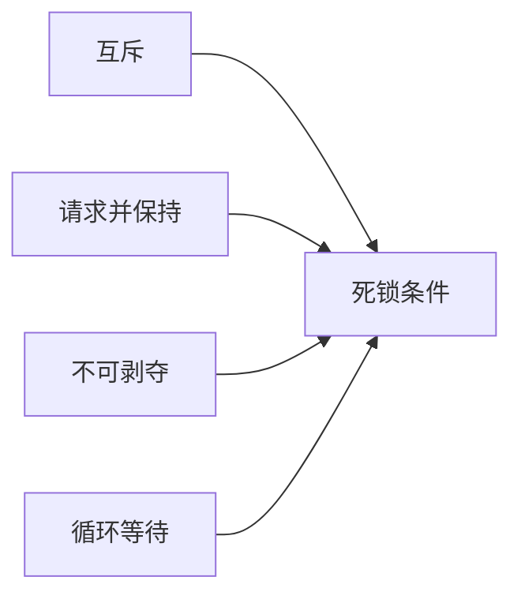

# 操作系统高频面试题

操作系统是后端、客户端、C++ 和测试开发岗位的共同基础。复习时建议从进程线程、内存、IO 和并发四条主线展开。

## 1、进程和线程有什么区别？

进程是资源分配和隔离的重要单位，线程是程序执行的重要单位。同一进程内的线程共享部分资源，但拥有各自的栈和执行上下文。

追问：线程切换为什么通常比进程切换轻量？

## 2、什么是用户态和内核态？

用户程序不能直接执行所有特权操作。涉及系统调用、设备访问等操作时，需要进入内核态，由操作系统提供受控能力。

## 3、什么是上下文切换？

操作系统切换执行任务时，需要保存当前上下文并恢复另一个任务的上下文。频繁切换会带来额外开销。

## 4、并发和并行有什么区别？

并发强调多个任务在一段时间内交替推进；并行强调多个任务在同一时刻实际执行。

## 5、常见进程间通信方式有哪些？

| 方式 | 特点 |
| --- | --- |
| 管道 | 适合简单字节流通信 |
| 消息队列 | 按消息进行通信 |
| 共享内存 | 性能较高，但需要同步机制 |
| Socket | 可用于本机或网络通信 |
| 信号 | 用于通知事件 |

## 6、什么是虚拟内存？

虚拟内存为进程提供相对独立的地址空间，并通过页表等机制映射到物理内存。理解时应关注隔离、按需加载和缺页处理。

## 7、什么是分页和分段？

分页通常按照固定大小划分内存，便于管理；分段更强调逻辑上的区域。回答时建议说明它们解决的问题和可能引入的碎片。

## 8、什么是死锁？

处理思路包括预防、避免、检测和恢复。

## 9、阻塞 IO、非阻塞 IO 和 IO 多路复用有什么区别？

回答时重点说明：等待发生在哪里、一个线程如何管理多个连接、事件就绪后如何处理。

## 10、如何复习操作系统？

1. 画出进程线程和内存管理知识图。
2. 用自己的语言解释概念差异。
3. 结合网络服务器、线程池和数据库场景说明应用。
4. 对不确定的系统细节查阅教材或官方文档。

## 行动清单

- [ ] 能解释进程、线程、协程的差异。
- [ ] 能说明虚拟内存和缺页处理。
- [ ] 能列出死锁四个必要条件。
- [ ] 能对比常见 IO 模型。
