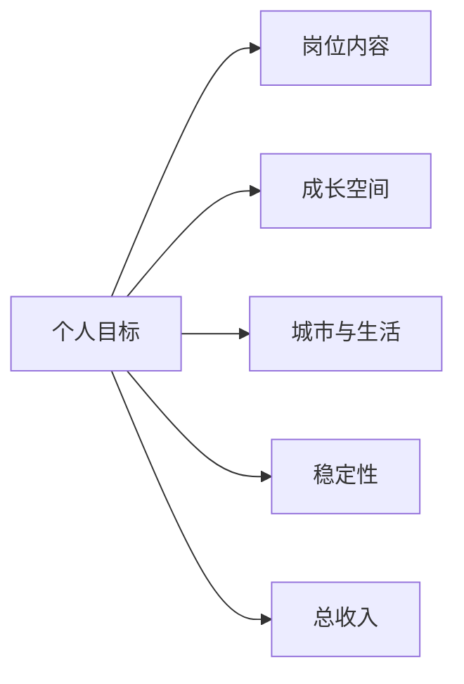

# 获得多个 offer，如何进行选择

选择 offer 不是简单比较月薪。更稳妥的做法，是先明确自己的优先级，再比较岗位内容、成长空间、稳定性、城市、团队和总收入。

## 一、先明确自己的排序

不同阶段的排序可能不同。有人更看重技术成长，有人需要优先考虑城市和家庭，也有人更关注稳定性。没有适合所有人的标准答案。

## 二、使用评分表辅助判断

| 维度 | 权重示例 | offer A | offer B | 需要核实的问题 |
| --- | --- | --- | --- | --- |
| 岗位内容 | 25% |  |  | 具体做什么，是否与招聘描述一致？ |
| 团队与导师 | 20% |  |  | 汇报对象、团队规模、培养方式？ |
| 成长空间 | 15% |  |  | 技术栈、业务复杂度、晋升机制？ |
| 总收入 | 15% |  |  | 固定工资、奖金、补贴、加班与年终？ |
| 城市与生活 | 15% |  |  | 通勤、房租、落户、家庭安排？ |
| 稳定性 | 10% |  |  | 业务阶段、组织调整、转正条件？ |

评分表不是为了机械计算，而是逼自己把模糊感受变成具体问题。

## 三、不要忽略隐藏信息

在接受 offer 前，尽量确认：

1. 工作地点、岗位方向和汇报关系。
2. 试用期、转正条件和薪资构成。
3. 奖金是否固定，发放条件是什么。
4. 是否存在轮岗、调岗、出差和值班要求。
5. offer、就业协议和劳动合同中的违约条款。
6. 接受 offer 的截止时间。

## 四、谨慎使用非正式信息

可以向学长学姐和团队成员了解情况，但不要只依赖单一评价。尽量区分：

- 事实：工作地点、薪资结构、业务方向。
- 个人体验：工作强度、团队氛围、管理风格。
- 推测：未来业务一定高速增长、一定不会调整。

## 五、最终决策

如果两个 offer 非常接近，可以问自己三个问题：

1. 哪个岗位更接近我未来两三年想积累的能力？
2. 哪个选择的风险是我可以承担的？
3. 即使结果不完美，哪个选择更不容易后悔？

## 行动清单

- [ ] 写下自己的前三项优先级。
- [ ] 使用评分表比较 offer，并记录待核实问题。
- [ ] 阅读所有书面材料，不只听口头承诺。
- [ ] 在截止时间前做出决定，并礼貌回复其他单位。

延伸阅读：[offer、三方和劳动合同避坑指南](./签约/offer三方和劳动合同避坑指南.md)
