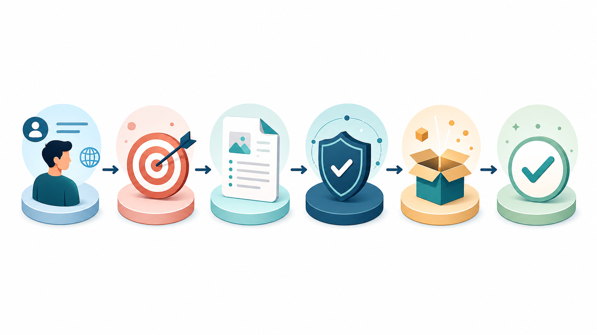
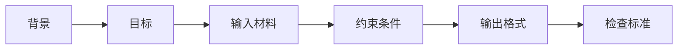
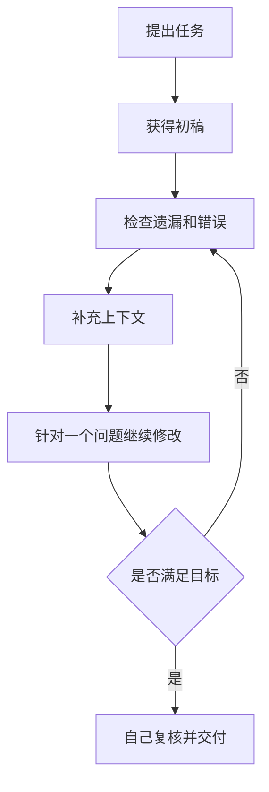

# 从提问到交付：写出高质量提示词


很多人第一次使用大模型时，会输入一句“帮我写一下”或“给我讲讲 Redis”。这种方式当然能获得回答，但答案通常比较宽泛。真正有用的提示词，不需要写得很长，却要让模型知道：**你是谁、要解决什么问题、有哪些限制、最终希望得到什么结果。**

## 一、提示词的五个组成部分





| 组成部分 | 要回答的问题 | 示例 |
| --- | --- | --- |
| 背景 | 你是谁，当前处于什么场景？ | 我正在准备 Java 后端实习面试 |
| 目标 | 你想解决什么问题？ | 帮我复习 Redis 持久化 |
| 输入材料 | 模型需要参考什么内容？ | 这是我的笔记和岗位描述 |
| 约束条件 | 哪些内容不要做？ | 不要扩展到分布式锁 |
| 输出格式 | 最终结果应该长什么样？ | 用表格比较 RDB 和 AOF |
| 检查标准 | 怎样判断结果可用？ | 最后给出 5 个常见追问 |

## 二、从模糊问题到可执行任务

### 普通提问

```text
帮我讲一下 MySQL 索引。
```

### 改进后的提问

```text
我是准备后端校招的学生，已经了解 B+ 树的基本结构。
请从面试角度讲解 MySQL 索引：
1. 解释聚簇索引、二级索引和回表；
2. 使用一个具体 SQL 示例说明最左匹配原则；
3. 列出 5 种常见索引失效场景；
4. 最后扮演面试官，给出 5 个递进式追问。
请使用表格和简短示例，不要扩展到数据库分库分表。
```

区别在于，第二个问题明确了学习阶段、知识范围和输出形式。模型更容易给出与你当前任务匹配的答案。

## 三、让模型先提问，再回答

当任务复杂、上下文不足时，不要急着让模型直接生成最终结果。可以先让它补齐信息。

```text
我想优化一段简历中的项目描述。
在给出修改稿之前，请先向我提出最多 5 个问题，
确认项目目标、我的职责、技术难点和量化结果。
如果信息不足，请使用【待补充】标记，不要自行虚构。
```

这条技巧特别适合简历优化、项目复盘、职业规划和复杂编码任务。

## 四、使用迭代代替一次性生成




可以使用以下追问：

```text
请检查刚才的答案：
1. 哪些结论可能需要核实？
2. 哪些地方过于宽泛？
3. 如果这是面试回答，面试官最可能继续追问什么？
4. 给出一个更精简、更适合口头表达的版本。
```

## 五、常见误区

1. **只给目标，不给背景**：模型不知道你是初学者还是有经验的工程师。
2. **一次要求太多**：任务过大时，拆成“分析、初稿、检查、修改”四步。
3. **让模型虚构细节**：简历、论文和项目中尤其危险。
4. **不验证答案**：模型表达流畅，不代表事实正确。
5. **只收藏模板，不实际练习**：好的提示词来自对任务的理解。

## 六、通用模板

```text
我的背景：
【说明身份、基础和当前场景】

我的目标：
【说明希望解决的问题】

输入材料：
【粘贴必要内容，敏感信息先脱敏】

约束条件：
【说明范围、篇幅、禁止事项】

输出格式：
【说明表格、步骤、代码、清单或其他形式】

检查标准：
【说明如何判断答案可用，并要求列出待核实项】
```

## 行动清单

- [ ] 在下一次提问时写清楚背景和目标。
- [ ] 为复杂任务增加输出格式和检查标准。
- [ ] 对最终答案至少追问一次“哪些内容需要核实”。
- [ ] 重要任务坚持自己阅读、验证和修改。

[返回专题目录](./README.md)
