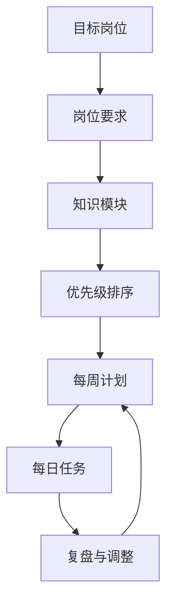
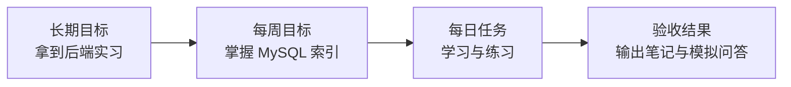

# 用大模型制定高效复习计划


校招复习最容易遇到两个问题：知识点太多，不知道从哪里开始；收藏的资料太多，却没有稳定的执行节奏。大模型适合协助你拆解任务和动态复盘，但最终的学习计划必须匹配你的时间、基础和目标岗位。

## 一、先建立复习地图



以 Java 后端为例，可以先拆成以下模块：

| 模块 | 常见内容 | 建议优先级 |
| --- | --- | --- |
| 语言基础 | 集合、并发、JVM、异常、泛型 | 高 |
| 数据库 | SQL、索引、事务、锁、优化 | 高 |
| 缓存 | Redis 数据结构、持久化、缓存问题 | 高 |
| 计算机基础 | 网络、操作系统、数据结构 | 高 |
| 框架 | Spring、Spring Boot、MyBatis | 中 |
| 工程实践 | Git、Linux、日志、测试 | 中 |
| 扩展能力 | 消息队列、微服务、容器 | 按岗位调整 |

## 二、让计划匹配你的真实情况

不要只问“帮我制定学习计划”，要把限制条件告诉模型。

```text
我是准备 Java 后端暑期实习的大三学生。
距离投递还有 8 周，每周可以投入 20 小时。
我熟悉 Java 基础，但 MySQL、Redis 和计算机网络比较薄弱。
请帮我制定复习计划：
1. 按周列出主题和目标；
2. 每周安排一次模拟面试和一次错题复盘；
3. 区分必须掌握和有余力再学的内容；
4. 给出每周可验收的成果。
```

“可验收成果”非常重要。学习计划不能只有“看完 Redis”，而要变成“能够解释缓存穿透、击穿、雪崩，并完成一次 15 分钟模拟面试”。

## 三、使用三层任务管理



### 每日计划模板

| 时间 | 任务 | 产出 |
| --- | --- | --- |
| 45 分钟 | 阅读一个知识主题 | 一页结构化笔记 |
| 30 分钟 | 回答 5 道面试题 | 错题列表 |
| 30 分钟 | 算法练习 | 1 至 2 道题和复盘 |
| 15 分钟 | 让大模型追问 | 口头表达薄弱点 |

## 四、每周让模型辅助复盘

```text
这是我本周的复习记录和错题列表。
请帮我做一次周复盘：
1. 总结本周已完成内容；
2. 找出反复出错的知识点；
3. 判断下周哪些任务应该提前，哪些可以延后；
4. 生成下周计划，保留 20% 的缓冲时间；
5. 给出 10 道用于验收的面试题。

复习记录：
【粘贴记录】
```

## 五、避免把计划做成收藏夹

1. 每周最多设置 3 个核心目标。
2. 每个目标都要有验收方式。
3. 留出缓冲时间，不要排满。
4. 优先补短板，再追求知识广度。
5. 计划连续两周无法完成时，减少任务量。

## 行动清单

- [ ] 写下目标岗位、准备周期和每周可用时间。
- [ ] 使用提示词生成第一版 8 周复习地图。
- [ ] 为每周目标增加可验收成果。
- [ ] 每周固定进行一次复盘和计划调整。

[返回专题目录](./README.md)
