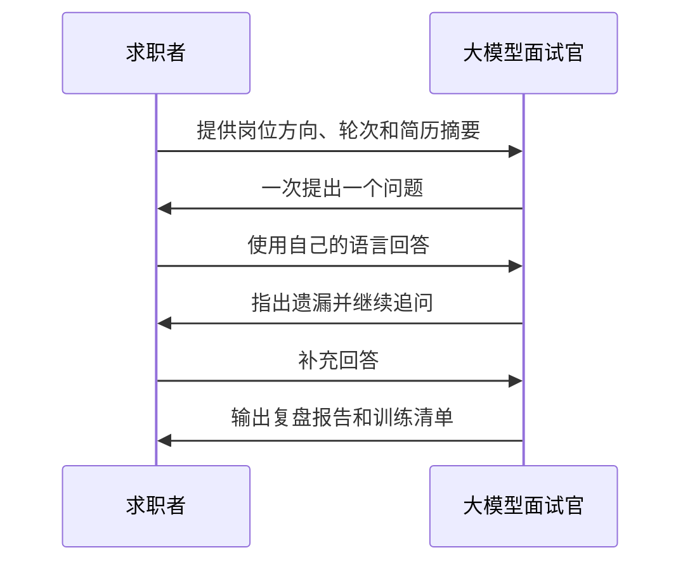
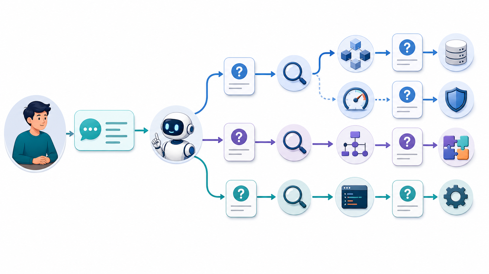
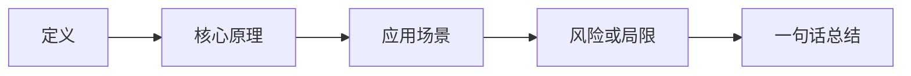

# 用大模型模拟技术面试


很多同学“看过”不少八股文，但真正开口回答时仍然表达混乱。面试训练的关键不是继续囤积答案，而是反复练习：先回答，再接受追问，最后复盘。

## 一、一场有效的模拟面试



## 二、使用“一次只问一个问题”



一次生成 50 道题，容易退化成阅读题库。模拟面试时，要求模型一次只问一个问题，不要提前公布答案。

```text
请扮演 Java 后端实习生一面的面试官。
重点考察 Java 集合、并发、MySQL、Redis 和计算机网络。
规则：
1. 一次只问一个问题；
2. 不要提前公布答案；
3. 根据我的回答继续追问；
4. 我回答结束后，指出事实错误、遗漏和表达问题；
5. 进行 12 个问题后，输出复盘报告。
现在开始。
```

## 三、练习结构化表达

回答技术问题时，可以使用“定义、原理、场景、风险、总结”的结构。



例如，回答“什么是缓存穿透”时：

1. 先给出定义：查询不存在的数据，请求绕过缓存落到数据库。
2. 再解释影响：大量无效请求可能给数据库带来压力。
3. 给出方案：缓存空值、布隆过滤器、入口校验。
4. 说明局限：空值缓存需要设置合理过期时间。
5. 最后总结：根据业务场景组合使用方案。

## 四、针对简历进行项目追问

```text
请扮演后端面试官，根据我的项目描述进行追问。
优先追问：
1. 我本人完成了哪些部分；
2. 为什么选择这些技术；
3. 遇到过什么问题；
4. 如何验证优化效果；
5. 如果流量扩大十倍，哪些环节最先出现瓶颈。

一次只问一个问题。不要替我编造项目细节。

项目描述：
【粘贴内容】
```

## 五、生成面试复盘报告


模拟结束后，让模型从多个维度评分：

| 维度 | 关注点 |
| --- | --- |
| 准确性 | 是否存在事实错误 |
| 完整性 | 是否覆盖关键知识点 |
| 表达结构 | 是否先讲重点，再补充细节 |
| 深度 | 是否经得住追问 |
| 项目可信度 | 是否能够解释个人贡献和结果 |

```text
请根据刚才的模拟面试输出复盘报告：
1. 使用表格列出每个问题的表现；
2. 标出需要重新学习的知识点；
3. 给出 3 个最优先改进项；
4. 为下一次训练生成 8 个针对性问题；
5. 将优秀回答整理为适合口头表达的版本。
```

## 六、训练节奏

1. 每周至少完成两次 20 分钟模拟面试。
2. 一次只聚焦一到两个主题。
3. 用手机录音，检查表达是否简洁。
4. 对答不出的题目建立错题清单。
5. 一周后重新回答同一批薄弱问题。

## 行动清单

- [ ] 选择一个岗位方向和一轮面试范围。
- [ ] 完成一次 12 题的递进式模拟面试。
- [ ] 输出复盘报告并找出 3 个薄弱点。
- [ ] 一周后再次回答相同问题，比较进步。

[返回专题目录](./README.md)
