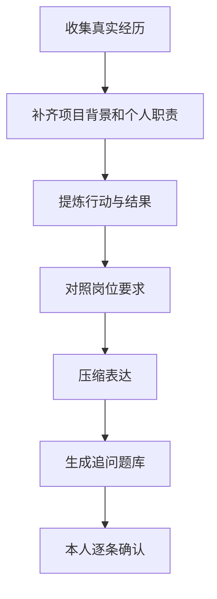
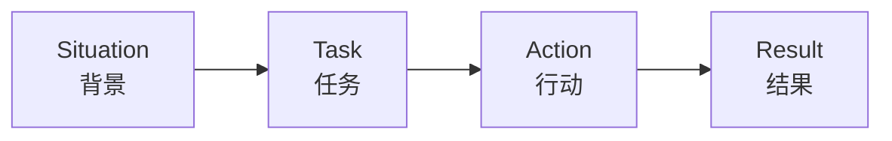
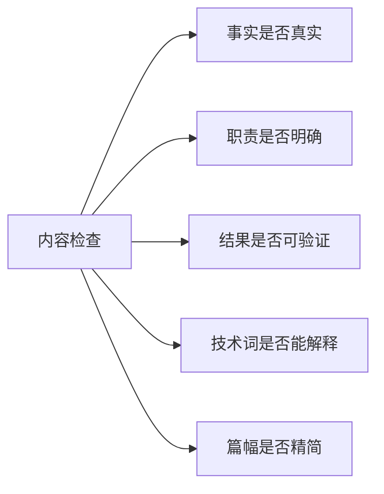

# 用大模型打磨求职简历


简历不是经历的堆砌，而是你与招聘者第一次沟通的界面。大模型可以帮你发现表达问题、提炼亮点和检查岗位匹配度，但它不能替你编造项目成果。任何写在简历上的内容，都应该能够在面试中讲清楚。

## 一、简历优化的正确流程



## 二、先补齐事实，再润色语言

优化项目描述前，先回答这些问题：

| 问题 | 作用 |
| --- | --- |
| 项目解决了什么问题？ | 说明项目价值 |
| 你本人负责什么？ | 区分团队成果和个人贡献 |
| 为什么选择这项技术？ | 展示技术判断 |
| 遇到什么困难？ | 为面试追问做好准备 |
| 结果如何衡量？ | 避免空泛描述 |

```text
我准备优化简历中的项目描述。
请先向我提出最多 8 个问题，补齐项目背景、个人职责、
技术选型、难点和结果。信息不足时不要开始润色，
不要自行编造数据。

原始项目描述：
【粘贴内容】
```

## 三、使用 STAR 原则组织经历



### 优化提示词

```text
请使用 STAR 原则优化下面的项目描述。
要求：
1. 保留原始事实，不要虚构数据；
2. 优先写清楚我的行动和结果；
3. 每条控制在一至两行；
4. 删除空泛形容词；
5. 信息不足时使用【待补充】标记；
6. 为每条描述给出一个可能的面试追问。

原始内容：
【粘贴内容】
```

## 四、对照岗位描述做匹配分析

同一份简历投递不同岗位时，可以调整内容排序和关键词，但不要为了匹配岗位而夸大经历。

```text
下面是岗位描述和我的简历。
请输出一张匹配分析表，包含：
1. 岗位要求；
2. 我的相关经历；
3. 简历中已经体现的内容；
4. 表达不足或需要补充学习的部分；
5. 修改建议。

不要虚构我没有做过的项目，也不要添加无法证明的数据。

岗位描述：
【粘贴 JD】

简历：
【粘贴简历，先删除手机号等敏感信息】
```

## 五、检查常见问题



常见问题包括：

1. 项目描述只有技术栈，没有业务目标。
2. 使用“熟练掌握”，但经不起基础追问。
3. 写了性能提升，却无法说明对比方式。
4. 团队成果被写成个人独立完成。
5. 简历信息过密，重点不突出。

## 六、让模型扮演面试官验收简历

```text
请扮演后端校招面试官，阅读我的简历后：
1. 找出最可能被追问的 10 个点；
2. 标记看起来空泛、夸张或难以验证的表述；
3. 对每个技术词给出一个基础追问和一个进阶追问；
4. 指出哪些内容应该删除或精简。
```

## 行动清单

- [ ] 删除简历中的敏感信息后再交给模型分析。
- [ ] 对每个项目补齐背景、职责、行动和结果。
- [ ] 对每一个技术名词准备至少两个追问。
- [ ] 最终逐条确认，不保留任何无法解释的内容。

[返回专题目录](./README.md)
