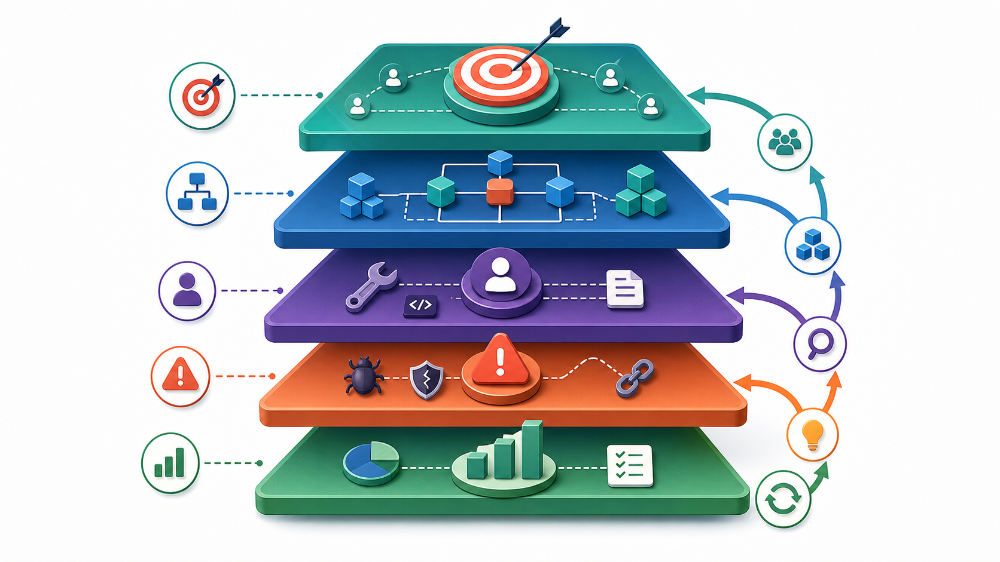
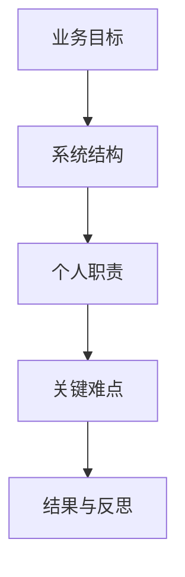
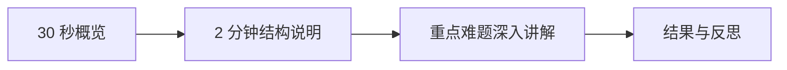
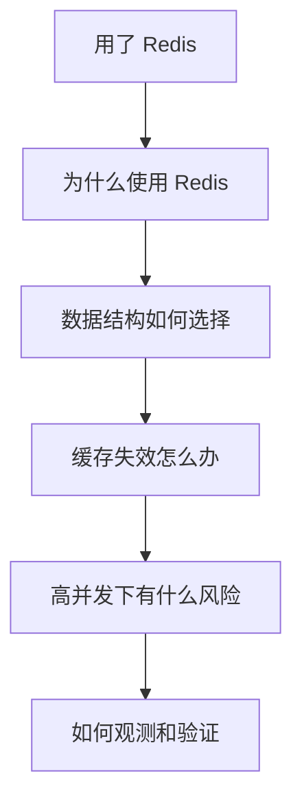
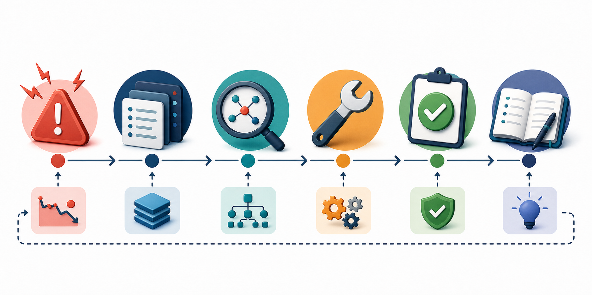

# 用大模型复盘项目经历


项目经历通常是技术面试中最容易拉开差距的部分。面试官关心的不只是你用了哪些技术，更想知道：你解决了什么问题，为什么这么设计，遇到过什么困难，如果场景变化会如何调整。

## 一、把项目拆成五层





| 层次 | 你需要讲清楚的内容 |
| --- | --- |
| 业务目标 | 项目服务谁，解决什么问题 |
| 系统结构 | 核心模块如何协作 |
| 个人职责 | 哪些部分由你完成 |
| 关键难点 | 技术选择、问题定位、解决过程 |
| 结果与反思 | 如何验证效果，还能怎样改进 |

## 二、让模型帮你发现信息缺口

```text
下面是我的项目介绍。
请扮演后端面试官，先不要给修改稿。
请从业务目标、系统结构、个人职责、技术选型、
异常情况、性能指标和后续优化七个方面提出问题。
一次提出不超过 10 个最关键的问题。
不要替我虚构答案。

项目介绍：
【粘贴内容】
```

如果你暂时答不上来，不要让模型直接补齐。把问题加入复习清单，回到代码、文档和实际记录中寻找答案。

## 三、整理项目讲解稿



### 30 秒概览模板

```text
这是一个面向【用户群体】的【项目类型】。
它主要解决【业务问题】。
我负责【个人职责】，重点完成了【核心模块】。
项目中最值得展开的是【技术难点或关键决策】。
```

### 生成讲解稿

```text
请根据我的真实项目材料，生成两版项目讲解稿：
1. 适合自我介绍的 30 秒版本；
2. 适合面试展开的 2 分钟版本。

要求突出个人职责和技术判断。
缺少的信息使用【待补充】，不要虚构。

项目材料：
【粘贴内容】
```

## 四、练习递进式追问



一个技术词常常会带来一串追问。可以使用下面的提示词训练：

```text
请根据我的项目描述进行压力测试式追问。
每次只问一个问题，并根据我的回答继续深入。
优先追问技术选型、失败场景、边界条件、性能验证和替代方案。
如果我的回答不够具体，请直接指出。
```

## 五、不要忽略失败经历



项目中最有价值的内容，往往不是“功能做完了”，而是“问题出现后如何定位和修复”。

可以复盘：

1. 一个持续时间较长的问题。
2. 一次错误的技术判断。
3. 一个难以复现的 Bug。
4. 一项效果不明显的优化。
5. 一次团队协作中的接口调整。

## 六、项目复盘卡片

| 项目问题 | 我的答案 | 证据或依据 | 是否需要补充 |
| --- | --- | --- | --- |
| 为什么选择这项技术？ |  |  |  |
| 最大的技术难点是什么？ |  |  |  |
| 如何验证优化结果？ |  |  |  |
| 流量扩大十倍怎么办？ |  |  |  |
| 重新设计会改什么？ |  |  |  |

## 行动清单

- [ ] 为每个项目准备 30 秒和 2 分钟版本。
- [ ] 写清楚个人职责，不混淆团队成果。
- [ ] 对每个核心技术词完成至少 3 层追问。
- [ ] 准备一个真实的问题定位或失败复盘案例。

[返回专题目录](./README.md)
