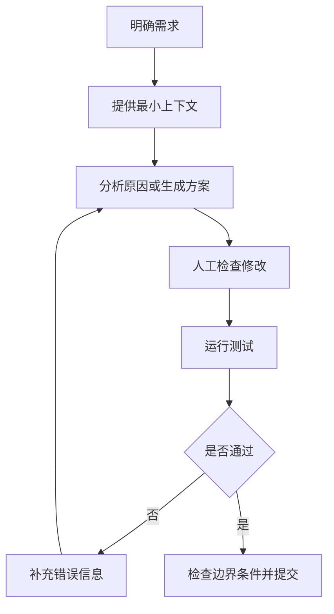

# 用大模型辅助编程与调试


大模型可以协助理解代码、分析报错、补充测试和讨论设计，但生成代码并不等于完成任务。你仍然需要阅读修改内容、运行测试、检查边界条件，并对最终结果负责。

## 一、把大模型放进开发闭环



## 二、先让模型分析，不要直接改代码

面对报错时，先理解原因，再讨论修复。

```text
下面是报错信息、相关代码和运行环境。
请先不要重写整个文件，按照以下顺序分析：
1. 用一句话解释报错；
2. 列出最可能的三个原因，并说明判断依据；
3. 给出排查步骤；
4. 提供最小修改建议；
5. 说明如何验证问题已经解决。

运行环境：
【版本、框架、操作系统】

报错信息：
【完整报错】

相关代码：
【最小可复现代码】
```

## 三、提供最小可复现上下文


不要一次粘贴整个项目。优先提供：

1. 完整报错栈。
2. 相关函数和调用入口。
3. 输入数据与预期输出。
4. 运行环境和版本。
5. 已经尝试过的排查步骤。

## 四、让模型帮助阅读陌生代码

```text
请阅读下面的代码，并按照新成员接手项目的视角进行说明：
1. 代码的整体目标；
2. 主要执行流程；
3. 每个核心函数的职责；
4. 外部依赖和数据流；
5. 可能存在的边界条件；
6. 我应该优先阅读哪些部分。

代码：
【粘贴代码】
```

## 五、使用模型补充测试思路


```text
请为下面的接口设计测试用例。
覆盖正常流程、边界条件、异常输入、依赖失败和并发场景。
使用表格输出：场景、输入、预期结果、优先级、是否适合自动化。

接口说明：
【粘贴接口说明】
```

## 六、审查生成代码

模型生成代码后，至少检查以下内容：

| 检查项 | 关注点 |
| --- | --- |
| 正确性 | 是否满足需求，是否遗漏边界条件 |
| 安全性 | 是否存在注入、越权、敏感信息泄露 |
| 兼容性 | 是否匹配项目现有版本和依赖 |
| 可维护性 | 是否引入不必要的复杂度 |
| 测试 | 是否有最小可验证路径 |

## 七、不要粘贴敏感代码

不要上传真实密钥、生产配置、用户数据、公司内部代码和未公开业务逻辑。必要时使用最小示例替代真实数据：

```text
数据库地址：db.example.internal
访问令牌：<TOKEN_REMOVED>
用户手机号：138****0000
业务字段：使用 field_a、field_b 替代真实字段名
```

## 行动清单

- [ ] 下一次报错先准备最小可复现上下文。
- [ ] 要求模型先分析原因，再提供最小修改建议。
- [ ] 对生成代码逐行阅读，并运行测试。
- [ ] 粘贴代码前删除密钥、用户数据和内部信息。

[返回专题目录](./README.md)
