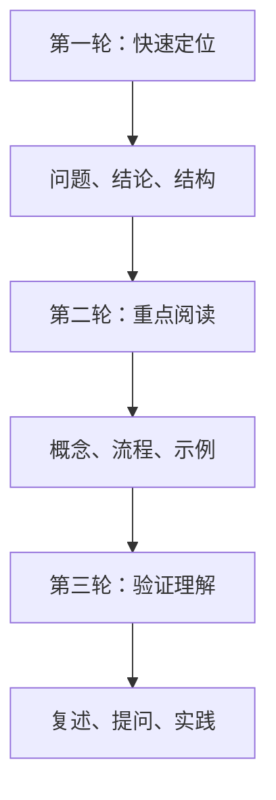
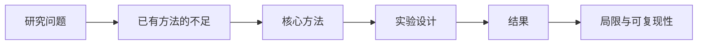

# 用大模型阅读论文和技术文档


面对论文、官方文档和陌生技术资料时，最困难的往往不是逐字阅读，而是快速判断：这份资料解决什么问题、哪些部分值得深入、有哪些前置知识、结论是否适用于自己的场景。

大模型适合做阅读助手，但不要让摘要代替原文。

## 一、使用三轮阅读法



| 轮次 | 目标 | 适合让模型做什么 |
| --- | --- | --- |
| 第一轮 | 判断资料是否值得精读 | 提取主题、结构和关键结论 |
| 第二轮 | 理解难点 | 解释概念、补充前置知识、对比方案 |
| 第三轮 | 验证掌握程度 | 生成问题、检查复述、设计小实验 |

## 二、阅读官方文档

```text
下面是一段官方文档。
请帮助我阅读，但不要脱离原文扩展：
1. 用三句话概括它解决的问题；
2. 列出关键概念及其关系；
3. 标出容易误解的部分；
4. 给出一个最小使用示例；
5. 说明哪些结论需要结合版本确认；
6. 最后生成 5 个检查理解的问题。

文档内容：
【粘贴内容或提供需要阅读的章节】
```

涉及版本、参数默认值和弃用状态时，一定要回到官方文档核实。

## 三、阅读论文



```text
请根据下面的论文摘要和目录，帮我建立阅读地图：
1. 论文试图解决什么问题；
2. 相比已有方法，它的新意是什么；
3. 哪些章节最值得优先阅读；
4. 阅读前需要补充哪些前置知识；
5. 有哪些结论需要查看实验细节后再判断。

摘要和目录：
【粘贴内容】
```

## 四、对比多个技术方案

```text
请比较方案 A 和方案 B。
使用表格输出：
1. 各自解决的问题；
2. 核心机制；
3. 优势和局限；
4. 适用场景；
5. 不适用场景；
6. 需要从官方文档核实的版本相关信息。

我的实际场景：
【补充业务规模、技术栈和限制条件】
```

## 五、建立术语卡片

阅读时遇到陌生概念，可以让模型生成卡片草稿：

| 字段 | 示例 |
| --- | --- |
| 概念名称 | 幂等性 |
| 一句话解释 | 同一操作执行多次，结果与执行一次一致 |
| 常见场景 | 支付回调、消息消费、重试 |
| 易混淆概念 | 去重、事务、一致性 |
| 一个例子 | 使用业务唯一键避免重复创建订单 |
| 需要核实 | 特定框架中的实现方式 |

## 六、使用模型检查理解

```text
我会用自己的语言解释下面的概念。
请检查：
1. 是否存在事实错误；
2. 哪些关键内容遗漏；
3. 哪些表达容易让人误解；
4. 给出一个反例或边界条件；
5. 再向我提出两个追问。

概念：
【填写概念】

我的解释：
【填写自己的理解】
```

## 行动清单

- [ ] 阅读前先生成一张结构地图。
- [ ] 对版本、参数和弃用信息回到官方文档核实。
- [ ] 用自己的语言复述，而不是只收藏摘要。
- [ ] 为重点概念补充一个例子和一个边界条件。

[返回专题目录](./README.md)
