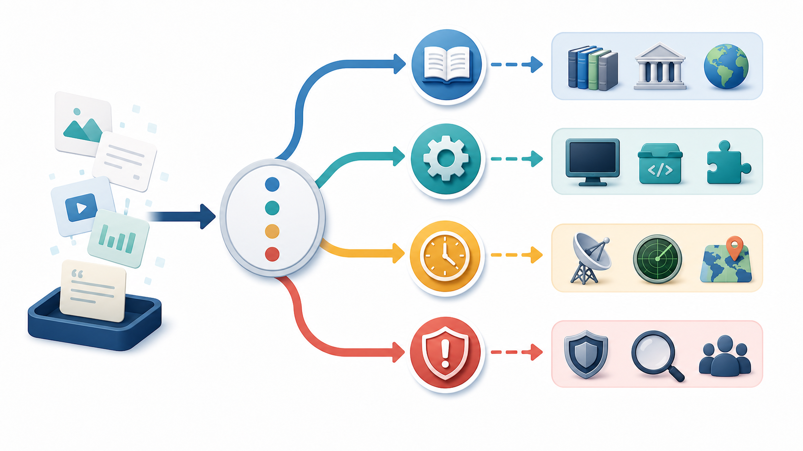
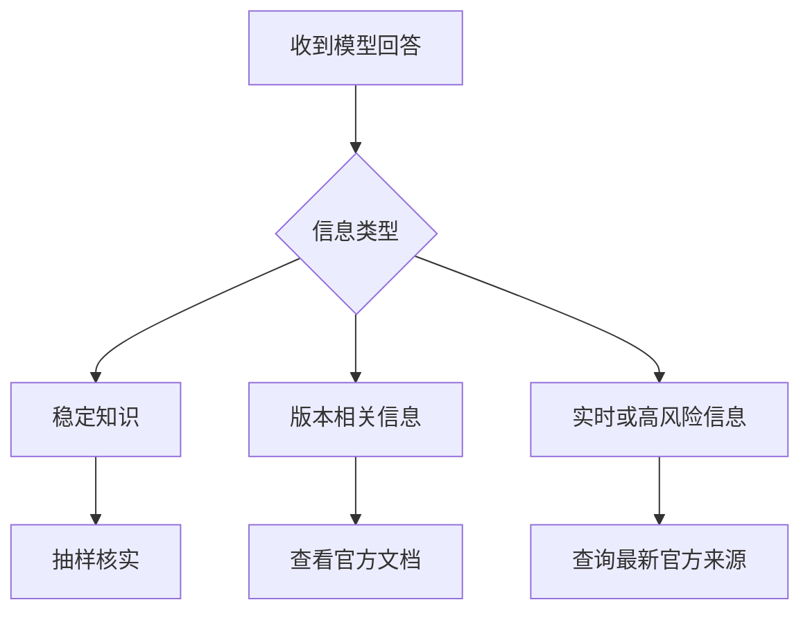
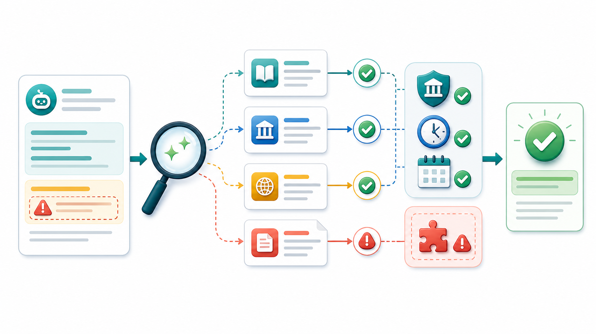
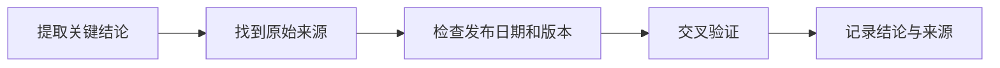

# 用大模型检索信息与核验事实


大模型擅长组织语言，却可能给出过时、缺失来源或并不存在的信息。涉及招聘规则、技术版本、政策法规、产品价格和最新动态时，不要把模型回答直接当作事实。

## 一、区分三类信息





| 类型 | 示例 | 核验方式 |
| --- | --- | --- |
| 稳定知识 | TCP 三次握手、B+ 树基本原理 | 使用教材或可靠资料抽样确认 |
| 版本相关信息 | 框架 API、模型能力、依赖参数 | 查看当前版本官方文档 |
| 实时信息 | 招聘时间、考试政策、产品价格 | 查看最新官方公告 |
| 高风险信息 | 法律、医疗、财务、安全配置 | 优先咨询专业人士或官方渠道 |

## 二、让模型主动标记不确定项

```text
请检查你刚才的回答，并将内容分为三类：
1. 可以直接用于理解的稳定知识；
2. 需要查看官方文档确认的版本相关信息；
3. 需要查询最新来源的实时信息。

对于后两类，请告诉我应该查看哪类官方来源。
不要编造链接，不确定时明确说明。
```

## 三、建立核验清单





每次处理重要信息时，至少确认：

1. 来源是否为官方文档、官方公告或原始论文。
2. 页面发布时间和更新时间。
3. 技术文档对应的版本。
4. 回答中是否混入推测。
5. 是否有第二个可靠来源可以交叉验证。

## 四、处理招聘和求职信息

招聘信息变化很快，尤其要谨慎。

```text
我正在整理某公司的校招信息。
请帮我生成核验清单，不要直接猜测：
1. 招聘官网入口；
2. 面向人群；
3. 投递开始和截止时间；
4. 岗位城市；
5. 笔试与面试流程；
6. 信息发布日期；
7. 哪些信息需要以官方公告为准。
```

## 五、处理技术问题

```text
请解释这个技术问题，并明确区分：
1. 与版本无关的原理；
2. 可能随版本变化的 API、参数和默认值；
3. 我应该在官方文档中搜索的关键词；
4. 一个最小验证实验。

问题：
【填写问题】

当前技术版本：
【填写版本】
```

## 六、警惕“像真的一样”

以下情况需要立即核实：

- 给出了非常精确的数字，却没有来源。
- 引用了你无法搜索到的论文、链接或政策。
- 对“最新”“目前”“已经发布”等词语十分肯定。
- 代码依赖某个 API，但没有说明版本。
- 回答与你掌握的常识冲突。

## 行动清单

- [ ] 重要信息主动要求模型标记不确定项。
- [ ] 优先查看官方文档、原始论文和官方公告。
- [ ] 对时效性信息记录发布日期。
- [ ] 对技术建议设计一个最小验证实验。

[返回专题目录](./README.md)
