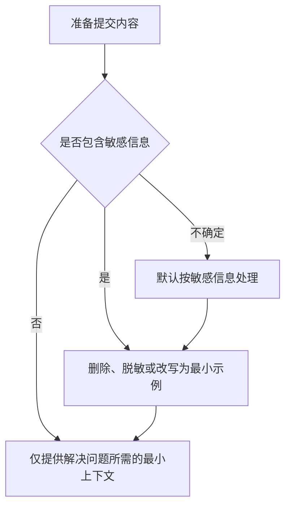
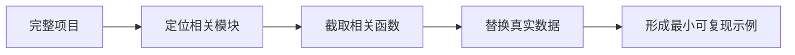

# 大模型使用中的隐私安全与边界


大模型能处理大量文本和代码，但“方便粘贴”不等于“适合粘贴”。在提交任何内容之前，先判断它是否包含隐私、密钥、内部资料或受限制的数据。

## 一、提交内容前做一次判断



## 二、哪些内容不要直接上传

| 类型 | 示例 | 推荐做法 |
| --- | --- | --- |
| 身份信息 | 姓名、手机号、身份证号、住址 | 删除或使用占位符 |
| 访问凭证 | API Key、Token、密码、Cookie | 永远不要粘贴 |
| 生产数据 | 用户记录、订单、日志、数据库导出 | 使用脱敏样例 |
| 内部代码 | 未公开项目、公司仓库、核心业务逻辑 | 遵守公司规定，使用最小示例 |
| 商业资料 | 合同、报价、客户名单、内部文档 | 不上传，先确认授权 |
| 他人信息 | 同事简历、聊天记录、面试资料 | 获得授权并脱敏 |

## 三、如何脱敏

```text
姓名：张三           -> 用户 A
手机号：13812345678  -> 138****5678
邮箱：name@company.com -> user@example.com
API Key：sk-xxxx     -> <TOKEN_REMOVED>
数据库地址：真实地址  -> db.example.internal
业务字段：真实字段名  -> field_a、field_b
```

如果脱敏后问题仍然可以被准确描述，就不需要提交真实数据。

## 四、使用最小必要上下文



分析编程问题时，优先提供：

1. 报错信息。
2. 与问题直接相关的函数。
3. 脱敏后的输入样例。
4. 运行环境和版本。
5. 预期行为与实际行为。

## 五、注意内容授权

在公司、实验室和团队项目中使用大模型前，先确认：

1. 是否允许将资料提交给外部服务。
2. 是否有企业版工具或内部部署工具。
3. 是否需要关闭训练使用或数据保留选项。
4. 是否存在行业监管要求。
5. 是否应该改用本地工具处理。

## 六、避免过度依赖

安全边界不只包括数据安全，也包括能力边界。

| 场景 | 风险 |
| --- | --- |
| 直接复制代码 | 引入漏洞、错误依赖或兼容性问题 |
| 直接提交生成论文 | 学术不端、引用不实 |
| 直接使用法律或医疗建议 | 信息过时或缺少专业判断 |
| 直接采用职业决策 | 忽略个人情况和现实限制 |

## 七、安全使用提示词

```text
下面是一个已经脱敏的最小示例。
请只根据提供的信息分析，不要假设存在未展示的内部逻辑。
如果信息不足，请列出需要补充的非敏感信息。
不要要求我提供密钥、生产数据或未公开代码。

问题：
【粘贴脱敏内容】
```

## 行动清单

- [ ] 粘贴内容前检查隐私、密钥和内部信息。
- [ ] 对不确定的信息默认按敏感内容处理。
- [ ] 优先构造脱敏后的最小可复现示例。
- [ ] 在公司环境中遵守组织的数据使用规定。

[返回专题目录](./README.md)
