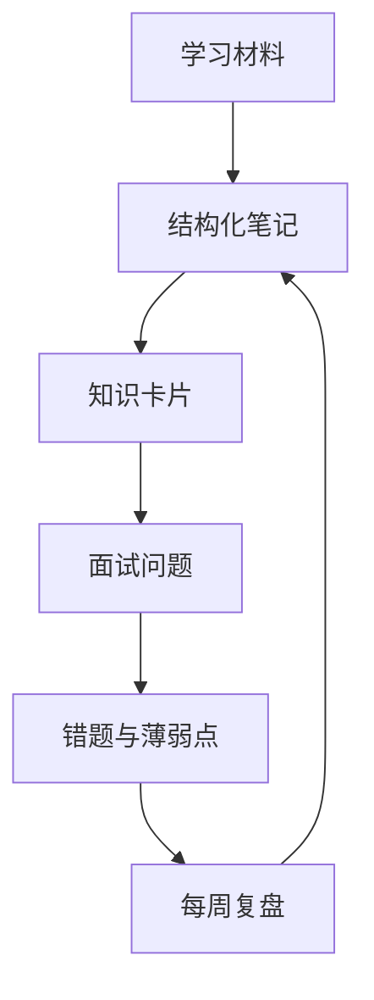
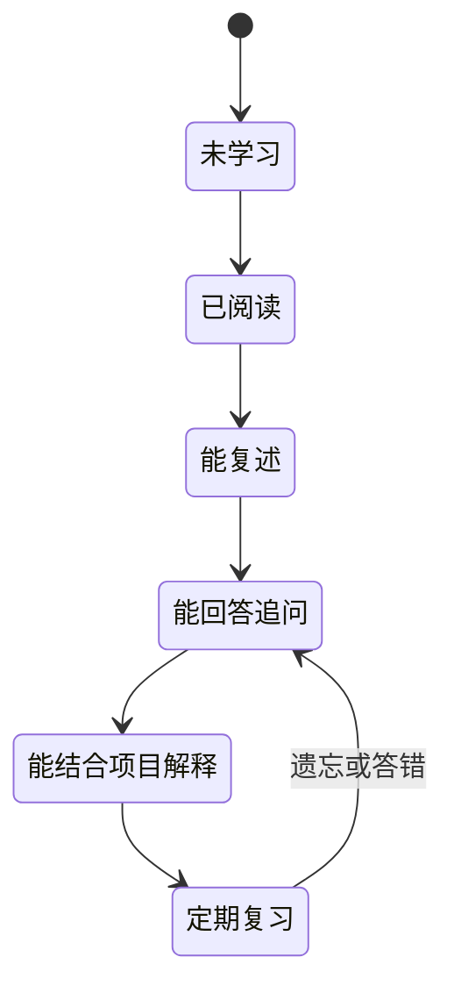

# 用大模型构建个人知识库


学习效率低，很多时候不是因为没有资料，而是资料没有形成可复用的系统。大模型可以帮助你整理笔记、提取错题、生成复习卡片和安排周期性回顾，让零散知识逐渐变成自己的知识库。

## 一、知识库不是资料仓库



一个可用的知识库应该帮助你回答三个问题：

1. 我已经掌握了什么？
2. 我经常在哪些地方出错？
3. 下一步最值得复习什么？

## 二、统一笔记模板

| 字段 | 内容 |
| --- | --- |
| 主题 | 例如 MySQL 事务隔离 |
| 一句话解释 | 用自己的语言说明 |
| 核心原理 | 关键机制和关系 |
| 一个例子 | SQL、代码或生活类比 |
| 易错点 | 常见误区 |
| 面试追问 | 至少两个递进问题 |
| 待核实项 | 版本或资料来源 |
| 下次复习时间 | 安排回顾 |

```text
请将下面的学习记录整理为知识卡片。
严格使用以下字段：
主题、一句话解释、核心原理、一个例子、
易错点、面试追问、待核实项、下次复习建议。

如果原始记录中缺少信息，请标记【待补充】，
不要自行虚构。

学习记录：
【粘贴内容】
```

## 三、建立错题循环


错题记录不要只有正确答案，还要记录自己为什么答错：

| 字段 | 示例 |
| --- | --- |
| 问题 | 为什么 MySQL 使用 B+ 树索引？ |
| 我的错误回答 | 只提到了查询速度快 |
| 遗漏原因 | 没有从磁盘 IO、范围查询和树高解释 |
| 修正后的回答 | 使用自己的语言整理 |
| 下次复习 | 3 天后重新口述 |

## 四、每周生成复盘报告

```text
下面是我本周的学习笔记、错题和模拟面试记录。
请帮我生成周复盘：
1. 已完成主题；
2. 反复出错的知识点；
3. 最值得优先补强的三个方向；
4. 下周复习计划；
5. 10 道用于下周验收的问题；
6. 需要查看官方资料核实的内容。

记录：
【粘贴内容】
```

## 五、给知识设置状态



不要用“看过”代表掌握。真正接近面试要求的状态，是能够使用自己的语言回答追问，并结合项目或例子解释。

## 六、保持知识库轻量

1. 使用自己习惯的 Markdown、文档或笔记工具即可。
2. 每张卡片只解决一个主题。
3. 优先记录错题和高频问题。
4. 定期删除重复和已经过时的资料。
5. 对版本相关内容标记来源和日期。

## 行动清单

- [ ] 建立一份统一的知识卡片模板。
- [ ] 从最近一次模拟面试中整理 5 张卡片。
- [ ] 为错题记录“为什么答错”。
- [ ] 每周固定生成一次复盘报告。

[返回专题目录](./README.md)
