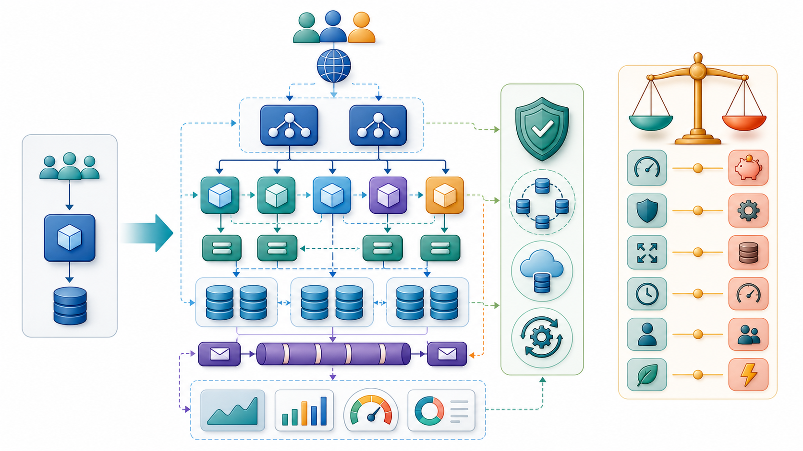
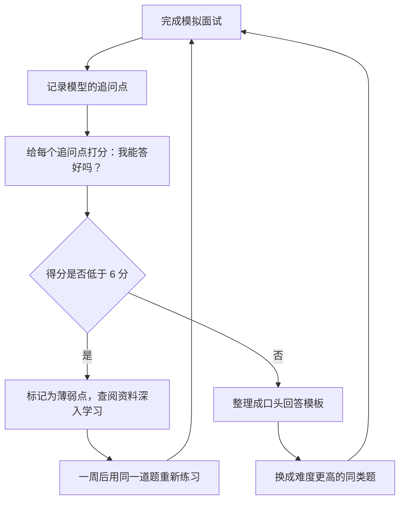

# 用大模型做系统设计练习：从刷题到面试模拟


系统设计是校招面试中让很多人头疼的环节——没有标准答案，没有题库可以背，全看临场发挥和平时积累。但反过来看，这也意味着系统设计是**最适合用大模型来练习**的科目：模型可以扮演面试官、给出框架、追问盲点，而且永远不会不耐烦。

## 一、为什么大模型适合练习系统设计

系统设计面试和算法面试有一个根本区别：算法题可以靠刷 LeetCode 积累套路，而系统设计考察的是**权衡取舍的能力**。同一道“设计短链接系统”，不同面试官的侧重点可能完全不同——有人关注数据库选型，有人追问并发处理，还有人让你从用户角度倒推需求。

这种开放性恰恰是大模型擅长处理的场景：

| 练习方式 | 传统刷题 | 看书 / 看视频 | 用大模型练习 |
| --- | --- | --- | --- |
| 有无标准答案 | 有（LeetCode 判题） | 单一方案讲解 | 无，但可给出框架和多种方案 |
| 能否追问 | 否 | 否 | 可以无限追问，深挖任何细节 |
| 能否模拟面试 | 无法还原压力 | 无法互动 | 可设定角色、级别、时间 |
| 能否指出盲点 | 判题器不管设计 | 被动接收 | 主动指出遗漏和薄弱环节 |
| 能否对比方案 | 不涉及 | 通常只讲一种 | 可以横向对比多种方案的优劣 |
| 练习成本 | 时间 + LeetCode 会员 | 搜集资料耗时 | 几乎为零 |

对比下来，大模型在系统设计练习上有三个核心优势：

**第一，能扮演面试官。** 你设定岗位、公司和级别，模型会调整问题深度和追问方向。面实习岗和面社招岗，它给的压力完全不同。

**第二，能给出多维度反馈。** 你画完方案后，模型可以从数据模型、接口设计、扩展性、容灾、监控等多个角度给出评价，这些维度靠自己很难面面俱到。

**第三，能把零散知识串成体系。** 很多人学了一堆 Redis、Kafka、分库分表的知识，但遇到“设计一个秒杀系统”时还是无从下手。模型可以帮你把这些知识点组织成一条可执行的链路。

## 二、怎么让大模型扮演系统设计面试官


核心思路：用提示词设定面试场景，然后像真实面试一样互动。不需要一次生成所有答案，而是让模型逐步追问。

### 2.1 基础提示词模板

```text
请扮演一名系统设计面试官。

面试信息：
- 目标公司：【填写，如字节跳动、阿里、美团等】
- 目标岗位：【填写，如 Java 后端实习生 / 校招生】
- 面试时长：本次模拟约 30 分钟
- 我的背景：【简要说明你的技术栈和水平】

面试规则：
1. 一次只问一个问题，不要提前公布答案；
2. 根据我的回答进行追问，追问方向包括但不限于：
   - 数据模型设计
   - 接口定义和协议选择
   - 并发与性能瓶颈
   - 扩展性和容灾
   - 监控和运维
3. 当我的回答有遗漏时，先不直接给答案，而是给一个提示让我补充；
4. 面试结束后，从以下维度打分（满分 10 分）：
   - 需求分析是否完整
   - 数据模型是否合理
   - 接口设计是否清晰
   - 是否考虑了并发和扩展性
   - 是否触及了常见坑点
5. 最后输出一份复盘报告，包含改进建议和针对性练习题目。

现在请出第一道题。
```

### 2.2 模拟对话示例

以下是一段真实可参考的对话节奏：

> **模型：** 请设计一个短链接系统，比如类似 [t.cn](http://t.cn) 的服务。可以先从需求分析开始。

> **你：** 核心功能是将长 URL 转换为短 URL，用户访问短 URL 时跳转到原始地址。需要支持高并发读请求。

> **模型：** 好的，你提到了核心功能，但需求分析还可以更完整。请补充以下几点：短链接的过期策略是什么？用户是否需要查看统计数据？短链接是否可以自定义后缀？

> **你：** 应该支持自定义后缀和过期时间，统计数据可以先不做，保持 MVP 简单。

> **模型：** 现在来设计数据模型，你会怎么设计数据库表？需要考虑短链接到长链接的映射存储。

可以看到，模型的追问会引导你把模糊的想法逐步精确化。这和真实面试中面试官的引导方式非常接近。

### 2.3 让模型评分和改进

模拟面试结束后，使用以下提示词让模型给出评估：

```text
请根据刚才的模拟面试，从以下维度给我打分（满分 10 分）并给出改进建议：

| 维度 | 分数 | 具体问题 | 改进建议 |
| --- | --- | --- | --- |
| 需求分析 | | | |
| 数据模型 | | | |
| 接口设计 | | | |
| 并发处理 | | | |
| 扩展性 | | | |
| 容灾与高可用 | | | |
| 监控与运维 | | | |

另外，请根据我的薄弱点，设计 3 道与之相关的进阶练习题目。
```

## 三、校招常见系统设计题 × AI 辅助练习

下面整理了校招面试中 8 道高频系统设计题，每道都附了可以直接使用的提示词模板。你可以把它当成一个“练习菜单”，每天挑一道，和模型对话 30 分钟。

| 序号 | 题目 | 考察重点 | 难度 |
| --- | --- | --- | --- |
| 1 | 短链接系统 | 哈希算法、Base62 编码、缓存策略、302 重定向 | ★★ |
| 2 | 秒杀系统 | 库存扣减、削峰填谷、消息队列、缓存预热 | ★★★ |
| 3 | 消息推送系统 | 长连接 / WebSocket、消息可靠性、离线存储 | ★★★ |
| 4 | 实时排行榜 | 有序集合、定时计算、Top-K 查询、分段存储 | ★★ |
| 5 | API 限流器 | 令牌桶 / 滑动窗口、分布式一致性、网关集成 | ★★★ |
| 6 | 文件存储系统 | 分块上传、元数据管理、CDN 分发、断点续传 | ★★★ |
| 7 | 聊天系统 | 消息收发、已读未读、会话列表、多端同步 | ★★★★ |
| 8 | 搜索引擎 | 倒排索引、分词、排序、增量更新 | ★★★★ |

### 3.1 短链接系统

```text
请扮演系统设计面试官，出一道"设计短链接系统"的面试题。

要求：
1. 先让我分析需求和非功能性指标（QPS、存储估算）；
2. 再追问短链生成算法（哈希 vs 自增 ID + Base62）；
3. 讨论重定向方式（301 vs 302）；
4. 引导我设计缓存策略（Redis + 布隆过滤器）；
5. 追问如何保证短链唯一性和分布式场景下的 ID 生成。
请在追问过程中标记我的遗漏点。
```

### 3.2 秒杀系统

```text
请扮演系统设计面试官，出一道"设计秒杀系统"的面试题。

要求：
1. 从业务需求出发，引导我分析秒杀的核心难点（高并发、超卖、黄牛）；
2. 追问前端层面的限流手段（验证码、答题、URL 动态化）；
3. 讨论后端如何防超卖（Redis 预减库存 + 数据库兜底）；
4. 引导我解释消息队列在整个链路中的作用；
5. 最后追问系统如何做灰度发布和熔断降级。
请在我遗漏关键组件时给出提示。
```

### 3.3 消息推送系统

```text
请扮演系统设计面试官，出一道"设计消息推送系统"的面试题。

要求：
1. 让我先区分推送的类型（全员推送、定向推送、个性化推送）；
2. 追问连接管理方案（长轮询 vs WebSocket vs SSE）；
3. 讨论消息如何保证不丢不重（ACK 机制 + 消息队列）；
4. 引导我设计设备注册和离线消息存储方案；
5. 追问系统如何支持千万级设备同时在线。
请指出我的设计中可能出现的单点故障。
```

### 3.4 实时排行榜

```text
请扮演系统设计面试官，出一道"设计实时排行榜"的面试题。

要求：
1. 让我先明确排行榜的更新频率和展示范围（Top 100 / 全量）；
2. 追问数据结构选择（Redis Sorted Set vs 数据库 ORDER BY）；
3. 讨论海量用户场景下的分段方案（分桶 + 合并）；
4. 引导我分析历史排名数据的存储和查询方案；
5. 追问如何实现实时性和一致性的平衡。
请在我忽略时间窗口设计时给出提示。
```

### 3.5 API 限流器

```text
请扮演系统设计面试官，出一道"设计 API 限流器"的面试题。

要求：
1. 引导我分析限流的不同粒度（用户级、IP 级、接口级、全局限流）；
2. 追问主流限流算法（固定窗口、滑动窗口、令牌桶、漏桶）的区别和适用场景；
3. 讨论分布式限流的一致性问题（Redis 原子操作 vs 本地限流）；
4. 引导我设计限流信息的存储和过期策略；
5. 追问限流器在微服务网关中的集成方式。
请在我的方案出现"突刺效应"隐患时给出警示。
```

### 3.6 文件存储系统

```text
请扮演系统设计面试官，出一道"设计文件存储系统"的面试题。

要求：
1. 让我先定义文件类型、大小限制和主要操作（上传、下载、预览、删除）；
2. 追问元数据设计（文件表 vs 用户表的关系模型）；
3. 讨论大文件的分块上传和断点续传方案；
4. 引导我分析存储后端选择（对象存储 vs 自建分布式文件系统）；
5. 追问 CDN 加速和访问控制（签名 URL、防盗链）。
请在我忽略去重和文件安全性时给出提示。
```

### 3.7 聊天系统

```text
请扮演系统设计面试官，出一道"设计聊天系统"的面试题。

要求：
1. 让我先区分单聊、群聊、消息类型（文本、图片、语音）；
2. 追问消息发送和接收的实时通信方案（WebSocket + 长连接管理）；
3. 讨论消息可靠性（ACK / 重试 / 消息 ID 去重）；
4. 引导我设计会话列表和消息同步方案（多端一致性、增量拉取）；
5. 追问群聊场景下消息扩散写的优化方案（写扩散 vs 读扩散）。
请在我忽略离线消息和漫游时给出提示。
```

### 3.8 搜索引擎

```text
请扮演系统设计面试官，出一道"设计搜索引擎"的面试题。

要求：
1. 让我先定义搜索对象、数据规模和实时性要求；
2. 追问倒排索引的构建原理和更新策略（全量 vs 增量）；
3. 讨论中文分词方案和相关性排序算法；
4. 引导我分析搜索结果的缓存策略和高亮展示；
5. 追问如何应对热点搜索和数据倾斜。
请在我忽略索引压缩和容错机制时给出提示。
```

> **使用建议：** 每道题练习 2-3 次，第一次熟悉思路，第二次补漏，第三次尝试限时完成。八道题覆盖了缓存、消息队列、分布式、存储、通信等核心领域，练完之后应对大多数校招系统设计面试已经足够。

## 四、一个完整的练习示例

以“设计一个短链接系统”为例，下面展示一段接近真实的练习对话。注意每个阶段模型是如何追问的，以及你的回答需要覆盖哪些关键点。

### 阶段一：需求澄清

> **提示词：**
> ```text
> 请扮演字节跳动后端校招面试官，现在开始系统设计面试。
> 题目：设计一个短链接系统（如 t.cn）。
> 先从需求分析开始，一次只问一个问题。现在开始。
> ```

> **模型：** 好的，请先说一下你理解的核心功能需求和非功能性需求（比如你预估的 QPS 和存储量）。

> **你的回答方向：**
> - 核心功能：长 URL → 短 URL 转换；访问短 URL → 302 跳转到长 URL。
> - 可选功能：自定义后缀、过期时间、访问统计。
> - 非功能性：读 QPS 远大于写 QPS（假设读 100K QPS，写 500 QPS）；短链长度控制在 7-8 位字符；可用性 99.99%。

**关键收获：** 很多同学一上来就聊短链生成算法，但面试官更看重你是不是先明确了“这个系统到底要干什么、有多少人用”。需求分析是系统设计的起点，也是面试中第一个评分点。

### 阶段二：短链生成算法

> **模型：** 需求分析不错。现在请设计短链的生成算法，你是用哈希还是自增 ID？为什么？

> **你的回答方向：**
> - **哈希方案（MD5 / MurmurHash）：** 对长 URL 取哈希后截取前 N 位，用 Base62 编码。优点是不依赖全局 ID 生成器，但存在哈希冲突，冲突时需要重试或在 URL 后追加随机串。
> - **自增 ID + Base62 方案：** 使用分布式 ID 生成器（如 Snowflake）生成唯一 ID，再用 Base62 转换成短码。优点是无冲突、短码长度可控，缺点是依赖 ID 生成器的可用性。
> - **推荐选择：** 自增 ID + Base62，因为唯一性有保证，且 62^7 ≈ 3.5 万亿，足够使用。

> **模型追问：** 你说用 Snowflake，但如果 IDC 时钟回拨怎么办？短链系统对 ID 递增有强需求吗？

> **你的补充：**
> - Snowflake 的时钟回拨可以通过等待或使用数据库号段模式（Leaf-segment）来解决。但短链系统对 ID 递增没有强需求，只要唯一即可，所以也可以直接用 Redis 的 INCR 或数据库自增主键。

**关键收获：** 每种方案都有 trade-off。面试官不会要求你给出唯一正确答案，但会考察你是否清楚每种方案的边界条件和风险。大模型的追问能帮你培养这种“决策 + 理由”的回答习惯。

### 阶段三：存储与缓存

> **模型：** 选定了自增 ID 方案。接下来请设计数据模型和缓存策略。

> **你的回答方向：**
> - **数据库表设计：**
>   - `id`（BIGINT，主键）、`short_code`（VARCHAR，唯一索引）、`long_url`（TEXT）、`created_at`、`expired_at`、`creator_id`。
> - **缓存策略：**
>   - 短链 → 长 URL 的映射对读请求极高，使用 Redis 全量缓存热数据。
>   - 缓存未命中时，先用布隆过滤器判断短链是否存在，避免缓存穿透打到数据库。
>   - 写操作时同步更新缓存（Cache-Aside 模式）。

> **模型追问：** 布隆过滤器存的是什么？如果你的短链系统要支持过期删除，布隆过滤器怎么处理过期 key？

> **你的补充：**
> - 布隆过滤器存的是 short_code。因为布隆过滤器删除困难，对于过期短链，可以采用定时重建布隆过滤器的策略（例如每天凌晨从数据库全量扫描未过期数据重建一次），或者使用支持删除的布隆过滤器变体（如 Counting Bloom Filter）。

**关键收获：** 缓存穿透是系统设计的高频追问点。能提到布隆过滤器是一个加分项，但能进一步讨论过期场景下的布隆过滤器维护才是真正的区分点。大模型会揪住这些细节不放，帮你把一个“看起来对的方案”打磨成“经得起追问的方案”。

### 阶段四：高并发与扩展性

> **模型：** 如果读 QPS 达到百万级，当前设计有什么瓶颈？如何扩展？

> **你的回答方向：**
> - **瓶颈：** 数据库承载不了百万级读取；Redis 单机有内存上限；Web 层需要水平扩展。
> - **扩展方案：**
>   - Web 层用 Nginx / 网关做负载均衡，无状态服务易于水平扩展。
>   - Redis 采用集群模式（Redis Cluster）或代理模式（Codis）进行分片，按 short_code 哈希分片。
>   - 数据库读写分离，写操作走主库，读操作走从库。
>   - 对于热点短链，增加本地缓存（如 Caffeine）减少对 Redis 的远程调用。

**关键收获：** 这是系统设计面试的分水岭——“你的方案能扛多少流量？扛不住怎么办？”回答时不能只说“加机器”，而要具体到哪个层加什么组件、数据怎么分片。大模型会一直追问到你给出具体方案为止。

### 阶段五：面试复盘

> **提示词：**
> ```text
> 请根据刚才的讨论，帮我总结：
> 1. 我的方案有哪些亮点和不足？
> 2. 如果给这道题打分（满分 10 分），各维度得分是多少？
> 3. 列出我遗漏的 3 个重要点。
> 4. 推荐 3 道与短链系统设计思路相关的进阶练习。
> ```

模型通常会给出类似以下的反馈结构：

| 评估维度 | 得分 | 点评 |
| --- | --- | --- |
| 需求分析 | 8/10 | 覆盖了核心功能和 QPS 估算，但未提及短链的防扫描和风控需求 |
| 算法选择 | 7/10 | 能对比哈希和自增 ID，但未讨论分布式场景下 Snowflake 的替代方案 |
| 数据模型 | 7/10 | 表设计合理，但缺少对分库分表的提前规划 |
| 缓存策略 | 8/10 | 提到布隆过滤器，但对过期 key 的处理需要更深入 |
| 扩展性 | 7/10 | 分层扩展思路清晰，但对 Redis Cluster 的数据迁移未做讨论 |
| 整体评价 | 7.5/10 | 方案框架完整，细节上有打磨空间 |

**常见遗漏点（模型经常会指出的）：**
1. 未讨论短链的安全性问题（恶意扫描、敏感内容过滤）。
2. 未考虑 302（临时重定向）和 301（永久重定向）对统计分析的影响差异。
3. 未设计监控指标和告警策略（如短链生成成功率、跳转延迟 P99）。

## 五、进阶技巧



掌握了基础练习方法之后，下面这些技巧可以帮你把练习效率再提一个台阶。

### 5.1 让模型对比不同方案

同一个系统设计题，不同公司的技术栈不同，选型也不同。让模型给出多种方案并对比，能帮你理解技术选型的底层逻辑。

```text
针对"短链接系统"的短链生成方案，请对比以下三种选择：
1. 哈希（MurmurHash） + Base62
2. 自增 ID（数据库自增） + Base62
3. 分布式 ID（Snowflake） + Base62

请使用表格从以下维度对比：
- 唯一性保证
- 生成性能
- 分布式支持
- 短码长度
- 实现复杂度
- 潜在风险

最后给出不同规模场景下的推荐选择（创业公司 vs 中大厂）。
```

### 5.2 让模型评估你的方案

如果你已经画了架构图或者写了一个初步方案，可以让模型从面试官视角严格评估：

```text
以下是我设计的"秒杀系统"方案摘要，请以字节跳动 P7 面试官的视角严格评估：

【粘贴你的方案】

评估要求：
1. 指出方案中的硬伤（如果有的话）；
2. 标记逻辑不自洽的地方；
3. 列出面试官最可能追问的 5 个问题及我对每个问题的应对提示；
4. 将该方案与业界标准做法做对比，标注差距；
5. 不要委婉，直接点出问题。
```

### 5.3 用模型生成面试笔记

每练习一道题，都可以让模型帮你总结成一份结构化的复习笔记，方便反复回顾：

```text
请将刚才讨论的"设计消息推送系统"整理成一份面试复习笔记，格式如下：

1. 核心考点（用 3 句话概括这道题在考察什么）
2. 需求分析清单（功能需求 + 非功能需求）
3. 推荐方案架构（分模块描述，每个模块一句话）
4. 关键技术决策和各自的 trade-off（表格形式）
5. 常见追问 10 题及回答要点
6. 一页纸速记图（用 ASCII 流程图表示）
7. 关联知识点（列出这道题涉及的所有技术点，如 WebSocket、MQ、Redis、数据库）

笔记语言精炼，适合面试前一天快速过一遍。
```

### 5.4 练习后的复盘方法

光练不复盘等于白练。建议每次练习后完成以下四步：



具体做法：

| 复盘步骤 | 具体操作 | 时间 |
| --- | --- | --- |
| 记录追问点 | 把模型中提出的所有追问和提示复制到笔记中 | 5 分钟 |
| 自评打分 | 每个追问点从 1-10 给自己打分，低于 6 分的需要重点补 | 5 分钟 |
| 整理回答模板 | 把模型的优秀追问转化成你自己的回答框架 | 10 分钟 |
| 设定补学任务 | 根据薄弱点，列出需要查阅的关键词和资料 | 5 分钟 |
| 滚动复习 | 一周后重新回答同一道题，对比两次回答的差距 | 30 分钟 |

### 5.5 分组练习策略

如果把 8 道题按技术领域分组，可以更有针对性地查漏补缺：

| 技术领域 | 对应题目 | 核心知识点 |
| --- | --- | --- |
| 缓存与高性能 | 短链接系统、实时排行榜 | Redis、布隆过滤器、缓存策略、读写分离 |
| 消息与异步 | 秒杀系统、消息推送系统 | 消息队列、削峰填谷、异步解耦、ACK 机制 |
| 存储与数据 | 文件存储系统、搜索引擎 | 数据库设计、分库分表、倒排索引、对象存储 |
| 通信与实时 | 聊天系统 | WebSocket、长连接、多端同步、消息可靠性 |
| 流量控制 | API 限流器 | 限流算法、网关、分布式一致性 |

建议每周聚焦一个领域，做深做透，而不是每天在不同领域间跳跃。

### 5.6 模拟真实面试压力

当你对某道题已经比较熟悉之后，可以增加面试压力模拟：

```text
请扮演字节跳动后端 P6 面试官，我的目标岗位是校招后端开发。

本次面试规则：
1. 总共 25 分钟，系统设计部分；
2. 出题后只给我 2 分钟思考时间；
3. 在我回答时，每隔一段就打断追问，不要等我全部说完；
4. 追问要犀利，直接质疑我的方案缺陷；
5. 如果我的回答跑偏，直接打断拉回来；
6. 时间到后直接收卷评分，不给我补充机会。

现在开始计时。
```

这种高压模式非常接近真实面试，尤其是大厂的面试节奏。提前适应被追问和打断的感觉，正式面试时会从容很多。

## 行动清单

- [ ] 阅读本章内容，了解大模型练习系统设计的方法。
- [ ] 从 8 道题目中选择 1 道，用本章的提示词模板进行一次完整的模拟面试（约 30 分钟）。
- [ ] 让模型输出复盘报告，标出 3 个薄弱点并制定补学计划。
- [ ] 用“进阶技巧”中的对比提示词，对同一道题探索至少两种不同方案。
- [ ] 一周后重新练习同一道题，对比两次的进步。
- [ ] 按分组策略，每周深耕一个技术领域的系统设计题。

[返回专题目录](./README.md)
