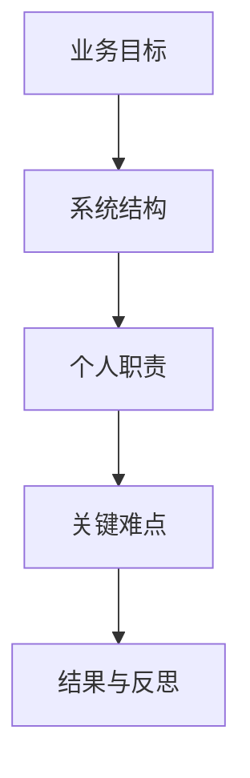
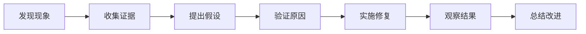

# 如何总结项目经历

项目经历是技术面试中最容易拉开差距的部分。面试官并不只关心你使用了什么技术，更关心你是否理解业务目标、是否真正参与实现、如何解决问题，以及能否验证结果。

## 一、使用五层结构梳理项目



| 层次 | 需要回答的问题 |
| --- | --- |
| 业务目标 | 项目服务谁，解决什么问题？ |
| 系统结构 | 核心模块如何协作？ |
| 个人职责 | 哪些部分由你完成？ |
| 关键难点 | 为什么这样设计，遇到过什么问题？ |
| 结果与反思 | 如何验证效果，重新设计会改什么？ |

## 二、准备三个时长版本

| 版本 | 使用场景 | 内容 |
| --- | --- | --- |
| 30 秒 | 自我介绍 | 项目目标、个人职责、一个亮点 |
| 2 分钟 | 面试展开 | 结构、难点、行动、结果 |
| 10 分钟 | 深入追问 | 技术选择、失败场景、优化与权衡 |

### 30 秒模板

```text
这是一个面向【用户群体】的【项目类型】，主要解决【业务问题】。
我负责【个人职责】，重点完成了【核心模块】。
项目中最值得展开的是【技术难点或关键决策】。
```

## 三、不要只罗列技术名词

以下表达比较空泛：

```text
使用 Redis、MySQL、Spring Boot 和消息队列完成系统开发。
```

更好的表达方式是：

```text
为降低热点数据查询压力，引入 Redis 缓存，并针对缓存失效场景设计降级策略；
通过压测和日志观察验证优化效果。
```

写下任何技术点之前，都要准备回答：

1. 为什么使用它？
2. 有什么替代方案？
3. 遇到异常怎么办？
4. 如何验证它确实有效？
5. 流量扩大十倍后，瓶颈可能在哪里？

## 四、准备一个真实问题复盘

项目中最有价值的内容往往不是“功能做完了”，而是“问题出现后如何定位和修复”。



可以准备：

- 一个难以复现的 Bug。
- 一次性能问题定位。
- 一个错误的技术判断。
- 一项效果不明显的优化。
- 一次接口协作中的调整。

## 五、项目复盘卡片

| 问题 | 我的答案 | 证据或依据 | 是否需要补充 |
| --- | --- | --- | --- |
| 为什么选择这个项目？ |  |  |  |
| 我本人完成了什么？ |  |  |  |
| 最大的难点是什么？ |  |  |  |
| 如何验证优化结果？ |  |  |  |
| 如果重新设计会改什么？ |  |  |  |

## 行动清单

- [ ] 为每个项目准备 30 秒、2 分钟和 10 分钟版本。
- [ ] 区分个人贡献和团队成果。
- [ ] 对每个核心技术词完成至少三层追问。
- [ ] 准备一个真实的问题定位案例。

延伸阅读：[用大模型复盘项目经历](./大模型使用/05-用大模型复盘项目经历.md) · [STAR 原则](./简历/STAR原则.md)
