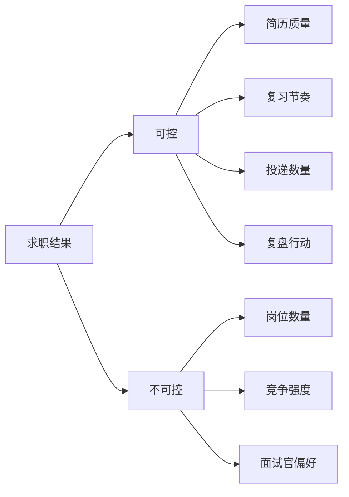

# 如何调整求职心态

求职是一段反馈密集、结果不完全可控的过程。尤其当身边同学陆续拿到 offer 时，很容易把一次拒绝理解为对自己能力的全面否定。

更健康的做法，是把注意力从“我能不能立刻拿到结果”转向“我今天能完成哪些有效动作”。

## 一、区分可控与不可控

把精力放在可控项上：

1. 每周完成固定数量的有效投递。
2. 每次面试后立即记录问题。
3. 对反复答错的知识点安排复习。
4. 保持睡眠、运动和基本生活节奏。

## 二、建立“过程记分板”

| 项目 | 本周目标 | 实际完成 |
| --- | --- | --- |
| 有效投递 |  |  |
| 笔试练习 |  |  |
| 模拟面试 |  |  |
| 面试复盘 |  |  |
| 运动与休息 |  |  |

当短期结果不理想时，这张表能提醒你：自己仍然在向前走。

## 三、遇到拒绝后怎么做

1. 允许自己短暂失落，但不要立即否定全部努力。
2. 记录本次流程、问题和薄弱点。
3. 判断原因属于简历、知识、表达、项目还是匹配度。
4. 只选择一个最优先问题进行改进。
5. 保持投递节奏，不让一次结果打断整个计划。

## 四、什么时候应该主动求助

如果持续失眠、情绪低落、无法学习或明显影响日常生活，请及时与家人、朋友、学校心理中心或专业人士沟通。求助不是软弱，而是对自己负责。

## 行动清单

- [ ] 写下本周可以控制的五个行动。
- [ ] 每次面试结束后完成一次复盘。
- [ ] 为休息和运动预留固定时间。
- [ ] 当压力持续影响生活时，主动寻求支持。
