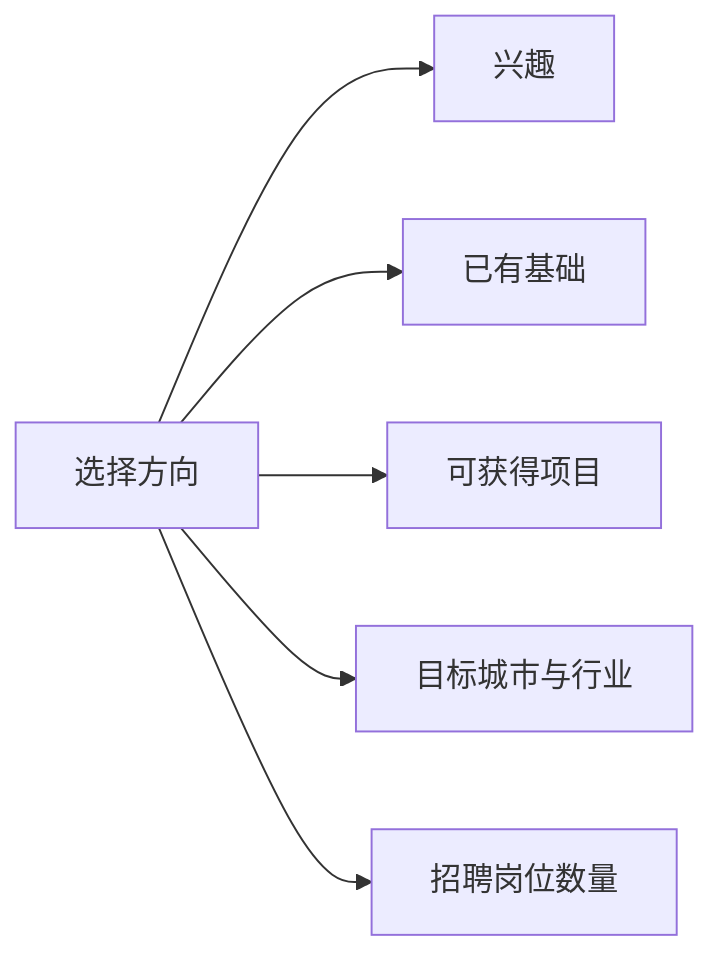

# 计算机岗位地图：如何选择求职方向

选择方向不是给自己贴上永久标签，而是确定接下来三个月最值得投入的训练主线。校招阶段最重要的是先形成一个能够投递的核心方向，再逐步扩展。

## 一、常见岗位对比

| 方向 | 典型工作 | 常见基础要求 | 适合谁 |
| --- | --- | --- | --- |
| 后端开发 | 接口、业务逻辑、数据库、服务治理 | 语言基础、数据库、网络、操作系统、缓存 | 喜欢系统设计和业务抽象 |
| 前端开发 | Web 页面、交互、工程化、性能优化 | HTML、CSS、JavaScript、框架、网络 | 重视用户体验和可视化反馈 |
| 测试开发 | 质量保障、自动化、平台工具、性能测试 | 编程、测试方法、网络、数据库、工程工具 | 关注稳定性和问题定位 |
| 算法工程师 | 模型、数据、实验、工程落地 | 数学、算法、机器学习、编程、论文阅读 | 喜欢模型与实验 |
| C++ 开发 | 基础设施、客户端、音视频、系统软件 | C++、数据结构、操作系统、网络 | 喜欢性能和底层机制 |
| 客户端开发 | Android、iOS、桌面端应用 | 语言、平台框架、网络、性能优化 | 喜欢终端体验和平台生态 |
| 数据开发 | 数据仓库、ETL、调度、数据质量 | SQL、数据库、数据建模、脚本、平台工具 | 喜欢数据链路和工程流程 |

## 二、选择方向时看什么

建议使用四步法：

1. 浏览 20 个真实岗位描述，提取高频要求。
2. 选择一个主方向和一个可迁移的备选方向。
3. 用 8 至 12 周完成最小能力闭环。
4. 通过项目、模拟面试和真实投递验证选择。

## 三、后端开发的最小能力闭环

| 模块 | 最低要求 |
| --- | --- |
| 编程语言 | 能解释集合、异常、并发、面向对象 |
| 数据库 | 能解释索引、事务、锁、慢查询 |
| 网络 | 能解释 TCP、HTTP、HTTPS |
| 操作系统 | 能解释进程线程、内存和 IO |
| 缓存 | 能解释 Redis 常见数据结构和缓存问题 |
| 算法 | 能完成常见数据结构和基础算法题 |
| 项目 | 能讲清楚个人职责、难点和验证方式 |

## 四、不要用“热门”替代判断

热门方向不一定适合你，冷门方向也不等于没有机会。比方向名称更重要的是：

- 是否能持续积累能力。
- 是否能做出可讲清楚的项目。
- 是否能在目标城市和行业找到足够岗位。
- 是否能接受该岗位的工作方式。

## 行动清单

- [ ] 收集 20 个目标岗位描述。
- [ ] 提取出现频率最高的 10 项技能。
- [ ] 选择一个主方向和一个备选方向。
- [ ] 为主方向制定 8 至 12 周计划。

延伸阅读：[Java 后端校招学习路线](./基础知识/Java后端校招学习路线.md) · [前端工程师学习路线](./基础知识/前端工程师.md)
