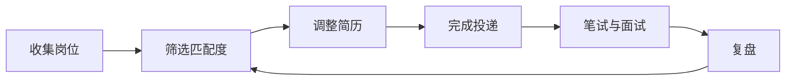
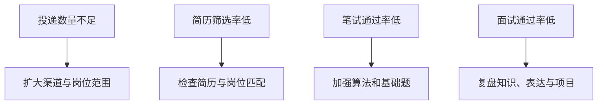

# 如何投递与管理求职进度

投递不是把同一份简历发送给尽可能多的公司。有效投递需要岗位筛选、版本管理、进度记录和持续复盘。

## 一、建立投递漏斗

## 二、常见渠道

| 渠道 | 优点 | 注意事项 |
| --- | --- | --- |
| 企业招聘官网 | 信息最权威 | 关注批次、岗位编号和截止时间 |
| 学校就业网 | 与本校招聘活动结合紧密 | 留意宣讲会和双选会 |
| 国家大学生就业服务平台 | 官方平台，覆盖多类岗位 | 定期检索和更新简历 |
| 内推 | 可能更快进入流程 | 内推不等于免笔试或保证面试 |
| 招聘会与宣讲会 | 适合现场了解信息 | 提前准备简历和问题 |
| 招聘平台 | 岗位数量丰富 | 注意信息真实性和重复岗位 |

## 三、使用求职表

| 字段 | 示例 |
| --- | --- |
| 公司与岗位 | 某公司 Java 后端开发 |
| 渠道 | 官网 / 内推 / 招聘会 |
| 投递日期 | 2026-03-20 |
| 简历版本 | 后端-v3 |
| 当前状态 | 已投递 / 笔试 / 一面 / offer |
| 下一步 | 复习 Redis、准备项目追问 |
| 截止时间 | 2026-03-28 |
| 备注 | 岗位地点、联系人、结果 |

你可以参考专栏中的 [求职表](../求职表.md)。

## 四、建立岗位梯度

不要只投一个层级。可以把岗位分为：

| 类别 | 作用 |
| --- | --- |
| 冲刺岗位 | 目标较高，用于争取更好机会 |
| 匹配岗位 | 与当前能力和经历较为匹配 |
| 稳妥岗位 | 增加有效反馈，控制求职风险 |

## 五、每周复盘投递结果

## 六、安全提醒

1. 不向陌生人支付“内推费”“保 offer 费”。
2. 不向未经确认的渠道提交身份证、银行卡等敏感信息。
3. 对面试邀请核实公司、岗位和联系方式。
4. 以企业官方通知和书面材料为准。

## 行动清单

- [ ] 建立一张求职表。
- [ ] 每周固定收集和筛选岗位。
- [ ] 为不同方向维护简历版本。
- [ ] 每周根据漏斗数据调整策略。

参考平台：[国家大学生就业服务平台](https://job.ncss.cn/)
