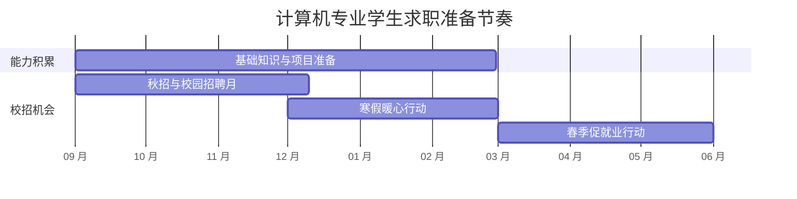

# 校招时间线：实习、秋招和春招分别做什么

校招不是某一天突然开始的。不同公司、行业和学校的安排存在差异，建议持续关注企业招聘官网、学校就业网和 [国家大学生就业服务平台](https://job.ncss.cn/)。

本文提供的是行动框架，不是固定截止日期。每年都要根据官方公告更新。

## 一、全年节奏

教育部公开信息显示：

- 2026 届高校毕业生“金秋启航”校园招聘月于 **2025 年 9 月 27 日**启动。
- 寒假促就业暖心行动安排在 **2025 年 12 月至 2026 年 2 月**。
- 春季促就业攻坚行动安排在 **2026 年 3 月至 5 月**。

这些时间用于帮助你理解招聘季节奏，具体岗位仍要以用人单位公告为准。

## 二、分阶段行动清单

| 阶段 | 核心目标 | 建议动作 |
| --- | --- | --- |
| 大二至大三上 | 建立方向感 | 尝试课程项目、实习、竞赛，了解岗位地图 |
| 实习招聘前 | 完成最小闭环 | 准备简历、项目讲解稿、基础题和算法训练 |
| 秋招前 2 至 3 个月 | 集中训练 | 扩大投递、模拟面试、记录错题 |
| 秋招进行中 | 保持节奏 | 每周复盘投递和面试，不等待单一结果 |
| 寒假 | 查漏补缺 | 关注补录、实习和寒假招聘，补齐短板 |
| 春招 | 抓住窗口 | 扩大岗位范围，优先处理明确机会 |
| 拿到 offer 后 | 做出决策 | 核实岗位、薪资、地点、协议和截止时间 |

## 三、每周检查一次

| 检查项 | 本周完成情况 |
| --- | --- |
| 新增有效投递数量 |  |
| 简历是否针对岗位调整 |  |
| 算法练习数量 |  |
| 基础知识薄弱点 |  |
| 模拟面试次数 |  |
| 面试复盘次数 |  |
| 下周最优先动作 |  |

## 四、避免三个误区

1. 不要等到招聘信息大量出现才开始准备。
2. 不要只盯着头部公司，建立梯度投递组合。
3. 不要因为一次流程暂停全部投递。

## 参考来源

- [教育部：2026 届高校毕业生“金秋启航”校园招聘月活动启动](https://www.moe.gov.cn/jyb_xwfb/gzdt_gzdt/s5987/202509/t20250927_1415177.html)
- [教育部：部署开展 2026 届高校毕业生“寒假促就业暖心行动”](https://www.moe.gov.cn/jyb_xwfb/gzdt_gzdt/s5987/202601/t20260107_1425856.html)
- [教育部：开展 2026 届高校毕业生春季促就业攻坚行动](https://www.moe.gov.cn/jyb_xwfb/gzdt_gzdt/s5987/202603/t20260319_1431535.html)
