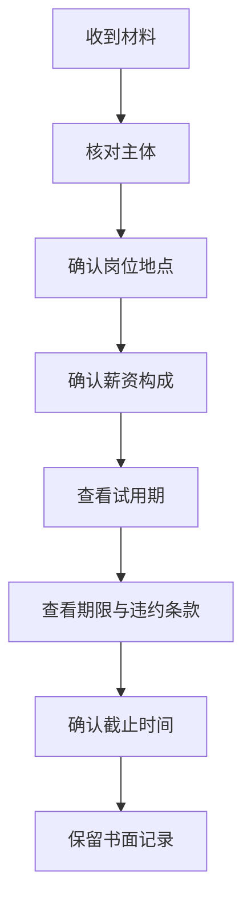

# offer、三方和劳动合同避坑指南

拿到 offer 后仍然需要认真阅读材料。口头沟通、offer、就业协议和劳动合同不是同一个概念，具体效力和处理方式要结合文本、学校流程和当地规定判断。

> 本文用于帮助你建立检查清单，不构成法律意见。遇到争议时，应咨询学校就业中心、当地人力资源社会保障部门或专业法律人士。

## 一、先区分四类材料

| 材料 | 关注点 |
| --- | --- |
| 口头沟通 | 便于了解情况，但关键内容应落实到书面材料 |
| offer 或录用通知 | 岗位、地点、薪资、入职时间、截止时间、附加条件 |
| 就业协议 | 学校流程、单位和学生约定、违约条款 |
| 劳动合同 | 劳动关系中的权利义务，以实际文本和法律规定为准 |

## 二、收到材料后检查什么



### 基础清单

- 单位名称、签约主体和工作地点。
- 岗位名称、职责、部门和是否存在调岗安排。
- 固定工资、奖金、补贴、绩效和发放条件。
- 试用期长度、试用期工资和转正条件。
- 入职日期、材料提交时间和接受截止日期。
- 服务期、培训、保密、竞业限制和违约条款。
- 就业协议、劳动合同与口头承诺是否一致。

## 三、劳动合同中的重要规则

根据《中华人民共和国劳动合同法》：

1. 建立劳动关系，应当订立书面劳动合同。
2. 劳动合同期限三个月以上不满一年的，试用期不得超过一个月。
3. 劳动合同期限一年以上不满三年的，试用期不得超过二个月。
4. 三年以上固定期限和无固定期限劳动合同，试用期不得超过六个月。
5. 以完成一定工作任务为期限的劳动合同或者劳动合同期限不满三个月的，不得约定试用期。
6. 同一用人单位与同一劳动者只能约定一次试用期。
7. 试用期工资不得低于本单位相同岗位最低档工资或者劳动合同约定工资的百分之八十，并不得低于用人单位所在地的最低工资标准。

阅读材料时应核对实际条款，并以现行法律和当地主管部门解释为准。

## 四、就业协议需要注意什么

就业协议通常与学校就业流程相关。学校、地区和单位的处理方式可能不同，因此不要套用他人的经验。

确认：

1. 协议由谁签署，是否需要学校流程。
2. 是否存在违约条款和截止时间。
3. 如果需要调整选择，应联系谁、走什么流程。
4. 是否会影响档案、户口或其他手续。
5. 所有承诺是否有书面记录。

## 五、做决定前留出检查时间

不要在压力下立即答应。可以礼貌说明：

```text
感谢贵司的认可。我希望认真阅读书面材料并确认相关安排，
请问最晚可以在什么时间前回复？
```

## 六、遇到问题怎么办

1. 保存邮件、聊天记录、offer 和协议文本。
2. 优先与招聘联系人确认书面解释。
3. 涉及学校流程时咨询学校就业中心。
4. 涉及劳动权益时咨询当地人力资源社会保障部门。
5. 情况复杂时寻求专业法律帮助。

## 行动清单

- [ ] 不只听口头承诺，阅读书面材料。
- [ ] 核对岗位、地点、薪资、试用期和截止时间。
- [ ] 了解学校就业协议办理流程。
- [ ] 保存所有重要记录。
- [ ] 遇到争议时及时咨询专业渠道。

## 参考来源

- [中华人民共和国劳动合同法（根据 2012 年修正）](https://www.samr.gov.cn/zw/zfxxgk/fdzdgknr/bgt/art/2023/art_0abfdd261c03417b949df19d869add8d.html)
- [中国政府网：试用期应该有多久？](https://app.www.gov.cn/govdata/gov/202203/01/482315/article.html)
- [国家大学生就业服务平台](https://job.ncss.cn/)
