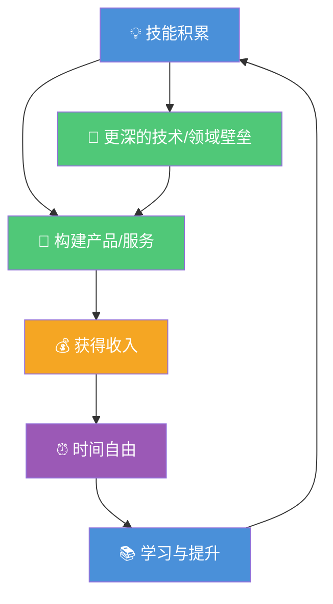
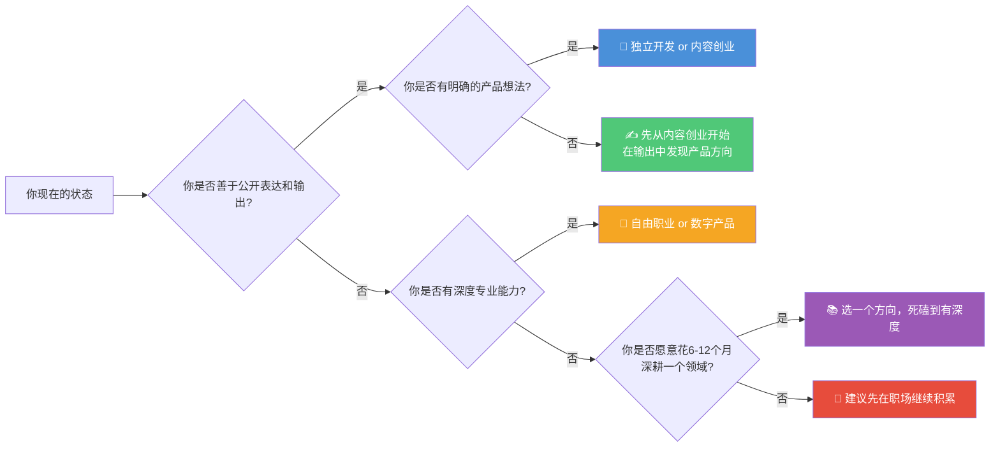

# 一人公司方法论：程序员如何构建个人商业系统

> 写这篇文章时，我已经以"一人公司"的形式工作了三年。这篇文章不是成功学，也不是贩售焦虑——它是一个我亲身踩过坑、也看到无数同行踩过坑之后，总结出的系统化思考框架。如果它能帮你少走几个月的弯路，目的就达到了。

---

## 一、什么是一人公司（OPC）

**One-Person Company（OPC）** 不是"一个人的小作坊"，而是**用技术和产品杠杆将个人能力放大到极致**的一种组织形态。

```
传统创业的逻辑：招人 → 融资 → 扩大规模 → 追求估值
一人公司的逻辑：技能 → 产品/服务 → 收入 → 时间自由 → 技能持续提升
```

与传统创业的核心区别在于：**不追求规模，追求自由度 + 可持续收入**。你不是在造一艘航母，而是在造一艘属于自己的快艇——灵活、高效、能随时调整航向。

### 为什么程序员天然适合 OPC？

1. **技术杠杆最高**：一个程序员 + AI 工具 = 过去一个 5 人团队的生产力。写一次代码，服务成千上万用户，边际成本趋近于零。
2. **产品即资产**：代码不属于公司，属于你（前提是合同要干净）。SaaS、App、开源项目都可以成为持续产生收入的资产。
3. **远程友好**：软件开发天然适合异步协作，不受地理位置限制。
4. **供需结构性失衡**：全球范围内，能独立交付高质量产品的人永远是稀缺的。

### OPC 的核心循环



这个循环的关键在于：每一圈都在为你累积**不可转移的资产**——你的技能、你的品牌、你的客户关系、你的产品。这些东西不会因为你离开某个公司而清零。

---

## 二、程序员的四种 OPC 路径

没有一条路径适合所有人。下表覆盖了四条最常见的路径，请根据你的技能特点和风险偏好来选择。

| 路径 | 典型形式 | 收入模式 | 启动难度 | 收入天花板 | 适合谁 |
|------|----------|----------|----------|------------|--------|
| **独立开发** | SaaS、App、付费工具、浏览器插件 | 订阅/买断/按量付费 | ⭐⭐⭐ 中 | ⭐⭐⭐⭐⭐ 高 | 有产品思维，能独立完成前后端 |
| **自由职业** | 接单、远程工作、技术咨询 | 时薪/项目制/月费 | ⭐⭐ 低 | ⭐⭐⭐ 中 | 有深度专业能力，沟通能力强 |
| **内容创业** | 技术博客、视频教程、知识付费、付费专栏 | 广告/订阅/课程销售/企业培训 | ⭐⭐⭐ 中 | ⭐⭐⭐⭐ 较高 | 善于表达和输出，有教学能力 |
| **数字产品** | 模板、代码库、设计资产、Notion模板 | 买断/单次购买 | ⭐⭐ 低 | ⭐⭐⭐ 中 | 有垂直领域积累，追求低维护 |

### 路径一：独立开发

独立开发是最能体现"技术杠杆"的路径。你构建一个产品，它在你睡觉时也能服务用户并产生收入。但请注意：**做产品的核心不是写代码，而是找到人们愿意付费的问题。**

> **真实案例**：「老陈」是一名后端工程师，业余时间开发了一款 API 文档管理工具。前 8 个月免费，积累 2000 用户后推出付费版（$12/月）。第 18 个月 MRR（月经常性收入）达到 $6500，超过了他的工资。他选择了辞职，现在全职维护这款产品，每周实际工作约 25 小时。

### 路径二：自由职业

这是启动难度最低的路径——你不需要产品，不需要流量，只需要一个愿意付费的客户。但这不意味着它容易。自由职业的挑战在于：**收入与你投入的时间强绑定**，你不工作就没有钱。这是 OPC 中最接近"卖时间"的模式，但它是一个很好的过渡选项。

> **真实案例**：「小林」深耕 Kubernetes 运维，在国内时通过领英找到了两家海外初创公司的兼职合作，远程月收入约 $4000。半年后他从原公司离职，现在同时服务 3 个长期客户。关键不是技术多强，而是他英语沟通无障碍，并且在一个细分领域做到了"别人搞不定的你来找我"。

### 路径三：内容创业

程序员做内容创业有一个天然优势：**你的学习过程本身就是内容**。你不需要成为专家才能分享，你只需要比受众早走一步。"Curate and Create" 是性价比最高的策略：整理优质信息 + 加上你自己的理解。

> **真实案例**：「阿杰」从 2021 年开始写技术博客，专注前端工程化方向。前 18 个月几乎零收入。第 20 个月，他在掘金/Medium 上的累计读者超过 3 万，开始收到付费课程邀约。现在他既有课程销售的被动收入，也有企业内训的主动收入。他的感悟是："最难的不是写，是写的前 100 篇没人看的时候坚持写下去。"

### 路径四：数字产品

数字产品的逻辑是做一次、卖多次。模板、代码库、设计资产——这些产品的边际成本极低，一旦做完，主要成本就是客服和零星更新。但它的挑战在于：**很容易被复制和盗版**，所以你需要找到自己能持续提供独特价值的领域。

> **真实案例**：「大刘」在数据可视化方向做了 5 年，把工作中积累的 ECharts/D3.js 图表模板整理成了付费套装（$49），在 Gumroad 上架。上线第一年卖出了约 600 份，算下来平均每个月只花 3-5 小时维护。"这些模板本来不卖也是躺在硬盘里，现在每年能带来 2 万多美金的纯利润。"

### 路径选择决策矩阵



---

## 三、从打工人到一人公司的过渡策略

### 重要的事说三遍

> **不要裸辞！不要裸辞！不要裸辞！**

不是开玩笑。我见过太多人读了几个独立开发者的成功故事，头脑一热就辞了职，然后在 3 个月后发现自己既没有产品也没有收入，陷入极大的焦虑。裸辞的致命问题在于：

- **焦虑会毁掉你的判断力**：当你的存款一天天减少，你会开始接受低质量的外包，放弃长期的正确选择。
- **验证需要时间**：你的第一个产品大概率会失败（这是正常的），你需要有缓冲来迭代和转向。
- **压力之下做不出好产品**：创造力需要在相对松弛的状态下才能发挥。

### 三阶段过渡模型

| 阶段 | 目标 | 关键里程碑 | 参考时间 | 风险等级 |
|------|------|------------|----------|----------|
| **阶段一：业余验证** | 跑通最小的收入闭环 | 赚到第一笔钱（哪怕只有 100 块） | 1-6 个月 | 极低 |
| **阶段二：副业稳定** | 副业收入达到工资的 50%+ | 连续 6 个月副业收入稳定或增长 | 6-18 个月 | 低到中 |
| **阶段三：平滑切换** | 从全职工作平稳过渡到独立 | 副业收入覆盖生活开支的 120% | 1-3 个月 | 中 |

#### 阶段一：业余验证（1-6 个月）

这个阶段的目标**不是赚钱，而是验证**。用晚上和周末的时间，做一个极小的东西，然后尝试让人为它付费。哪怕只卖出一份，意义都是巨大的——它证明了"你可以独立创造价值并让人付钱"这件事。

**里程碑**：赚到第一笔非工资收入。金额不重要，重要的是这个心理关口。

#### 阶段二：副业稳定（6-18 个月）

当你验证了方向，下一个目标是把副业收入提升到主业工资的 50% 以上，并且这个状态持续至少 6 个月。这不是一个保守的数字——它意味着你已经有能力独立产生可观的现金流。

> **为什么是 50%？** 因为这意味着即使你辞职后收入暂时不会增长，你也不至于立刻陷入窘迫。同时，全职投入后你的产出通常会翻倍，所以副业收入达到 50% 是一个合理的"发射窗口"。

#### 阶段三：平滑切换（1-3 个月）

不要搞"勇士断腕"式的离职。更聪明的做法是：

1. 先和你现在的雇主谈远程或兼职（如果关系还不错）。
2. 很多公司对于核心员工的"降级"是愿意接受的——降薪但保留基础待遇。
3. 当副业收入已经超过 100% 工资，且增长趋势明确，再彻底切换。

---

## 四、最小可行产品（MVP）思维

### 第一个产品应该多小？

**比你想象的小得多。** 这里有一个真实的反面教材：我曾经花了 4 个月的周末时间做了一个"完美的" SaaS 产品，包含了注册登录、支付系统、权限管理、精美的 Dashboard……然后上线后 2 个月只有一个付费用户（那是我朋友）。

正确的做法是：**解决一个你真正遇到的小问题，用最粗糙但能用的方式。**

举几个具体的 MVP 例子：

| 你的痛点 | 极简 MVP | 需要写的代码 | 验证指标 |
|----------|----------|-------------|----------|
| 每次部署都要手动跑十几个命令 | 一个 Shell 脚本 + 简单的配置页面 | 200 行 | 你自己用了 30 天后是否离不开它 |
| 记不住各种 API 的参数 | 一个 Markdown 速查表 + 网页展示 | 50 行 + 一份文档 | 收到的 star/收藏数 |
| 团队日志分散各处难以排查 | 一个简易的日志聚合 CLI 工具 | 500 行 | 同事是否愿意主动使用 |
| 找不到高质量的某个领域的资料 | 一篇系统性的整理文章 + 付费 PDF | 0 行代码 | 是否有付费转化 |

### 怎么验证需求：先卖再造

> "如果你不能在没有产品的时候卖出去，有了产品也很难卖出去。"

在写一行代码之前，先做这几件事：

1. **写一篇 Landing Page**：用 Carrd 或 Notion 做一个单页，描述你的产品解决什么问题。
2. **去目标用户聚集的地方**：Reddit、V2EX、知乎、Twitter、微信群，发帖子问"你们也有这个问题吗？"
3. **做预售**：设定一个早鸟价，看是否有人愿意付费。不是"感兴趣"，是**真的付钱**。
4. **如果 50 个人看了你的页面但无人付费**：不是定价或文案的问题，是需求不存在或不够痛。

### 技术栈怎么选

**一个原则：用你最熟悉的技术栈，不要在这个阶段学新技术。**

> 你的目标是以最快的速度验证商业假设，不是在简历上增加技术关键词。

| 产品类型 | 推荐技术栈（选你最熟的，不是最酷的） |
|----------|--------------------------------------|
| SaaS / Web App | Next.js + Prisma + 你常用的后端语言 |
| 移动端 App | React Native / Flutter（跨平台，一个人搞定） |
| CLI 工具 | Go / Rust / Python（挑你最顺手的） |
| 内容网站 | 静态站点生成器（Hugo / Astro）+ Markdown |
| Chrome 插件 | 纯 HTML + JS，零框架 |

### 什么时候该放弃

给每一个 MVP 设定明确的验证周期和指标：

| 验证周期 | 最低成功标准 | 如果没达到 |
|----------|-------------|-----------|
| 第一个月 | 有 10 个真实用户在持续使用 | 去和用户聊，找出为什么不用 |
| 第三个月 | 至少有 1 个付费用户 | 重新审视需求是否存在 |
| 第六个月 | 月增长率 > 10% 或有清晰的增长路径 | 认真考虑放弃或大规模 pivot |

**放弃不丢人。** 你放弃的是一个错误的假设，不是一个失败的人生。保留代码、保留经验、保留教训，下一个产品你会做得更快。

---

## 五、运营自己：一人公司的营销能力

> 一人公司最大的敌人不是竞争对手，是**没有人知道你存在**。

### 程序员的天然营销优势

仔细观察你会发现：程序员拥有的技能，恰好也是做内容营销最需要的能力：

| 程序员技能 | 对应营销能力 | 具体做法 |
|-----------|-------------|----------|
| 写文档 / README | 内容写作 | 把技术文章当作文档来写——结构化、清晰、有代码示例 |
| 写开源项目 | 信任建立 | 开源的 star 数是天然的信任背书 |
| 解决问题的方法 | 教程 / 案例分析 | "我是怎么解决 XX 问题的"是最受欢迎的技术内容类型 |
| 结构化思维 | 课程设计 | 把知识体系化，做成课程或专栏 |
| 数据分析 | 增长黑客 | 用数据驱动的方式测试哪个渠道转化率最高 |

### 建立个人品牌的最低成本方式：持续公开输出

说穿了就是两件事：**写**和**分享**。

- **写**：技术博客、问题排查记录、工具测评、学习笔记——什么都行，关键是持续。
- **分享**：GitHub 开源、Twitter/微博、掘金/知乎、Reddit/Hacker News、相关的 Discord/Telegram 群。

持续公开输出 6 个月以上，你会发现：
- 有人开始通过你的文章找你做咨询
- 有人通过 GitHub 了解你，然后发来工作/合作邀约
- 你的观点开始在某个细分领域有影响力

### "Build in Public" 的方法

"Build in Public" 是近年在独立开发者圈子里最有效的增长策略。核心很简单：**把你构建产品的过程公开分享**。

具体做法：

1. 在 Twitter/X 上开一个 Thread，每天分享你做了什么（不需要很完整，只要真实）。
2. 定期发布 MRR（收入）更新，展示从零到一的过程（人们喜欢看真实的故事）。
3. 把遇到的坑和解决方案写成文章——这些文章是你的长期 SEO 资产。
4. 在 Product Hunt 上发布产品时，你已经有一群关注者可以帮你投票。

> **关键不是你的产品有多好，而是人们陪你一起走过从零到一的过程后，他们会成为你最忠实的用户和传播者。**

### 你的 GitHub 就是你的简历兼名片

对于一个独立开发者来说，GitHub 不仅仅是一个代码托管平台。它是：

- **你的作品集**：比简历更有说服力。
- **你的信任证明**：一个 500 star 的项目比任何自我介绍都有用。
- **你的获客渠道**：用户在 GitHub 上搜到你解决问题的项目，然后发现你的产品。

**尽可能把你做的一切公开放在 GitHub 上。** Readme 写清楚、有 Demo 链接、有使用文档。这份资产会持续不断地为你带来机会。

---

## 六、财务与心态

### 财务底线

| 项目 | 最低建议 | 理想建议 |
|------|----------|----------|
| 生活储备金 | 12 个月生活费 | 18-24 个月 |
| 商业启动资金 | $0（服务型）/ $500-2000（产品型） | $5000 |
| 独立前的月收入基准 | 覆盖全部生活开支 | 覆盖生活开支的 150% |

**12 个月的生活费不是危言耸听。** 如果你走独立开发路线，第一个打得平的产品可能需要 6-12 个月才能稳定产生收入。自由职业稍微快一些，但客户流失的风险也需要缓冲。

### 孤独感是真实的

一人公司意味着大多数时间你是一个人工作。如果你之前习惯了办公室的社交环境，这种转变会比你想象的更难。

**我的建议：**

1. **加入独立开发者社群**：Indie Hackers（英文）、V2EX 的"分享创造"节点、即刻上的独立开发者圈子。
2. **定期参加线下活动**：黑客马拉松不但能让你认识人，还可能碰撞出产品想法。
3. **找一个 Accountability Partner**：每周视频通话一次，互相汇报进度。这可能是让你坚持下来的最重要的一件事。
4. **考虑共享办公空间**：哪怕一周只去一天，人对人的随机碰撞是有价值的。

### 社保、税务、合同：实用提醒

> **免责声明**：以下不是专业建议，请务必咨询当地的专业机构。

- **社保**：国内可以通过灵活就业人员身份自行缴纳养老和医疗保险。部分地区有"个体工商户"政策，比灵活就业更灵活。
- **税务**：
  - 国内：个体工商户年应纳税所得额不超过 200 万元的部分，减半征收个人所得税（现行政策，请核实最新）。
  - 海外收款：Stripe、PayPal、Wise 等都可以收美元，但要注意结汇限额（个人每年 $5 万等值外币）。超过需要走对公账户。
- **合同**：自由职业者一定要签合同，哪怕对方是朋友。合同不需要复杂，但至少要约定：工作范围、交付标准、付款节奏、知识产权归属。推荐用 HelloSign 或 DocuSign。
- **知识产权**：确保你给客户开发的"副产品"不侵犯你在公司期间产生的知识产权。最稳妥的方式是：用独立的电脑、独立的环境开发，且在公司入职时就明确过你的副业在合同允许范围内。

### 什么时候应该放弃"一人"

一人公司不是宗教教条。到了一定阶段，你可能发现"一个人"不再是优势而是瓶颈：

| 信号 | 建议动作 |
|------|----------|
| 收入增长但重复性工作占据了 60% 以上的时间 | 招一个虚拟助理（VA）或兼职客服 |
| 技术栈需要跨领域但你实在学不过来 | 找一个互补的合伙人（你做后端他做前端） |
| 有明确的增长机会但你一个人忙不过来 | 先外包非核心工作，再考虑招人 |
| 你发现自己不喜欢"一个人的状态" | 这完全 OK，一人公司不是唯一的路 |

**招人还是找合伙人？** 一个简单的判断标准：如果是长期需要的能力，找合伙人（分股权）；如果是临时的、可替代的工作，招人或外包（付钱）。

---

## 七、常见误区

### 误区一："做个 App 就能躺赚"

这是被无数虚假广告植入的错误认知。真相是：

- 研发只占成功产品的 20-30%。剩下的是**营销、维护、客服、迭代、处理各种意外**。
- 任何有用户的软件都需要持续维护：依赖升级、安全漏洞、服务器故障、用户投诉。
- "被动收入"不是"零工作收入"，而是"你不需要按小时出售时间的收入"。

**正确的预期**：如果你做一个 SaaS 产品，前 6 个月你可能每天要花 1-2 小时维护和推广，6 个月后能降到每周几小时。这才是合理的"躺赚"。

### 误区二："技术好就够了"

> 一人公司的核心竞争力不是技术深度，而是**技术 × 产品 × 运营**的三要素乘积。

如果其中一项是零，最终结果就是零。很多技术大牛做一人公司失败，不是因为技术不行，而是因为：

- **产品思维缺失**：做了自己觉得酷炫但没人需要的功能。
- **营销能力为零**：产品做完了，但没有人知道。
- **不会和用户沟通**：技术术语轰炸用户，而不是理解用户的真实场景。

> **实用建议**：如果你的技术是 9 分，产品和营销是 1 分，那么你的重心不是把技术提到 10 分，而是把产品和营销提到 5 分。

### 误区三："国内没有机会"

> 事实：**全球市场向中国开发者敞开着。**

| 出海渠道 | 具体方式 | 典型收入 |
|----------|----------|----------|
| 海外 SaaS | 面向全球用户的产品 | MRR $1000-$10000+ |
| 远程工作 | 为海外公司远程工作 | 年薪 $50K-$150K |
| Gumroad / Etsy | 卖数字产品给全球用户 | 月收入 $500-$5000 |
| 自由职业平台 | Upwork / Toptal / Fiverr | 时薪 $30-$150 |

除了市场更大之外，出海还有一个隐藏优势：**你的收入是美元，但你的生活成本是人民币。** 这意味着你的收入门槛大大降低——月入 $3000 在很多国内城市已经可以过得很舒服。

> **真实案例**：「小北」做了一款面向海外用户的 AI 写作辅助工具（Chrome 插件），定价 $9.99/月。上线 1 年月活 1500，付费转化率 5.5%，MRR 约 $820。他的开发成本：一台 MacBook + 周末时间。

### 误区四："自由职业 = 没人管，很自由"

自由职业者面临的挑战恰恰相反：**你需要更强的自律和节奏感。**

| 公司上班 | 一人公司 |
|----------|----------|
| 老板给你安排优先级 | 你自己判断什么最重要 |
| 到了公司就有社交 | 你可能一整天不说话 |
| 有人帮你处理行政/财务 | 你是一切的后勤 |
| 做不完可以甩锅 | 所有问题最终都是你的问题 |
| 定时发工资 | 收入不稳定，可能这个月多下个月零 |

**实用建议**：

1. **保持固定作息**：没有人管你，但你得管自己。给自己设定"工作开始"和"工作结束"的仪式。
2. **区分工作空间和生活空间**：哪怕只是房间里的两张不同的桌子。
3. **每周日晚上做下周计划**：没有经理帮你规划，你必须自己来。
4. **强制自己出门**：每天至少出门一次，哪怕是散步。

---

## 八、行动清单

以下是一份从今天开始就可以执行的行动清单。不需要做完所有事，但请至少开始做第一件。

### 📋 你的 OPC 启动清单

- [ ] **本周内**：列出你拥有但别人可能愿意付费的 3 种技能（技术栈、工具使用、领域知识等）
- [ ] **本周内**：确定你的首选路径（独立开发 / 自由职业 / 内容创业 / 数字产品）
- [ ] **第 1-2 周**：选择一个公开平台（GitHub / 博客 / Twitter / 掘金），发布你的第一篇文章或项目
- [ ] **第 1 个月内**：完成第一个付费实验——找到至少 1 个愿意为你付费的客户/用户
- [ ] **第 1 个月内**：搭建你的第一个 Landing Page 或 GitHub README 产品页
- [ ] **第 2-3 个月**：建立持续输出的习惯——每周至少 1 篇技术文章或 1 次代码提交
- [ ] **第 3-6 个月**：跑通一个完整的收入闭环（从获取用户关注 → 交付价值 → 收到付款）
- [ ] **第 6 个月**：复盘数据，决定是否 pivot 或继续
- [ ] **第 6-12 个月**：目标——副业月收入达到主业月收入的 30% 以上
- [ ] **第 12-18 个月**：目标——副业月收入稳定在 50% 以上，持续 6 个月

### 推荐资源

**社群与平台：**

| 资源 | 类型 | 适合阶段 |
|------|------|----------|
| [Indie Hackers](https://www.indiehackers.com) | 社区 + 案例 | 所有阶段 |
| [Product Hunt](https://www.producthunt.com) | 产品发布 | 产品上线期 |
| [V2EX - 分享创造](https://v2ex.com/go/create) | 中文社区 | 所有阶段 |
| [Hacker News](https://news.ycombinator.com) | 社区 | 推广和学习 |
| [即刻 App](https://web.okjike.com) - 独立开发者圈子 | 中文社区 | 所有阶段 |

**书籍：**

| 书名 | 核心价值 | 适合谁 |
|------|----------|--------|
| 《The Mom Test》 | 如何正确地做用户访谈 | 所有人必读 |
| 《Indie Hackers 访谈集》 | 真实的一人公司案例 | 寻找灵感 |
| 《Make》by Pieter Levels | 极简主义产品开发 | 独立开发者 |
| 《重来》（Rework） | 颠覆传统商业认知 | 所有阶段 |
| 《小而美》（Small Is Beautiful） | 小型企业的经营哲学 | 心态建设 |

---

## 最后的提醒

开始之前，请接受这几件事作为前提：

1. **你的前三个产品大概率都会失败。** 这是数据，不是诅咒。接受了这个前提，你就不会在第一个产品失败时否定自己。
2. **月入 $500 比月入 $5000 更难。** 从 0 到 1 是最难的——一旦你突破了这个心理和技术关口，增长就有了踏脚石。
3. **不要等到准备好了再开始。** 没有"准备好了"的时候。从今天晚上写第一篇文章、第一行代码开始。
4. **一人公司不是逃离职场的出口，而是创造价值的另一种方式。** 如果你只是因为讨厌现在的工作而想做这件事，先换工作。当你是被"创造的自由"所驱动，而不是被"打工的痛苦"所驱动时，你才真正准备好。

> 世界上最危险的，不是尝试之后发现不行，而是一直在等一个永远不会来的"完美时机"。

---

*本文写于 2026 年 5 月。创业环境、税收政策、平台规则均会随时间变化，请以最新信息为准。*

*如果你开始行动了，希望你把进展分享出来。每多一个人分享真实的独立探索过程，这个生态就会更好一点。*
