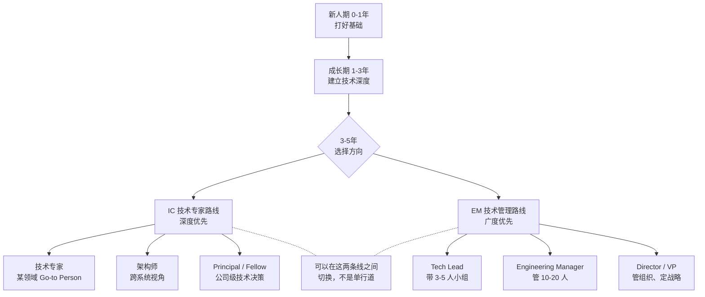

# 技术人的职业成长路径：从新人到骨干

> 这不是一篇"你应该努力"的鸡汤，而是一份我希望自己刚入行时就能看到的路线图。里面写的东西，都是这些年踩坑踩出来的。

---

## 一、技术人的成长阶段

技术成长不是线性的，但你大致会经过这么几个阶段。每个阶段的核心矛盾不同，用力的方向也不同。

| 阶段 | 年限 | 核心任务 | 关键能力 | 常见误区 |
| :--- | :--- | :--- | :--- | :--- |
| **新人期** | 0--1 年 | 独立完成明确任务 | 代码规范、调试能力、主动沟通 | 闷头写代码不问问题；怕犯错不敢动手 |
| **成长期** | 1--3 年 | 负责模块 / 子系统 | 设计能力、排查能力、跨团队协作 | 只关注技术本身，不了解业务上下文 |
| **骨干期** | 3--5 年 | 主导项目 / 带新人 | 系统设计、项目管理、技术决策 | 什么都想自己做；不会把经验沉淀成方法论 |
| **专家期** | 5 年+ | 技术规划 / 影响团队 | 架构设计、技术判断、影响力 | 陷入舒适区；技术视野停留在部门内 |

> **一个常被忽略的真相**：四个阶段不是按年限自然晋升的。有些人干了五年还是"执行型成长期"，有些新人两年就具备了骨干能力。区别在于**主动复盘**的习惯——你有没有在做每件事的同时，提炼出可迁移的方法论。

下面展开每个阶段的要点。

### 新人期（0--1 年）：建立信任

新人期的目标只有一个——**让你的 mentor 和同事觉得"把活交给你是放心的"**。这比写出什么惊才绝艳的代码重要得多。

怎么做：

- **交付靠谱**。Deadline 是 deadline，不是 suggestion。预估时间的时候给自己留 buffer，但一旦承诺了就做到。如果发现做不完，提前说，不要等到最后一刻。
- **主动同步信息**。不要等别人来问你"进度怎么样了"。每天或者隔天，主动在群里或文档里写一句话的进展。不是卷，是降低别人的沟通成本。
- **学会提问**。新人最让人头疼的不是"不懂"，而是"不懂却不说"。用好问题模板：**"我在做 X，遇到了 Y 问题，我尝试了 A 和 B 方案，A 因为什么不行，B 因为什么不行，你看我还有没有遗漏的方向？"**——这表明你动过脑子了。
- **把每行代码过一遍脑子**。不要从 Stack Overflow 或者 ChatGPT 直接复制粘贴。理解之后再写，写完自己 review 一遍。这会在未来三年持续给你回报。

### 成长期（1--3 年）：建立深度

这个阶段的核心任务是**在某一个方向上建立起超越同龄人的专业深度**。

为什么需要"一个方向"？因为三年后大家判断你价值的方式不再是"这个人干活靠不靠谱"，而是"提到某某领域能不能想到他/她"。这个领域可能是：

- 性能优化（你能把慢查询从 3 秒压到 50 毫秒）
- 中间件（你对消息队列、缓存、RPC 框架的源码和原理如数家珍）
- 稳定性（你能设计一套完整的监控、告警、降级、容灾方案）
- 数据库（你对索引优化、分库分表、数据迁移有实操经验）

怎么建立深度？

| 方法 | 具体做法 | 投入 |
| :--- | :--- | :--- |
| 啃一个开源项目 | 选一个你天天用的中间件（如 Redis、Kafka），读源码、写注释、做内部分享 | 坚持 3 个月，每天 1 小时 |
| 做一次性能优化 | 找一个线上慢接口，从 profiling 到优化到压测，完整走一遍并写文档 | 1--2 周集中攻关 |
| 跟一个完整项目 | 从需求评审到上线到复盘，参与全流程，记下每个环节踩过的坑 | 随项目周期 |

> **一个关键建议**：在 1--3 年这个窗口，尽量不要频繁跳槽。每次跳槽你都要花 3--6 个月重新建立上下文，这对深度积累非常不利。如果当前环境学不到东西，优先考虑内部转岗。

### 骨干期（3--5 年）：建立判断力

到了这个阶段，你和别人拉开差距的不再是"写代码快不快"，而是**做判断的能力**。

区别在哪？下面这张表可以说明：

| 场景 | 成长期做法 | 骨干期做法 |
| :--- | :--- | :--- |
| 接到一个需求 | 确认清楚就开始做 | 先想：这个需求要解决什么问题？有没有更简单的方案？需不需要做？ |
| 选技术方案 | 用自己熟悉的 / 组里在用的 | 对比 2--3 个方案，列出优劣、代价、长期维护成本，给出明确推荐 |
| 线上出故障 | 紧张，找人帮忙 | 先止损（回滚 / 降级），再定位，最后复盘。顺序不乱。 |
| 带新人 | 有问必答，帮他写代码 | 给方向、给反馈、给试错空间，让他自己长出能力 |

骨干的核心能力词是**项目管理**。你能把一个模糊的需求变成可执行的计划，拆出里程碑，识别风险，协调资源，推动落地。这不是"软技能"——这是高级工程师的硬门槛。

### 专家期（5 年+）：建立影响力

专家和骨干的区别：骨干能把一件事做好，专家能让一群人把一类事做好。

- **技术规划**：不是做完今年的 OKR，而是判断明年团队应该往哪个技术方向走。
- **方法论沉淀**：你的经验能不能变成文档、工具、规范，让后来人少踩你踩过的坑？
- **跨团队影响力**：你做的决定能不能影响不是你下属的人？你的技术判断能不能在更大范围内被信任？

---

## 二、两条核心路线：IC vs 管理

到了 3--5 年这个节点，你会面临一个分叉：继续往深走，还是往宽走。这就是经典的 IC（Individual Contributor，个人贡献者）和 EM（Engineering Manager，工程经理）两条路线。

### 技术专家路线（IC）

走这条路，你的核心策略是**深度优先**。你要成为某个领域的 go-to person——大家遇到这方面的问题，第一反应就是"去问他/她"。

- **优势**：天花板可以很高。在国内外大厂，Principal Engineer / Distinguished Engineer 的薪资和影响力完全不低于同级别的管理者。
- **代价**：你需要持续在技术上投入，保持对新技术的好奇心。技术迭代很快，停下来就掉队。
- **关键动作**：在某个细分领域做到团队前 20%，然后扩展到相邻领域，形成 T 型能力结构。

### 技术管理路线（EM）

走这条路，你的核心策略是**广度优先**。你不再靠自己写代码来产出，而是通过提升团队效能来产出。

- **优势**：你能够推动更大规模的事情——一个人写代码的产出有上限，但一个高效团队的产出可以很大。
- **代价**：你会离一线技术越来越远。这是无法避免的。你要接受自己的价值不再体现在"写出最优雅的代码"上。
- **一个常见的误解**：很多人觉得做管理就是"升职了"。真相是：**管理不是升职，是转岗**。它是一份工作内容完全不同的工作，不是"高级工程师的下一步"。如果你不享受培养人、处理冲突、开各种会，那管理对你来说可能是一种折磨。

### 怎么选？

| 你的特点 | 更适合 |
| :--- | :--- |
| 享受钻研技术细节，写代码让你进入心流 | IC |
| 对"这件事技术上能怎么做得更好"特别感兴趣 | IC |
| 喜欢帮别人成长，看到团队成员成功比自己成功更开心 | EM |
| 对"我们为什么要做这件事"比对"怎么做"更感兴趣 | EM |
| 两样都有点感觉但都不确定 | 先做 IC，同时尝试带实习生或新人，低成本试一下 |

> 而且两条路不是单行道。很多优秀的 Tech Lead 在 IC 和 EM 之间来回切换过——做了两年管理觉得手痒，又回到 IC 岗位。这在好公司是被鼓励的，不是"降级"。**职业生涯是四十年的马拉松，试错一两年完全值得。**

---

## 三、每一年应该关注什么

以下是"如果能重来，我希望每一年聚焦做什么"的建议。注意：这是**理想节奏**，不是 KPI。根据自己的环境调整。

### 第 1 年：建立信任

| 关注点 | 具体做法 |
| :--- | :--- |
| 代码基本功 | 写干净、可维护的代码；每次 CR（Code Review）的评论都是学习机会，不要抵触 |
| 交付能力 | 给你的任务按时做完，做不完提前说。这是信任的基础 |
| 提问习惯 | 遇到问题先查文档 / 搜历史 / 自己调试 15 分钟，解决不了再问 |
| 融入团队 | 了解每个同事负责什么；参加团队周会时认真听，慢慢建立全局视角 |
| 工具熟练度 | 把 IDE、Git、Linux 命令、公司内部平台全部用熟。工具磨刀不误砍柴工 |

### 第 2 年：建立深度

| 关注点 | 具体做法 |
| :--- | :--- |
| 技术纵深 | 选一个方向（性能 / 中间件 / 存储 / 网络），钻进源码层 |
| 排查能力 | 遇到线上问题不要只恢复就完事，追根溯源，搞清楚 root cause |
| 设计能力 | 开始承担小型模块的方案设计，学会写设计文档 |
| 技术分享 | 在团队内做 1--2 次技术分享，锻炼表达和总结能力 |
| 业务理解 | 不要只盯着自己的模块，弄清楚上下游在做什么、整个系统长什么样 |

### 第 3 年：建立广度

| 关注点 | 具体做法 |
| :--- | :--- |
| 横向扩展 | 从"擅长一块"变成"熟悉整个系统的各个组件" |
| 产品和业务 | 理解产品决策背后的逻辑，理解业务指标的含义 |
| 跨团队协作 | 主动参与需要和其他团队合作的项目，锻炼沟通和推动能力 |
| 面试能力 | 即使不跳槽，也每年出去面一圈。了解市场在要什么人、自己值多少钱 |
| 文档沉淀 | 把你踩过的坑写成文档，让后来人少花时间 |

### 第 4--5 年：建立判断力

| 关注点 | 具体做法 |
| :--- | :--- |
| 技术选型 | 主导一次技术选型，完整走一遍「问题定义 → 方案对比 → 决策 → 落地 → 复盘」 |
| 项目管理 | 带一个跨迭代的中型项目（3--6 个月），从排期到交付一手抓 |
| 指导新人 | 正式或非正式地带一个人，从"帮 TA 解决问题"到"帮 TA 学会解决问题" |
| 架构意识 | 开始思考系统的非功能需求：扩展性、可维护性、成本 |
| 职业选择 | 明确自己是走 IC 还是 EM 路线——或者两条都再探索一下 |

---

## 四、如何找到好 mentor

一个残酷的观察：**大部分人其实没有 mentor**。有 title 的"导师"是公司安排的，但真正能深刻影响你成长的人，需要你自己去找到和建立关系。

### 什么是好 mentor

| 好 mentor 的特征 | 不是好 mentor 的特征 |
| :--- | :--- |
| 愿意花时间跟你聊，不只是"最近怎么样" | 只在你主动找 TA 时才聊，从不主动关心你 |
| 能给出**具体**的反馈——"你那个方案在容错上有个漏洞" 而不是 "你还要多努力" | 反馈永远是泛泛的鼓励或批评 |
| 帮你建立**判断力**——"如果是我的话，会这么想……你觉得呢？" | 替你做决定——"你就这么做，听我的" |
| 愿意跟你分享 TA 自己踩过的坑和当时的思考过程 | 只展示成果，不分享过程 |
| 把你推荐给其他人、给你创造机会 | 把你圈在自己手下 |

### 怎么主动建立 mentor 关系

最有效的策略不是走过去说"你能做我的 mentor 吗？"——这太正式了，大多数人会尴尬。

更好的方式：

1. **从"持续请教具体问题"开始**。每次有问题去请教，完事后告知结果。比如："上次你建议我用异步处理那个接口超时的问题，我试了一下，延迟降了 60%，太感谢了。这个方案我还发现了另一个适用场景……"
2. **让 TA 看到你的成长**。mentor 最大的成就感来自于看到被指导的人进步。你要让 TA 觉得"花在你身上的时间是值得的"。
3. **提供价值**。关系是双向的。你可能没法在技术上给 TA 提供价值，但你可以在其他方面——帮 TA 整理会议纪要、把 TA 讲的思想写成文档、在团队内部分享时提到 TA 给你的启发。
4. **时机很重要**。Code Review、项目复盘、技术方案评审——这些都是天然的请教场景。利用好这些场景，不要只在 1-on-1 的时候才交流。

### 没有 mentor 怎么办？

如果你的环境里确实找不到能指导你的人，不要因此觉得"成长不了"。以下替代方案很多人用过，效果不错：

| 替代方案 | 怎么做 |
| :--- | :--- |
| 从 Code Review 中学习 | 认真读每一行评论，不理解的就追问，把好的评论记下来 |
| 阅读技术文档和设计文档 | 找团队过去的方案文档来读，理解当时为什么这么设计 |
| 订阅优秀技术博客 / 专栏 | 保持外部技术视野，但别沉迷——看 10 篇不如自己练 1 次 |
| 参与开源社区 | 给感兴趣的开源项目提 PR、参与讨论，社区里藏着很多高手 |
| 建立外部同行网络 | 参加技术大会、线下 meetup，和同阶段的人互相交流 |
| 把自己当成 mentor | 教是最好的学。写博客、做分享、带实习生——在输出的过程中你会逼自己学得更深 |

---

## 五、容易被低估的能力

技术能力之外，有些能力和习惯在早期不被重视，但它们决定了你的职业天花板。职场上混了十年的人回头看，以下四项最重要。

### 1. 写文档和做分享

**"你的工作需要被看见。"**

你把一个模块的性能优化了 50%，如果不说，只有你自己知道。如果你写一篇文档讲优化思路、做一次内部分享，全团队——甚至隔壁团队——都知道了。这不是"表演"，是**让价值被发现**。

而且写文档的过程本身就是一次深度的思考整理。很多你以为懂了的东西，一落笔就会发现其实没想清楚。

### 2. 问好问题

区分好问题和差问题：

| 差问题 | 好问题 |
| :--- | :--- |
| "这个报错了怎么办？" | "我在部署 XX 服务时遇到这个错误，日志显示 XXX，我查了文档说可能是 YY 原因，试了方案 A 没解决，还有什么可能性？" |
| "我们为什么用 Redis？" | "我看到我们缓存用的是 Redis，也了解过 Memcached 和本地缓存。当时的选型主要考量是什么？有没有什么历史原因？" |
| "你能帮我看看这段代码吗？" | "这段代码在输入为 XX 时输出不符合预期，我定位到第 N 行，逻辑似乎有矛盾，但不确定正确做法应该是什么——是这样……还是那样……？" |

**好问题的公式**：背景 + 你尝试过什么 + 你的理解 / 猜测 + 具体需要什么帮助。

### 3. "说不"的艺术

早期很多人不敢拒绝，明明忙不过来还是接活，结果每件事都做不好。这比直接拒绝更伤害你的 reputation。

拒绝的正确姿势不是"我不做"，而是：

> "我理解这个需求的背景和 urgency。但我手上现在有 A、B 两件事，deadline 分别是下周和月底。如果接你这个，我能承诺的时间点是下下周一。你看这个时间可以吗？还是你帮我调整一下 A、B 的优先级？"

——**不说不，给替代方案。责任在提需求的人身上做决策。**

### 4. 向上管理

很多工程师一听到"向上管理"就反感，觉得是拍马屁。这是一个天大的误解。

**向上管理的本质是"帮你的老板做 TA 的工作"**。具体来说：

| 向上管理做什么 | 为什么重要 |
| :--- | :--- |
| 理解老板的 OKR 和压力来源 | 你做的事情才能和 TA 的目标对齐，TA 才会把好机会给你 |
| 提前同步风险，不要报喜不报忧 | 让老板有足够的缓冲时间去处理，比最后一刻炸雷好一百倍 |
| 用数据和事实汇报，而不是感觉 | 你的感觉和老板的感觉可能完全不同，数据是共同语言 |
| 做完了事情主动告知结果和影响 | 省去老板追问的时间，TA 会感谢你，更信任你 |

---

## 六、常见卡点和突破

下面三个卡点是我被问到最多的。每个都配了具体的突破思路。

### 卡点一："做了三年 CRUD，感觉没有成长"

这是最常见的困境。大部分业务开发的工作确实是"增删改查"，但这不代表你只能做增删改查。

**突破思路**：

| 方向 | 具体切入点 | 价值 |
| :--- | :--- | :--- |
| **性能** | 找出系统中 TOP 5 的慢接口，做 profiling、加索引、改查询逻辑、加缓存 | 直接价值可见，容易出成果 |
| **稳定性** | 梳理系统中的单点故障、弱依赖，推动加监控、加降级、加容错 | 锻炼系统思维，非常利于晋级 |
| **效率** | 写一个代码生成器、搞一个自动化脚本，减少团队重复劳动 | 放大你的影响力 |
| **业务理解** | 深入了解你的模块在业务闭环中的位置，理解数据指标的业务含义 | 为将来转产品 / 技术 leader 铺路 |
| **技术深度** | 框架和中间件不是你调 API 就完了——去看源码、理解设计原理 | 面试和实际问题解决能力同步提升 |

> 关键心态切换：**不要等别人给你"有成长"的任务，而是把你正在做的事情做出"有成长"的深度。**

### 卡点二："技术上不去，管理不想做"

到了 4--5 年，有人会感觉进退两难——写代码好像就这样了，做管理又没兴趣或没机会。

**突破思路**：

1. **先做横向对比**。你感觉的"上不去"是真的上不去，还是在当前环境里上不去？有时候换一个技术氛围更好的团队，天花板立刻就不一样了。
2. **找差异化优势**。与其在主流赛道卷，不如找一个交叉领域。比如：既懂后端又懂数据的全栈工程师、既懂工程又懂安全的 DevSecOps、既懂开发又懂运维的 SRE。交叉领域的竞争压力小，价值反而高。
3. **做 Tech Lead 过渡**。Tech Lead 是介于 IC 和 EM 之间的角色——你仍然写代码，但同时负责一个小组的技术方向和协调。很多人在这个角色上找到了自己的位置。

### 卡点三："倦怠期——什么都提不起劲"

职业倦怠（burnout）在技术行业非常普遍。连续加班、重复性工作、缺乏反馈的时候，任何人都可能进入倦怠期。这不是你不够努力，是需要调整策略了。

**突破思路**：

| 策略 | 实施难度 | 适用场景 |
| :--- | :--- | :--- |
| **学新东西** | 低 | 对旧技术烦了，但不是对所有事都烦。学一门新语言、新框架，新鲜感会激活状态 |
| **换个场景** | 中 | 同上，但更有冲击力。从不做性能优化的团队转到专门做基础设施的团队，从不写文档的公司转到工程师文化好的公司 |
| **内部转岗** | 中 | 不想离开公司，但对当前业务失去兴趣。保留你的人脉和组织积累，换一个全新的技术领域 |
| **休个长假** | 高（需要制度允许） | 如果倦怠是因为长期过载，休息是最好的解药。两周不够就一个月，真正断开 |
| **调整预期** | 精神层面 | 不是每份工作都必须是热爱的。把工作当成"用劳动换取资源去做热爱的事"，把热情放在工作之外——这也是一种健康的方式 |

---

## 写在最后

技术这条路很长，从 22 岁到 60 岁，将近四十年的时间。你可能觉得第一年出不了成绩就很焦虑，但其实没人在意你第一年做了什么——大家在意的是你第三年、第五年、第十年是什么水平。

所以把节奏放长一点。

第一年，踏踏实实写代码，建立信任。第二年，在一个方向上钻下去。第三年，打开视野看更大的图景。然后每一年，都比前一年更有判断力一点。

如果只能给一个建议，我会说：**保持好奇，持续复盘**。技术行业变得太快，你不可能靠吃老本活二十年。但如果你养成了学习和复盘的习惯，那么无论技术怎么变，你都能跟上。

祝你在技术的路上，走得稳，也走得远。
