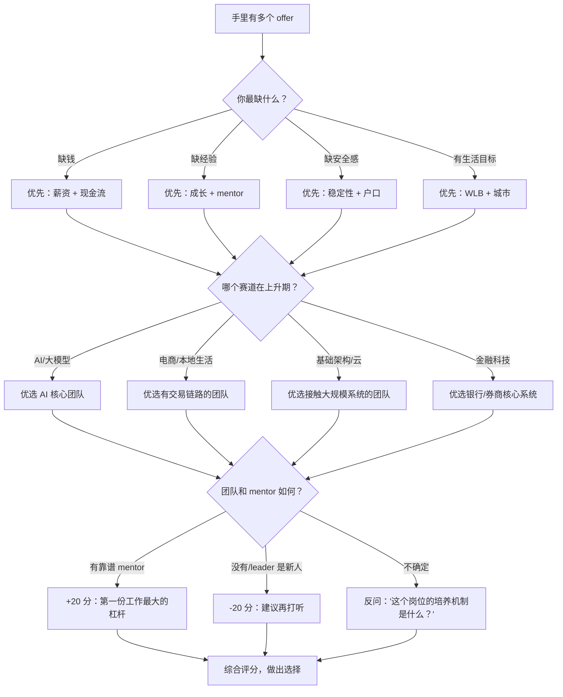

# 第一份工作怎么选：大厂、中厂、创业、国企与外企

每年秋招春招季，后台都会收到同一类问题："拿了两个 offer，一个钱多一个稳定，怎么选？"或者"大厂边缘组和小厂核心岗，哪个更好？"

这篇想跟你聊聊，当手握多个 offer 时，怎么建立自己的评估标准。没有"完美选择"，但可以有"更适合你当前阶段的选择"。

---

## 一、选工作的五个维度

别只看月薪。把 offer 拆成以下五个维度：

| 维度 | 为什么重要 |
|------|-----------|
| **薪资** | 包括基础月薪 + 年终奖 + 股票/期权 + 签字费 + 补贴。**区分"总包"和"到手现金"**——期权在上市前是纸，年终奖在亏损业务线不一定发得出来。 |
| **成长** | 技术栈 + 业务复杂度 + 培养体系，决定了你三年后的市场价值。核心问题：**"我在这干两年，简历上能写什么？"** |
| **稳定性** | 试用期通过率、业务线是否盈利、公司是否在裁员、行业是否上升期。经济下行周期，有的 offer 可能入职即毕业。 |
| **WLB** | 几点下班、周末是否 on call、是否双休。**学会算时薪**——月薪 30K 每天 11 点走，和月薪 22K 六点走人，时薪可能一样。 |
| **城市/户口** | 北京上海的户口指标、杭州深圳的落户补贴、成都武汉的生活成本。第一份工作的城市，基本决定了你几年内的人脉和生活半径。 |

> 这五个维度的权重没有标准答案。家里有经济压力 vs 想攒钱留学 vs 需要户口，排序完全不同。**别用别人的优先级做自己的选择。**

---

## 二、各类公司的真实画像

### 概览对比

| 类型 | 代表公司 | 应届薪资 | 成长速度 | 稳定性 | 适合谁 |
|------|---------|:--------:|:--------:|:------:|--------|
| **大厂** | 阿里/腾讯/字节/美团/拼多多/快手/百度 | 30-50w+ | ⭐⭐⭐⭐⭐ | ⭐⭐⭐ | 想快速积累技术 + 简历背书、不介意强度的同学 |
| **中厂** | 小红书/B站/得物/米哈游/携程/蔚来 | 25-40w | ⭐⭐⭐⭐ | ⭐⭐⭐ | 想在特定赛道深耕、兼顾成长与生活的同学 |
| **创业公司** | MiniMax/月之暗面/智谱AI 等 | 现金偏低期权高 | ⭐⭐⭐⭐⭐ | ⭐ | 愿赌赛道、能承受风险、不想做螺丝钉的同学 |
| **国企/银行** | 六大行软开/招银网络/政策性银行 | 15-25w | ⭐⭐ | ⭐⭐⭐⭐⭐ | 求稳、需户口、看重长期生活质量的同学 |
| **外企** | 微软/Zoom/Shopee/亚马逊/SAP | 25-45w | ⭐⭐⭐ | ⭐⭐⭐⭐ | 要 WLB、计划出国、英语好的同学 |

### 大厂的真相

大厂最大的红利是"系统性成长"——规范的新人培训、严格的 code review、成熟的中间件生态、身边一批优秀同龄人。简历上的大厂经历也是硬通货，未来跳槽时 HR 筛选简历的第一眼就是这东西。

但大厂不是乌托邦。**核心业务和边缘业务天差地别**——前者有人带你、有预算；后者可能你进去三个月组就没了。部分业务"拧螺丝"现象真实：花半年维护一个报表系统的一小角，跳槽时简历写不出东西。另有一些厂（拼多多、快手等）的加班强度对身体的消耗需要诚实评估。

### 中厂：被低估的甜点区

中厂处于一个甜点区：业务体量够大学东西，但组织没膨胀到每个人是螺丝钉。一个应届生可能有机会独立负责某功能模块的完整链路，而非像大厂那样先做三个月 oncall 再接祖传代码。

风险在于"不上不下"——遇到行业波动，不敌大厂能扛，也不如创业公司灵活。培养体系通常不如大厂系统化，更多靠自己主动学。部分公司上市后股价直接影响期权含金量。

### 创业公司：高上限，真风险

A / B 轮公司最大诱惑是"当核心"——你可能是某方向的第一个工程师，直接向 CTO 汇报，成长曲线陡峭如墙。成了，回报远超打工路径。

但风险不止"可能倒闭"。更常见的是：**没有 mentor，或 mentor 自己也没做过这件事**。你需要在没人教的情况下摸索最佳实践，这对应届生并不友好。期权在 90%+ 的创业公司最终价值为零。如果你选这条路，问自己："如果一年后公司没了，我学到了什么？"以及"创始人和核心团队是我愿意跟着学两年的人吗？"

### 国企/银行：稳定，但不等于躺平

最大卖点是稳定性——基本无裁员风险，户口指标相对充裕，公积金顶格缴纳。需要落户北京或上海的话，是很现实的考量。

但需破除几个幻想。其一，"稳定不等于轻松"——部分股份制银行和头部城商行加班并不少，投产上线期间也可能通宵。其二，技术栈相对陈旧，大量系统跑在 Java + Oracle 上，未来若想跳回互联网，技术 gap 需自己补。其三，晋升慢、涨薪慢是常态。

### 外企：WLB 很好，但不是免费的

微软、Zoom 等以到点下班和不卷闻名，假期制度完善，氛围相对平等。若计划出国读研或申请海外职位，外企经历在简历上更"通用"。

但外企中国的业务深度是隐患。很多团队做的是边缘或适配性工作，核心决策由海外总部做出。此外，裁员虽流程规范（补偿给足），但裁起来果断——2023-2025 年已有多家外企退出或缩减中国办公室。签外企前，确认团队在中国做的到底是核心产品还是本地化支持。

---

## 三、一个决策框架

别在脑子里空转。把选择变成可执行的流程。

### 优先级的决策树

### 用打分表量化

拿一张纸或 Excel，给每个 offer 打分。权重你自己填，分数 1-5 分。

| 评估维度 | 你的权重（%） | Offer A | Offer B | 加权 A | 加权 B |
|---------|:-----------:|:-------:|:-------:|:------:|:------:|
| 薪资（现金占比 + 总包） | | /5 | /5 | | |
| 成长（技术栈 + 业务复杂度 + mentor） | | /5 | /5 | | |
| 稳定性（业务健康度 + 公司近况） | | /5 | /5 | | |
| WLB（工作时长 + 假期 + 通勤） | | /5 | /5 | | |
| 城市/户口/生活成本 | | /5 | /5 | | |
| 跳板价值（两年后简历竞争力） | | /5 | /5 | | |
| **加权总分** | **100%** | | | | |

打分参考：

- **薪资 5 分**：总包符合或超预期，且现金占比高；**1 分**：明显低于市场水平
- **成长 5 分**：核心业务 + 成熟 mentor + 前沿技术栈；**1 分**：边缘业务 + 没人带 + 老旧堆栈
- **稳定性 5 分**：业务盈利 + 无裁员信号 + 转正率高；**1 分**：亏损 + 刚裁过人
- **跳板价值 5 分**：公司品牌好 + 业务知名 + 产出可量化；**1 分**：公司小且不知名

> 打分不是为了消除主观，而是让你看清：你纠结的到底是差了 3K 月薪，还是差了 20 分加权总分。**如果总分差距在 5 分以内，选内心倾向的那个——你本来就知道答案。**

---

## 四、常被忽略的因素

### 1. Mentor 比公司重要

大厂的烂 mentor vs 小厂的好 mentor，前者更可能让你试用期就怀疑人生。好 leader 至少做到：分配有挑战的任务、给 code review 意见、愿意回答"蠢问题"、绩效季帮你争取。

面试反问环节直接问："入职后有具体导师吗？""新人怎么上手？""入职前三个月最大挑战是什么？"看回答是具体的还是套话——后者是红色信号。

### 2. 业务线比公司名声重要

同个大厂，核心 vs 边缘业务的体验完全是两个公司。判断信号：JD 模糊不清、面试官说不清你入职做什么、部门最近有组织调整、业务不是公司主要收入源。反之，面试官能清晰说出"你来要解决的具体问题及其价值"——这是健康信号。

### 3. 试用期和合同条款要细看

接受 offer 前就应问清楚，而非入职培训才知道：

- **试用期与转正标准**：合同三年则试用期不超过六个月（法定）
- **薪资构成**：基本工资多少、绩效多少、年终奖是否写入合同。合同至少写明基本月工资
- **竞业范围**：大厂竞业有时宽到离职哪都去不了
- **违约金**：三方协议违约金多少、提前解约流程
- **五险一金基数和比例**：全额 vs 最低标准缴纳，差距极大

### 4. 第一份工作的跳板价值

你不是一辈子只找这一次工作。评估每个 offer，问自己一个"两年后问题"：

> 如果我在这里做两年后离开，简历上这段经历能讲出什么？

好的第一份工作应该让你未来能说清："我负责了 X 系统，处理了 Y 规模的数据/请求，解决了 Z 问题，带来了 N 项可量化的改进。"如果两年后只能说"维护了一些接口、修了一些 bug"，那即便钱多一些，也是在透支职业发展。

---

## 五、常见误区

- **"大厂一定好"**：大厂是平均概念，不代表你的组好。签前尽力打听：组在核心业务线上吗？leader 口碑如何？近半年有人员流动吗？能打听到的事实比公司层面的宣传有用百倍。

- **"钱多就行"**：第一份工作的年收入在职业生涯中占比很小，但它决定了你跳槽时的起点和方向。更要学会算**时薪**——如果加班时间长期无法用于学习或休息，多出来的钱是在拿未来竞争力换。

- **"先去小公司当核心"**：前提是小公司有靠谱的人带你。如果整个技术团队就你一个应届生，CTO 也才工作三年，没人 code review——那不是在当核心，是在自己摸索一套三年后要推倒重来的东西。去小公司前确认：团队有 1-2 个能跟着学的人，公司资金至少能撑 18 个月以上。

- **"国企一定轻松"**：部分国企（股份制银行软开、国资委科技子公司）内部考核压力不低，运维投产也通宵。轻松与否看具体单位和岗位，找实际在里面的人打听——同一个银行不同部门体验都可能完全不同。

- **"外企不裁员 / 就是养老"**：外企裁员流程规范、赔偿给够，但该裁不会犹豫。2023-2025 年多家外企关闭中国办公室就是例子。同时外企晋升可能遇到玻璃天花板——核心决策岗位在总部，中国团队多是执行层。

---

## 写在最后

选了也不一定对，但不选才真的没有机会纠错。

第一份工作重要，但没重要到决定一生。二十岁出头，哪怕做了一个不太好的选择，两三年后换方向的人比比皆是。关键是——**无论选了什么，进去后保持学习，保持对行业变化的敏感，保持对自己想要什么生活的诚实判断。**

三句话，来自过来人的真实感受：

- **第一份工作选"成长"，不选"面子"。** 别人羡慕你进了哪家公司不重要，两年后你能做什么才重要。
- **好 mentor 比好公司值钱。** 遇到一个愿意带你的人，是第一份工作最大的运气。
- **别拿身体换钱，除非真的别无选择。** 职业生涯很长，用健康换的东西，最后大概率要用更多健康赎回去。

祝你能选到一份让你成长、让你开心、让你觉得"来对了"的第一份工作。

---

> **相关阅读：**
> - [获得多个 offer，如何进行选择](../多个offer如何进行选择.md)
> - [offer、三方和劳动合同避坑指南](../签约/offer三方和劳动合同避坑指南.md)
> - [面试中提问为什么不去互联网](./面试中提问为什么不去互联网.md)
> - [银行科技岗/金融科技岗到底怎么样？（视频）](https://www.bilibili.com/video/BV12e411V7KM/)
