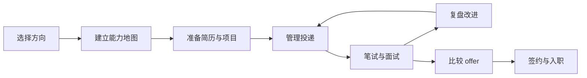

# 计算机专业求职全流程：从准备到签约

求职不是临近毕业才开始的短期冲刺，而是一条由方向选择、能力积累、材料准备、投递、面试、决策和签约组成的完整路径。

## 一、求职全流程

## 二、每个阶段要交付什么

| 阶段 | 核心问题 | 最低交付物 |
| --- | --- | --- |
| 选择方向 | 我想投什么岗位？ | 一份岗位对比表 |
| 能力建设 | 面试会考什么？ | 一张知识地图和复习计划 |
| 材料准备 | 为什么值得给我面试机会？ | 一页简历、项目讲解稿、自我介绍 |
| 投递管理 | 我投了哪些岗位？ | 一张求职表 |
| 面试训练 | 我能否经得住追问？ | 错题清单和复盘记录 |
| offer 决策 | 哪个选择适合我？ | offer 对比表 |
| 签约入职 | 有哪些规则和风险？ | 待确认事项清单 |

## 三、建议节奏

校招时间会因企业、行业和学校而变化。一般建议至少提前 2 至 3 个月准备材料和技术基础，并持续关注企业招聘官网、学校就业网和 [国家大学生就业服务平台](https://job.ncss.cn/)。

| 时间窗口 | 建议动作 |
| --- | --- |
| 大二至大三 | 选择方向、完成基础学习、积累项目 |
| 实习招聘前 | 完成简历、刷题、项目复盘、模拟面试 |
| 秋招前 | 扩大投递、集中复习、建立复盘节奏 |
| 寒假与春招 | 补齐短板、继续投递、关注补录 |
| 拿到 offer 后 | 比较岗位、核实条款、处理签约 |

## 四、优先级原则

1. 先明确目标岗位，再决定学什么。
2. 先补齐高频基础，再追求技术广度。
3. 先准备可以讲清楚的项目，再添加更多技术词。
4. 先建立稳定投递节奏，再等待单个结果。
5. 先阅读书面材料，再接受口头承诺。

## 五、求职仪表盘

| 项目 | 当前状态 | 下一步动作 |
| --- | --- | --- |
| 目标岗位 |  |  |
| 简历版本 |  |  |
| 项目讲解稿 |  |  |
| 算法刷题 |  |  |
| 基础知识复习 |  |  |
| 有效投递 |  |  |
| 模拟面试 |  |  |
| offer 与签约 |  |  |

## 延伸阅读

- [计算机岗位地图](./技能与知识要求.md)
- [AI 应用研发工程师求职专题](./AI应用研发/README.md)
- [求职季作战手册](./求职规划/求职季作战手册.md)
- [校招时间线](./求职规划/校招时间线.md)
- [如何投递与管理求职进度](./求职规划/如何投递与管理求职进度.md)
- [简历证据库](./简历/简历证据库.md)
- [HR 面试常见问题](./面试攻略/HR面试常见问题.md)
- [offer、三方和劳动合同避坑指南](./签约/offer三方和劳动合同避坑指南.md)
