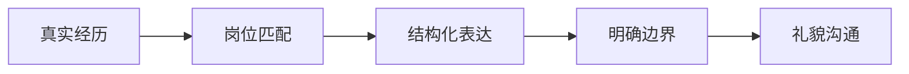

# HR 面试常见问题：动机、选择与反问

HR 面不是走过场。它通常关注求职动机、表达、稳定性、选择逻辑、入职时间和薪资预期。回答时要真实、简洁，并与自己的经历保持一致。

## 一、回答原则



## 二、常见问题

### 1、自我介绍

建议结构：

1. 基本背景。
2. 与岗位相关的技能。
3. 一到两个项目或实习亮点。
4. 为什么投递当前岗位。

延伸阅读：[面试中如何进行自我介绍](../自我介绍.md)

### 2、为什么选择我们公司？

避免只回答“平台大、发展好”。可以从岗位内容、业务方向、技术场景和个人经历说明匹配点。

### 3、为什么选择这个岗位？

用经历证明兴趣。例如：课程、项目、实习中哪些内容让你愿意继续投入。

### 4、你的优点和缺点是什么？

缺点不要伪装成优点。选择一个真实、可改进、不直接否定岗位胜任力的问题，并说明正在采取的行动。

### 5、你遇到过最大的困难是什么？

使用 STAR 结构，重点讲清楚行动和复盘，而不是只描述困难。

### 6、手里还有其他 offer 吗？

如实回答即可。可以说明当前流程、决策时间和自己关注的因素，不必透露不适合公开的信息。

### 7、期望薪资是多少？

先了解岗位、城市、行业和薪资结构。沟通时确认：

- 固定薪资和奖金。
- 补贴、福利和发放条件。
- 试用期薪资。
- 是否存在调薪和绩效规则。

### 8、什么时候可以入职？

结合毕业、实习、学校要求和个人安排给出明确时间。

## 三、反问问题

| 方向 | 示例 |
| --- | --- |
| 岗位 | 这个岗位入职后的主要职责是什么？ |
| 团队 | 团队规模和协作方式如何？ |
| 培养 | 对应届生有哪些培养和反馈机制？ |
| 流程 | 后续流程和预计时间是什么？ |

不建议只问官网可以直接找到的信息。

## 四、模拟练习

```text
请扮演 HR 面试官，针对校招 Java 后端岗位向我提问。
一次只问一个问题，根据我的回答继续追问。
最后从真实性、结构、岗位匹配和表达简洁度四个方面点评。
```

## 行动清单

- [ ] 准备 1 分钟自我介绍。
- [ ] 为求职动机准备真实依据。
- [ ] 梳理 offer、入职时间和薪资边界。
- [ ] 准备 3 个有价值的反问。
