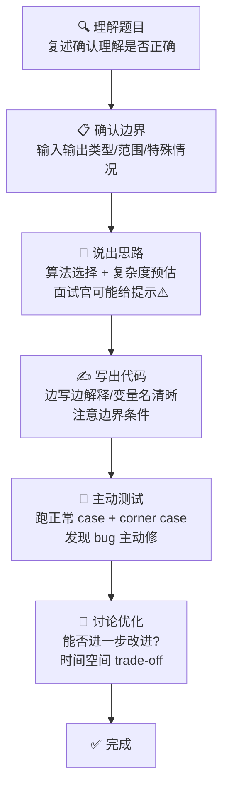
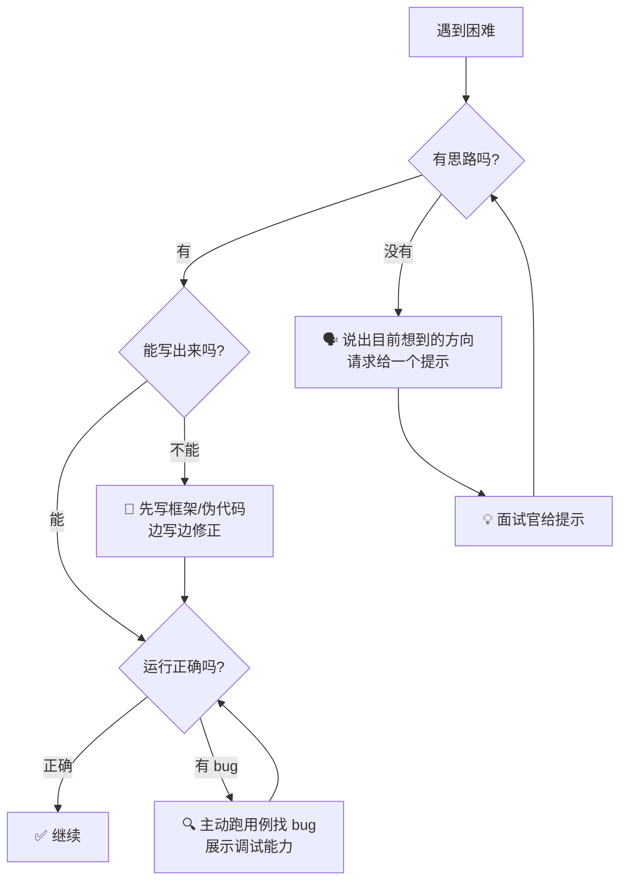

# 算法与代码面试准备指南：不只是刷题

> 刷过 500+ 题，面过十几次，挂过也拿过 offer。这篇文章是我踩过的坑和总结出的方法论，希望能帮你少走弯路。

---

## 一、Coding 面试到底考什么

很多人以为 coding 面试就是"把题做出来"，这是一个巨大的误解。实际上，面试官在 45 分钟内考察的是五个维度：

1. **问题定义能力**：能不能把模糊的需求转化为清晰的问题定义
2. **沟通能力**：能不能在动手前先说出思路，而不是闷头写代码
3. **编码质量**：代码有没有 bug，边界条件是否覆盖，corner case 有没有考虑到
4. **复杂度分析**：能不能准确说出时间和空间复杂度，以及为什么
5. **优化意识**：在面试官给出提示后，能不能顺着方向改进方案

一句话总结：**面试官不是在找能写出正确答案的人，而是在找他愿意一起工作的同事。**



> 理想流程不是"读题 → 写代码 → 提交"，而是"理解 → 沟通 → 编码 → 验证 → 优化"。每一步面试官都在打分。

---

## 二、刷题策略：精刷 vs 广刷

| 策略 | 做法 | 适合谁 | 典型节奏 | 验收标准 |
|:---|:---|:---|:---|:---|
| **精刷** | 每类题型 3~5 道典型题，反复做到闭上眼睛能写出来 | 时间紧（<2 个月）、基础偏弱、非科班同学 | 第一遍：理解思路；第二遍：独立写；第三遍：默写 + 口头讲 | 拿一道同类新题，能在 20 分钟内独立 AC |
| **广刷** | 大量刷题，见识各种变体和边界条件 | 时间充裕（>3 个月）、已打好基础、冲刺大厂的同学 | 每天 3~5 道新题 + 1 道旧题复习 | 随机抽题，中等难度能在 25 分钟内 AC |

**我的建议**：90% 的校招同学应该走精刷路线。把时间花在"真正吃透每一道题"上，而不是"看着答案觉得自己会了然后刷下一道"。

### 精刷核心题型路线图

按优先级从高到低排列，每类吃透 2~3 道必刷题：

| 题型 | 重要性 | 必刷题（LeetCode 题号） | 核心技巧 |
|:---|:---|:---|:---|
| **数组 / 双指针** | ⭐⭐⭐⭐⭐ | 1（两数之和）、15（三数之和）、88（合并有序数组） | 左右指针、快慢指针、去重技巧 |
| **链表** | ⭐⭐⭐⭐⭐ | 206（反转链表）、141（环形链表）、21（合并有序链表） | dummy 节点、快慢指针、递归写法 |
| **二叉树** | ⭐⭐⭐⭐⭐ | 102（层序遍历）、236（最近公共祖先）、104（最大深度） | 递归三要素、迭代写法转换 |
| **动态规划** | ⭐⭐⭐⭐⭐ | 70（爬楼梯）、322（零钱兑换）、1143（最长公共子序列） | 状态定义 → 转移方程 → 初始化 |
| **二分查找** | ⭐⭐⭐⭐ | 704（基础二分）、33（搜索旋转数组）、34（查找区间） | 左闭右闭 vs 左闭右开、循环不变量 |
| **回溯** | ⭐⭐⭐⭐ | 46（全排列）、78（子集）、22（括号生成） | 决策树画图、剪枝条件 |
| **滑动窗口** | ⭐⭐⭐⭐ | 3（无重复最长子串）、209（最短子数组）、438（字母异位词） | 窗口扩张/收缩条件、窗口内状态维护 |
| **堆 / 优先队列** | ⭐⭐⭐⭐ | 215（第 K 大元素）、347（前 K 高频元素）、23（合并 K 个链表） | 大顶堆 vs 小顶堆、Top K 模板 |
| **图** | ⭐⭐⭐ | 200（岛屿数量）、207（课程表）、994（腐烂橘子） | BFS/DFS 遍历、入度表 |
| **排序** | ⭐⭐⭐ | 912（排序数组 — 手写快排和归并）、215（快排 partition） | 快排 partition 模板、归并模板 |

> "吃透"的意思是：你能不看答案，在白板上边讲边写，15 分钟内完成，并且能讲清楚每一步为什么这样做。

---

## 三、面试中的沟通技巧

**最重要的一条原则：不要上来就写代码。**

### 面试中应该做的 5 件事

1. **确认输入输出**
   - "输入是这个数组，输出是布尔值对吗？"
   - "数据范围大概多大？需不需要考虑溢出的情况？"
   - "输入是否可能为空？需不需要处理异常输入？"

2. **复述你的理解**
   - "我理解这道题是让我们找数组中出现次数超过一半的元素，对吗？"
   - 这一句话能让你避免"做错题"，面试官也会觉得你沟通清晰

3. **说思路，等回应**
   - "我打算用哈希表统计频率，这样时间 O(n)，空间 O(n)。还是说你希望我用 O(1) 空间？"
   - **面试官的表情和回应是你的关键信号**——如果他问"能不能不用额外空间"，说明这就是考察点

4. **边写边解释（Think Out Loud）**
   - 写完关键的 for 循环时说一句："这里我维护一个窗口，左指针只在窗口内重复元素时右移"
   - 不要念代码，而是解释意图

5. **写完主动跑测试**
   - 先跑题目给的示例："我们来走一下题目里的例子，输入 [2,7,11,15], target=9..."
   - 再跑一个 corner case："如果数组为空呢？——哦这里提前返回了，没问题"
   - 主动发现 bug 并修复 —— **这比写出 bug-free 的代码更加分**

### 好沟通 vs 差沟通：同一道题，两种结局

> 题目：给定非递减排序数组 nums 和目标值 target，如果 target 在数组中，返回下标，否则返回 -1。你必须 O(log n) 解决。

**❌ 差沟通的表现：**

```
面试官：给你一道题，在一个排序数组里找目标值。
A 同学：（沉默 10 秒后直接开始写代码）
       int i = 0, j = nums.length - 1;
       while (i <= j) {
           int mid = (i + j) / 2;
           if (nums[mid] == target) return mid;
           else if (nums[mid] < target) i = mid + 1;
           else j = mid - 1;
       }
       return -1;
A 同学：写完了。
面试官：这个代码有没有什么问题？比如 mid 的计算...
A 同学：呃...（沉默）
面试官：如果数组里有重复元素呢？
A 同学：这题没说重复啊。
面试官：（内心：没有主动思考边界，也没有沟通习惯）
```

**✅ 好沟通的表现：**

```
面试官：给你一道题，在一个排序数组里找目标值。
B 同学：好的，先确认一下——输入是非递减排序的数组，可能有重复元素。输出是目标值的下标，
       有多个时返回任意一个，找不到返回 -1。需要 O(log n) 时间。对吗？
面试官：对。
B 同学：那很直接，标准的二分查找。我用左闭右闭的写法 [left, right]，
       mid 用 left + (right - left) / 2 防止溢出，这个习惯是刷题养成的（笑）。
       循环条件是 left <= right，因为区间还有至少一个元素就继续找。
面试官：好，你写吧。
B 同学：（边写边说）
       // left 指向搜索区间的左端（闭区间）
       // right 指向搜索区间的右端（闭区间）
       int left = 0, right = nums.length - 1;
       while (left <= right) {
           // 用 left + (right - left) / 2 防止整数溢出
           int mid = left + (right - left) / 2;
           if (nums[mid] == target) {
               return mid;  // 找到直接返回
           } else if (nums[mid] < target) {
               left = mid + 1;  // target 在右半部分
           } else {
               right = mid - 1; // target 在左半部分
           }
       }
       return -1;  // 搜索区间为空，没找到
面试官：你跑个测试吧。
B 同学：好的。先跑题目给的例子：nums = [-1,0,3,5,9,12], target = 9。
       初始 left=0 right=5 → mid=2, nums[2]=3<9, left=3
       → mid=4, nums[4]=9, 返回 4。正确。
       再测 corner case：数组为空——right = -1，left=0 > right，直接返回 -1，没问题。
       只有一个元素且等于 target——left=right=0, 直接判断返回 0，也没问题。
面试官：不错，那如果有重复元素，我想找到最左边的那个呢？
B 同学：这个变化很常见，只需要在找到 target 时不直接返回，
       而是把 right 收缩到 mid - 1 继续搜左边，最后返回 left。
       其实就是把"等于"分支改成 right = mid - 1，最后检查 nums[left] == target。
```

同样的题，同样的答案正确，但面试官的体验天差地别。**B 同学展示的是一个会和你讨论方案的同事，A 同学展示的是一个沉默的代码机器。**

---

## 四、常见题型的面试模板

### 模板 1：二分查找 —— 说清楚 left / right 的语义

这是面试中最容易"写出来但解释不清"的题型。核心在于**定义清楚 left 和 right 的语义**，然后一切推导都基于这个定义。

```java
// 面试口述："我采用左闭右闭 [left, right] 的定义：
// left 指向第一个可能包含 target 的位置
// right 指向最后一个可能包含 target 的位置
// 所以循环条件是 left <= right，因为当 left == right 时区间还有元素"
public int binarySearch(int[] nums, int target) {
    int left = 0, right = nums.length - 1;  // 左闭右闭

    while (left <= right) {  // 区间不为空就继续
        int mid = left + (right - left) / 2;  // 防溢出

        if (nums[mid] == target) {
            return mid;  // 找到了
        } else if (nums[mid] < target) {
            left = mid + 1;  // target 在右侧，left 跳过 mid
        } else {
            right = mid - 1; // target 在左侧，right 跳过 mid
        }
    }
    return -1;  // 没找到：left > right，区间为空
}
```

> 面试官追问 "为什么用左闭右闭而不是左闭右开" 时，答："两种都可以，关键是**选定一种定义后就保持前后一致**。左闭右闭的好处是直观看区间不为空的条件就是 left <= right，不容易搞混。"

### 模板 2：动态规划 —— 四步法

```java
// 面试口述："这道题我打算用 DP 做。说清楚四件事：
// 1. dp[i] 表示什么
// 2. 状态怎么转移
// 3. 初始值是什么
// 4. 遍历顺序为什么这样"

// 以零钱兑换（LeetCode 322）为例：
// 1. 状态定义：dp[i] = 凑出金额 i 所需的最少硬币数
// 2. 状态转移：dp[i] = min(dp[i], dp[i - coin] + 1)  其中 coin 遍历所有面值
//    含义是：要么不用这个硬币，要么用了以后从 dp[i-coin] 转移过来
// 3. 初始条件：dp[0] = 0（凑 0 元需要 0 个硬币），其他初始化为 amount+1 表示不可达
// 4. 遍历顺序：外层遍历金额从 1 到 amount，内层遍历硬币，
//    因为对于每个金额我们需要检查所有硬币才能确定最优解
public int coinChange(int[] coins, int amount) {
    int[] dp = new int[amount + 1];
    Arrays.fill(dp, amount + 1);  // amount+1 表示"无法凑出"
    dp[0] = 0;

    for (int i = 1; i <= amount; i++) {
        for (int coin : coins) {
            if (i >= coin) {
                dp[i] = Math.min(dp[i], dp[i - coin] + 1);
            }
        }
    }
    return dp[amount] > amount ? -1 : dp[amount];
}
```

> DP 题最怕的不是写不出，而是"不知道为什么这样遍历"。把上面四步在口头过一遍，面试官就知道你是真懂了。

### 模板 3：二叉树 —— 说清楚递归边界和返回值

```java
// 面试口述："递归做二叉树题的核心是说清楚三件事：
// 1. 空节点怎么处理（这是你一切推导的起点）
// 2. 单层递归做什么（当前节点利用左右子树的结果做计算）
// 3. 返回值代表什么（给上层递归提供什么信息）"

// 以二叉树最大深度（LeetCode 104）为例：
// 1. 空节点：高度为 0，这是递归终止条件
// 2. 单层逻辑：当前节点的深度 = max(左子树深度, 右子树深度) + 1
// 3. 返回值：以当前节点为根的子树的最大深度
public int maxDepth(TreeNode root) {
    if (root == null) {
        return 0;  // 空树深度为 0，递归出口
    }
    int leftDepth = maxDepth(root.left);   // 左子树深度
    int rightDepth = maxDepth(root.right); // 右子树深度
    return Math.max(leftDepth, rightDepth) + 1; // 当前层 + 1
}
```

---

## 五、如果做不出来怎么办

**先消除一个误解：卡住了不等于挂定了。** 我见过太多同学因为中间卡了一下就心态崩了，后面全程沉默，这才是真的挂了。面试官看的是你面对困难时的反应。

### 卡住时的自救策略

| 情况 | 应对策略 | 效果 |
|:---|:---|:---|
| **完全没思路** | "我目前想到的方向是 XX，但卡在了 XX 这个地方，可以给我一个方向上的提示吗？" | 展现实事求是和主动求助的能力，而不是硬撑 |
| **有思路但写不出来** | 先在注释里写框架（`// 第一步：建哈希表统计频率 // 第二步：用堆找 Top K`），然后逐块填代码 | 结构化思维比一口气写完更受认可 |
| **写出来了但有 bug** | 不是等面试官指出，而是主动说："我来跑个用例验证一下"。跑完后："找到了，这里下标越界了，我来修一下" | **主动调试 > 一次跑通 > 面试官帮你找 bug** |
| **面试官给了提示** | **顺着提示走，不要抗拒**。"哦对，用双指针可以省掉额外的数组空间，我改一下" | 面试官给提示说明他想让你过，抗拒等于拒绝帮助 |
| **时间不够了** | 框架和核心逻辑写出来，剩余部分用注释补充思路。"时间不够的话这段我写个伪代码，思路是..." | 让面试官看到你是知道怎么做的 |



### 不同公司的卡住容忍度

| 公司类型 | 卡住后的重点 | 关键做法 |
|:---|:---|:---|
| **大厂（字节/阿里/腾讯）** | 持续输出思考，即使没做出来也要展示分析过程 | 口头补足没写完的部分 |
| **外企（Google/Microsoft）** | 很看重沟通和思路，提示后改进很加分 | 积极主动要提示，不要死磕 |
| **中厂 / 独角兽** | 基础要扎实，表现不要崩 | 保持稳定输出，至少把简单解法写完 |
| **银行 / 国企** | 不太难，基本能力验证为主 | 别犯低级错误，保证代码整洁 |

---

## 六、模拟练习方法

刷题和面试是两件不同的事。**你在 LeetCode 上刷题只练了"写代码"，面试还考"在压力下对着陌生人边说话边写代码"。**

### 模拟面试练习体系

| 方法 | 具体操作 | 频率建议 |
|:---|:---|:---|
| **限时模拟** | 抽一道没做过的题，严格计时：简单 15min、中等 25min、困难 35min。到时间就停笔，模拟真实面试。 | 每天 1 次 |
| **录音/录屏** | 用手机录下自己说思路的过程。回看时你会发现自己说了太多"嗯...那个...就是..." | 每周 2~3 次 |
| **两人互 Mock** | 找同学，一个人面一个人当面试官。面试官故意不给提示、问边界条件、追问优化。**这是效果最好的方法。** | 每周 2 次 |
| **LeetCode Mock Interview** | 使用 LeetCode 的 mock interview 功能，随机抽题 + 限时 + 真人（随机匹配）。体验完全陌生的面试环境。 | 每周 1~2 次 |
| **白板练习** | 关掉 IDE，在纸上或白板上手写代码。不借助自动补全和纠错。 | 考前 2 周每天 |

> 每周至少做 **2 次完整模拟面试**——全程开摄像头、计时、边写边说、跑测试用例。这不是在刷题，是在练面试。两件事的目标和感受完全不同。

### 一个 45 分钟模拟面试的标准流程

```
0-3 分钟：面试官出题 → 你复述确认理解
3-8 分钟：讨论思路、分析复杂度、和面试官对齐
8-30 分钟：写代码（边写边说，保持沟通）
30-35 分钟：主动跑测试，发现 bug 就修
35-40 分钟：讨论优化 / 面试官追问变体
40-45 分钟：反问环节
```

---

## 七、笔试 vs 面试 Coding：两种完全不同的游戏规则

很多同学犯的错误是：用准备笔试的方式准备面试，或者反过来。

| 维度 | 笔试（OJ） | 面试 Coding |
|:---|:---|:---|
| **评分标准** | 只看最终结果（AC / 不 AC） | 看过程：沟通、编码、分析、调试 |
| **提交机会** | 可以反复提交，试错 | 只有一次展示机会 |
| **核心策略** | **先 AC 再优化**——暴力先过，再改 | **先沟通再写，写完自己测**——先确认思路，再动手 |
| **代码风格** | 变量名可以简写，追求速度 | 变量名清晰有意义，要能展示工程素养 |
| **时间压力** | 题多时间紧，要练速度 | 45 分钟 1~2 题，要练节奏感 |
| **准备侧重点** | 题型覆盖广，常见 tricks 烂熟于心 | 嘴和手同步，每道题都能讲出来为什么 |
| **刷题平台** | 牛客、Codeforces、洛谷 | LeetCode + 模拟面试 |
| **典型代表** | 华为机试、量化公司 OA | 大厂技术面试、外企 coding 轮 |

> **笔试练的是"做题速度 + 正确率"，面试练的是"讲题能力 + 代码展示"。** 准备面试时，每刷一道题都要口头讲一遍思路，而不是看着编辑器敲完就跑。

---

## 八、常见误区

| 误区 | 为什么错了 | 正确做法 |
|:---|:---|:---|
| **"刷够 300 题就稳了"** | 题数和面试通过率不是线性关系。刷 100 道但每道吃透的人，远强于刷 300 道但每道只是"看过答案"的人。 | 质量 > 数量。精刷 100 道经典题，反复做到能闭眼写 + 口头讲清。 |
| **"看答案也算刷"** | 看着答案觉得"哦原来这么简单，我会了"，但合上答案根本写不出来。这和真正掌握差了十万八千里。 | 每道题至少独立闭卷写出来 3 次。第一次看答案理解，第二次独立写，第三次限时默写。 |
| **"Hard 题都做不来怎么办"** | 校招面试出现 hard 题的概率很低（< 10%），而且基本是经典 hard。面试官更看重你能不能把中等题做出彩。 | 中等题吃透 + 经典 hard 了解思路即可。把时间花在"把中等题做出 bug-free 且能讲清楚"上。 |
| **"Python 一行写完才显水平"** | 面试官要看的不是你写了多短的代码，而是你的思考过程和代码可维护性。炫技不等于能力强。 | 代码清晰可读。变量名有意义。逻辑分段清楚。面试官是未来的同事，写别人看得懂的代码。 |
| **"刷题就能过面试"** | 面试不只有 coding 轮，还有项目经历、基础知识、系统设计（部分岗位）、行为面试。 | coding 是必要但不充分条件。分配时间：coding 50%，项目/知识 30%，行为面试 20%。 |
| **"挂了一道题 = 挂了"** | 面试是综合评估，一道题卡住了但展示了很好的思考过程和沟通能力，完全可能通过。反之，一声不吭写出最优解也可能挂。 | 重点是展示思维过程和沟通意愿。面试官要找的是**能一起解决问题的同事**，不是做题机器。 |

---

## 写在最后

如果你只有 1 分钟，记住这三句话：

1. **面试是对话，不是考试。** 说出来比写出来重要，过程比结果重要。
2. **精刷 100 道经典题，远胜广刷 300 道。** 反复做 + 口头讲 + 限时模拟。
3. **卡住不是失败，沉默才是。** 任何时候都要保持沟通——面试官就在你对面，他是来帮忙的，不是来审判你的。

祝你面试顺利，拿 offer 拿到手软。🍀
