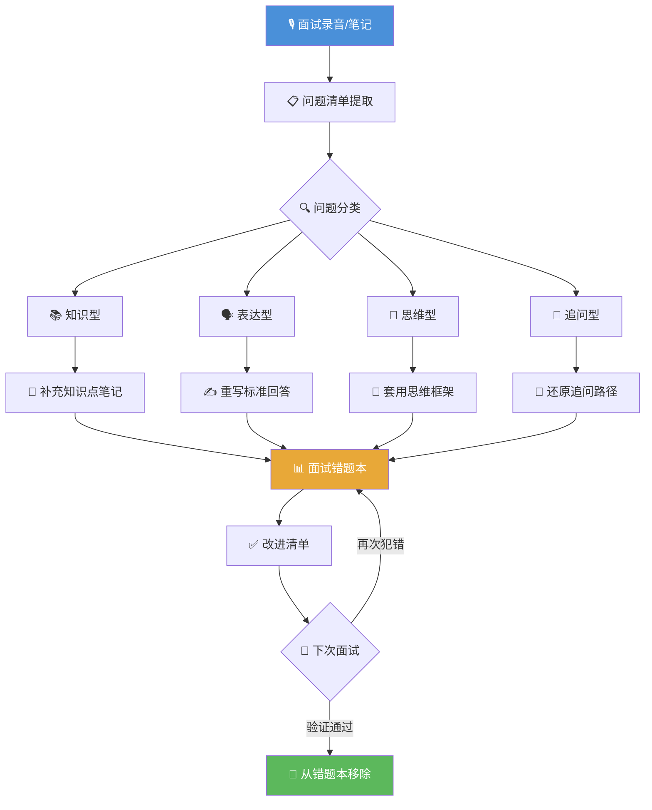
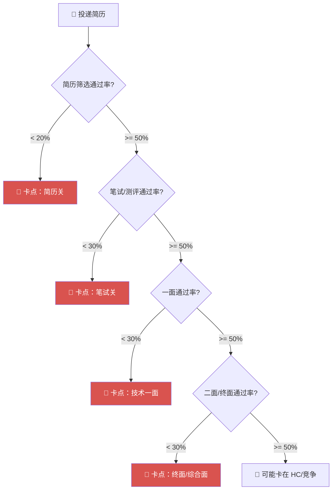

# 面试复盘方法论：让每一次面试都有积累

> 大多数人面了等于白面，因为他们从不复盘。你面前摆着一个天大的便宜——面试官免费帮你找盲点，你却只关心过没过。

---

## 一、为什么要复盘

校招季，你可能会面 10 家、20 家甚至更多公司。但如果我问你："你上一次面试，暴露了哪些具体问题？"大多数人只能说出"算法题没做出来"或者"八股文忘了"这种模糊的答案。

**不复盘的人，本质上是在用同样的水平反复测试不同的运气。**

复盘的目标不是自我安慰、不是"这次挂了下次加油"，而是精确地找到三样东西：

| 复盘目标 | 核心问题 | 不复盘的后果 |
|---------|---------|------------|
| **知识盲区** | 哪些知识点我以为会了、实际讲不清楚？ | 下次换个问法继续翻车 |
| **表达问题** | 我脑子懂但嘴说不明白的是什么？ | 面试官以为你不会，实际你只是不会说 |
| **思维漏洞** | 开放题/场景题从哪里开始乱的？ | 永远卡在"没思路"这一关 |

面试是你整个求职周期里**唯一的免费模拟考**。笔试你可以自己刷，但面试需要对面坐一个有经验的工程师——这个人正在用比你多 3-5 年的经验，无偿帮你扫描知识体系。更妙的是，不同公司的面试官会从不同角度戳中你的盲区，这些信号如果被认真记录和消化，价值远超任何面经。

**记住：面试挂了不等于你不行，面试复盘不认真才等于你真的不行。**

---

## 二、复盘的黄金 24 小时

面试结束后，你的记忆衰减曲线是这样的：1 小时内能回忆起 80% 的对话细节，6 小时后只剩 50%，24 小时后只剩零星片段。所以复盘有明确的时效性——必须在 24 小时内完成。

### 复盘全流程



### 面试复盘记录表（当场填写）

面试结束后的第一件事——趁记忆还热乎，打开这个模板直接填：

| 维度 | 记录内容 |
|------|---------|
| **基本信息** | 公司 + 岗位 + 面试轮次 + 日期 |
| **面试形式** | 视频/电话/现场 + 时长 |
| **自我介绍反馈** | 面试官有没有追问某个项目？有没有走神？ |
| **技术问题清单** | 逐题记录：题目 → 我的回答要点 → 面试官反应（追问/纠正/跳过） |
| **算法题** | 题目描述 + 我的解法 + 时间复杂度 + 有没有卡壳 + 面试官提示了什么 |
| **项目深挖** | 面试官追问了哪个项目？追问到什么深度？我哪个回答让他皱眉头了？ |
| **开放题/场景题** | 题目 + 我的思路走向 + 面试官引导的方向 |
| **反问环节** | 我问了什么？面试官回答的态度和内容如何？ |
| **整体感受** | 面试官风格（温和/压迫/冷淡）、自己的心态变化、哪个瞬间最慌 |

---

## 三、把问题分成四类来复盘

面试中所有翻车，逃不出这四类。分类不是为了贴标签，而是因为**不同类型的问题，正确的改进方式完全不同**。

| 类型 | 典型表现 | 翻车案例 | 正确的改进方式 | 错误做法（别这么干） |
|------|---------|---------|--------------|-------------------|
| **知识型** | 问了不会、答了不对 | 没答上 Redis 持久化 RDB vs AOF | 当天补齐知识点 → 写进笔记 → 用费曼法讲一遍 | 收藏一篇面经就觉得"下次会了" |
| **表达型** | 心里懂、说不好 | 问到 MVCC，脑子里有图，说出来像一团浆糊 | 重写标准回答 → 录音 → 听自己的录音 → 改到清晰为止 | 觉得"反正我知道"就不练了 |
| **思维型** | 开放题无从下手、思路跳跃 | 问"设计一个秒杀系统"，东一句西一句 | 用 STAR/总分总框架组织、练习"先讲树干再补枝叶" | 背系统设计八股文 |
| **追问型** | 第一问能答，一追就崩 | 答了索引 B+ 树 → 追问"为什么不用 B 树" → 卡住 | 预判追问链、加深理解而非死记 | 只背表面答案，不思考"为什么" |

### 四类问题的真实复盘示例

#### 知识型问题复盘

```
【原始问题】Redis 持久化有哪几种方式？各有什么优缺点？
【我的回答】RDB 和 AOF，RDB 是快照，AOF 是追加日志……（讲得模糊，没说清应用场景）
【面试官反应】追问了"混合持久化是什么"，我没答上来
【根本原因】没真正读过 Redis 持久化章节，只看过面经里的几句话
【改进动作】
  1. 当天读 Redis 官方文档 persistence 章节
  2. 整理三种持久化方式的对比笔记（RDB / AOF / 混合）
  3. 写出"如果有人问我 Redis 持久化"的标准回答脚本
【验证方式】下次面试被问到 Redis 相关话题时，主动引导到持久化并完整讲一遍
```

#### 表达型问题复盘

```
【原始问题】讲一下 MySQL 的 MVCC 机制
【我的回答】MVCC 就是多版本并发控制……ReadView……undo log……（逻辑乱，面试官中途打断让我重新组织）
【面试官反应】直接说"你讲得太乱了，能不能用一个具体的例子说明"
【根本原因】我对 MVCC 的理解是碎片化的，知道各个概念但串不起来
【改进动作】
  1. 用一句话说清 MVCC 解决什么问题（事务并发时避免脏读/不可重复读）
  2. 用"一个事务从开始到提交看到了什么"的时间线来组织回答
  3. 录音自测，确保能在 2 分钟内讲清楚
【验证方式】找同学模拟一次"请你介绍一下 MVCC"，看他能不能听懂
```

#### 思维型问题复盘

```
【原始问题】如果我们要做一个类似于大众点评的推荐系统，你会怎么设计？
【我的回答】先从数据库设计说起……然后提到协同过滤……又说要考虑冷启动……（跳跃发散，没有逻辑线）
【面试官反应】一直在追问"你为什么会这样想？""前面的方案跟后面有什么关系？"
【根本原因】没有结构化思维的习惯，想到哪说到哪
【改进动作】
  1. 学习"总分总"回答框架：先说整体思路 → 分点展开 → 总结权衡
  2. 用 STAR 框架套用到系统设计题（Situation → Task → Action → Result）
  3. 同类型题目刻意练习 3 道，先写大纲再口述
【验证方式】下次开放题，先花 10 秒列大纲再开口
```

#### 追问型问题复盘

```
【原始问题】HTTP 和 HTTPS 的区别？
【我的回答】HTTPS 多了 SSL/TLS 加密……（安全回答）
【追问 1】TLS 握手过程是怎样的？
【我的回答】客户端发 ClientHello……服务端回 ServerHello……（勉强答完）
【追问 2】为什么握手的时候用非对称加密，数据传输用对称加密？
【我的回答】因为非对称加密比较安全？……（开始瞎猜，彻底翻车）
【根本原因】只知道"是什么"，不知道"为什么这样设计"
【改进动作】
  1. 针对每个高频考题，准备至少 2 层追问的回答
  2. 学习时追问自己"为什么这样设计""有什么 trade-off"
  3. 把这道题的完整追问链纳入错题本
```

---

## 四、如何还原面试官的追问路径

**会复盘的人，复盘的不是问题，是追问链。**

面试官不会随机追问。他的每一个追问，背后都有逻辑。如果你能还原这个逻辑，你就知道自己的回答在哪个环节触发了面试官的"不满足感"。

### 追问路径还原模板


### 追问链分析技巧

对每一条追问链，问自己三个问题：

| 分析维度 | 要回答的问题 | 示例 |
|---------|------------|------|
| **触发点** | 面试官从我的哪句话开始追问的？ | 我说"HTTPS 多了加密层"，他说"你讲讲具体怎么加的" |
| **意图** | 他在验证什么？ | 验证我是"背了概念"还是"理解了协议设计" |
| **我的断点** | 追问到第几层我开始兜不住了？ | 到"为什么握手非对称、传输对称"就崩了 |

**规律：追问断点 = 你"知其然不知其所以然"的深度边界。**

如果你总在第二层追问翻车，说明你的学习习惯停留在"能答出定义就行"——你需要逼自己至少多想一层。

---

## 五、建立个人面试错题本

刷 LeetCode 有错题本，面试更应该有。但面试错题本记录的不只是"题目+答案"，而是一整套上下文。

### 面试错题本模板

以下是一个单题的完整记录模板，建议用 Notion/飞书多维表格或 Excel 维护（方便筛选和统计）：

```markdown
## 错题 #003 | 2024-09-15 | 字节跳动 二面

### 基本信息
- **题目/话题**：InnoDB 的索引底层结构
- **问题类型**：追问型
- **出现频率**：第 2 次被问到相关问题（上次在美团一面也翻过）

### 当时发生了什么
- **面试官原话**："你刚才提到了 B+ 树索引，能不能讲一下为什么 InnoDB 选择 B+ 树而不是 B 树或者哈希表？"
- **我的回答**（尽量还原原话）："B+ 树把数据都存在叶子节点，非叶子节点只存索引键，这样树的高度更低……B 树的话每个节点都存数据，所以……嗯……范围查询不方便？"
- **面试官反应**：微微皱眉，追问"你刚才说树高更低，为什么更低？你算一下。"
- **我在哪一步卡住了**：能说结论，但不会推导。面试官一让"算一下"就慌了。

### 标准答案应该是什么
1. B+ 树非叶子节点不存数据 → 一个节点能存更多索引键 → 扇出更大 → 高度更低 → IO 次数更少
2. B+ 树叶子节点有双向链表 → 范围查询只需找到起点然后顺序遍历 → 不需要在树上反复回溯
3. 哈希表不支持范围查询，且哈希冲突会导致查询退化
4. 面试官期待的可能是：能估算"假设一个节点 16KB，一个索引键 8 字节 + 指针 6 字节，一个节点大约能存 1000 个键，三层就能覆盖 10 亿行数据"

### 根因分析
- 不是不知道 B+ 树的特点，是**没有做过定量推演**，知识停在定性层面
- 遇到"你算一下"这种追问就暴露了

### 改进动作
- [x] 当天推算了一遍三层 B+ 树能存多少数据
- [x] 整理到 MySQL 索引笔记中，标记为"高频追问"
- [ ] 找一次模拟面试，主动引导面试官问到索引然后完整展示这个推导

### 状态：🔴 待下次验证
```

### 错题本的使用规则

| 规则 | 说明 |
|------|------|
| **每次面试后 24 小时内录入** | 过期记忆失真，不值得记 |
| **按公司+轮次标记** | 你会发现某些公司爱追问同一个方向 |
| **每周回顾一次** | 周末花 30 分钟过一遍本周新增的错题 |
| **验证通过才关闭** | 同一道题在真实面试中答好了，标记为 ✅ |
| **同一题出现 2 次以上** | 说明不是"忘记"，是"本来就没学会"——重新学，别继续补了 |

---

## 六、复盘后的行动清单

复盘完不行动，等于看病不给药。不同类型的问题，行动完全不同。

### 行动清单 Checklist

```markdown
## 面试复盘行动清单 | 面试日期：____ | 公司：____

### 📚 知识型错题（当天补齐）
- [ ] 题目 1：____ → 已补充笔记：____ → 已用费曼法自讲一遍：____
- [ ] 题目 2：____ → 已补充笔记：____ → 已用费曼法自讲一遍：____
- [ ] 题目 3：____ → 已补充笔记：____ → 已用费曼法自讲一遍：____

### 🗣️ 表达型问题（48 小时内重写 + 模拟）
- [ ] 问题 1：____ → 已重写标准回答 → 已录音 → 已找同学模拟验证
- [ ] 问题 2：____ → 已重写标准回答 → 已录音 → 已找同学模拟验证

### 🧠 思维型问题（3 天内框架训练）
- [ ] 问题 1：____ → 已用 STAR/总分总框架重写思路
- [ ] 同类型题目刻意练习 2-3 道
  - [ ] 练习题 1：____
  - [ ] 练习题 2：____
  - [ ] 练习题 3：____

### 🔄 追问型问题（当天还原追问链）
- [ ] 追问链 1：____ → 已还原 3 层追问 → 已准备标准回答
- [ ] 追问链 2：____ → 已还原 3 层追问 → 已准备标准回答

### 📂 项目深挖卡壳（48 小时内重新梳理）
项目中卡壳的部分，用"五层结构"重新梳理：
- [ ] 项目 1 - ____ → 业务背景 / 技术选型 / 核心难点 / 我的贡献 / 量化结果
- [ ] 项目 2 - ____ → 业务背景 / 技术选型 / 核心难点 / 我的贡献 / 量化结果

### 🏗️ 系统设计薄弱（针对性练习 2-3 道）
- [ ] 弱点方向：____（如：秒杀/消息队列/分布式锁/缓存设计）
- [ ] 练习题 1：____
- [ ] 练习题 2：____
- [ ] 练习题 3：____

### 😰 心态问题（持续改进）
- [ ] 紧张/大脑空白 → 本周多做 2 场模拟面试
- [ ] 被面试官压制 → 学习"遇到不会的问题如何优雅化解"
- [ ] 时间分配问题 → 下周用计时器练习限时回答

### 📋 下次面试前检查
- [ ] 错题本中同类型问题已全部复习
- [ ] 本次行动清单所有项已完成
- [ ] 准备了 2-3 个"我想展示给面试官的知识点"在自我介绍中埋伏笔
```

### 行动优先级矩阵

| 紧急且重要 | 重要不紧急 |
|-----------|-----------|
| 知识型错题——当天补齐 | 思维型问题——框架训练 |
| 表达型问题——重写回答 | 系统设计薄弱——专题练习 |
| **紧急不重要** | **不紧急不重要** |
| 个别冷门八股不会 | 面试官随口一提的技术栈 |
| 先记到错题本，不急补 | 标记为"了解即可"，不分配时间 |

**原则：每次复盘最多列出 3 个优先改进项。贪多嚼不烂——能把 3 个问题彻底消灭，比列 10 个问题每个都只改一半强十倍。**

---

## 七、如果面了很多次还是没有 offer

面了 10+ 家没 offer，说明不是运气问题。你需要做一个系统性诊断。

### 先判断卡在哪个环节



### 各卡点的诊断与对策

| 卡点位置 | 典型症状 | 深层原因 | 具体对策 |
|---------|---------|---------|---------|
| **简历关** | 投 20 家只有 2-3 个面试邀请 | 简历没有突出技术亮点、缺乏量化结果、排版混乱 | 1. 检查简历是否有"业务背景 + 技术方案 + 量化成果"<br>2. 找 3 个拿过 offer 的学长帮忙 review<br>3. 针对不同岗位微调简历关键词 |
| **笔试关** | 笔试总是差几分过不了 | 算法基础不够扎实、笔试技巧欠缺 | 1. 按公司定向刷近 3 年笔试真题<br>2. 算法薄弱项专项突破（二分/DP/图论）<br>3. 笔试时间管理训练（先易后难，别死磕一道题） |
| **技术一面** | 面完就知道挂了，问题答不上来 | 基础知识有硬伤，八股停留在"背过"层面 | 1. 用本文的错题本方法记录每次一面的所有问题<br>2. 每个知识点按"定义 → 原理 → 为什么 → 对比"四层准备<br>3. 每周 2 次模拟面试，重点是表达而非知识 |
| **二面/终面** | 一面能过、二面挂 | 项目讲不深、系统设计没思路、软素质问题 | 1. 项目用"五层结构"重写：背景→选型→难点→贡献→量化<br>2. 系统设计专项训练（秒杀/短链/IM/推荐等经典题）<br>3. 准备"为什么选择我们""职业规划""优缺点"等软问题 |
| **终面后没消息** | HR 面完了说"等通知"然后没了 | HC 不足（竞争太激烈）、薪资期望不匹配、横向对比被刷 | 1. 继续保持面试节奏，不要死等一家<br>2. 调整薪资预期，了解市场价位<br>3. 复盘终面有没有"说错话"（对业务不感兴趣、职业规划不清晰等） |

### 面了很多次没 offer 的自我诊断清单

```markdown
## 🔍 面试困境自检清单

### 数据统计（先收集硬数据）
- [ ] 共投递简历数：____
- [ ] 收到面试邀请数：____  （通过率：____%）
- [ ] 参加笔试/测评数：____  （通过率：____%）
- [ ] 一面通过数：____  （通过率：____%）
- [ ] 二面/终面通过数：____  （通过率：____%）
- [ ] 收到 offer 数：____

### 卡点诊断（根据上面计算）
- [ ] 简历通过率 < 30% → 优先优化简历
- [ ] 笔试通过率 < 40% → 优先补算法
- [ ] 一面通过率 < 30% → 优先补基础知识 + 表达训练
- [ ] 二面通过率 < 30% → 优先补项目深度 + 系统设计

### 深层排查
- [ ] 我的自我介绍有没有让面试官对我产生兴趣？（还是听完了面无表情？）
- [ ] 我的项目描述面试官追问最多的是哪一块？（说明那一块讲得最模糊）
- [ ] 我有没有在面试中表现出"我只是来练手的"或者"我不是很想来"的态度？
- [ ] 反问环节我有没有问出有深度的问题？（"加班多吗""薪资多少"是减分项）
- [ ] 有没有明显的面试禁忌？（迟到、着装随意、打断面试官、简历造假嫌疑）

### 如果以上都排查过依然无解
- [ ] 考虑是否是目标公司/岗位与自身水平不匹配（过高或过低的投递策略）
- [ ] 找一位拿到该级别 offer 的学长/朋友，做一次全真模拟面试并让他逐帧分析
- [ ] 考虑是否需要花 1-2 个月做系统性补强后再战（而不是持续无效面试消耗心态）
```

---

## 写在最后

面试复盘不是一次性的行为，而是一套可以贯穿你整个求职季的工作流。每次面完做一次复盘，三面以后你就会看到自己的知识盲区正在缩小；十面以后，你会发现很多问题你已经被问过不止一次——而你已经准备得比面试官问的更深。

**真正拉开差距的，不是面了多少家，是每一家留下了多少积累。**

祝看到这里的同学，下次面试不再是"面完就忘"，而是"面完就知道自己哪里会更好了"。

---

*如果你觉得这篇文章有用，下一次面试结束的当晚，打开你选择的笔记软件，创建第一个面试错题本条目。这就是一切改变的开始。*
