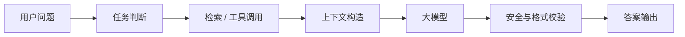

# AI 应用研发项目 README 模板

> AI 项目不要只展示“调用了模型”。重点展示任务定义、检索 / 工具链路、评测方法、失败案例和安全边界。

## 项目简介

- 项目名称：
- 场景：
- 目标用户：
- 解决问题：
- 我的角色：
- 模型与框架：

## 系统流程

## 核心模块

| 模块 | 功能 | 实现要点 |
| --- | --- | --- |
| Prompt |  |  |
| RAG |  |  |
| Tool Calling |  |  |
| Evaluation |  |  |
| Observability |  |  |

## 评测设计

| 指标 | 定义 | 当前结果 | 说明 |
| --- | --- | --- | --- |
| 召回准确性 |  |  |  |
| 答案正确性 |  |  |  |
| 引用完整性 |  |  |  |
| 延迟 |  |  |  |
| 成本 |  |  |  |

## Bad Case 复盘

| 问题 | 原因 | 修改 | 是否解决 |
| --- | --- | --- | --- |
|  |  |  |  |

## 安全边界

- [ ] 不上传隐私数据。
- [ ] 对工具调用设置人工确认。
- [ ] 对模型输出做格式校验。
- [ ] 对关键回答保留引用来源。

## 面试追问准备

1. 为什么选这个模型和框架？
2. RAG 的切分和召回怎么做？
3. 如何评测效果？
4. 如何处理幻觉？
5. 如何控制成本和延迟？
